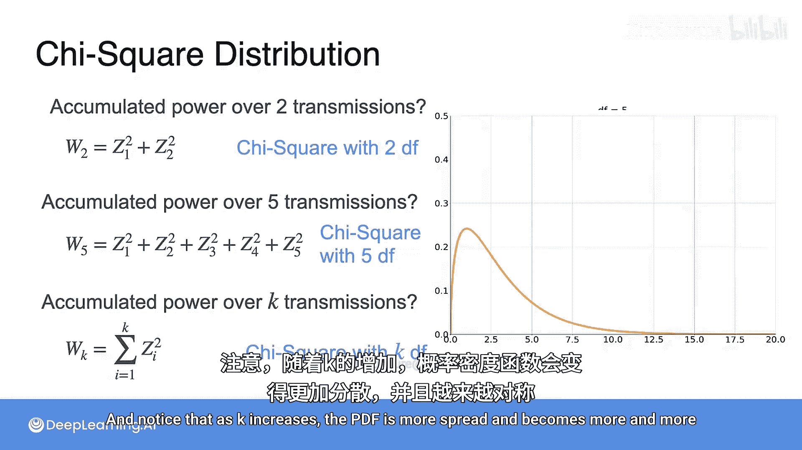

# 028：卡方分布 🧮

在本节课中，我们将要学习一个在通信和信号处理中非常重要的概率分布——卡方分布。我们将从一个简单的通信场景出发，理解噪声功率的统计特性，并推导出卡方分布的定义和性质。

## 通信中的噪声问题

想象一下，你正在两台设备之间传输比特信息。你发送了一条消息“10010”。这条消息需要通过空气（即通信信道）进行传输。信道中存在噪声，这些噪声会影响你发送的消息。噪声可能来自不同的源头，例如其他设备的干扰（比如Wi-Fi路由器）、障碍物（如墙壁、树木、建筑物）以及天气条件（如降雨或高湿度）也可能影响你的信号。此外，电气干扰（例如来自输电线路）和许多其他因素也会影响实际接收到的信号。

实际上，假设你接收到的消息是“10010”加上一些影响信号的噪声。我们称这个噪声为 **Z**，它具有随机性。在通信领域，一个常见的假设是噪声 **Z** 服从均值为0的高斯分布（正态分布）。

## 噪声功率与方差

通信中一个非常有用的度量是**噪声功率**，它大致由噪声的平方来建模。这个度量很重要，因为它与噪声的方差或离散程度相关，并将决定正确解读接收信号的难度。

现在，核心问题是：**W = Z²** 的分布是什么？为了简化，我们假设 **Z** 服从标准正态分布，即均值为0，方差为1。

让我们尝试从图形上理解。**W** 的每个值都可以通过 **Z** 的两个不同值来实现，即 **-√W** 和 **√W**。更进一步，**W** 小于等于某个值 **w** 的概率，就是高斯分布概率密度函数曲线下介于 **-√w** 和 **√w** 之间的面积。

因此，你可以通过为每个可能的 **w** 值找到这个面积来获得 **W** 的累积分布函数。注意，对于较小的 **w** 值，概率面积的累积速度要快得多。这是因为高斯分布的概率集中在0附近。这种分布被称为具有**1个自由度**的**卡方分布**。

## 从CDF推导PDF

由于累积分布函数是概率密度函数的积分，那么通过对CDF求导，就可以轻松找到PDF。这本质上就是CDF在每个点处的斜率。

现在，你可以清楚地看到，概率累积的速度对于小的 **w** 值很大，并且随着 **w** 的增加而变得越来越小。原因是，对于小的 **w** 值，CDF是一条非常陡峭、增长迅速的曲线；但对于越来越大的值，它增长得越来越慢。

## 扩展到多次传输

那么，如果你想要两次传输中累积的噪声功率呢？这意味着现在的功率是 **Z₁² + Z₂²**，其中两者都服从正态分布。这就是具有**2个自由度**的卡方分布。

五次传输中累积的功率呢？那将是 **Z₁² + ... + Z₅²**，这是一个具有**5个自由度**的卡方分布。

那么，**k** 次传输的功率呢？请注意，这同样是许多独立标准正态变量平方的和，它被设定为服从具有 **k** 个自由度的卡方分布。并且注意到，随着 **k** 的增加，概率密度函数会更加分散，并且变得越来越对称。

## 总结

本节课中，我们一起学习了卡方分布。我们从通信中的噪声建模出发，定义了噪声功率 **W = Z²**，并推导出当 **Z** 服从标准正态分布时，**W** 服从自由度为1的卡方分布。接着，我们将其推广到多个独立正态变量平方和的情况，即自由度为 **k** 的卡方分布，并观察到其概率密度函数形状随自由度增加而变化的特点。卡方分布在假设检验、方差分析等统计领域有广泛应用。