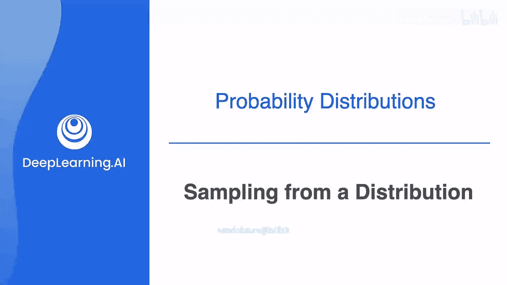
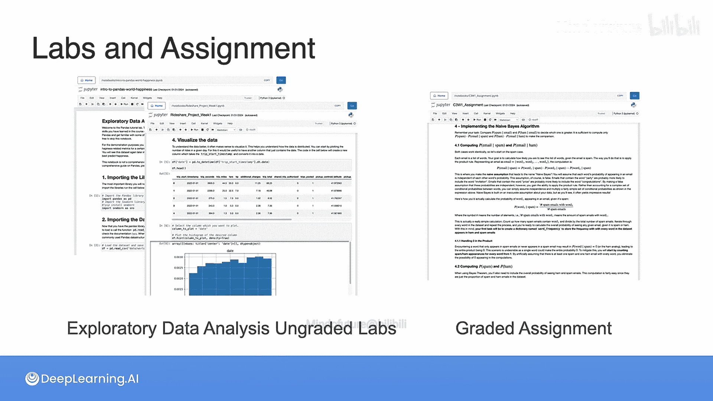

# 029：从分布中抽样 🎲

在本节课中，我们将要学习一个在概率论和机器学习中都非常重要的概念：**从分布中抽样**。我们将探讨如何从一个已知的概率分布中生成新的、符合该分布规律的随机数据点。这对于数据增强、模拟实验和理解统计模型至关重要。

想象你有一个数据集，例如人们的身高数据，但你需要一个更大的数据集。然而，收集更多真实数据的成本太高。那么，你能做什么呢？你可以创建一些看起来与原始数据非常相似的**合成数据**。

实现这一点的一种方法是，根据原始数据构建一个概率分布，然后从这个分布中进行**抽样**。所谓抽样，就是指按照原始分布给出的概率来选取数据点。

## 离散分布的抽样 🎨

让我们从一个简单的离散分布开始理解这个过程。假设我们有一个关于颜色的分布，包含三个可能的结果：绿色、蓝色和橙色。其概率分别为：绿色0.3，蓝色0.5，橙色0.2。

现在，你想设计一个实验，生成一个遵循此分布的随机数据样本。如何从该分布中抽样数据呢？

由于所有结果的概率之和为1，我们可以将它们堆叠在一起，形成一个从0到1的连续条带。计算机可以均匀地从给定区间中选择一个随机数。为了模拟这个分布，你需要遵循以下三个步骤：

以下是具体的操作步骤：
1.  在0到1之间生成一个随机数。
2.  判断这个随机数属于三个区间中的哪一个。
3.  根据该区间，分配对应的颜色。

这个过程能帮助你按照图中给定的概率，随机选取绿色、蓝色或橙色。

现在，假设我们不分配颜色，而是为这些结果分配数字，例如0、1和2。整个过程将完全一样。

## 利用累积分布函数抽样 📈

上一节我们介绍了通过划分概率区间进行抽样的方法。本节中，我们来看看另一种更通用的解决思路：利用**累积分布函数**。

让我们创建另一个图表。我们只需将之前的概率条旋转并向右推，绘制出的那条红色曲线，实际上就是**累积分布函数**。

现在，你要做的就是从垂直区间（0到1）上均匀地抽样。例如，图中这四个点就是均匀抽取的。然后，你只需在累积分布函数的水平轴上读出对应的值，这样你就能按照左侧的分布规律选取数字了。

## 连续分布的抽样 🔄

我们不仅可以将CDF方法用于离散分布，它同样适用于连续分布，而且过程非常精妙。

假设左侧是一个**高斯分布**。直接从这个分布中随机选取点并不容易，因为计算曲线下的面积很困难。

但是，如果你观察右侧的CDF图，然后从那个灰色的垂直区间（0到1）上均匀地选取一些随机数。

接下来，我们只需观察这些随机数在CDF曲线上对应的位置，并找出它们在水平轴上的投影点。如图所示，这些投影点实际上就是根据左侧的正态分布抽取的。当你观察它们在左侧分布图上的位置时，会发现它们恰好符合该分布。

因此，无论是离散还是连续情况，**累积分布函数**都是从一个特定分布中进行抽样的非常有用的方法，它能为你打下坚实的应用统计学基础。

## 本周实践内容 💻

为了巩固所学知识，本课程包含了五个探索性数据分析实验。你将有机会亲手处理一些数据，并观察概率和统计的概念如何帮助发现模式和做出决策。这些实验不计分，但每个实验都为你提供了许多建议活动。

本周你将完成该系列中的两个实验。

以下是两个实验的介绍：
*   **实验一：Pandas入门**。这是一个广泛使用的Python数据分析库。本实验重点介绍你将在后续四个实验中使用的Pandas工具，同时你将首次接触一个关于“世界幸福指数”的数据集，该数据集会在课程后期再次出现。如果你已经熟悉Pandas，可以快速浏览本实验。
*   **实验二：数据分析与可视化**。本实验将引导你应用第一周学到的一些概念，来分析和可视化数据，并描述其关键特征。实验引入了一个关于芝加哥共享单车的数据集，该数据集同样会在课程后期再次使用。

希望你享受这两个实验。

## 本周计分任务 ✅

完成实验后，你将面临本周的计分部分。

首先，你会遇到一个涵盖本周所有主题的计分测验。

最后，你将完成一个计分的编程作业，在该作业中，你需要应用**贝叶斯定理**来预测一封电子邮件是否为垃圾邮件。这项作业将帮助你巩固关于贝叶斯定理和条件概率的许多知识。同时，它也是一个绝佳的机会，让你看到所学的概念在经过巧妙应用后，能够多么强大地解决现实世界的问题。

你的任务很明确，但我知道你能完成。祝你好运，顺利完成本周的学习。

---

本节课中，我们一起学习了**从概率分布中抽样**的核心方法。我们首先通过划分概率区间理解了离散分布的抽样过程，然后引入了更强大的工具——**累积分布函数**，并演示了如何利用CDF对离散和连续分布进行抽样。最后，我们预览了通过实践和作业来巩固这些概念的具体途径。掌握这些技能，是进行数据模拟和深入理解统计模型的基础。