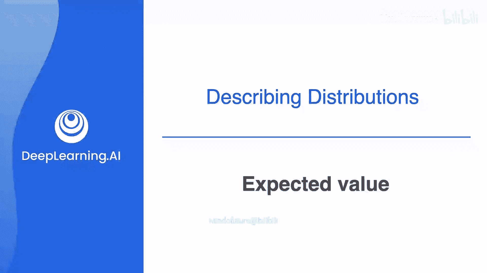
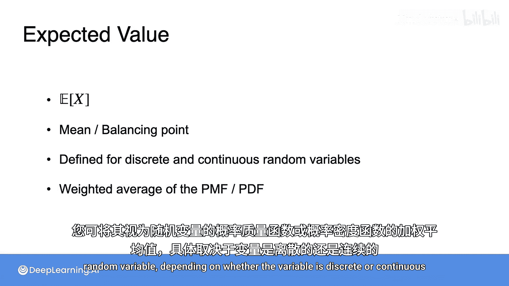

# 031：期望值

在本节课中，我们将学习一个描述概率分布中心位置的核心概念：期望值。我们将通过直观的例子和公式来理解它，并了解它在离散和连续随机变量中的应用。

## 概述：什么是期望值？

上一节我们介绍了概率分布的基本概念。本节中，我们来看看如何描述分布的中心。期望值，也称为均值，是概率分布的一个关键特征。它可以被直观地理解为分布的“平衡点”，或者从长远来看，随机变量取值的“平均值”。

## 期望值的直观理解

让我们通过一个例子来建立直观感受。假设我们观察了一组不同年龄的小猫：
*   有3只0岁的小猫。
*   有2只1岁的小猫。
*   有4只2岁的小猫。
*   有1只3岁的小猫。

如果我们把每只小猫想象成一个等重的小球，并将它们放在一个天平上，通过反复试验，我们可以找到一个让天平平衡的点。这个点就是分布的期望值。

## 期望值的计算

以下是计算上述小猫平均年龄的步骤：

1.  首先，我们计算所有小猫年龄的总和，然后除以小猫的总数。这是计算平均值的常用方法。
    `(3*0 + 2*1 + 4*2 + 1*3) / 10 = 13 / 10 = 1.3`

2.  我们可以将上述公式重写，以揭示其与概率的联系：
    `(3/10)*0 + (2/10)*1 + (4/10)*2 + (1/10)*3 = 1.3`

这样写更容易看出，期望值实际上是随机变量所有可能取值的**加权平均**，而权重就是每个值出现的**概率**。在这个例子中，年龄为0的概率是3/10，年龄为1的概率是2/10，依此类推。

如果随机变量 `X` 代表小猫的年龄，那么它的期望值写作 **`E[X]`**。因此，`E[X] = 1.3`。

## 期望值在决策中的应用

期望值可以帮助我们做出理性的决策。考虑一个游戏：抛一枚均匀的硬币，正面朝上赢得10美元，反面朝上赢得0美元。你的朋友要求你每次游戏支付6美元。你应该玩吗？

我们可以计算这个游戏的期望收益：
*   一半的时间收益为 $10。
*   一半的时间收益为 $0。
*   因此，长期的平均收益（期望值）是：`E[收益] = 0.5 * $10 + 0.5 * $0 = $5`。

由于期望收益是5美元，这意味着从长期看，你平均每局能赢5美元。因此，5美元是你愿意为玩一局游戏支付的最高价格。支付6美元会导致长期亏损，而支付4美元则长期来看有利可图。

## 离散随机变量的期望值公式

对于一般的离散随机变量 `X`，其期望值的计算公式如下：

**`E[X] = Σ [x * P(X=x)]`**

其中：
*   `x` 代表 `X` 所有可能的取值。
*   `P(X=x)` 是概率质量函数，给出了 `X` 取值为 `x` 的概率。
*   `Σ` 表示对所有可能的 `x` 求和。

这个公式正是我们之前使用的加权平均。

## 连续随机变量的期望值

上一节我们介绍了从离散分布过渡到连续分布。对于连续随机变量，计算期望值的思路类似，但求和变成了积分。

连续随机变量 `X` 的期望值公式为：

**`E[X] = ∫ x * f(x) dx`**

其中：
*   `f(x)` 是概率密度函数。
*   `∫` 表示积分，可以理解为对无限多个极其狭窄的区间进行加权求和。

虽然本课程不要求掌握积分计算，但重要的是理解其核心思想：**无论是离散还是连续情况，期望值都是所有可能取值的加权平均**。

## 常见分布的期望值示例

让我们看两个连续分布的例子：

1.  **均匀分布**：如果你在任意时间到达公交站，而公交车每小时一班，那么你的等待时间在0到60分钟之间是均匀分布的。这个分布的平衡点（期望值）正好在中间，即30分钟。对于区间 `[a, b]` 上的均匀分布，其期望值为 `(a+b)/2`。

2.  **指数分布**：考虑客服电话的等待时间。其概率密度函数在0附近较高，然后随着时间延长而下降。这个分布的期望值（平均等待时间）会落在概率密度“较重”区域稍偏右的位置，而不是正中间。

## 期望值与中位数的区别

这里有一个常见的误解：人们可能认为均值（期望值）是将数据分成两半的点。实际上，那个点被称为**中位数**，我们将在下一节详细讨论。

均值是平衡点。在一个不对称的分布中，均值可能会被少数极端值“拉”向一侧。想象一下：一只大象非常靠近平衡点，而一只老鼠在几公里外。即使老鼠很轻，但由于距离极远，它也能平衡大象的重量。类似地，在概率分布中，即使某个区域的概率质量不大，但如果其取值非常大，也会显著影响期望值的位置。

## 总结

本节课中我们一起学习了期望值的概念：
*   **期望值 `E[X]`** 是随机变量 `X` 概率分布的均值，代表其长期平均值。
*   它可以被**直观地理解为分布的平衡点**。
*   对于**离散随机变量**，其计算公式为加权和：`E[X] = Σ [x * P(X=x)]`。
*   对于**连续随机变量**，其计算公式为积分：`E[X] = ∫ x * f(x) dx`，核心思想仍是加权平均。
*   期望值在**理性决策**（如游戏定价）中非常有用。
*   需要注意的是，期望值（均值）与将数据平分为两半的**中位数**是不同的概念。

在下一节，我们将继续探讨描述分布中心的其他方法——中位数和众数。