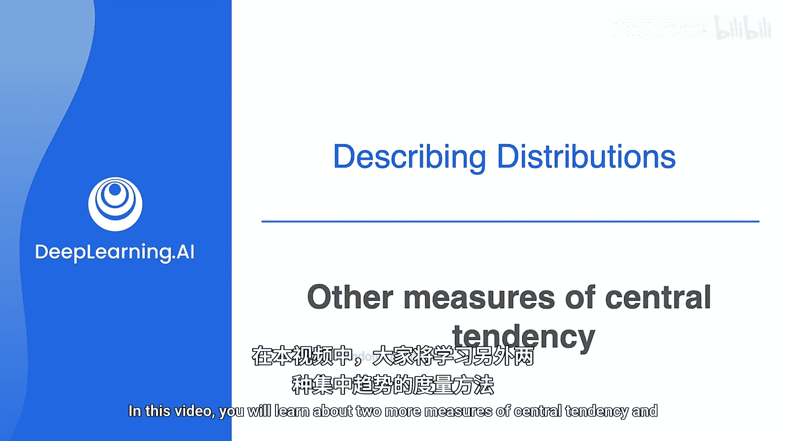
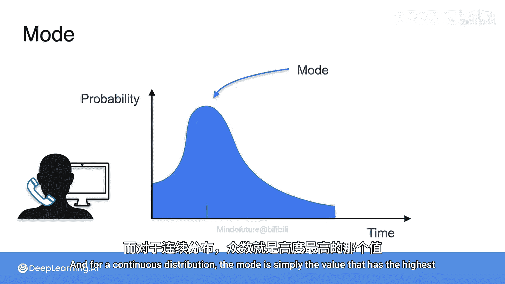
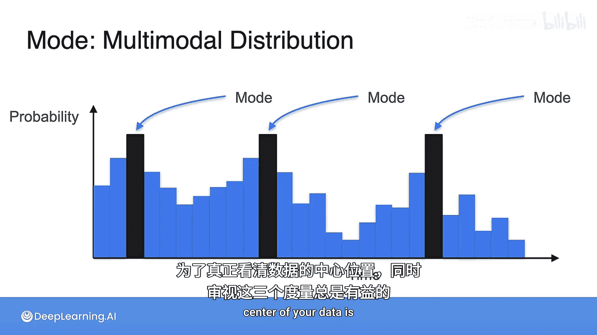
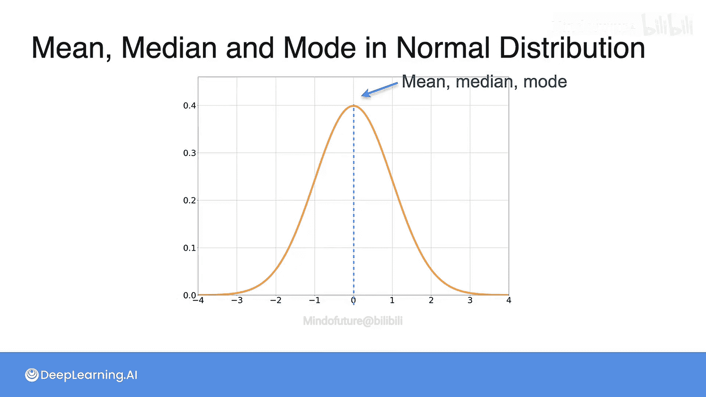

# 032：其他集中趋势度量——中位数与众数 📊

## 概述
在本节课中，我们将要学习除了均值（期望值）之外，另外两种描述数据分布“中心”或“典型值”的重要方法：中位数与众数。理解这些概念对于全面解读数据至关重要。

## 均值可能具有误导性
上一节我们介绍了随机变量的期望值或均值。然而，均值并非衡量分布中心的唯一方法。在某些情况下，均值可能无法准确反映数据的典型情况。

例如，在20世纪80年代，北卡罗来纳大学地理专业毕业生的起薪高达25万美元。这听起来非常高，尤其是考虑到当时美国其他地区地理专业毕业生的起薪仅为2.2万美元。原因在于，迈克尔·乔丹作为该校地理专业的毕业生，其极高的收入极大地拉高了整体平均值。这使得平均值看起来很高，但并不能代表“普通”毕业生的真实收入水平。

## 中位数：排序后的中间值
当平均值具有误导性时，我们可以考虑使用中位数。中位数的计算方法是：将所有数据按大小顺序排列，然后选取正中间的那个数值。

**公式**：对于有序数据集 `[x₁, x₂, ..., xₙ]`，中位数 `Median` 的计算方式为：
*   如果 `n` 是奇数：`Median = x₍ₙ₊₁₎/₂`
*   如果 `n` 是偶数：`Median = (xₙ/₂ + xₙ/₂₊₁) / 2`

在上述薪资例子中，将所有毕业生的薪资排序后，位于中间位置的薪资值（中位数）就不会被迈克尔·乔丹的极端高薪过度影响，从而更真实地反映了普通毕业生的收入水平。

## 众数：出现频率最高的值
除了均值和中位数，描述分布中心的第三种方法是众数。众数是指在数据集中出现频率最高的那个值。在概率分布中，众数对应着概率最高的那个结果。

以下是众数在不同分布中的体现：
*   在离散分布中，众数是概率质量函数（PMF）图中“塔”最高的那个点。
*   在连续分布中，众数是概率密度函数（PDF）图中峰值（最高点）所对应的横坐标值。
*   众数可能不唯一。如果一个分布有多个峰值（即多个值具有相同的最高频率），则称之为**多峰分布**。
*   在均匀分布中，所有值的出现概率相同，因此所有值都可以被视为众数。

## 实例分析
现在，让我们通过几个具体分布的例子，来观察均值、中位数和众数的关系。

### 二项分布示例
首先看一个对称的二项分布：进行5次试验，每次成功的概率为0.5（例如抛5次公平的硬币）。
*   **均值**：通过“平衡”分布找到，位于2.5。
*   **中位数**：由于数据点数量为偶数，取中间两个值的平均值，同样是2.5。
*   **众数**：分布中概率最高的点有两个，分别是2和3。因此众数为2和3。

接下来看一个不对称的二项分布：进行5次试验，但每次成功的概率为0.3。
*   **均值**：平衡点位于1.5（如图中蓝线所示）。
*   **中位数**：将数据分为左右两半的点，位于1。
*   **众数**：概率最高的结果，是1。

### 正态分布示例
对于连续的正态分布：
*   **均值**：由于分布完全对称，平衡点位于中心。
*   **中位数**：将面积平分为两半的点，也位于中心。
*   **众数**：概率密度最高的点，同样位于中心。
因此，在完美的正态分布中，均值、中位数和众数三者重合。

## 总结
本节课中我们一起学习了三种衡量数据分布集中趋势的度量方法：
1.  **均值（期望值）**：所有数据的平均值，但对极端值敏感。
2.  **中位数**：将数据排序后位于中间的值，对极端值不敏感。
3.  **众数**：数据中出现频率最高的值，可能不唯一。

为了真正理解数据的中心位置，同时观察这三种度量通常是有益的。它们各自提供了不同的视角，帮助我们更全面、更准确地解读数据。