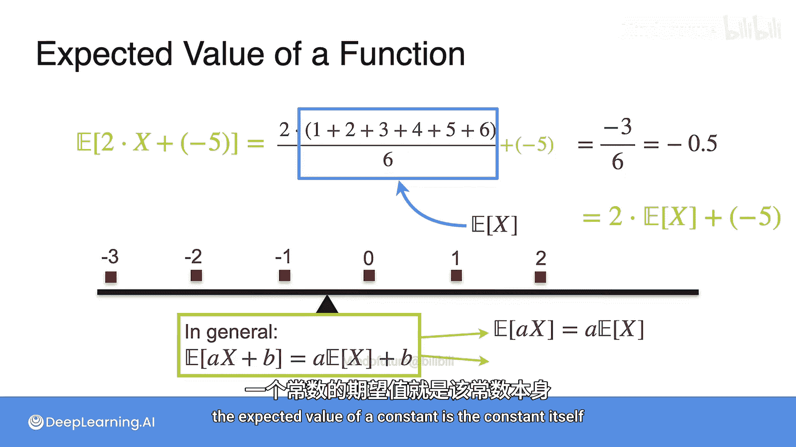

# 033：函数的期望值

## 概述
在本节课中，我们将要学习如何计算随机变量函数的期望值。我们将从回顾随机变量本身的期望值计算开始，逐步扩展到计算其平方、立方或其他任何函数的期望值，并最终揭示期望值运算的一个重要性质——线性性。

## 随机变量期望值的回顾
上一节我们介绍了如何计算随机变量本身的期望值。对于一个具有特定概率分布的随机变量，其期望值的计算方法是：将每个可能的结果乘以其发生的概率，然后将所有乘积相加。

## 函数期望值的计算方法
本节中我们来看看，如果关注的不是随机变量本身，而是它的某个函数（例如 `x²` 或 `x³`），其期望值应如何计算。

假设一个随机变量 `X` 有四个可能的结果：`x₁, x₂, x₃, x₄`，对应的概率分别为 `P(x₁), P(x₂), P(x₃), P(x₄)`。我们想要求函数 `g(X)` 的期望值，记作 `E[g(X)]`。

以下是计算 `E[g(X)]` 的步骤：
1.  对每一个可能的结果 `xᵢ`，计算函数值 `g(xᵢ)`。
2.  将每个函数值 `g(xᵢ)` 乘以其对应的概率 `P(xᵢ)`。
3.  将所有乘积相加。

用公式表示如下：
`E[g(X)] = Σᵢ [ g(xᵢ) * P(xᵢ) ]`

这个过程与计算 `E[X]` 非常相似，只是将原来的 `xᵢ` 替换成了 `g(xᵢ)`，而概率部分保持不变。

## 应用示例：骰子游戏
为了理解这个概念，让我们通过一个骰子游戏的例子来实践。

### 示例一：支付平方值的游戏
想象一个游戏：你掷一个公平的六面骰子，朋友将支付给你（骰子点数）² 的金额。为了公平地参与这个游戏，你应该支付多少入场费？

要回答这个问题，我们需要计算你从游戏中获得的平均收益，即 `E[X²]`，其中 `X` 是骰子的点数。

以下是计算 `E[X²]` 的过程：
*   当 `X=1` 时，`g(X)=1²=1`，概率为 `1/6`。
*   当 `X=2` 时，`g(X)=2²=4`，概率为 `1/6`。
*   当 `X=3` 时，`g(X)=3²=9`，概率为 `1/6`。
*   当 `X=4` 时，`g(X)=4²=16`，概率为 `1/6`。
*   当 `X=5` 时，`g(X)=5²=25`，概率为 `1/6`。
*   当 `X=6` 时，`g(X)=6²=36`，概率为 `1/6`。

根据公式计算期望值：
`E[X²] = (1 * 1/6) + (4 * 1/6) + (9 * 1/6) + (16 * 1/6) + (25 * 1/6) + (36 * 1/6) = 91/6 ≈ 15.17`

因此，这个游戏的公平入场费约为 15.17 元。这个计算本质上就是求 `X²` 的期望值。

### 示例二：线性变换的游戏
现在，假设游戏规则改变：朋友支付你 `2 * X` 元，但你需要预先支付 5 元入场费。你的净收益 `Y` 是 `Y = 2X - 5`。这个游戏的平均收益（即 `E[Y]`）是多少？

我们可以直接计算 `E[Y] = E[2X - 5]`。`Y` 的可能取值为：当 `X` 从 1 到 6 时，`Y` 分别为 -3, -1, 1, 3, 5, 7。每个值出现的概率均为 `1/6`。

计算其平均值：
`E[Y] = [(-3) + (-1) + 1 + 3 + 5 + 7] / 6 = 12 / 6 = 2`

然而，我们也可以从 `E[X]` 推导出这个结果。我们知道一个骰子点数的期望值 `E[X] = 3.5`。观察计算过程：
`E[2X - 5] = E[2X] + E[-5] = 2 * E[X] + (-5) = 2 * 3.5 - 5 = 2`

这揭示了一个重要规律。

## 期望值的线性性质
从第二个示例中，我们发现 `E[2X - 5] = 2 * E[X] - 5`。这并非巧合，而是一个普遍性质。

对于任意随机变量 `X` 和常数 `a`, `b`，期望值算子满足线性性质：
`E[aX + b] = a * E[X] + b`

这个性质被称为**期望的线性性**。它意味着：
1.  常数因子可以提到期望算子外面：`E[aX] = a * E[X]`。
2.  常数的期望就是它本身：`E[b] = b`。

这个性质极大地简化了涉及线性函数期望值的计算。

## 总结
本节课中我们一起学习了：
1.  如何计算随机变量函数 `g(X)` 的期望值：`E[g(X)] = Σ [g(xᵢ) * P(xᵢ)]`。
2.  通过骰子游戏的例子实践了 `E[X²]` 的计算。
3.  发现了期望值运算的一个关键性质——线性性：`E[aX + b] = aE[X] + b`。掌握这个性质能帮助我们更高效地解决许多概率与统计问题。