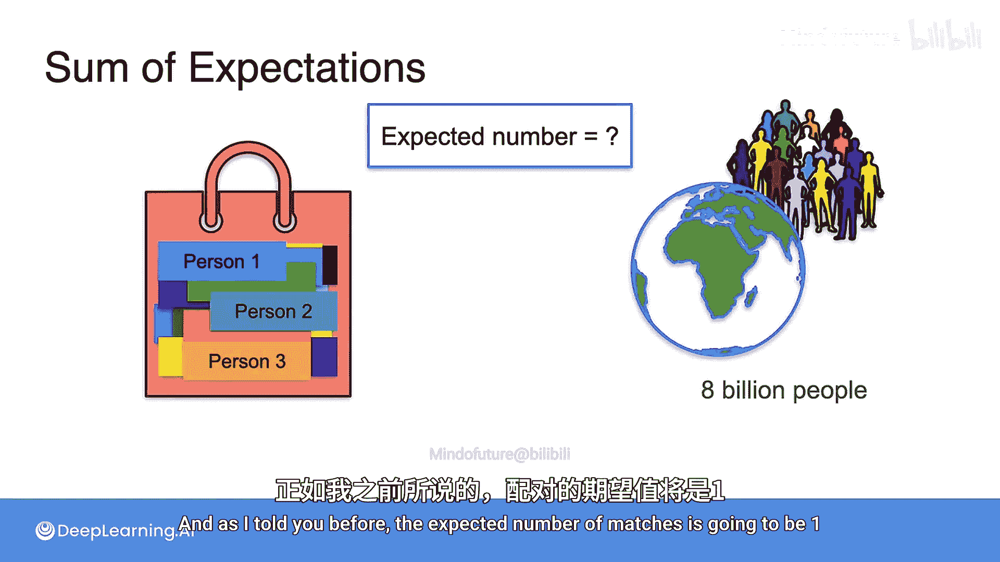
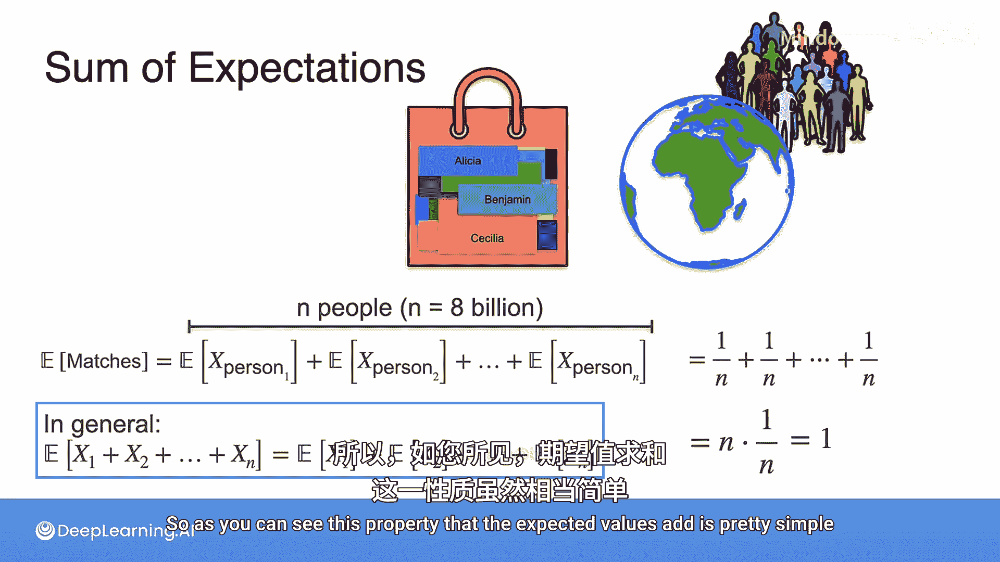

# 034：期望值之和 🎲


在本节课中，我们将要学习期望值的一个核心性质：**和的期望等于期望的和**。这个性质看似简单，但能帮助我们解决一些看似复杂的问题。我们将通过一个有趣的“名字匹配”游戏来深入理解这个概念。

## 一个简单的游戏示例

想象一个包含两个步骤的游戏：
1.  首先，你抛一枚硬币。如果正面朝上，你赢得1美元；否则，你赢得0美元。
2.  然后，你掷一个六面骰子，并赢得骰子朝上点数对应的美元数。

问题是：你在这个游戏中赢得的**期望金额**是多少？

对于抛硬币的部分，我们定义随机变量 **X_coin**。其期望值 **E[X_coin]** 为：
```
E[X_coin] = (1/2) * $1 + (1/2) * $0 = $0.5
```
每次游戏，你平均能赢得0.5美元。

对于掷骰子的部分，我们定义随机变量 **X_die**。其期望值 **E[X_die]** 为：
```
E[X_die] = (1/6)*(1+2+3+4+5+6) = $3.5
```
这是所有可能点数的平均值。

现在，整个游戏的总收益是 **X = X_coin + X_die**。总收益的期望值 **E[X]** 是：
```
E[X] = E[X_coin + X_die] = E[X_coin] + E[X_die] = $0.5 + $3.5 = $4
```
**结论是**：和的期望等于期望的和。用公式表示，对于任意两个随机变量 **X** 和 **Y**，有：
```
E[X + Y] = E[X] + E[Y]
```

## 一个反直觉的匹配问题

上一节我们介绍了期望值相加的基本性质，本节中我们来看看如何用它解决一个有趣的问题。

假设世界上有80亿人，每个人的名字（包含足够多的标识信息）都写在一张小纸条上，放入一个大袋子中。现在，我周游世界，从袋子里随机抽取一张纸条交给遇到的每一个人。

**问题是**：**预期**会有多少人拿到写有自己名字的纸条？

答案可能令人惊讶：**预期只有1个人**会拿到自己的名字。无论总人数是3个还是80亿，这个期望值都是1。下面我们来解释原因。

## 从简单情况开始分析

为了理解原理，我们先从只有3个人（Aisha, Beto, Cameron）的情况开始。

以下是所有6种可能的纸条分配方式（每种概率相同），以及每种方式下匹配正确的人数：

| 分配顺序 | 匹配正确人数 |
| :--- | :--- |
| (A, B, C) | 3 |
| (A, C, B) | 1 |
| (B, A, C) | 1 |
| (B, C, A) | 0 |
| (C, A, B) | 0 |
| (C, B, A) | 1 |

计算匹配人数的期望值 **E[Matches]**：
```
E[Matches] = (3 + 1 + 1 + 0 + 0 + 1) / 6 = 6 / 6 = 1
```
对于3个人，期望匹配数确实是1。

## 利用期望值之和的性质

对于80亿人，列出所有分配方式来计算平均值显然不现实。这时，期望值相加的性质就显示出威力了。

我们定义随机变量 **M** 为总匹配人数。我们的目标是证明 **E[M] = 1**。

关键思路是：将总匹配数 **M** 分解为每个人是否匹配自己名字的简单事件之和。

定义指示变量 **I_i**：
- **I_i = 1**， 如果第 **i** 个人拿到了自己的名字。
- **I_i = 0**， 如果第 **i** 个人没有拿到自己的名字。

那么，总匹配数 **M** 就是所有这些指示变量的和：
```
M = I_1 + I_2 + I_3 + ... + I_n
```
其中 **n** 是总人数（例如3或80亿）。



根据期望的线性性质（和的期望等于期望的和）：
```
E[M] = E[I_1 + I_2 + ... + I_n] = E[I_1] + E[I_2] + ... + E[I_n]
```

现在，计算任意一个人（比如Aisha）的 **E[I_i]**。由于纸条是随机分配的，Aisha拿到自己名字的概率是 **1/n**。指示变量的期望值就是其取值为1的概率：
```
E[I_i] = 1 * P(拿到自己名字) + 0 * P(没拿到自己名字) = 1 * (1/n) = 1/n
```
这个结论对每个人都成立。

因此，总匹配人数的期望值为：
```
E[M] = (1/n) + (1/n) + ... + (1/n) = n * (1/n) = 1
```
**n** 个 **1/n** 相加，结果总是 **1**。

## 核心性质总结



本节课中我们一起学习了期望值的一个强大性质。无论随机变量之间是否独立，无论它们的分布如何，以下公式恒成立：
```
E[X_1 + X_2 + ... + X_n] = E[X_1] + E[X_2] + ... + E[X_n]
```
这个性质被称为**期望的线性性**。它看似简单，却为我们提供了一种将复杂问题（如全球名字匹配）分解为许多简单问题（单个人是否匹配）并轻松求解的强大工具。通过“名字匹配”游戏，我们直观地看到，即使面对80亿种可能性，利用这个性质也能迅速得出精确的期望值。