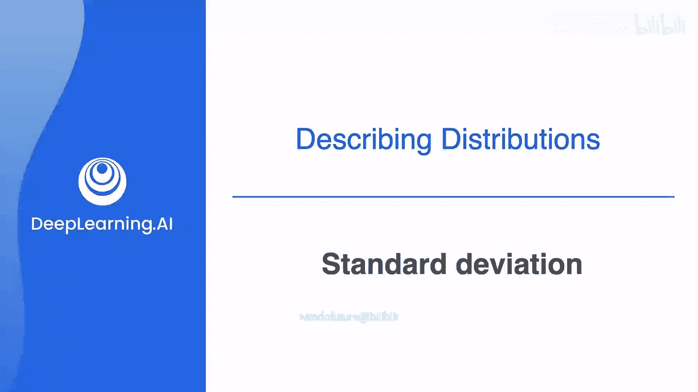
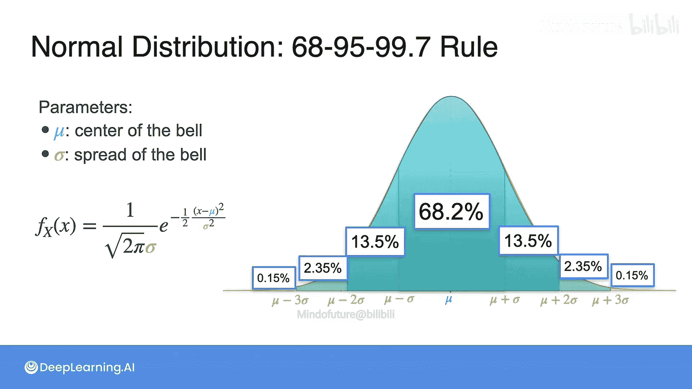

# 036：标准差

## 概述
在本节课中，我们将要学习方差的一个局限性，并引入一个更实用的度量分布离散程度的概念——标准差。我们将了解标准差如何解决方差的单位问题，并探讨它在正态分布中的具体应用和意义。

## 从方差到标准差
上一节我们介绍了方差是衡量数据分布离散程度的有用指标。然而，方差存在一个小的缺点。

这个缺点与单位有关。假设你的分布测量的是人的身高，这些身高值以米或英尺为单位，其期望值（均值）也以相同的单位（米或英尺）表示。但是，方差的计算公式导致其单位变成了米²或英尺²，这在直观解释上并不方便。

为了解决这个问题，我们对方差取平方根，得到的结果称为**标准差**。

## 标准差的定义
标准差是一种使用与原始数据相同单位来衡量分布离散程度的实用方法。

正如我们所见，方差是 `(X - μ)²` 的期望值，也可以写作 `E[X²] - (E[X])²`。

这里有一个小问题。假设 `X` 以米为单位（例如身高或长度），那么 `X` 的期望值 `E[X]` 也以米为单位，它告诉我们所测量人群的平均身高。然而，观察方差：`E[X²]` 的单位是米²，`(E[X])²` 的单位也是米²。因此，`X` 的方差 `Var(X)` 的单位是米²。

这不太直观。想象一下，我们在测量人的身高，方差却告诉你一个以平方米为单位的数值，这衡量的是面积，所以不太实用。

我们能做什么？一个简单的解决方案是取 `X` 的方差的平方根，现在它的单位就变回了米。我们称之为 `X` 的**标准差**。标准差是 `X` 的方差的平方根。

用公式表示：
**标准差 σ = √(Var(X))**

## 正态分布中的标准差
在正态分布中，标准差非常有用。让我们回顾一下钟形曲线。

当我们定义正态分布时，它有两个参数：`μ`（钟形曲线的中心，即均值或期望值）和 `σ`（钟形的宽度，即标准差）。其公式是我们上周看到的那一个。

一个判断 `σ` 值的直观技巧是观察钟形曲线凹凸性发生变化的点。在那个点上，你处于 `μ + σ` 或 `μ - σ` 的位置，具体取决于你所处的一侧。

那么，在 `μ + σ` 和 `μ - σ` 之间有多少面积呢？实际上，有 **68%** 的面积位于这两者之间。

当你观察 `μ ± 2σ`（即均值两侧两个标准差的范围）时，实际上有 **95%** 的曲线面积位于此区间内。

如果观察 `μ ± 3σ`，则有 **99.7%** 的曲线面积。

为了更精确：
*   **68.2%** 的面积位于一个标准差范围内（即 `μ ± σ`）。
*   在一个标准差到两个标准差之间（即 `μ ± σ` 到 `μ ± 2σ` 的两个小条带），有 **13.5%** 的面积。
*   在两个标准差到三个标准差之间（即 `μ ± 2σ` 到 `μ ± 3σ`），有 **2.35%** 的面积。
*   在尾部（延伸到无穷远但面积非常非常小），有 **0.15%** 的面积。

在统计学中，当讨论正态分布时，非常常见的是谈论处于均值的一、二或三个标准差范围内。

## 总结
本节课中我们一起学习了标准差的概念。我们了解到，虽然方差能衡量离散程度，但其单位是原始单位的平方，解释起来不够直观。通过对方差取平方根，我们得到了标准差，它保持了与原始数据相同的单位。特别是在正态分布中，标准差 `σ` 具有明确的意义，它决定了曲线宽度，并且有固定的比例数据落在均值加减若干倍标准差的区间内（如68-95-99.7法则），这使得标准差成为描述数据分布的一个极其强大和常用的工具。