# 037：高斯分布之和 🧮

在本节课中，我们将学习一个关于均值、期望、方差和标准差的有趣应用：**两个高斯分布相加**。我们将通过一个计算机系统总响应时间的例子，来理解如何计算两个独立高斯随机变量之和的分布参数。

## 概述

想象你正在研究一个计算机系统的总响应时间。这个时间由两个部分组成：
1.  **处理时间**：系统处理给定任务所需的时间。
2.  **网络延迟**：计算机系统与数据库服务器或外部API等网络设备通信时的延迟。

我们分别用变量 **T** 和 **L** 表示处理时间和网络延迟。那么，总响应时间 **R** 就是这两者之和，即：
`R = T + L`

## 问题建模

假设我们可以用高斯分布（正态分布）来分别建模这两个部分：
*   处理时间 **T**（单位：毫秒）服从均值为 **10**、标准差为 **2** 的高斯分布。
*   网络延迟 **L**（单位：毫秒）服从均值为 **5**、标准差为 **1** 的高斯分布。
*   并且，**T** 和 **L** 是相互独立的。

以下是这两个变量的概率密度函数曲线图：

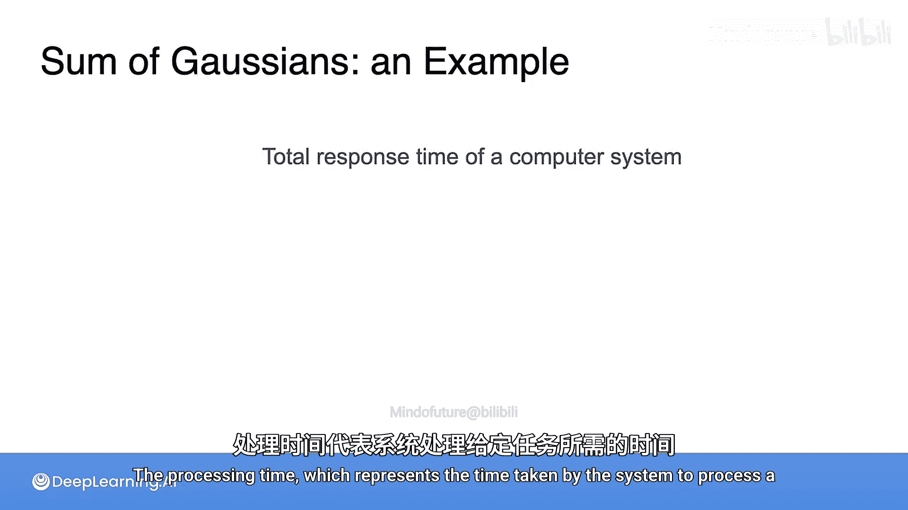

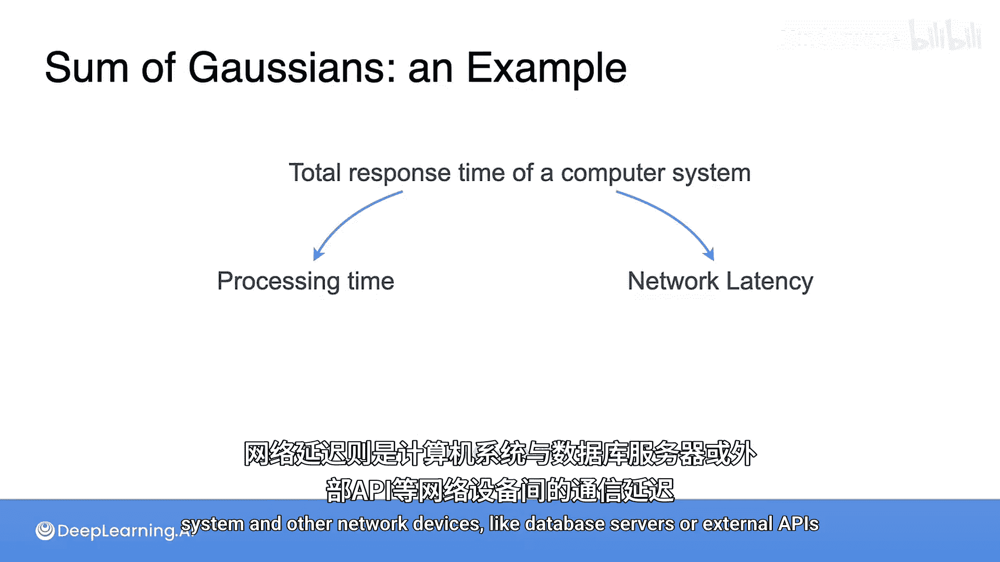

## 通过抽样验证

为了直观理解，我们可以对每个变量进行抽样。例如，各抽取10，000个样本，并绘制直方图。可以看到，它们的直方图与理论曲线拟合得很好。

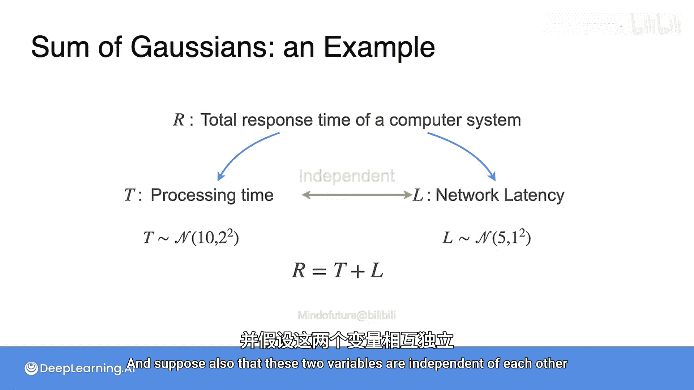
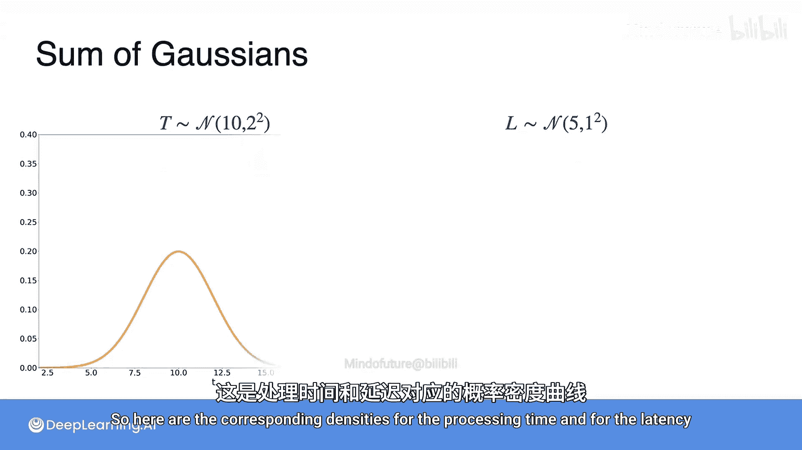

现在，利用这些样本，我们可以生成10，000个总响应时间 **R** 的样本。具体做法是将每一对 **T** 和 **L** 的样本值相加。

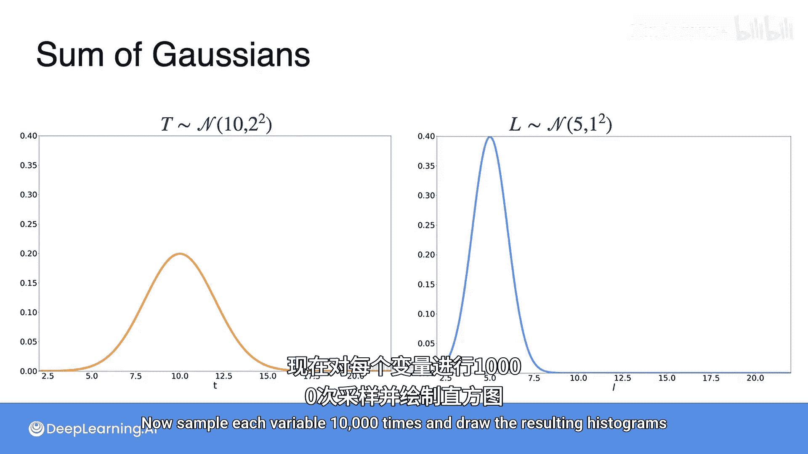

生成样本后，我们得到 **R** 的直方图如下。注意，**R** 的分布形状仍然近似于高斯分布。

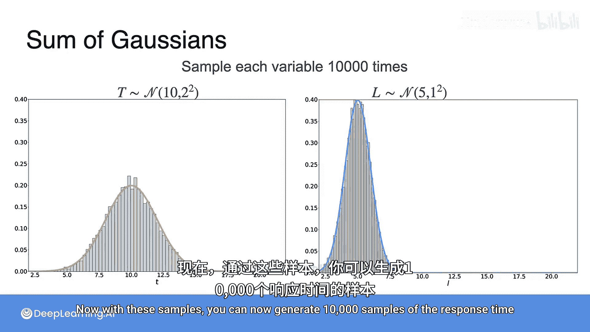

## 推导新分布的参数

现在的问题是：这个新的高斯分布 **R** 的均值（μ）和标准差（σ）是多少？

### 计算均值 μ_R

均值计算相对简单，因为它是 **R** 的期望值。
`μ_R = E[R] = E[T + L]`
由于期望的线性性质，和的期望等于期望的和：
`μ_R = E[T] + E[L] = μ_T + μ_L`
代入已知数值：
`μ_R = 10 + 5 = 15`

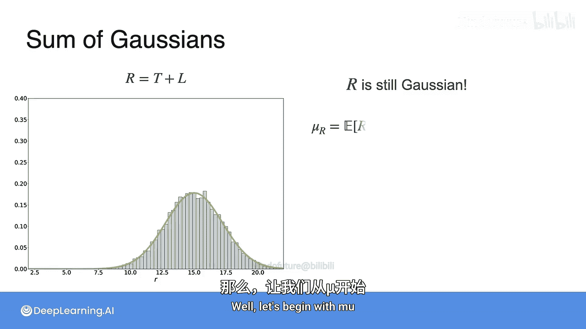

### 计算标准差 σ_R

标准差是方差的平方根。首先计算方差 `Var(R)`：
`σ_R = sqrt(Var(R)) = sqrt(Var(T + L))`
这里需要一个关键性质：**对于两个独立的随机变量，它们和的方差等于各自方差的和**。
因此：
`Var(T + L) = Var(T) + Var(L)`
我们知道方差是标准差的平方，所以：
`σ_R = sqrt(σ_T^2 + σ_L^2)`
代入已知数值：
`σ_R = sqrt(2^2 + 1^2) = sqrt(4 + 1) = sqrt(5) ≈ 2.2361`

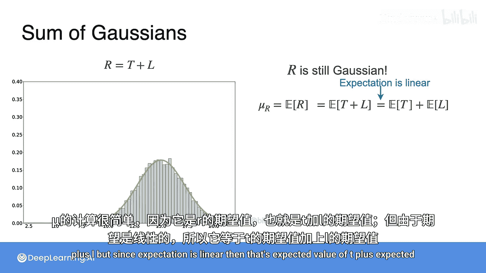

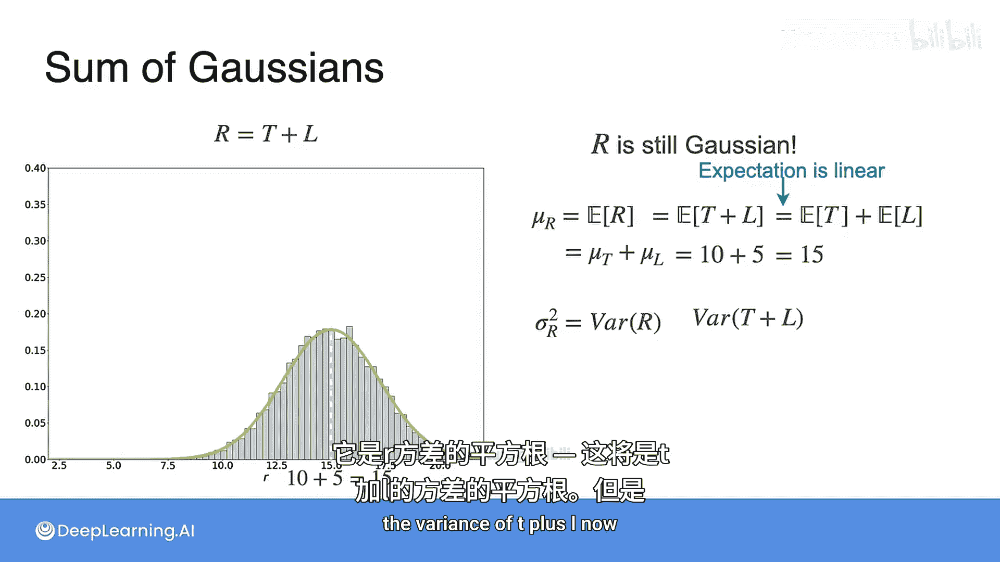

## 结论

最终，总响应时间 **R** 服从一个新的高斯分布，其参数为：
*   **均值 μ_R = 15**（两个原始均值的和）
*   **标准差 σ_R = √5 ≈ 2.236**（两个原始标准差的平方和的平方根）

其概率密度函数曲线如下：

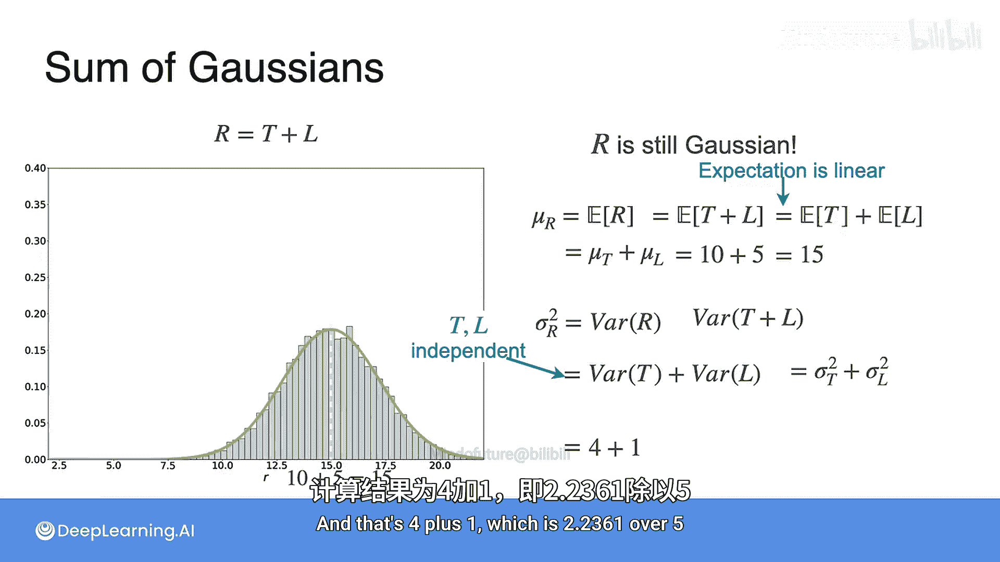

## 一般化公式

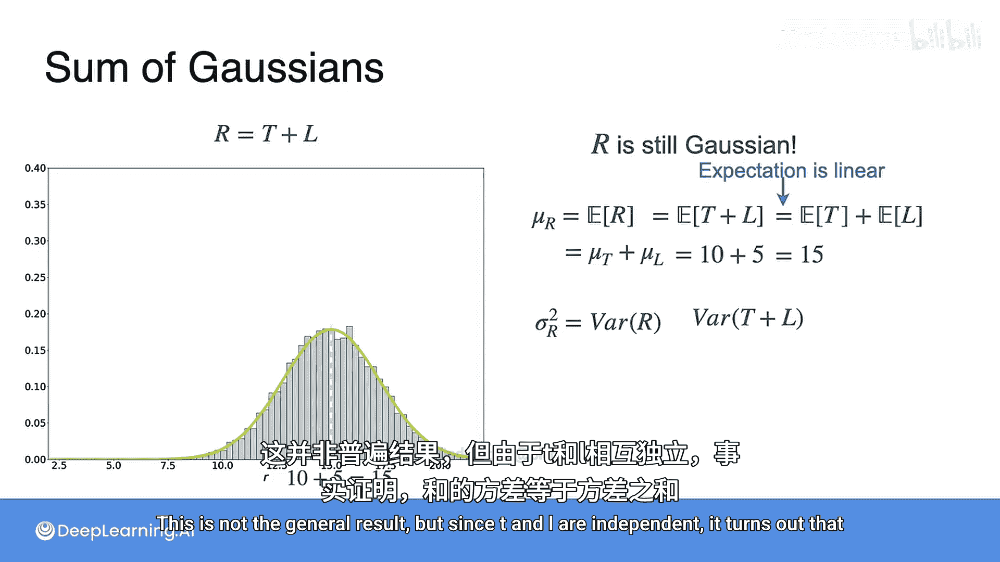

上一节我们通过具体例子推导了两个独立高斯变量相加的结果。现在，我们将其推广到更一般的线性组合情况。

假设有两个独立的高斯随机变量：
*   `X ~ N(μ_X， σ_X^2)`
*   `Y ~ N(μ_Y， σ_Y^2)`

那么，它们的线性组合 `Z = aX + bY`（其中 `a` 和 `b` 是常数）也服从高斯分布，其参数为：
*   **均值**：`μ_Z = a * μ_X + b * μ_Y`
*   **方差**：`σ_Z^2 = a^2 * σ_X^2 + b^2 * σ_Y^2`

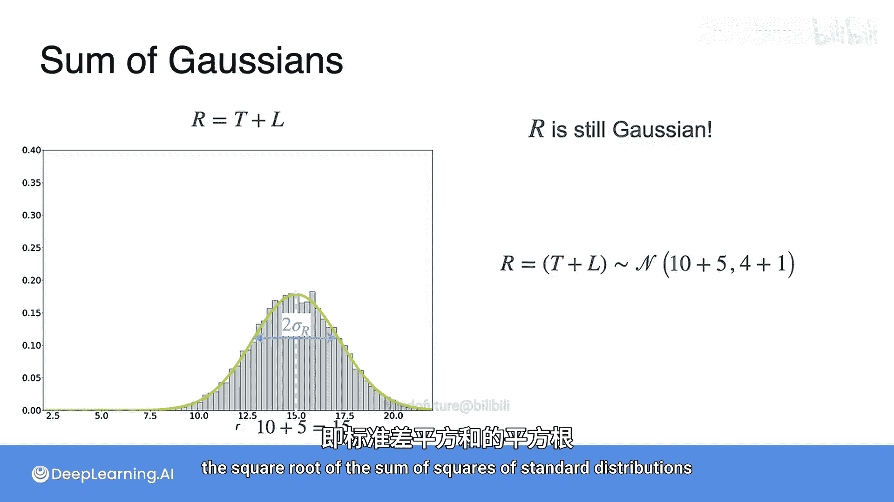

用公式表示为：
`Z ~ N(aμ_X + bμ_Y， a^2σ_X^2 + b^2σ_Y^2)`

当 `a = 1， b = 1` 时，就退化为我们之前讨论的“和”的情况。

## 总结

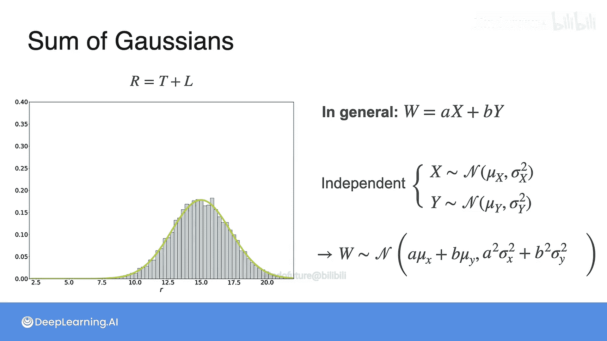

本节课中，我们一起学习了如何计算两个独立高斯分布之和的分布。核心要点如下：
1.  **和的均值**等于**均值的和**：`μ_(X+Y) = μ_X + μ_Y`。
2.  **和的方差**（在变量独立时）等于**方差的和**：`σ_(X+Y)^2 = σ_X^2 + σ_Y^2`。
3.  两个独立高斯随机变量的和（或线性组合）仍然是一个高斯随机变量。
4.  这一性质在系统性能分析、误差建模、信号处理等许多领域都有广泛应用，因为它允许我们将复杂系统的总不确定性分解为各个独立部件的不确定性之和。