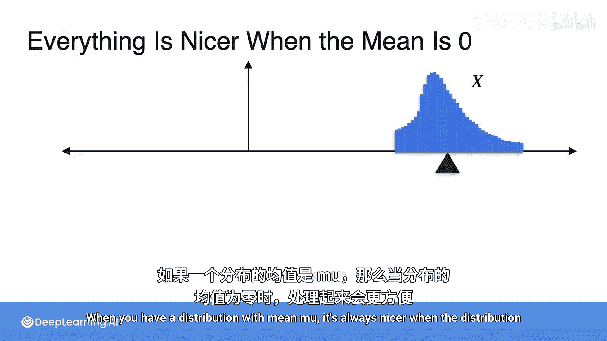
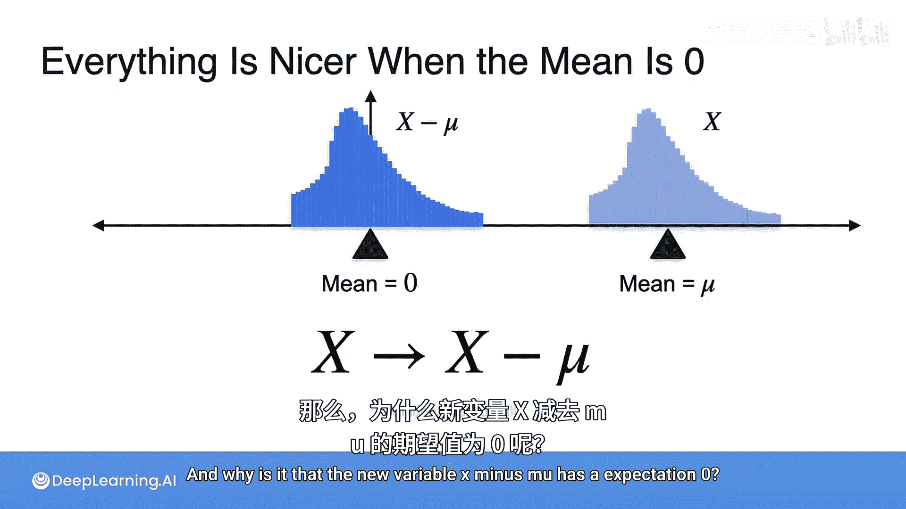
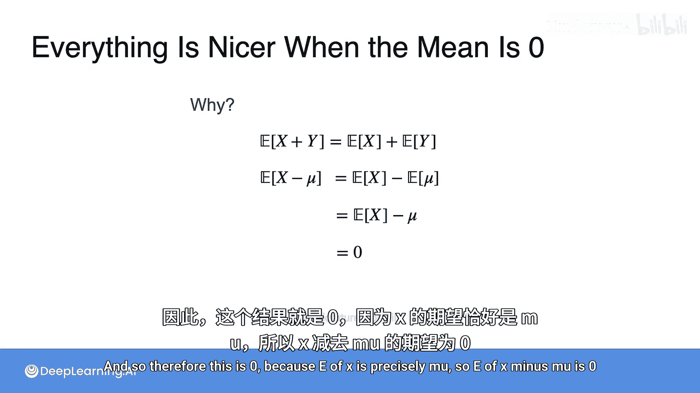
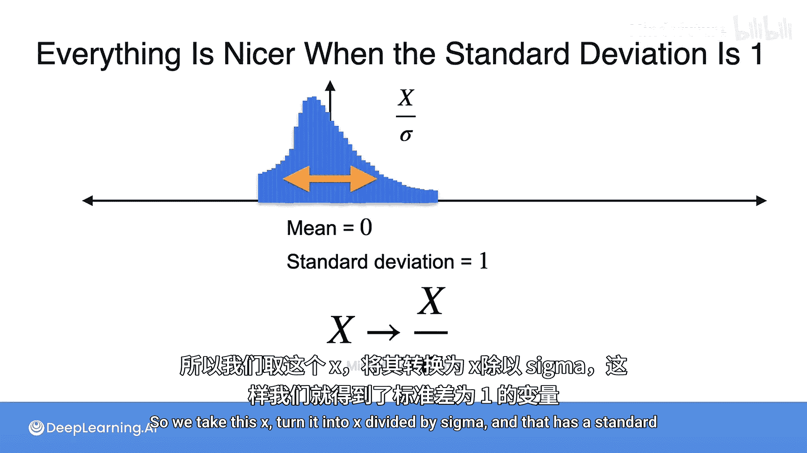
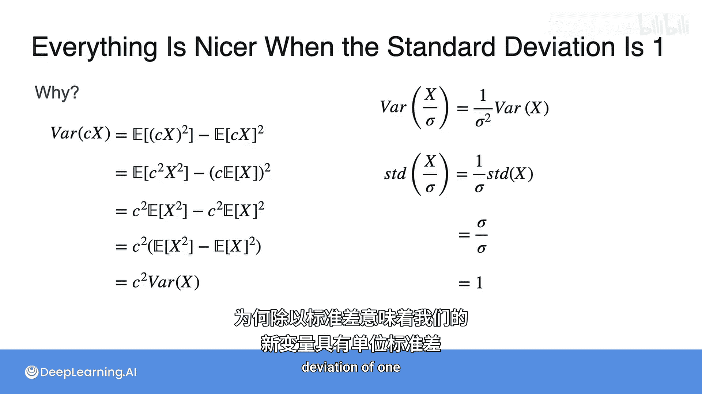
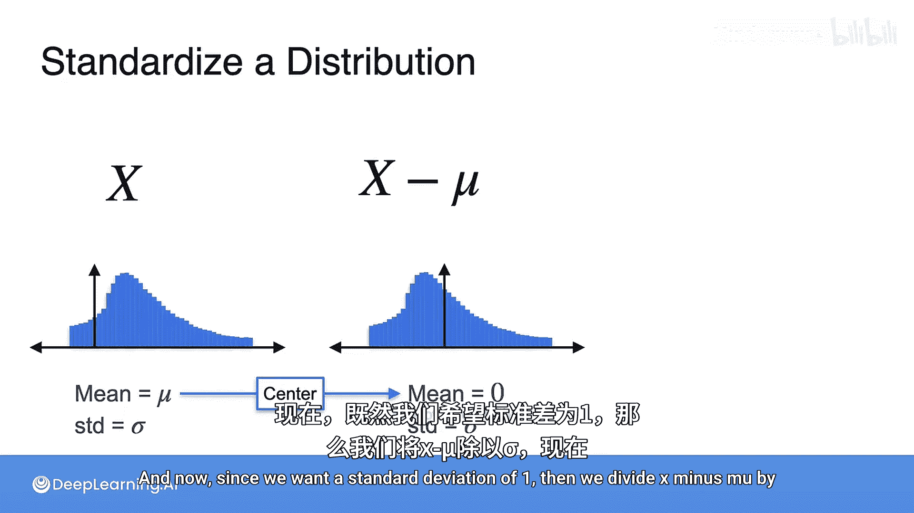
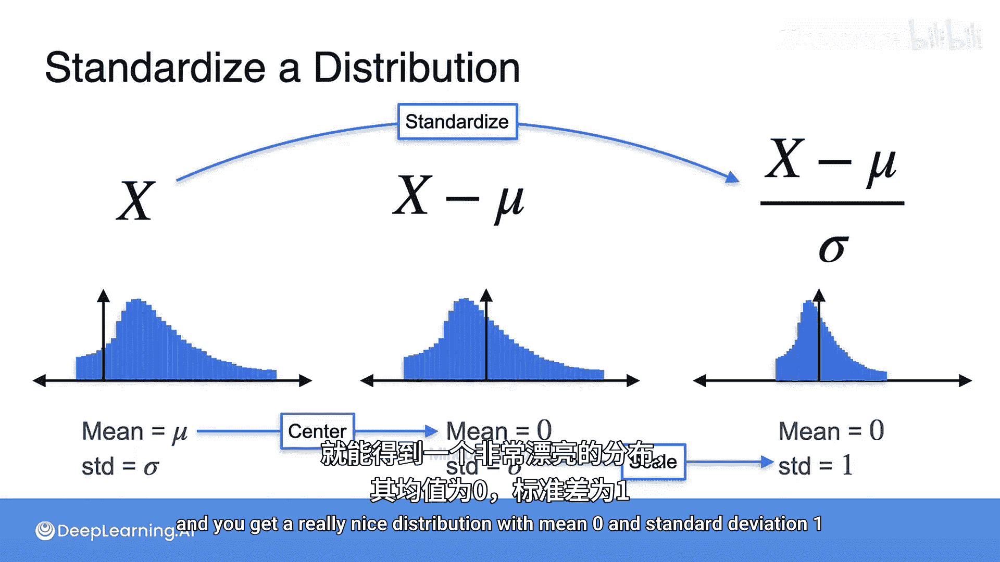
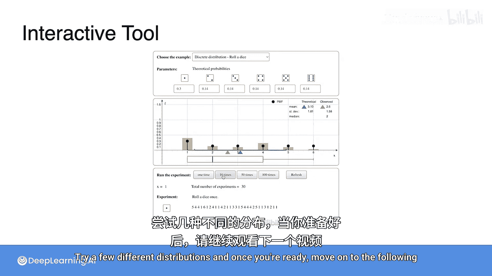

# 038：分布的标准化 📊

在本节课中，我们将学习一个在数据科学和机器学习中至关重要的概念：**分布的标准化**。我们将了解如何通过数学变换，将任何具有特定均值和标准差的分布，转换为一个均值为0、标准差为1的标准形式。这个过程是许多高级统计分析和机器学习算法的基础。

## 中心化：将均值变为零

上一节我们介绍了分布的均值和标准差。本节中我们来看看如何通过变换来“标准化”一个分布。首先，假设我们有一个随机变量 **X**，其均值为 **μ**。为了使分布更易于处理，我们通常希望其均值为零。

以下是实现中心化的方法：
*   定义一个新的随机变量：**Y = X - μ**。
*   由于期望的线性性质，**E[Y] = E[X - μ] = E[X] - E[μ] = μ - μ = 0**。

因此，通过减去均值 **μ**，我们得到了一个均值为零的新分布。这个过程被称为**中心化**。中心化后，分布的均值变为0，但其标准差 **σ** 保持不变。

## 缩放：将标准差变为一

现在，我们有了一个均值为零的分布。接下来，我们希望其标准差为1，这样数据的“尺度”就统一了。

以下是实现缩放的方法：
*   假设随机变量 **Z** 的方差为 **Var(Z)**。对于一个常数 **c**，有公式：**Var(cZ) = c² Var(Z)**。
*   因此，如果我们对中心化后的变量 **Y** 除以标准差 **σ**，即定义 **Z = Y / σ = (X - μ) / σ**。
*   那么，**Var(Z) = Var(Y / σ) = (1/σ)² Var(Y) = (1/σ²) * σ² = 1**。
*   由于标准差是方差的平方根，所以 **Z** 的标准差为 **√1 = 1**。

通过除以标准差 **σ**，我们得到了一个标准差为1的新变量。这个过程被称为**缩放**。

## 标准化：完整的流程

结合上述两个步骤，我们就得到了**标准化**的完整过程。

以下是标准化的步骤：
1.  **中心化**：从原始变量 **X** 中减去其均值 **μ**，得到 **X - μ**。
2.  **缩放**：将中心化后的结果除以其标准差 **σ**，得到 **(X - μ) / σ**。

最终得到的标准化变量 **Z** 具有以下性质：
*   均值 **E[Z] = 0**
*   标准差 **Std(Z) = 1**

任何分布经过标准化后，都会转化为均值为0、标准差为1的形式。这在比较不同尺度的数据、以及为许多机器学习模型（如支持向量机、逻辑回归）准备数据时非常有用。

## 动手实践 🛠️

接下来，你将找到一个交互式工具，可以从几种不同的分布中进行抽样并可视化结果。你将能够看到所收集数据的均值、中位数和标准差，并将这些结果与你期望的理论值进行比较。

请尝试几种不同的分布。完成后，请继续学习下一个视频。

---

本节课中我们一起学习了**分布的标准化**。我们首先通过**中心化**（减去均值）将分布的均值调整为零，然后通过**缩放**（除以标准差）将分布的标准差调整为一。这个 **Z = (X - μ) / σ** 的标准化过程，是数据预处理中的一个关键步骤，它能帮助我们将不同来源和尺度的数据放在同一个标准尺度上进行比较和分析。