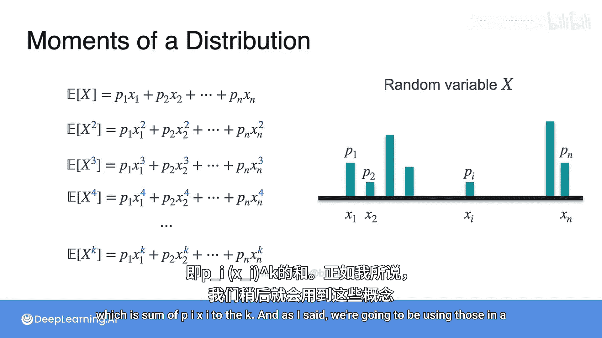

# 039：偏度与峰度——分布的矩

在本节课中，我们将学习如何更全面地描述一个概率分布。除了期望值和方差，我们还将引入“矩”的概念，并了解“偏度”和“峰度”这两个重要的分布特征。

## 期望值与方差的局限性

上一节我们介绍了期望值和方差（或标准差），它们是描述分布中心位置和离散程度的核心指标。然而，期望值和方差并不能捕捉到分布的所有细节。

例如，它们无法告诉我们分布的形状是否对称，或者分布的“尾巴”有多厚。为了描述这些更细微的特征，我们需要引入新的度量方法，即“偏度”和“峰度”。在深入探讨这两个概念之前，我们先来学习一个更基础的工具——“矩”。

## 理解分布的“矩”

“矩”是一个数学概念，它提供了一种系统化地描述分布形状的方法。你可能已经接触过其中的一些，现在我们来正式定义它。

假设有一个随机变量X，其取值和概率如下：
*   取值为 -2，概率为 1/3。
*   取值为 0，概率为 1/6。
*   取值为 1，概率为 1/2。

那么，它的期望值（一阶矩）计算如下：
`E[X] = (1/3)*(-2) + (1/6)*0 + (1/2)*1`

接下来，我们计算变量平方的期望值（二阶矩）：
`E[X^2] = (1/3)*(-2)^2 + (1/6)*0^2 + (1/2)*1^2`

期望值 `E[X]` 被称为**一阶矩**。`E[X^2]` 被称为**二阶矩**，它与方差有关（方差是 `E[(X - E[X])^2]`，即中心化的二阶矩）。

我们可以将这个思路继续推广：
*   **三阶矩**：`E[X^3]`
*   **四阶矩**：`E[X^4]`
*   **k阶矩**：`E[X^k]`

这些矩在后续分析中将非常有用。

## 矩的一般化公式

更一般地，如果一个随机变量可以取值 `x1, x2, ..., xn`，对应的概率为 `p1, p2, ..., pn`，那么各阶矩的计算公式如下：

以下是各阶矩的计算公式：
*   **一阶矩（期望值）**：`∑ p_i * x_i`
*   **二阶矩**：`∑ p_i * (x_i)^2`
*   **三阶矩**：`∑ p_i * (x_i)^3`
*   **四阶矩**：`∑ p_i * (x_i)^4`
*   **k阶矩**：`∑ p_i * (x_i)^k`

正如之前所说，我们将很快用到这些矩。

## 总结

本节课中，我们一起学习了“矩”这一核心概念。我们了解到，期望值和方差（分别对应一阶矩和中心化的二阶矩）虽然重要，但不足以完全描述一个分布。通过引入更高阶的矩（如三阶矩、四阶矩），我们可以量化分布的“偏度”（不对称性）和“峰度”（尾部厚度与峰值尖锐度），从而更全面地刻画分布的形状特征。在接下来的课程中，我们将具体探讨如何利用这些矩来计算偏度和峰度。