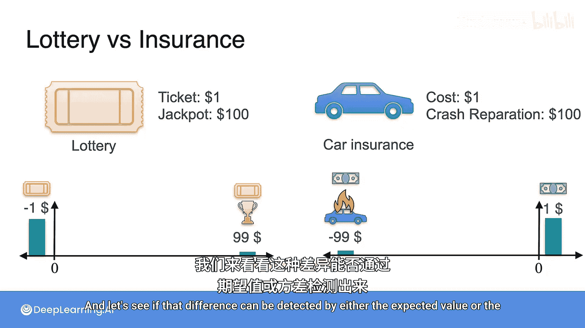
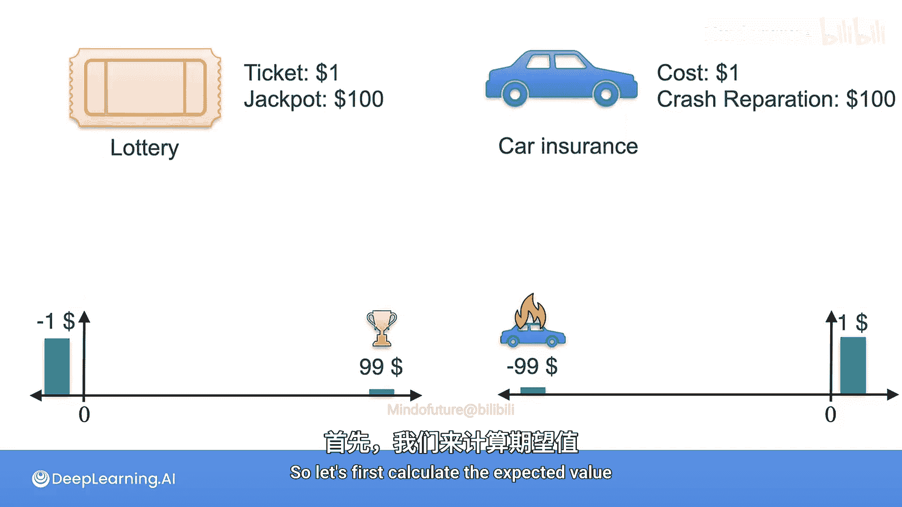
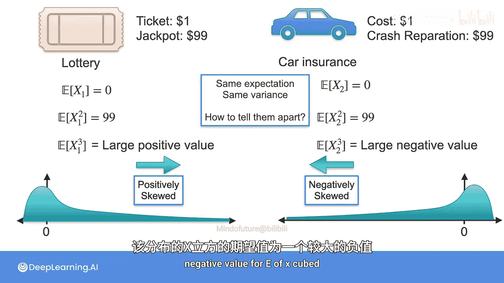
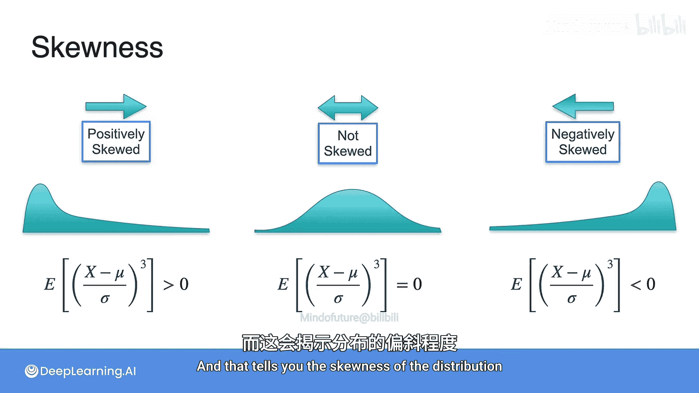

# 040：偏度与峰度

在本节课中，我们将学习如何描述概率分布的形状特征，特别是当分布的**期望值**和**方差**相同时，如何区分它们。我们将通过一个彩票与汽车保险的对比案例，引入**偏度**这一核心概念。

## 概述

之前我们学习了描述数据集中趋势（期望值）和离散程度（方差）的指标。然而，有时两个分布即使拥有相同的均值和方差，其形状也可能截然不同。本节将介绍**偏度**，它描述了分布的不对称性，帮助我们捕捉到这种差异。

## 案例对比：彩票与汽车保险

为了理解偏度的作用，我们首先来看两个看似不同但统计量相似的场景。

### 场景一：购买彩票
*   你花费1美元购买一张彩票。
*   有1%的概率赢得100美元大奖。
*   有99%的概率不中奖，损失1美元。

### 场景二：经营汽车保险
*   你是一家汽车保险公司，一位客户支付1美元保费。
*   有1%的概率客户发生事故，你需要赔付100美元。
*   有99%的概率客户安全无事，你赚取1美元保费。

以下是两个场景的收益分布图：

如图所示，彩票的收益分布（X1）和保险的收益分布（X2）恰好关于水平轴对称。接下来，我们计算它们的期望值和方差。

## 期望值与方差的局限性

首先，我们计算两个分布的期望值。

**彩票（X1）的期望值：**
`E(X1) = (-1) * 0.99 + 99 * 0.01 = 0`

**保险（X2）的期望值：**
`E(X2) = (-99) * 0.01 + 1 * 0.99 = 0`

两个分布的期望值均为0。这意味着，从长期平均来看，玩无数次彩票或卖出无数份保险，平均收益都是0。

接着，我们计算方差。

**彩票（X1）的方差：**
`Var(X1) = E(X1²) = (-1)² * 0.99 + (99)² * 0.01 = 99`

**保险（X2）的方差：**
`Var(X2) = E(X2²) = (-99)² * 0.01 + (1)² * 0.99 = 99`

两个分布的方差也相同，都是99。这表明它们的离散程度一致。

然而，这两个游戏的风险和体验感天差地别。彩票是“小概率赢大钱，大概率亏小钱”，而保险是“大概率赚小钱，小概率亏大钱”。期望值和方差无法捕捉这种本质区别，因为它们只用到了一阶矩（期望）和二阶矩（方差）。

## 引入三阶矩：偏度

既然一阶矩和二阶矩相同，我们尝试计算三阶矩 `E(X³)`。

**彩票（X1）的三阶矩：**
`E(X1³) = (-1)³ * 0.99 + (99)³ * 0.01 = 9702`

**保险（X2）的三阶矩：**
`E(X2³) = (-99)³ * 0.01 + (1)³ * 0.99 = -9702`

计算结果出现了巨大差异！彩票分布的三阶矩是很大的正数，而保险分布的三阶矩是绝对值很大的负数。这是因为 `X³` 会放大远离中心的值的影响，并保留其符号。

*   **正的三阶矩**（如9702）意味着分布右侧存在极端的正值，图形有一个向右的“长尾”。我们称之为**正偏**或**右偏**。
*   **负的三阶矩**（如-9702）意味着分布左侧存在极端的负值，图形有一个向左的“长尾”。我们称之为**负偏**或**左偏**。

为了消除量纲影响，我们通常使用标准化的三阶矩来定义**偏度**。

## 偏度的定义

偏度是随机变量标准化后的三阶矩，其公式如下：

`偏度 = E[((X - μ) / σ)³]`

其中：
*   `μ` 是随机变量 `X` 的期望值。
*   `σ` 是随机变量 `X` 的标准差。

根据偏度的值，我们可以对分布形状做出判断：

*   **偏度 > 0**：分布为正偏（右偏）。均值通常大于中位数，长尾在右侧。
*   **偏度 = 0**：分布大致对称（如正态分布）。
*   **偏度 < 0**：分布为负偏（左偏）。均值通常小于中位数，长尾在左侧。

在我们的案例中：
*   彩票收益分布是**正偏**的，因为有小概率获得巨大收益。
*   保险收益分布是**负偏**的，因为有小概率遭受巨大损失。

## 总结

本节课我们一起学习了**偏度**的概念。当两个分布的期望值（一阶矩）和方差（二阶矩）无法区分时，偏度（三阶矩）提供了关键信息。它描述了概率分布的不对称性，帮助我们识别分布是偏向左侧（负偏）、对称还是偏向右侧（正偏）。理解偏度对于风险评估、投资决策和深入理解数据分布形状至关重要。

