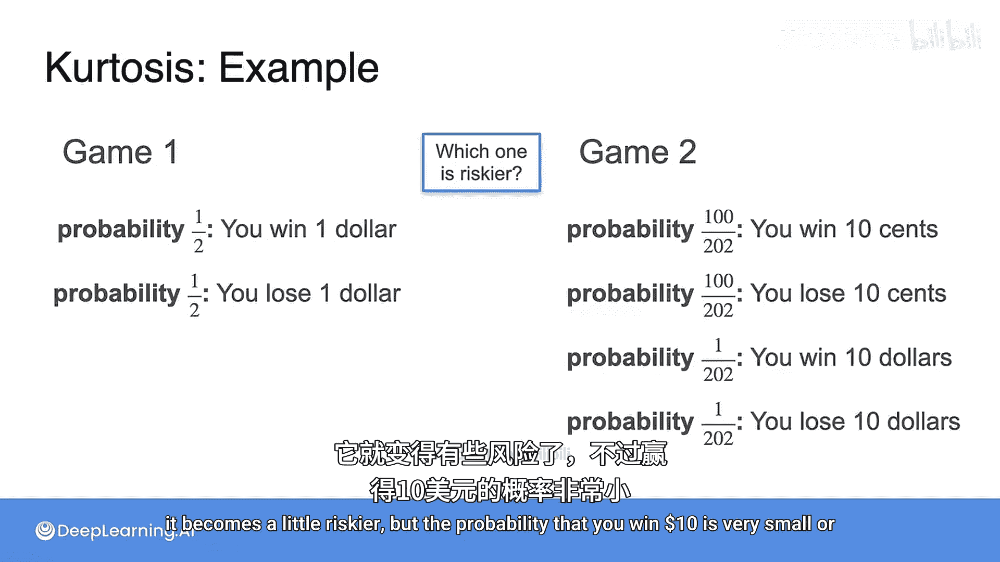
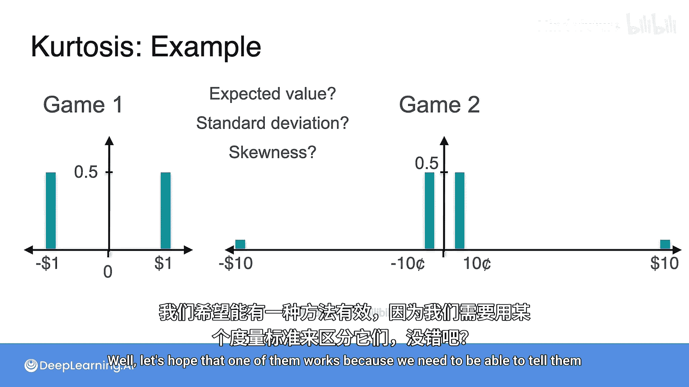
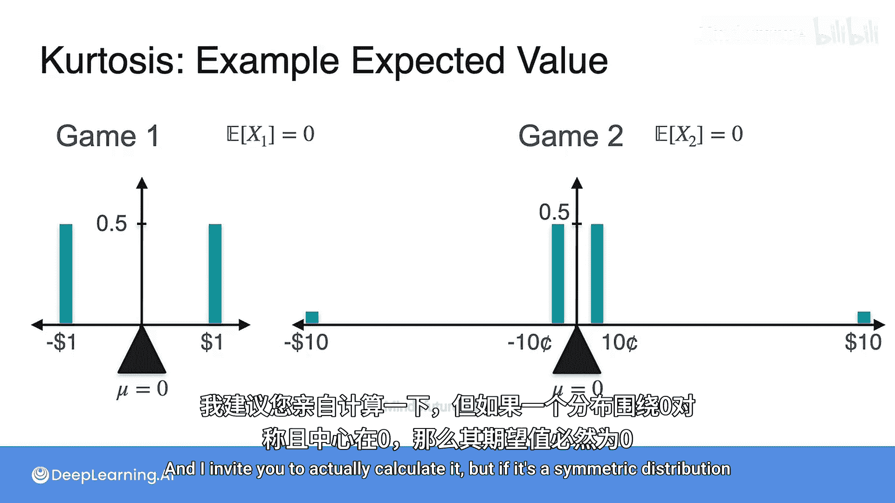
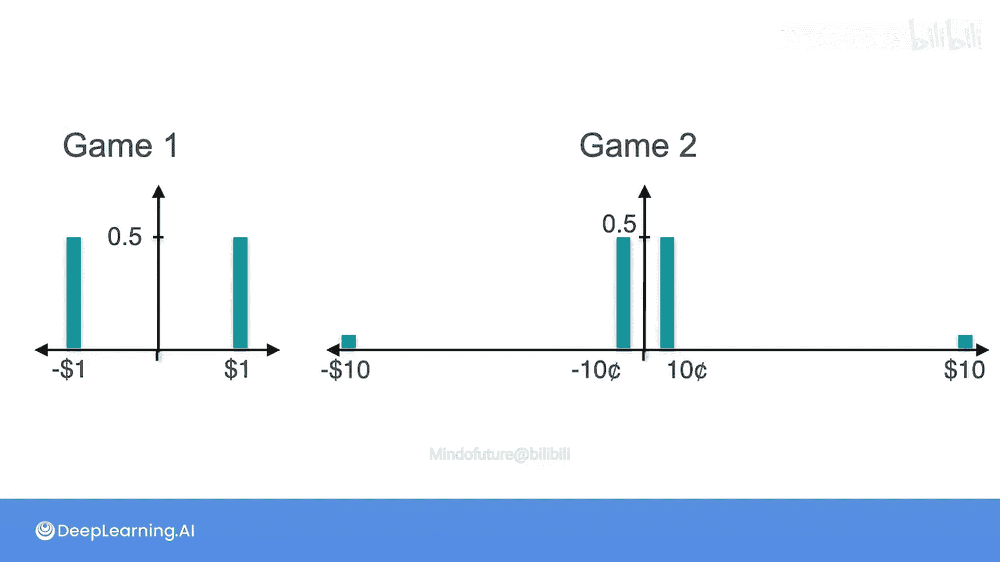
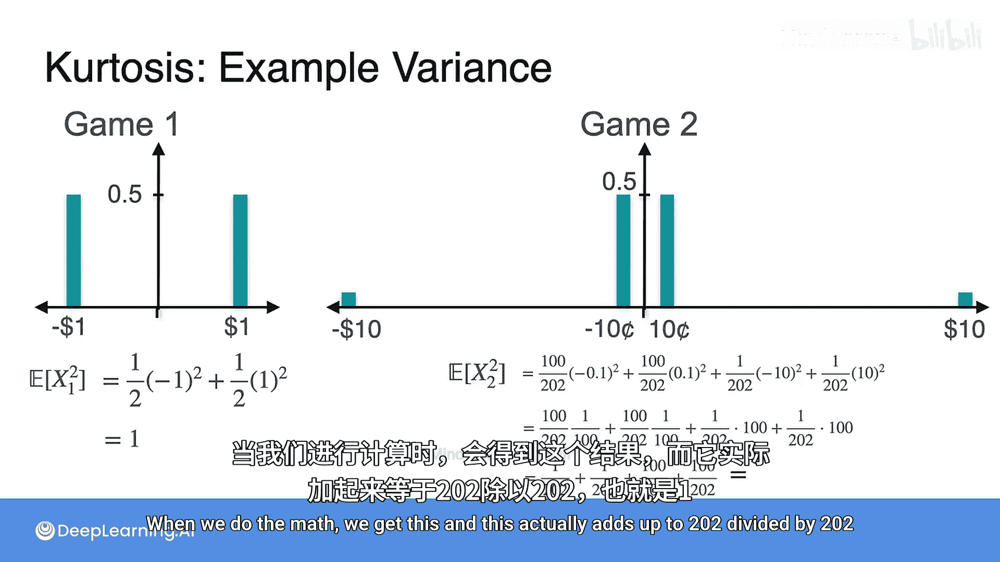
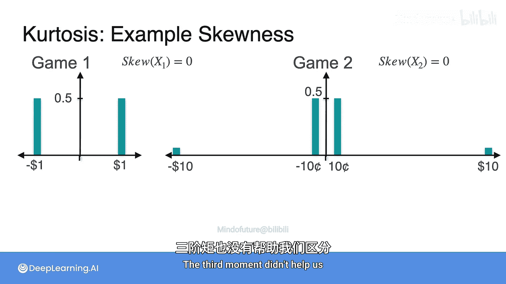
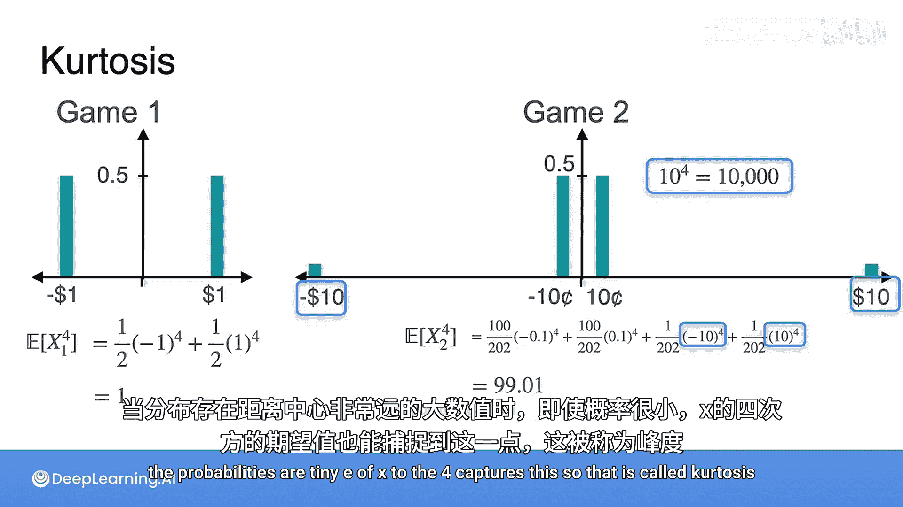
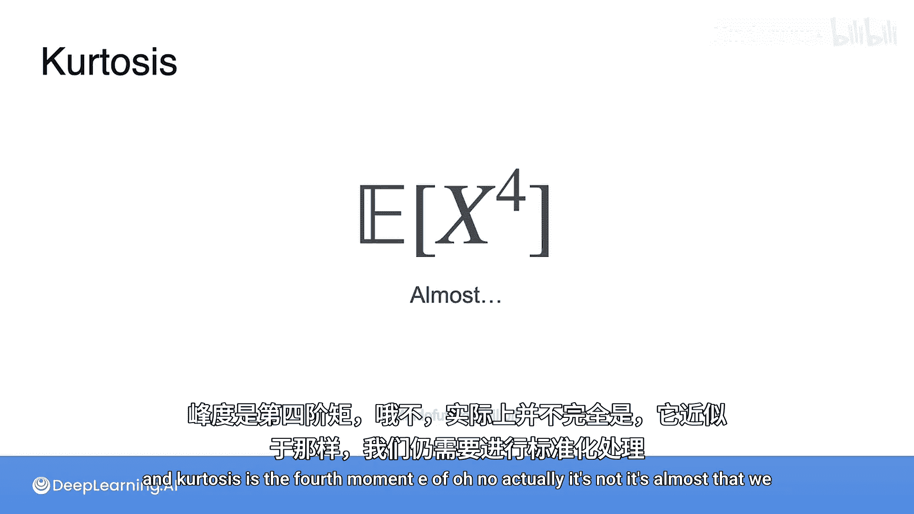
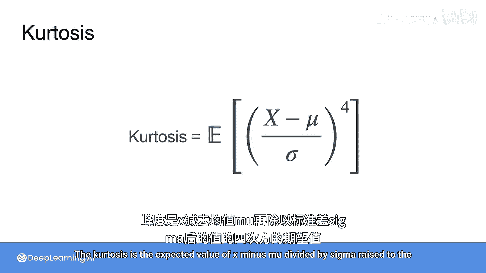
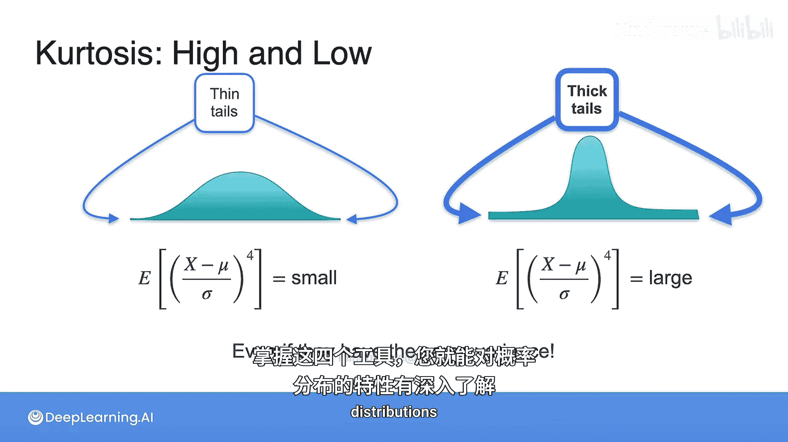

# 041：偏度与峰度 📊

在本节课中，我们将要学习两个新的统计概念：偏度与峰度。我们将通过比较两个不同的游戏来理解这些概念如何帮助我们描述概率分布的形状，特别是当期望值和方差都无法区分它们时。

上一节我们介绍了期望值和方差，本节中我们来看看偏度和峰度如何提供更多信息。

## 概述：两个游戏

以下是两个不同的游戏，我们将分析它们的分布。

**游戏一**：抛一枚公平的硬币。
*   有二分之一的概率赢得1美元。
*   有二分之一概率输掉1美元。

**游戏二**：一个更复杂的游戏。
*   有 `100/202` 的概率赢得0.1美元。
*   有 `100/202` 的概率输掉0.1美元。
*   有 `1/202` 的概率赢得10美元。
*   有 `1/202` 的概率输掉10美元。

游戏二看起来更保守（通常只赢或输10美分），但存在极小的概率会赢或输一大笔钱（10美元）。一个关键的问题是：哪个游戏风险更高？

## 期望值与方差分析

首先，让我们计算两个游戏的期望值（均值）。对于对称且中心在0的分布，期望值为0。

**公式**：`E[X] = Σ (x_i * P(x_i))`

计算证实，两个游戏的期望值均为0。因此，期望值无法区分这两个游戏。

接下来，我们计算方差，它衡量数据的离散程度。

**公式**：`Var(X) = E[(X - μ)²] = E[X²] - (E[X])²`

对于游戏一：
`E[X₁²] = (1/2)*(-1)² + (1/2)*(1)² = 1`
因此，`Var(X₁) = 1`。

对于游戏二：
`E[X₂²] = (100/202)*(-0.1)² + (100/202)*(0.1)² + (1/202)*(-10)² + (1/202)*(10)² = 1`
因此，`Var(X₂) = 1`。

令人惊讶的是，两个游戏的方差也完全相同。这意味着标准差也相同。因此，方差也无法告诉我们哪个游戏风险更高。

## 偏度分析

既然前两阶矩（期望值、方差）都失效了，我们来看看第三阶矩——偏度。偏度衡量分布的不对称性。

**公式**：`Skewness = E[((X - μ)/σ)³]`

对于围绕中心对称的分布，其偏度为0。我们这两个游戏的分布都是对称的，因此它们的偏度均为0。偏度同样无法区分它们。

总结一下，到目前为止：
*   两个游戏的期望值（均值）均为 **0**。
*   两个游戏的方差均为 **1**。
*   两个游戏的偏度均为 **0**。

然而，这两个分布显然不同。游戏二的分布有更厚的“尾巴”（即出现极端值的概率虽小但存在）。我们需要一个新的度量来捕捉这种特征。

## 引入峰度

为了捕捉分布尾部的厚度，我们引入第四阶矩——峰度。峰度衡量分布尾部相对于正态分布的厚重程度。

**公式**：`Kurtosis = E[((X - μ)/σ)⁴]`

让我们计算两个游戏的第四阶矩（未标准化的版本）`E[X⁴]`。

对于游戏一：
`E[X₁⁴] = (1/2)*(-1)⁴ + (1/2)*(1)⁴ = 1`

对于游戏二：
`E[X₂⁴] = (100/202)*(-0.1)⁴ + (100/202)*(0.1)⁴ + (1/202)*(-10)⁴ + (1/202)*(10)⁴ ≈ 99.01`

游戏二的第四阶矩远大于游戏一。这是因为 `10⁴ = 10000` 这个极大值，即使其概率很小，也对期望值产生了巨大影响。

标准化后的峰度公式能更准确地比较不同分布。高峰度值意味着分布有更厚重的尾部（更多极端值），而低峰度值意味着尾部更薄。

*   **薄尾分布**（如游戏一）：峰度值小。
*   **厚尾分布**（如游戏二）：峰度值大。

因此，峰度是一个对分布尾部厚度非常敏感的度量，即使在方差相同的情况下也能有效区分分布。

## 总结

本节课中我们一起学习了如何用不同的统计矩来描述概率分布：
1.  **期望值（一阶矩）**：描述分布的中心位置。
2.  **方差/标准差（二阶矩）**：描述数据的离散程度。
3.  **偏度（三阶矩）**：描述分布的不对称性。
4.  **峰度（四阶矩）**：描述分布尾部的厚度。

通过两个游戏的例子，我们看到当期望值、方差和偏度都无法区分两个分布时，峰度能够有效地揭示其尾部风险的差异。掌握这四个工具，你将能更全面深入地描述和分析任何概率分布的特性。