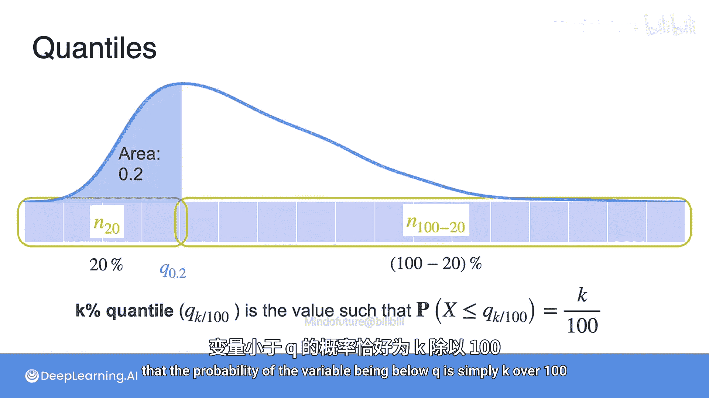

# 042：分位数与箱线图 📊

在本节课中，我们将学习如何通过分位数来量化数据分布，并介绍一种强大的数据可视化工具——箱线图。我们将从一个小型数据集入手，逐步理解这些核心概念。

## 概述

你已经学习了多种用数字描述数据的方法。对于数据科学家而言，能够正确地可视化数据至关重要。本节视频将展示几种数据可视化方法。让我们从一个数据集开始。

我们考虑一个广告销售数据集，特别是报纸广告预算部分。如果你学习过本专项课程的第二门课，应该对它很熟悉。这个数据集展示了报纸、电视和广播的预算以及产生的销售收入。

为了简化，我们只从报纸广告预算中选取12个样本。

## 计算分位数

从这个小型样本中，你可能想推断其中位数。记住，中位数是将数据分成两半的点。

以下是计算步骤：

首先，需要将观测值按升序排序。由于你有12个数据点，可以将其均匀地分成两半，每半有6个样本。中位数就是中间两个值的平均值，即27.8。

我们称之为**50%分位数**或**第二四分位数**。这些名称稍后会更有意义。

那么，将数据左边留下四分之一、右边留下四分之三的点是什么呢？换句话说，这两个值的平均值是多少？答案是18.35，这就是**25%分位数**或**第一四分位数**，我们称之为**Q1**。

它有点像中位数，但不是将数据分成两半，而是分成四分之一和四分之三。我们可以将其记作 `q(0.25)` 或 `Q1`。

一般来说，你可以为任何百分比进行此操作。**K%分位数**是这样一个值：它使得K%的数据在其左侧，`(100-K)%`的数据在其右侧。它被记作 `q(k/100)`。

一些常见的分位数是25%、50%和75%分位数。正如所见，25%分位数是第一四分位数Q1。50%分位数是中位数，即Q2。75%分位数是第三四分位数，即Q3。

## 分位数的概率解释

假设你的数据集有n个点，`n_k`对应前K%的数据。例如，这里的`n_20`是前20%的数据，`n_100 - n_20`是后80%的数据。

那么我们有：`20/100 = n_20 / n`。这就是你所测量的变量`X`低于K%分位数（本例中是`q(0.2)`，因为那是20%）的概率。

我们所做的是：假设你的数据遵循某种分布，它有一个概率密度函数，看起来像蓝色曲线。那么，对于K%分位数（本例中是20%分位数），该曲线下的面积应该是`k/100`。

因此，如果你从分布中计算分位数，可以说**K%分位数**就是这样一个值：变量低于Q的概率恰好等于`k/100`。用公式表示为：

**P(X ≤ Q) = k/100**

## 总结

本节课中，我们一起学习了分位数的概念及其计算方法。我们了解到，中位数（Q2）是50%分位数，它将数据平分为两半。第一四分位数（Q1）是25%分位数，第三四分位数（Q3）是75%分位数。分位数不仅可以从数据样本中计算，还可以从概率分布的角度理解，即分位数点使得变量取值低于该点的概率等于指定的百分比。理解分位数是构建箱线图和分析数据分布的基础。