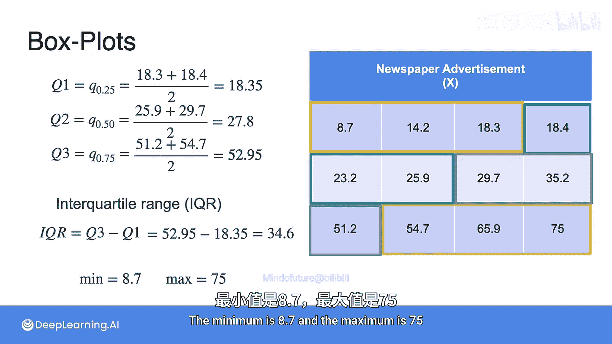
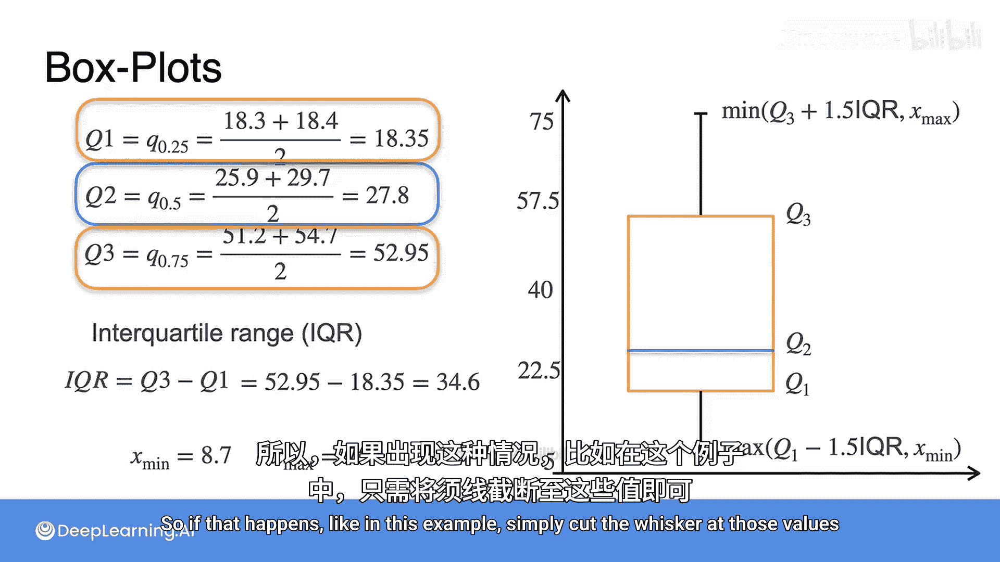
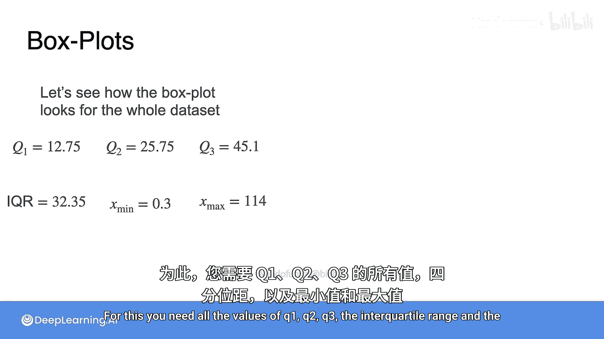
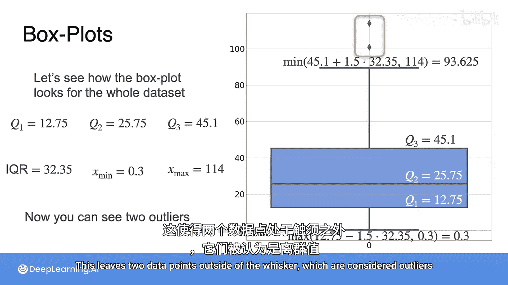

# 043：数据可视化之箱线图 📊

在本节课中，我们将要学习一种名为箱线图（或称盒须图）的强大数据可视化工具。它是一种基于五个关键统计量来标准化展示数据分布的图形方法。

## 箱线图的构成要素

上一节我们介绍了数据分布的基本概念，本节中我们来看看如何用箱线图来直观地表示它。箱线图基于以下五个统计量构建：
*   **最小值**：数据集中的最小数值。
*   **最大值**：数据集中的最大数值。
*   **中位数**：将数据集按大小排序后，位于正中间的值。
*   **第一四分位数**：数据集中所有数值按升序排列后，处于前25%位置的值。
*   **第三四分位数**：数据集中所有数值按升序排列后，处于前75%位置的值。

## 构建箱线图：一个实例

让我们通过一个报纸广告数据的例子，一步步学习如何构建箱线图。

首先，需要计算三个四分位数，即25%分位数、50%分位数（即中位数）和75%分位数。这意味着我们需要将数据分成四个大小相等的部分。

以下是计算步骤：
1.  **第一四分位数**：位于数据排序后前25%位置的两个数值的中点，例如18.3和18.4的中点，即 **18.35**。
2.  **第二四分位数**：即中位数，位于数据排序后中间的两个数值的中点，例如25.9和29.7的中点，即 **27.8**。
3.  **第三四分位数**：位于数据排序后前75%位置的两个数值的中点，例如51.2和54.7的中点，即 **52.95**。

接下来，我们计算**四分位距**，其公式为：
**IQR = Q3 - Q1**
在我们的例子中，IQR = 52.95 - 18.35 = **34.6**。这个区间包含了数据集中50%的数据。

同时，我们记录数据集的**最小值**（8.7）和**最大值**（75）。

## 绘制箱线图的步骤

现在，我们将所有统计量整合到一个图中。

1.  **绘制箱体**：画一个矩形，其底部位于第一四分位数（Q1 = 18.35），顶部位于第三四分位数（Q3 = 52.95）。
2.  **标记中位数**：在箱体内部画一条横线，位置对应中位数（Q2 = 27.8）。

3.  **绘制须线**：这是关键步骤。须线从箱体的两端向外延伸。
    *   下须线从Q1向下延伸，但通常只延伸到 **Q1 - 1.5 * IQR** 这个位置。
    *   上须线从Q3向上延伸，但通常只延伸到 **Q3 + 1.5 * IQR** 这个位置。
    *   **重要规则**：须线不能超过数据集的实际最小值和最大值。如果计算出的须线端点超出了数据范围，则须线应在实际的最小值或最大值处截断。

在我们的例子中，由于计算出的须线端点（Q1 - 1.5*IQR 和 Q3 + 1.5*IQR）超出了实际的数据范围（8.7 到 75），所以须线直接绘制到最小值和最大值为止。

## 如何解读箱线图

箱线图之所以有用，是因为一眼就能获取大量关于数据分布的信息。

*   **观察数据偏度**：在我们的例子中，可以轻易看出数据是**右偏**的。因为箱体上半部分（Q3到Q2的距离）远大于下半部分（Q2到Q1的距离）。
*   **识别异常值**：对于这个小数据集，由于两条须线都结束于最大值和最小值，因此**没有异常值**。通常，任何落在须线范围（Q1 - 1.5*IQR 到 Q3 + 1.5*IQR）之外的数据点，都被视为**异常值**。
*   **分析数据离散程度**：箱体和须线的长度反映了数据的分散情况。箱体越长，中间50%的数据越分散；须线越长，两端的数据范围越广。

## 包含异常值的完整数据集示例

现在，让我们看看使用完整数据集绘制的箱线图。我们需要所有值：Q1， Q2， Q3， IQR， 最小值和最大值。
*   最小值：0.3
*   最大值：114

根据这些值，我们得到以下箱线图：

图中标出了Q1， Q3和Q2（中位数）。注意，下须线从Q1延伸到数据集的最小值0.3。而上须线则结束于 **Q3 + 1.5 * IQR** 计算出的位置（93.6），这个值小于最大值114。

这使得有两个数据点（大于93.6）落在了上须线之外，它们被视为**异常值**。

## 总结

本节课中我们一起学习了箱线图。我们了解到，箱线图通过最小值、最大值、中位数和两个四分位数这五个统计量，以一种标准化的方式清晰展示了数据的分布、中心趋势、离散程度和潜在的异常值。它是一种非常高效的数据探索和比较工具。