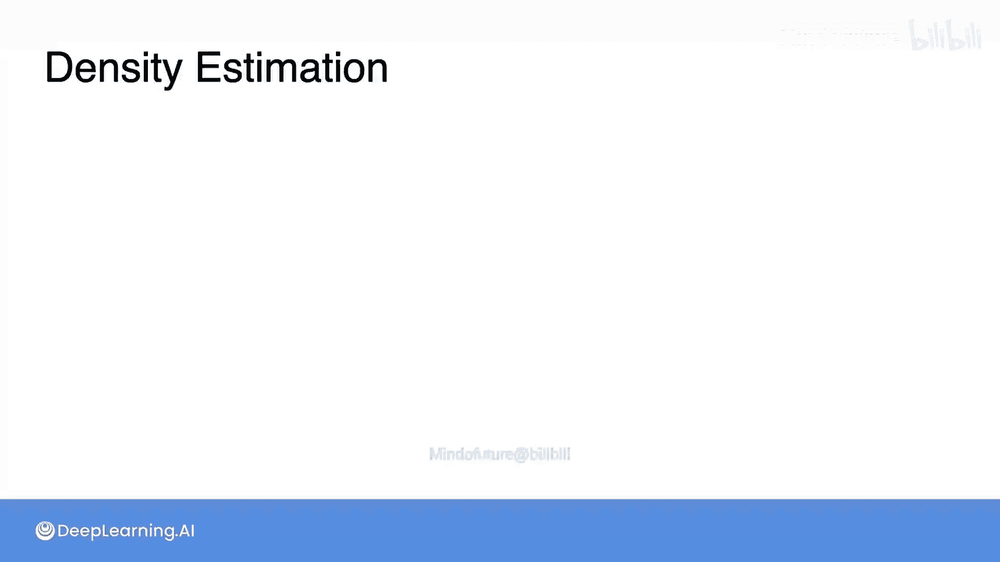
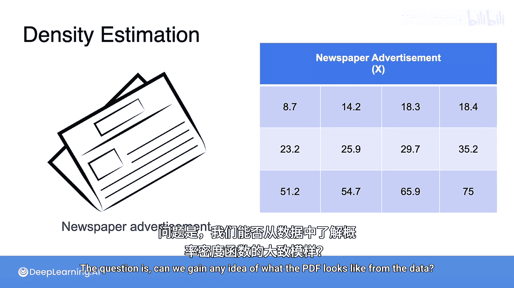
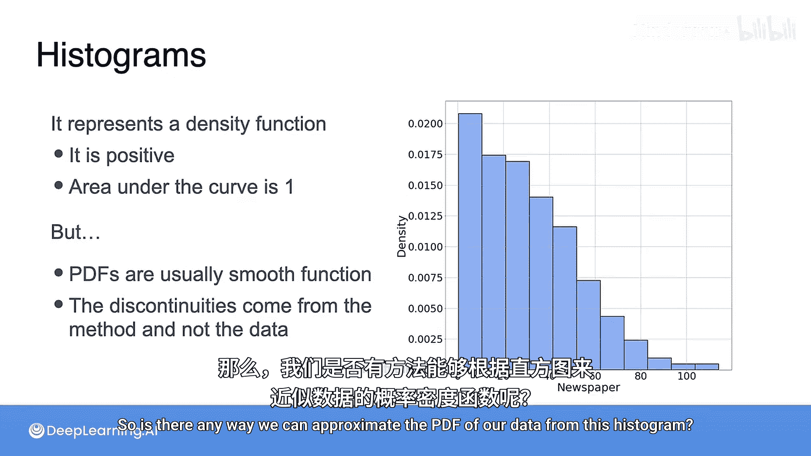
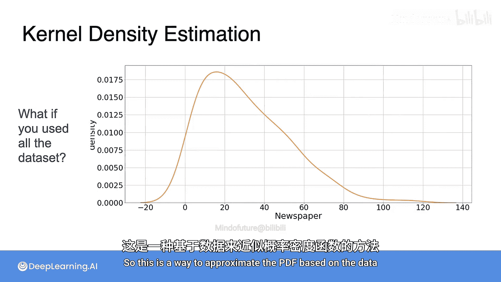

# 044：数据可视化与核密度估计

在本节课中，我们将学习如何从数据中估计连续随机变量的概率密度函数。我们将回顾直方图的局限性，并介绍一种更平滑、更准确的估计方法——核密度估计。

## 从直方图到概率密度函数

上一节我们介绍了连续随机变量的概率密度函数。本节中我们来看看如何从实际数据中估计这个函数。

让我们回到广告点击率的例子。所有样本数据都来自一个连续随机变量。我们知道，描述连续变量数据分布的工具是概率密度函数。问题是，我们能从数据中看出PDF的大致形状吗？

以下是估计PDF的传统方法：直方图。

从技术上讲，直方图满足密度函数的所有条件：它是非负的，并且曲线下的面积总和为1。然而，它并不是一个理想的PDF近似。原因有以下两点：
*   PDF通常是平滑的函数。
*   直方图条形的不连续性源于其计算方法，而非数据本身的特性。

换句话说，数据来源的真实分布可能具有非常平滑的密度函数，但由于我们绘制了直方图，它看起来有很多峰值。

那么，有没有办法能从直方图中更好地近似我们数据的PDF呢？答案是肯定的，这种方法被称为核密度估计。

## 核密度估计的原理

上一节我们指出了直方图的不足。本节中我们来看看核密度估计如何提供更平滑的估计。

核密度估计的方法如下：
1.  首先，将观测数据点绘制在图上。
2.  我们希望数据集中的每个点都能产生一个围绕观测点扩散的“影响”，因为点密集的地方密度应该高，没有点的地方密度应该低。
3.  在每个数据点上放置一个“小山丘”，即在每个数据点顶部放置一个小的高斯曲线。这个“小山丘”被称为**核**。你也可以选择高斯函数以外的其他函数作为核，但这里我们不做深入讨论。
4.  为高斯密度函数选择的**σ**值将决定每个点的影响范围。σ值小，核就“瘦高”；σ值大，核就“矮胖”。
5.  最后，将所有蓝色曲线乘以 **1/n**（n是数据点总数），然后求和。

由于每条曲线下的面积为1，这些曲线的平均值给出的曲线下面积也必然是1。清理一下绘图后，估计结果如下所示：

这个估计看起来可能还不完美，但这只是因为我们试图用仅仅12个数据点来近似一个密度函数。如果使用更多的数据点，你实际上会得到一个非常平滑的函数，它能很好地近似真实的PDF。

## 总结

本节课中我们一起学习了如何从数据估计概率密度函数。我们首先回顾了直方图作为PDF估计工具的局限性，如其不连续性。接着，我们详细介绍了核密度估计方法，它通过在每个数据点上放置一个核函数（如高斯核），并将所有核函数加权平均，从而生成一个平滑、连续的PDF估计。这种方法能更有效地揭示数据背后的真实分布形状。