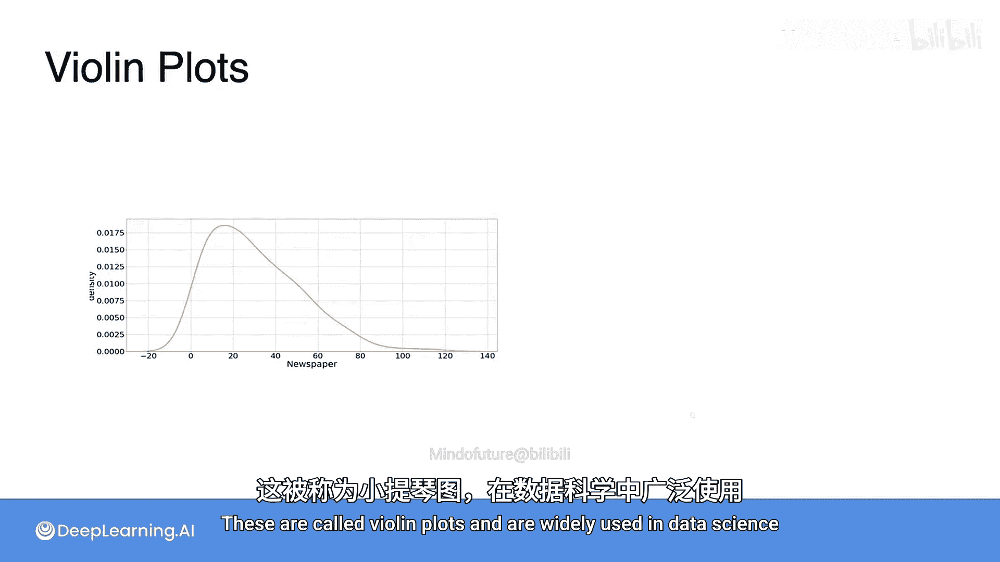
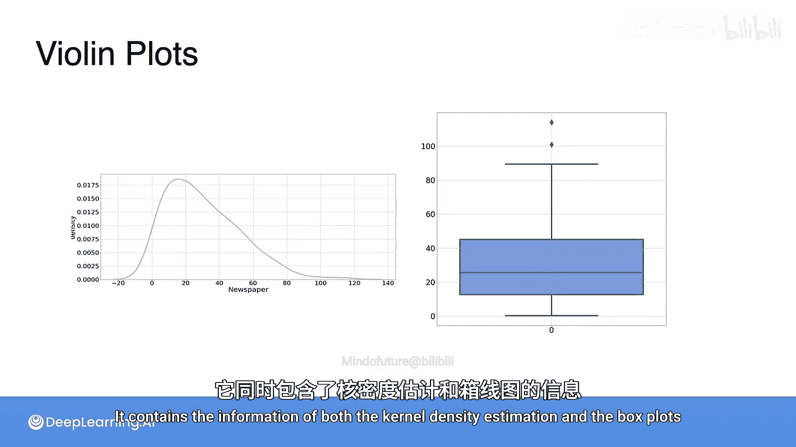
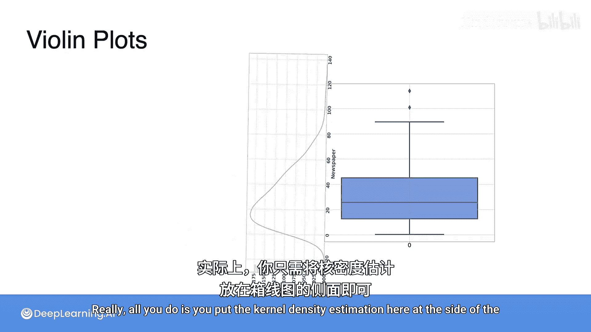
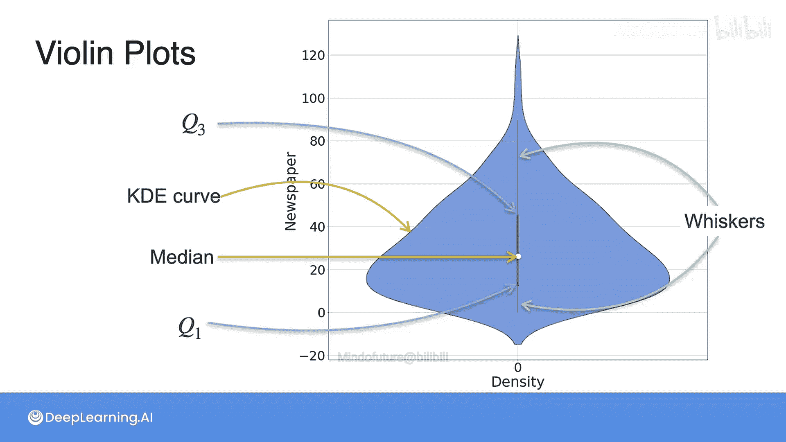

# 045：数据小提琴图 🎻

在本节课中，我们将要学习一种在数据科学中广泛使用的可视化工具——小提琴图。我们将了解它的构成、优势以及如何解读它。

上一节我们介绍了核密度估计和箱线图，本节中我们来看看如何将两者的优势结合起来。

## 什么是小提琴图？

小提琴图是一种强大的数据可视化工具，它同时包含了核密度估计和箱线图的信息。

具体来说，小提琴图的结构如下所示：

以下是构成小提琴图的核心元素：

*   **核密度估计曲线**：图形主体部分，展示了数据的概率密度分布，形状类似小提琴。
*   **均值标记**：通常以一个小点或一条短线表示数据集的平均值。
*   **四分位数箱体**：图形中间的一个矩形箱体，显示了数据的第一四分位数、中位数和第三四分位数。
*   **须线**：从箱体延伸出去的线条，表示数据的分布范围（通常基于1.5倍四分位距或最小/最大值）。

## 小提琴图的优势

正如你所见，小提琴图非常有用。它将数据的整体分布形态（通过KDE）与关键统计量（通过箱线图）融合在一个图形中。

与单独的箱线图相比，小提琴图能揭示数据是单峰、双峰还是多峰分布。与单独的密度图相比，它又能提供精确的中位数、四分位数等统计信息。

本节课中我们一起学习了小提琴图。它是一种集成了核密度估计与箱线图信息的综合可视化工具，能够同时展示数据的分布形状和关键统计量，是数据探索性分析中的利器。