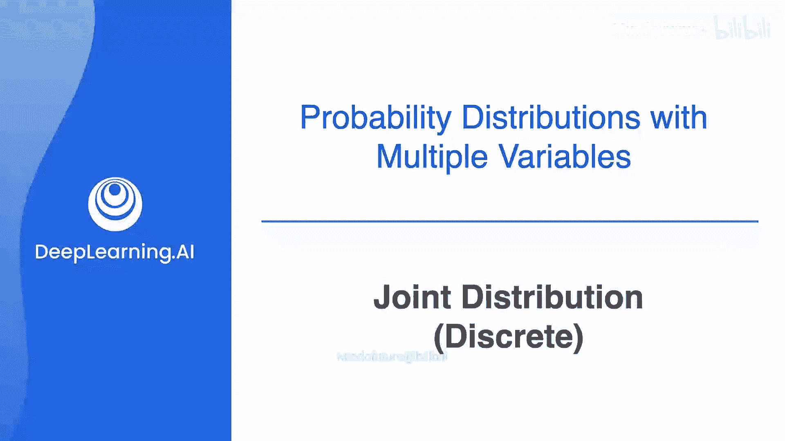
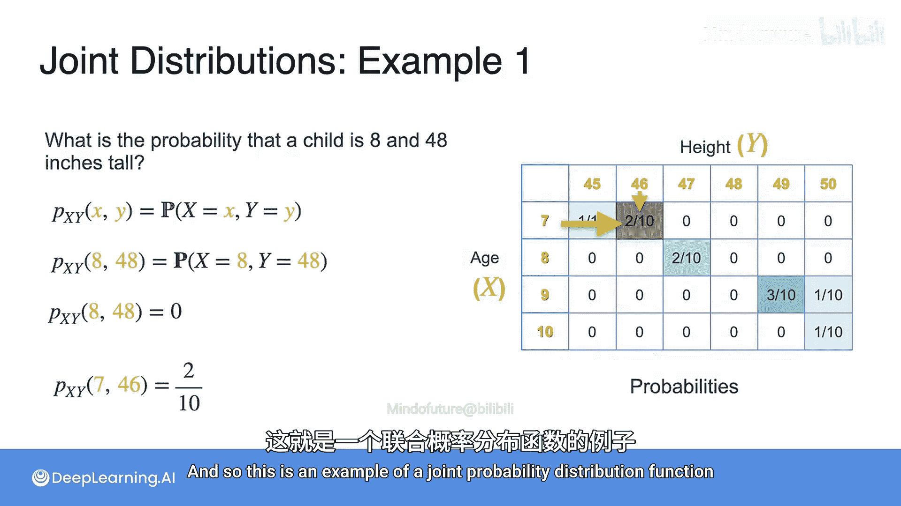

# 047：联合分布（离散）第一部分

## 概述
在本节课中，我们将要学习**联合分布**的概念。之前我们学习了单个变量的概率分布，例如人口的身高。本节我们将探讨如何同时分析两个变量，例如人口的年龄和身高，并理解它们如何共同作用。

## 从单变量到双变量
上一节我们介绍了单个变量的概率分布。本节中我们来看看当我们需要同时考虑两个变量时的情况。例如，我们有一个包含10名7至10岁儿童的数据集。以下是按年龄统计的儿童数量：

*   7岁：3名
*   8岁：2名
*   9岁：4名
*   10岁：1名

将计数除以总数10，我们可以得到每个年龄的概率。例如，一个儿童年龄为9岁的概率是 `P(年龄=9) = 4/10 = 0.4`。

对于同一批儿童，我们也有他们的身高数据（单位：英寸）。以下是按身高（四舍五入到最近的英寸）统计的儿童数量：

*   45英寸：1名
*   46英寸：2名
*   47英寸：2名
*   48英寸：0名
*   49英寸：3名
*   50英寸：2名

同样，除以总数10后，我们得到每个身高的概率。例如，一个儿童身高为47英寸的概率是 `P(身高=47) = 2/10 = 0.2`。

## 引入联合概率
现在我们有了按年龄和身高分别统计的数据。这里有一个问题：在这组数据中，一个儿童年龄为9岁**且**身高为49英寸的概率是多少？

从年龄分布看，有4名9岁的儿童。从身高分布看，在这4名儿童中，只有3人身高是49英寸。因此，概率是3除以总数10，即 `3/10 = 0.3`。

我们用 `X` 表示年龄变量，用 `Y` 表示身高变量。那么，“年龄为9岁且身高为49英寸”的概率可以写作：
`P(X=9, Y=49) = 3/10`

更一般地，两个离散变量的**联合概率**表示为 `P(X=x, Y=y)`。这表示变量 `X` 取特定值 `x`，同时变量 `Y` 取特定值 `y` 的概率。

## 构建联合分布表
我们可以通过构建一个表格来更清晰地组织和计算联合概率。以下是基于我们数据集的联合计数表：

| 年龄 (X) \ 身高 (Y) | 45 | 46 | 47 | 48 | 49 | 50 |
| :--- | :---: | :---: | :---: | :---: | :---: | :---: |
| **7** | 1 | 2 | 0 | 0 | 0 | 0 |
| **8** | 0 | 0 | 2 | 0 | 0 | 0 |
| **9** | 0 | 0 | 0 | 0 | 3 | 1 |
| **10** | 0 | 0 | 0 | 0 | 0 | 1 |

将表中的每个计数除以总数10，我们就得到了**联合概率质量函数**表：

| 年龄 (X) \ 身高 (Y) | 45 | 46 | 47 | 48 | 49 | 50 |
| :--- | :---: | :---: | :---: | :---: | :---: | :---: |
| **7** | 0.1 | 0.2 | 0.0 | 0.0 | 0.0 | 0.0 |
| **8** | 0.0 | 0.0 | 0.2 | 0.0 | 0.0 | 0.0 |
| **9** | 0.0 | 0.0 | 0.0 | 0.0 | 0.3 | 0.1 |
| **10** | 0.0 | 0.0 | 0.0 | 0.0 | 0.0 | 0.1 |

这个表格包含了 `X` 和 `Y` 所有可能取值组合的概率，它完整地描述了这两个变量的**联合分布**。由于年龄和身高在此处都是离散变量，因此这是一个离散联合分布。

## 使用联合分布解决问题
有了联合分布表，我们可以轻松回答关于两个变量组合的问题。以下是几个例子：

*   **问题1**：一个儿童年龄为8岁且身高为48英寸的概率是多少？
    *   **解答**：查看表格中 `X=8`，`Y=48` 对应的单元格，概率为 `0.0`。因此，`P(X=8, Y=48) = 0`。

*   **问题2**：一个儿童年龄为7岁且身高为46英寸的概率是多少？
    *   **解答**：查看表格中 `X=7`，`Y=46` 对应的单元格，概率为 `0.2`。因此，`P(X=7, Y=46) = 0.2`。

## 总结
本节课中我们一起学习了**联合分布**的核心概念。我们了解到：
1.  联合分布 `P(X, Y)` 用于描述两个随机变量同时取特定值的概率。
2.  对于离散变量，可以通过构建**联合概率质量函数**表来清晰地表示所有可能的组合及其概率。
3.  该表格是分析和计算涉及多个变量概率问题的强大工具。

在下一节中，我们将继续探讨联合分布的其他性质和应用。