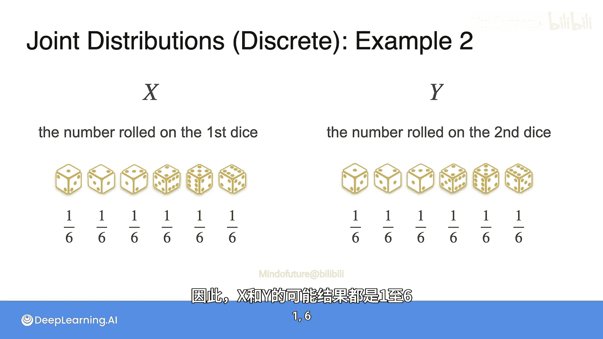
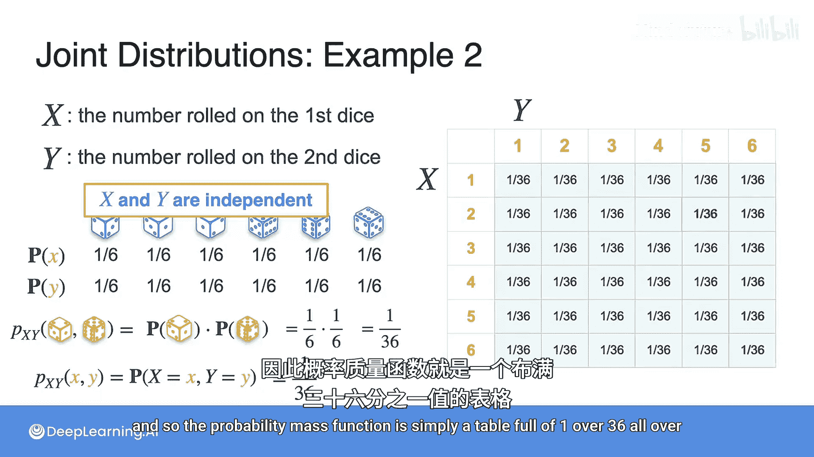
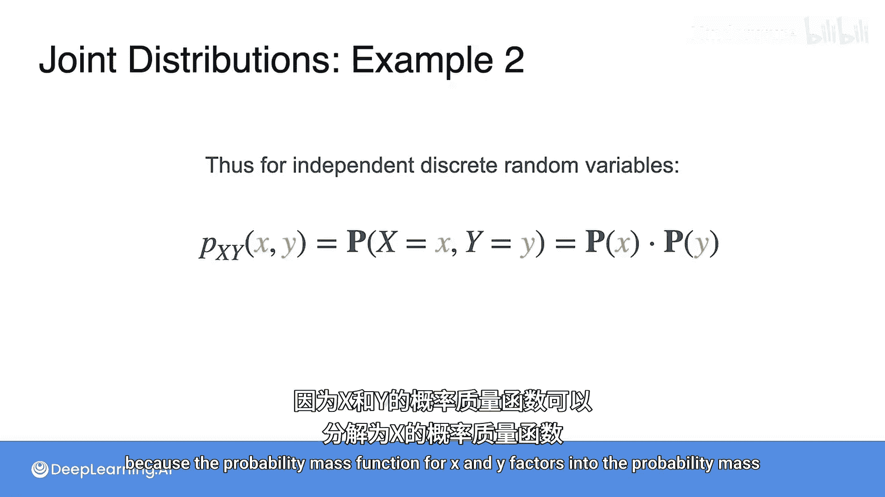
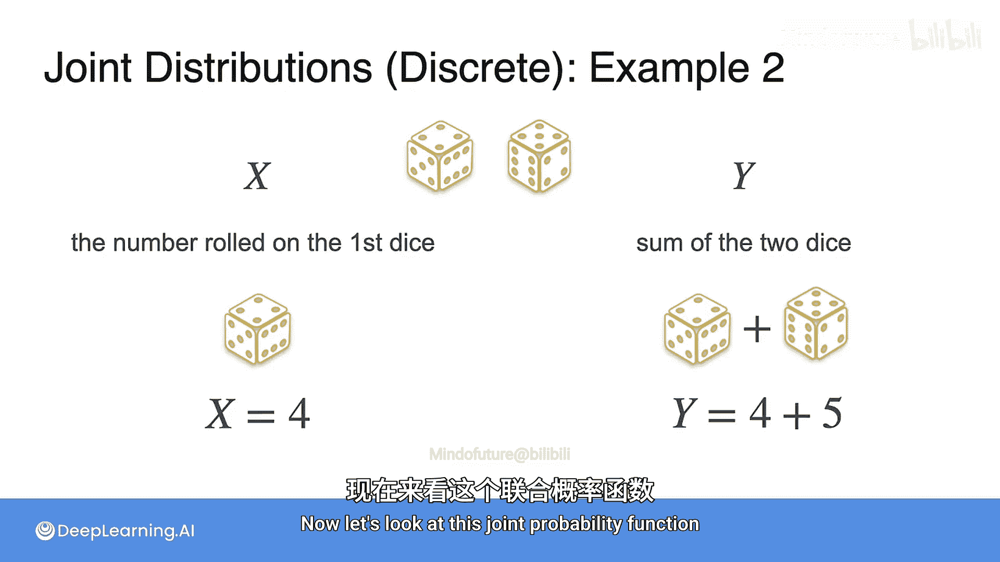
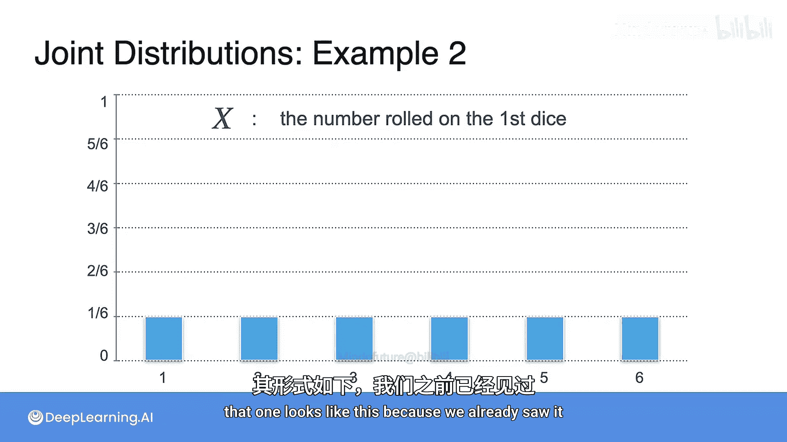
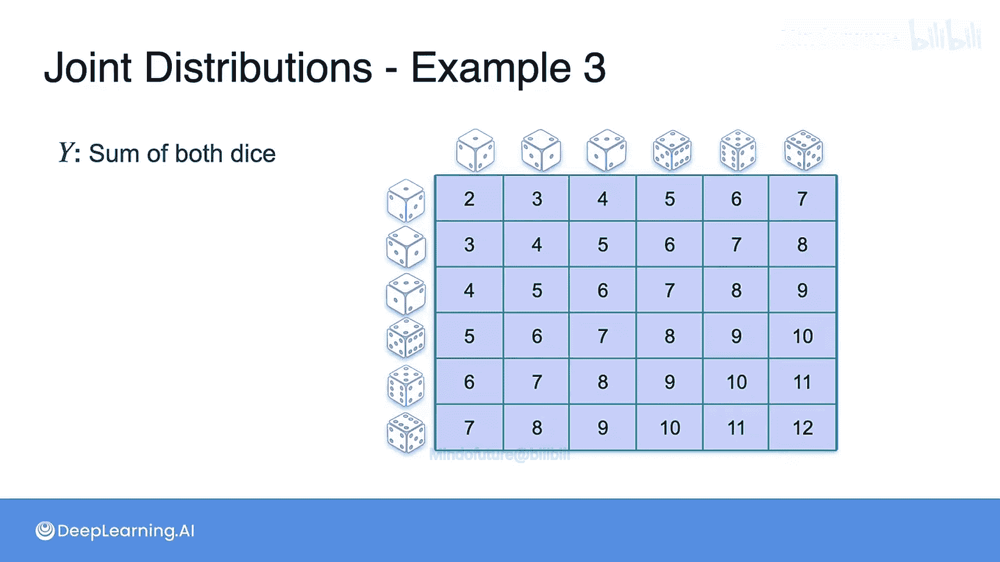
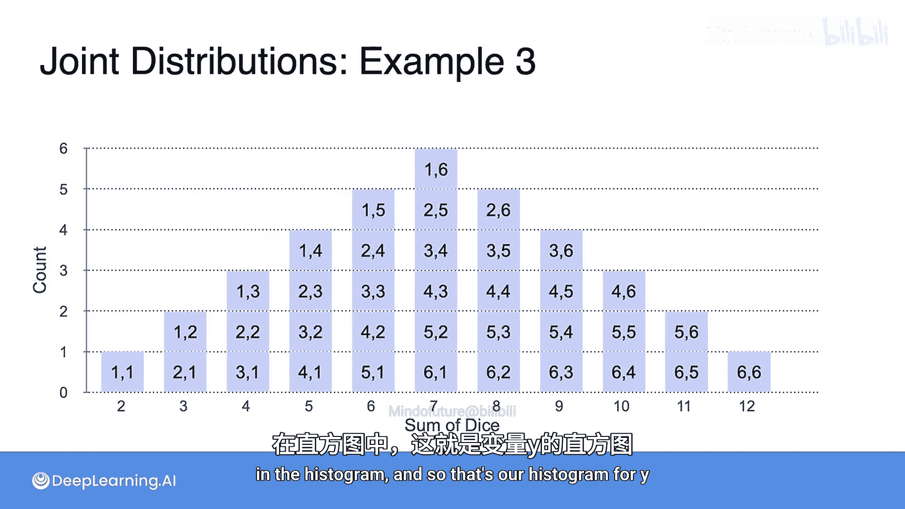
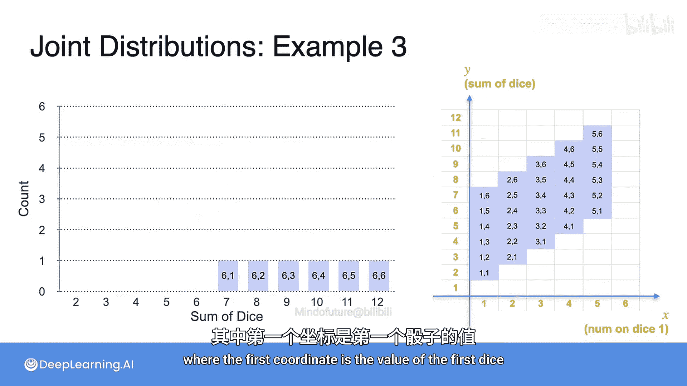
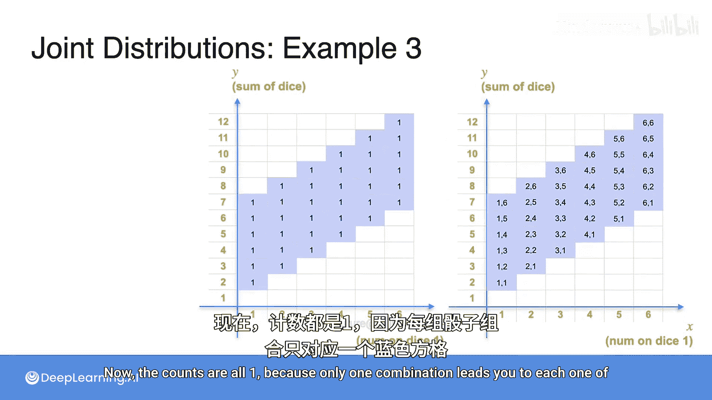
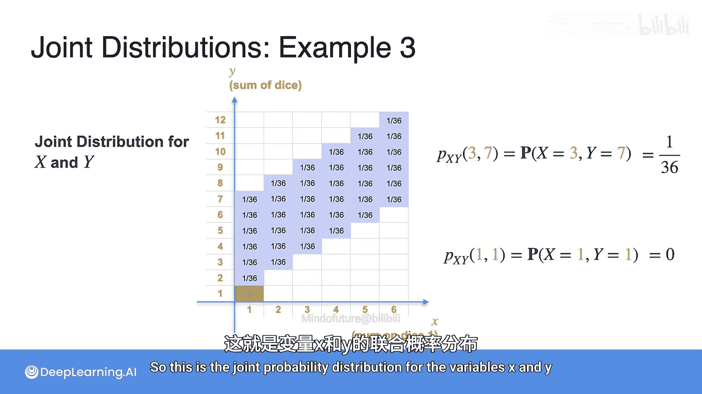

# 048：联合分布（离散第二部分）🎲

在本节课中，我们将学习两个离散随机变量的联合概率分布。我们将通过掷骰子的例子，来理解当两个变量独立或不独立时，联合概率质量函数（PMF）如何计算和表示。

上一节我们介绍了联合分布的基本概念，本节中我们来看看两个具体的例子，以加深理解。

## 独立随机变量的联合分布

首先，我们考虑一个简单的例子：同时投掷两个公平的六面骰子。

*   令 **X** 为表示第一个骰子点数的离散随机变量。
*   令 **Y** 为表示第二个骰子点数的离散随机变量。

X 和 Y 的可能结果都是 {1, 2, 3, 4, 5, 6}，且每个结果的概率都是 1/6。

以下是 X 和 Y 各自的概率质量函数。请注意，X 和 Y 是**独立**的随机变量。

由于独立性，任何一对结果 (x, y) 的联合概率，例如 P(X=2, Y=5)，都等于各自概率的乘积：`(1/6) * (1/6) = 1/36`。这对所有可能的组合都成立。

因此，联合概率质量函数是一个 6x6 的表格，其中每个单元格的值都是 1/36。

用公式表示，对于独立的离散随机变量，其联合概率质量函数可以分解为各自概率质量函数的乘积：

**P(X=x, Y=y) = P(X=x) * P(Y=y)**

## 非独立随机变量的联合分布

现在，我们来看一个更复杂的例子，其中两个变量**不独立**。

我们再次投掷一个公平的六面骰子。
*   令 **X** 为表示第一个骰子点数的离散随机变量（例如，X=4）。
*   令 **Y** 为表示两个骰子点数之和的离散随机变量（例如，如果第一个是4，第二个是5，则 Y=9）。

X 的概率质量函数和之前一样，每个点数概率为 1/6。

Y（两个骰子之和）的概率分布则不同。以下是所有可能组合的表格：

我们可以将 Y 的分布绘制成直方图。横轴是骰子之和（2到12），纵轴是出现次数。可以看到，和为7的情况出现最多，而和为2或12的情况出现最少。

现在，让我们构建 X 和 Y 的联合概率分布表。横轴是 X（第一个骰子的值，1到6），纵轴是 Y（两个骰子之和，2到12）。

以下是所有可能结果在坐标 (X, Y) 上的分布图，每个蓝色方块代表一种组合。

由于总共有36种等可能的结果，每个蓝色方块（即每种有效组合）的概率都是 1/36。表格中其他不可能的组合（如第一个骰子是1但和是1）概率为0。

因此，我们得到了 X 和 Y 的联合概率分布表，其中每个单元格的值是 1/36 或 0。

利用这个联合分布表，我们可以轻松查询任何事件的概率。

例如：
*   **P(X=3, Y=7)**：找到 X=3 的列和 Y=7 的行，其对应的概率是 **1/36**。
*   **P(X=1, Y=1)**：这是一个不可能事件，因为第一个骰子为1时，两个骰子之和至少为2。在表中对应单元格的概率为 **0**。

本节课中我们一起学习了离散随机变量的联合概率分布。我们通过两个掷骰子的例子，对比了当变量独立时联合概率可以简单分解为边缘概率的乘积（`P(X,Y) = P(X)*P(Y)`），而当变量不独立时，则需要通过枚举所有可能结果或构建联合分布表来完整描述其概率关系。理解联合分布是分析多个随机变量之间关系的基础。