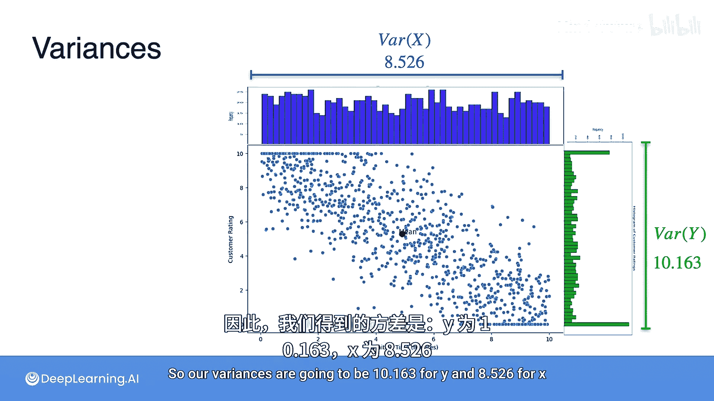

# 049：连续型联合分布

## 概述
在本节课中，我们将要学习连续型随机变量的联合分布。我们将通过一个客户服务等待时间与满意度的例子，理解如何描述和分析两个连续变量之间的关系，并计算其均值与方差。

上一节我们介绍了离散型随机变量的联合分布，本节中我们来看看当变量是连续型时，情况会如何。其核心概念非常相似，被称为连续型变量的联合分布。

## 连续型联合分布简介
回想之前的课程，我们曾以电话呼叫为例，生成了类似于下图的呼叫等待时间的概率分布。我们学习了如何计算连续变量在某个区间内的概率，即曲线下的面积。

现在，让我们处理一些新数据。假设我们有两个变量 **X** 和 **Y**。
*   **X** 是客户服务接通前的等待时间，我们假设其取值范围在 **0 到 10 分钟** 之间。
*   **Y** 是客户满意度评分，同样是一个在 **0 到 10 分** 之间的连续值。

因此，两个变量都是连续的。例如，X 可以是 2.4 分钟、1.5 分钟，Y 可以是 0.0 分、5.7 分等。

## 数据可视化分析
我们收集了 8000 名客户的数据，并绘制了散点图与热力图。观察数据分布，我们可以发现数据更多地集中在两个角落。

以下是原因分析：
*   许多客户等待时间很短，并且非常满意（高评分）。这些数据点位于**左下角**（低等待时间，高满意度）。
*   许多客户等待时间很长（甚至达到10分钟上限），并且非常不满意（低评分）。这些数据点位于**右上角**（高等待时间，低满意度）。

从三维视角看，这个热力图就像一座山的俯视图，深色区域代表“山峰”（高概率密度区），浅色区域代表“山谷”（低概率密度区）。上述两个角落就是最可能找到客户数据点的“山峰”区域。

## 计算均值与方差
回到散点图，让我们计算变量 **X** 和 **Y** 的均值与方差。均值点 `(E[X], E[Y])` 可以视为整个数据集的“平衡点”。

### 计算均值
*   **X（等待时间）的期望值**：`E[X] = 4.903` 分钟。
*   **Y（满意度）的期望值**：`E[Y] = 5.280` 分。

### 计算方差
为了计算方差，我们需要分别对行（等待时间）和列（满意度）进行聚合，得到各自的分布。

以下是方差计算步骤：

**1. 计算 X 的方差**
*   首先计算 `E[X]` 和 `E[X²]`。
    *   `E[X] = 4.903`
    *   `E[X²] = 32.561`
*   方差公式为：`Var(X) = E[X²] - (E[X])²`
*   代入计算：`Var(X) = 32.561 - (4.903)² = 8.526`

**2. 计算 Y 的方差**
*   首先计算 `E[Y]` 和 `E[Y²]`。
    *   `E[Y] = 5.280`
    *   `E[Y²] = 38.037`
*   方差公式为：`Var(Y) = E[Y²] - (E[Y])²`
*   代入计算：`Var(Y) = 38.037 - (5.280)² = 10.163`

因此，我们得到：
*   **X（等待时间）的方差**：`Var(X) = 8.526`
*   **Y（满意度）的方差**：`Var(Y) = 10.163`

## 总结
本节课中我们一起学习了连续型随机变量的联合分布。我们通过一个具体的客户服务案例，看到了如何用散点图和热力图可视化两个连续变量之间的关系，并计算出描述数据集中趋势（均值）和离散程度（方差）的关键统计量。理解联合分布是分析变量间相关性和构建复杂模型的重要基础。