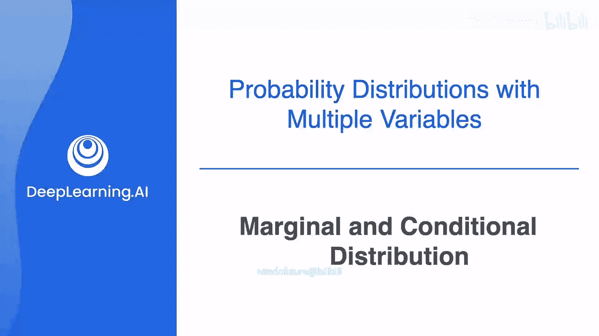
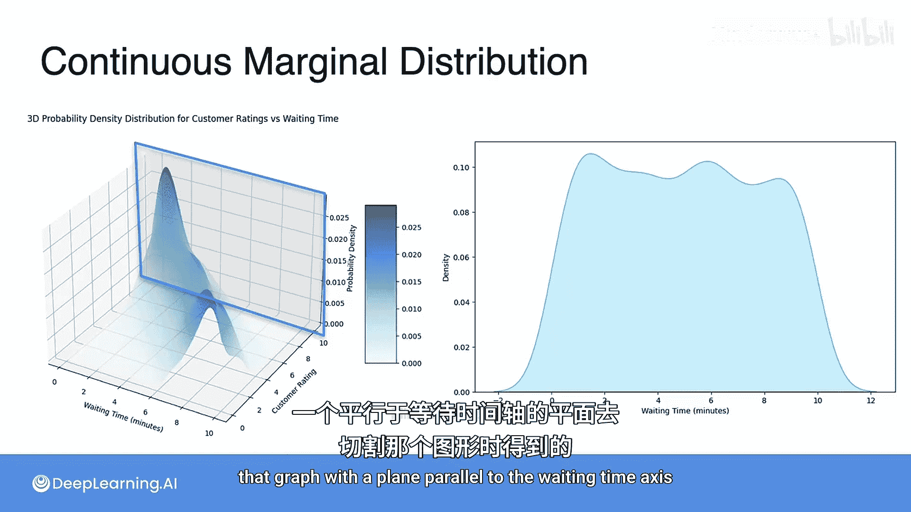

# 050：边缘分布与条件分布

在本节课中，我们将要学习概率论中两个非常重要的概念：**边缘分布**与**条件分布**。我们将通过具体的例子，理解如何从联合分布中提取出单个变量的信息。

## 概述

上一节我们介绍了**联合分布**，它描述了多个随机变量同时发生的概率。本节中，我们来看看如何从联合分布中，聚焦于单个变量的行为，这就是**边缘分布**；以及如何在已知一个变量取特定值的条件下，研究另一个变量的分布，这就是**条件分布**。

## 边缘分布

想象我们有一个关于人口年龄和身高的联合分布。如果我们突然不再关心年龄，只想知道身高的分布情况，我们需要做的就是将所有年龄的可能性“聚合”起来。这样得到的分布，就称为身高的**边缘分布**。

以下是计算边缘分布的步骤：

1.  **确定目标变量**：首先，明确你希望得到哪个变量的边缘分布（例如，身高 `Y`）。
2.  **对另一个变量求和**：在联合概率表中，对你不关心的那个变量（例如，年龄 `X`）的所有可能取值进行求和。
3.  **得到边缘概率**：求和的结果就是目标变量每个取值的边缘概率。

让我们通过一个简单的数据集来演示。假设我们有一个关于儿童年龄（`X`）和身高（`Y`）的联合概率分布表：

| P(X, Y) | Y=45英寸 | Y=46英寸 | Y=47英寸 | Y=48英寸 | Y=49英寸 | Y=50英寸 |
| :--- | :---: | :---: | :---: | :---: | :---: | :---: |
| **X=7岁** | 0.1 | 0.1 | 0.1 | 0 | 0 | 0 |
| **X=8岁** | 0 | 0.1 | 0.1 | 0 | 0.1 | 0.1 |
| **X=9岁** | 0 | 0 | 0 | 0 | 0.1 | 0.1 |

现在，我们想忽略年龄，只得到身高的边缘分布 `P(Y)`。我们需要对每一列（即每个身高值）的所有概率求和。

*   `P(Y=45)` = 0.1 + 0 + 0 = **0.1**
*   `P(Y=46)` = 0.1 + 0.1 + 0 = **0.2**
*   `P(Y=47)` = 0.1 + 0.1 + 0 = **0.2**
*   `P(Y=48)` = 0 + 0 + 0 = **0**
*   `P(Y=49)` = 0 + 0.1 + 0.1 = **0.2**
*   `P(Y=50)` = 0 + 0.1 + 0.1 = **0.2**

**公式**：身高 `Y` 取特定值 `yj` 的边缘概率公式为：
`P(Y = yj) = Σ_i P(X = xi, Y = yj)`
其中，`Σ_i` 表示对变量 `X` 的所有可能取值 `xi` 求和。

同理，如果我们想得到年龄的边缘分布 `P(X)`，就对每一行求和：
*   `P(X=7)` = 0.1 + 0.1 + 0.1 + 0 + 0 + 0 = **0.3**
*   `P(X=8)` = 0 + 0.1 + 0.1 + 0 + 0.1 + 0.1 = **0.4**
*   `P(X=9)` = 0 + 0 + 0 + 0 + 0.1 + 0.1 = **0.2**

**公式**：年龄 `X` 取特定值 `xi` 的边缘概率公式为：
`P(X = xi) = Σ_j P(X = xi, Y = yj)`
其中，`Σ_j` 表示对变量 `Y` 的所有可能取值 `yj` 求和。

## 从图像理解边缘分布

我们可以通过可视化来更直观地理解边缘分布。考虑一个更大的数据集（50名儿童）的年龄-身高散点图，其中颜色深浅代表数据点的密集程度。

*   要得到**年龄的边缘分布**，我们想象将这张图沿着垂直方向（身高轴）“挤压”或投影到水平轴（年龄轴）上。这相当于对图中每个年龄值，累加该垂直线上所有身高对应的数据点数量。结果会形成一个显示年龄分布的直方图。
*   要得到**身高的边缘分布**，我们则沿着水平方向（年龄轴）“挤压”或投影到垂直轴（身高轴）上。这相当于对每个身高值，累加该水平线上所有年龄对应的数据点数量。

## 更多例子：骰子

让我们回顾之前掷两个骰子的例子。

**例子1**：设 `X` 为第一个骰子的点数，`Y` 为第二个骰子的点数。它们的联合分布是一个6x6的表格，每个格子的概率都是 `1/36`。
*   `X` 的边缘分布：对每一行求和，每行有6个 `1/36`，所以 `P(X=任意值) = 6/36 = 1/6`。这正是单个骰子的均匀分布。
*   `Y` 的边缘分布同理，也是 `1/6`。

**例子2**：设 `X` 为第一个骰子的点数，`Y` 为两个骰子的点数之和。它们的联合分布表更为复杂。
*   如果我们想求 `Y`（点数之和）的边缘分布，就需要对联合分布表的每一行（对应一个 `Y` 值）求和。例如，`P(Y=7)` 的概率最高，因为有多组 `(X, Y)` 组合能得到和为7。最终得到的 `P(Y)` 直方图会呈中间高、两边低的形状。

## 条件分布

现在，让我们转向另一个核心概念。如果我们不是忽略另一个变量，而是**已知**某个变量取了一个特定值，然后在这个条件下看另一个变量的分布，这就是**条件分布**。

回到年龄和身高的例子。假设我们已知一个儿童的年龄是8岁，那么在这个条件下，他的身高分布是怎样的？我们不再看整个表格，而是只看 `X=8` 的那一行。这一行本身可能不是一个概率分布（因为概率和可能不为1），我们需要将其“归一化”。

**计算方法**：
1.  **切片**：在联合分布表中，找到条件变量（这里是年龄 `X`）等于特定值（`X=8`）的那一行。
2.  **归一化**：将该行每个概率值除以该行的边缘概率 `P(X=8)`，使得新的概率之和为1。

使用之前的表格：
*   已知 `X=8` 时，对应的联合概率行是：`[0, 0.1, 0.1, 0, 0.1, 0.1]`，总和为 `0.4`（即 `P(X=8)`）。
*   条件分布 `P(Y | X=8)` 为：
    *   `P(Y=45 | X=8) = 0 / 0.4 = 0`
    *   `P(Y=46 | X=8) = 0.1 / 0.4 = 0.25`
    *   `P(Y=47 | X=8) = 0.1 / 0.4 = 0.25`
    *   `P(Y=48 | X=8) = 0 / 0.4 = 0`
    *   `P(Y=49 | X=8) = 0.1 / 0.4 = 0.25`
    *   `P(Y=50 | X=8) = 0.1 / 0.4 = 0.25`

**公式**：在 `X = xi` 的条件下，`Y = yj` 的条件概率为：
`P(Y = yj | X = xi) = P(X = xi, Y = yj) / P(X = xi)`
其中，`P(X = xi)` 是 `X` 的边缘概率，且必须大于0。

## 总结

本节课中我们一起学习了：
1.  **边缘分布**：从联合分布中，通过对不关心的变量求和，得到单个变量的概率分布。它用于总结单一变量的行为。
    *   **公式**：`P(X) = Σ_Y P(X, Y)`， `P(Y) = Σ_X P(X, Y)`
2.  **条件分布**：在已知一个变量取某个值的条件下，另一个变量的概率分布。它描述了变量之间的依赖关系。
    *   **公式**：`P(Y | X) = P(X, Y) / P(X)`

理解这两个概念是分析多变量数据、进行统计推断和构建机器学习模型（如朴素贝叶斯分类器）的重要基础。边缘分布让我们聚焦于单个特征，而条件分布则揭示了特征之间的内在联系。