# 051：条件分布 📊

在本节课中，我们将要学习条件分布的概念。条件分布描述了在已知一个随机变量取特定值时，另一个随机变量的概率分布情况。理解条件分布是掌握联合概率、贝叶斯定理等核心概念的基础。

## 从联合分布到条件分布

上一节我们介绍了联合分布和边缘分布。现在，我们来看看条件分布。

回忆一下那个关于儿童年龄和身高的简单数据集。我们生成了关于年龄变量 **X** 和身高变量 **Y** 的联合分布。边缘分布只总结一个变量（例如身高）的行为，因为我们忽略了年龄变量，并对同一身高下的所有年龄值进行了求和。

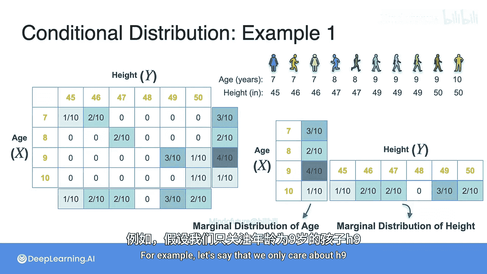

现在，如果我们想观察在已知另一个变量值的情况下，某个变量的分布，例如，我们只关心年龄为9岁（**X=9**）的儿童，并想找出身高变量 **Y** 的分布，这就是条件分布。

## 离散变量的条件分布计算

计算条件分布更简单。你只需要“切”出一片数据。如果我们固定 **X=9**，就意味着我们只关注年龄为9岁的这一行数据。这一行数据就是年龄为9岁的儿童的身高概率分布。

例如，我们想求 **P(Y=49 | X=9)**，也就是在年龄为9岁的条件下，身高为49的概率。这个值就是上图中对应单元格的值。然而，这里有一个小问题：概率分布中所有概率之和必须为1。但这一行数据的和是 **4/10**（三个1/10加上一个1/10）。因此，我们需要进行归一化处理，即用每个值除以这一行的总和。

归一化后，我们得到 **3/4** 和 **1/4**。所以，**P(Y=49 | X=9) = 3/4**。

这个归一化的过程，实际上就是在应用条件概率公式。回忆一下条件概率公式：
**P(A|B) = P(A∩B) / P(B)**

如果我们把 **A** 看作 **Y=49**，**B** 看作 **X=9**，那么：
**P(Y=49 | X=9) = P(X=9, Y=49) / P(X=9)**

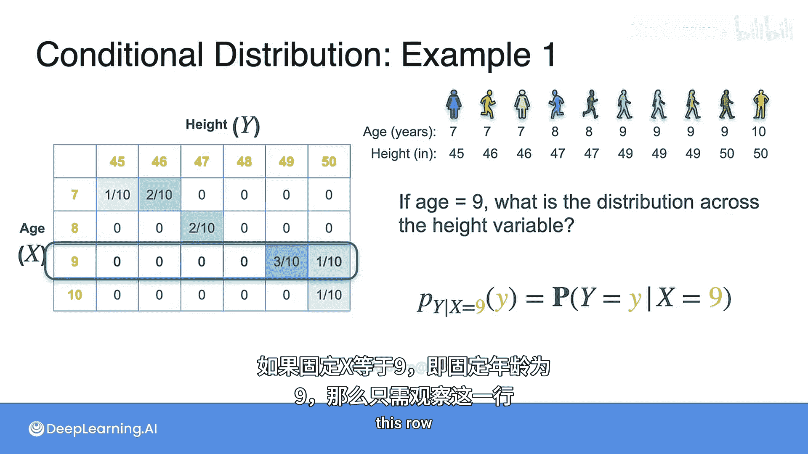

其中，**P(X=9)** 就是那一行的总和（边缘概率）。所以，除以行总和就是应用了条件概率规则。

因此，**P(Y=49 | X=9) = (3/10) / (4/10) = 3/4**，与我们之前计算的结果一致。

以下是离散条件分布的一般公式：

**P(Y=y | X=x) = P(X=x, Y=y) / P(X=x)**

或者用概率质量函数（PMF）表示为：
**p_{Y|X}(y|x) = p_{XY}(x, y) / p_X(x)**

其中：
*   **p_{XY}(x, y)** 是联合概率质量函数。
*   **p_{Y|X}(y|x)** 是条件概率质量函数。
*   **p_X(x)** 是 **X** 的边缘概率质量函数。

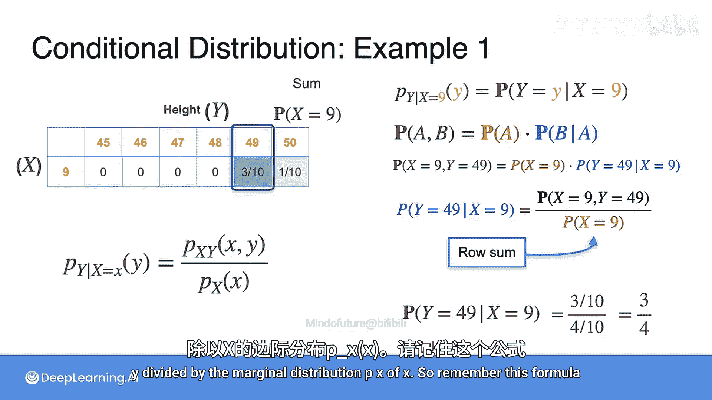
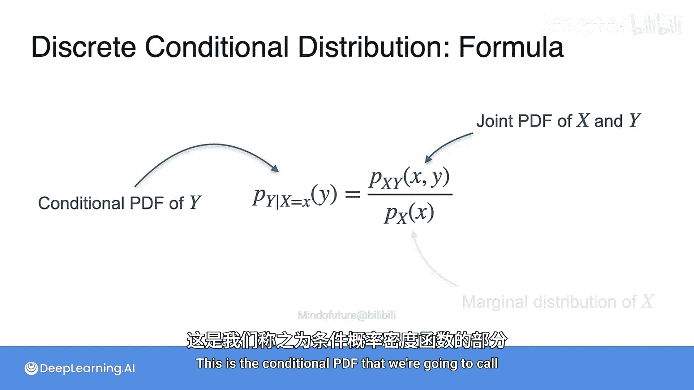

## 条件分布示例：掷骰子

让我们看另一个简单的例子。假设 **X** 是第一个骰子的点数，**Y** 是第二个骰子的点数。

如果我们想知道，在第一个骰子点数为4的条件下，第二个骰子点数为1的概率，即 **P(Y=1 | X=4)**。

根据公式，这意味着我们取 **X=4** 的这一行数据，忽略表格的其余部分，然后通过除以 **1/6**（这一行的边缘概率）进行归一化，将每个 **1/36** 的概率值变为 **1/6**。最终我们得到 **P(Y=1 | X=4) = 1/6**，这完全符合我们的预期（两个骰子独立）。

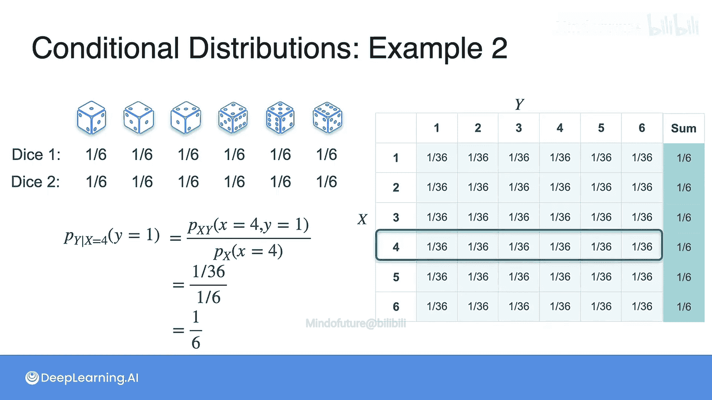

## 连续变量的条件分布

现在，让我们回到客服电话等待时间和客户评分的例子。如果我们想找出，在等待时间为特定值（例如4分钟）的条件下，客户评分的分布，我们该怎么做？

首先，回忆一下它们的联合概率密度函数图像。

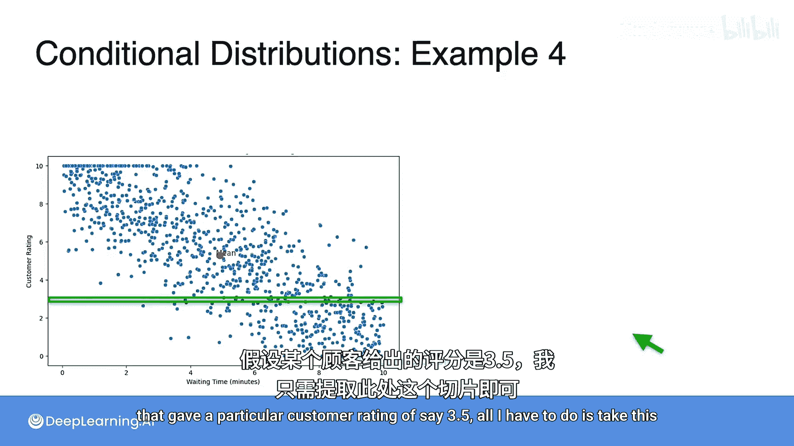
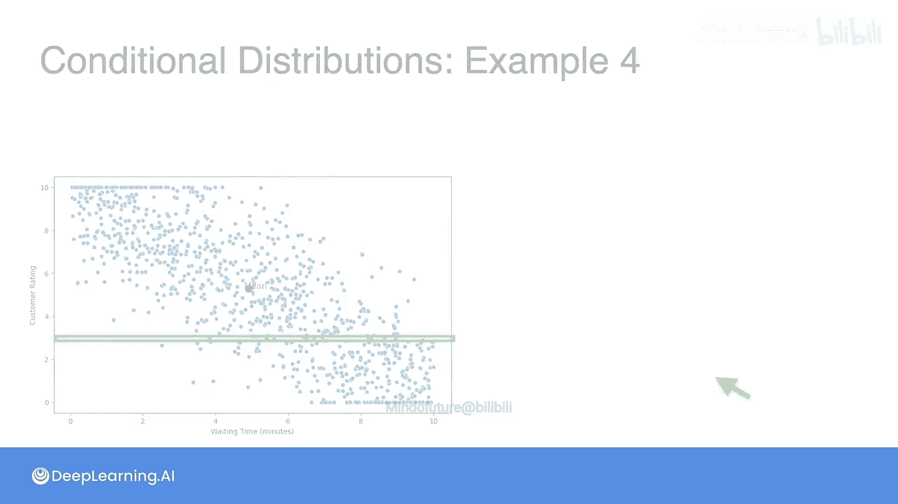

为了找到给定等待时间 **X=4** 时评分 **Y** 的条件分布，我们需要在 **X=4** 处“切”一个截面。

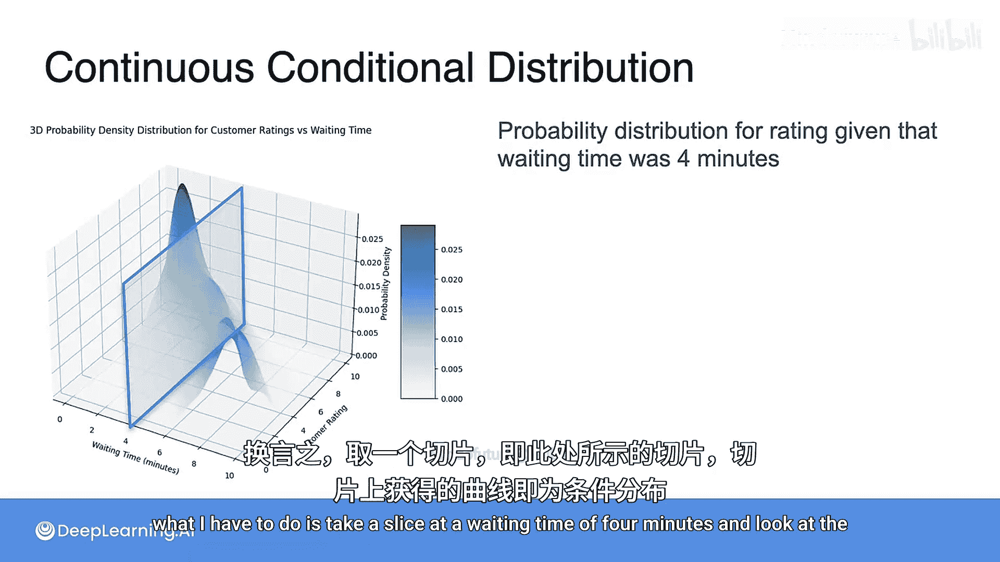

这个截面上的曲线，描绘了在 **X=4** 这个固定点上，不同 **Y** 值的“可能性”高低。然而，这条曲线本身还不是一个合格的概率密度函数，因为它下方的面积（积分）不一定等于1。所以，和离散情况一样，我们需要对它进行归一化。

归一化后得到的曲线，就是 **Y** 在给定 **X=4** 条件下的条件概率密度函数。

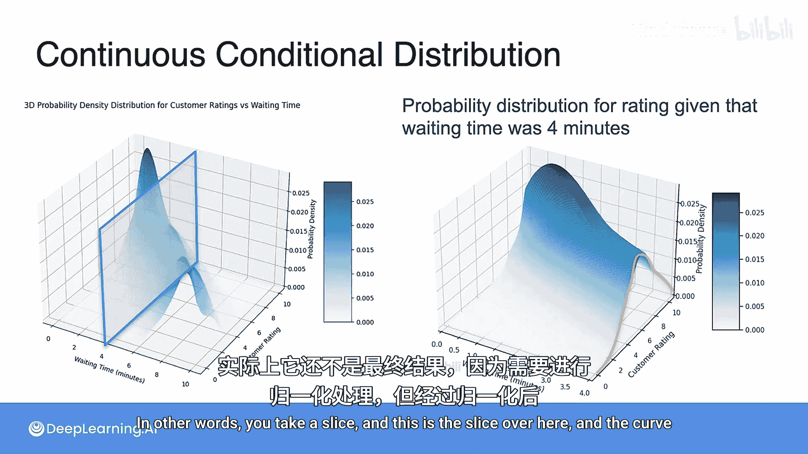

以下是连续条件分布的一般公式，它与离散形式非常相似，只是将概率质量函数 **p** 替换为概率密度函数 **f**：

**f_{Y|X}(y|x) = f_{XY}(x, y) / f_X(x)**

其中：
*   **f_{XY}(x, y)** 是联合概率密度函数。
*   **f_{Y|X}(y|x)** 是条件概率密度函数。
*   **f_X(x)** 是 **X** 的边缘概率密度函数。

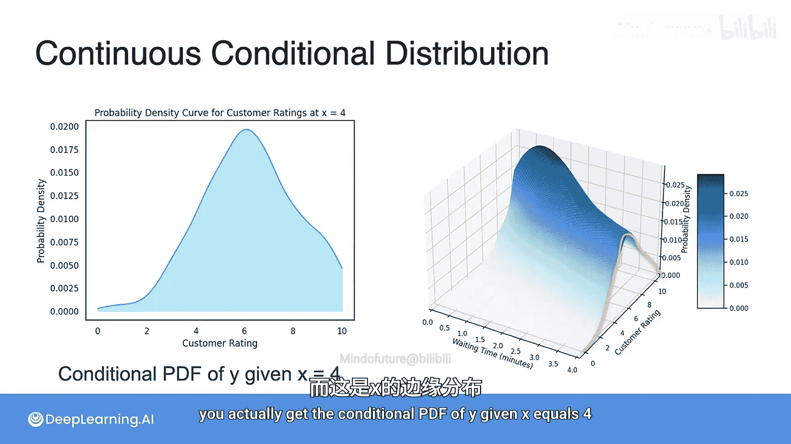
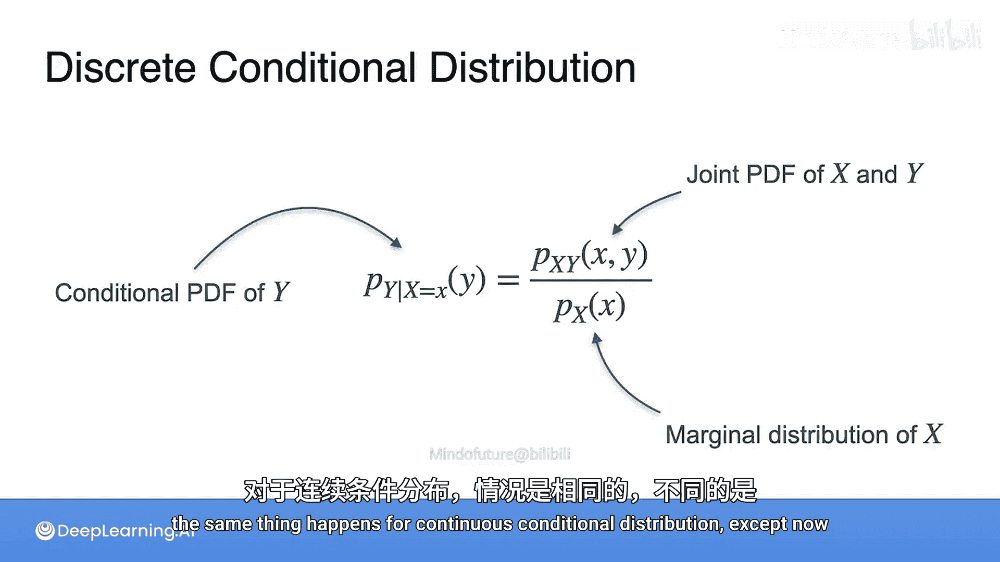
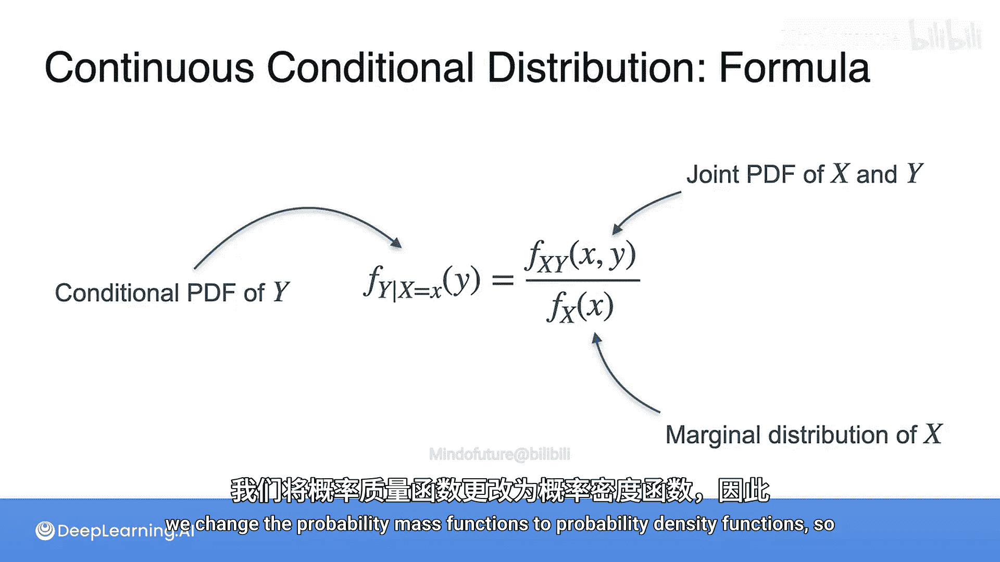

## 总结

本节课中我们一起学习了条件分布。我们了解到：
1.  **条件分布**描述了在已知一个随机变量取某个值的条件下，另一个随机变量的概率分布。
2.  对于**离散变量**，计算方法是：从联合分布表中取出对应行（或列），然后除以该行（或列）的边缘概率总和进行归一化。核心公式是：**p_{Y|X}(y|x) = p_{XY}(x, y) / p_X(x)**。
3.  对于**连续变量**，计算方法是：在联合概率密度函数的图像上，在给定条件下“切”一个截面，然后对该截面曲线进行归一化，使其积分为1。核心公式是：**f_{Y|X}(y|x) = f_{XY}(x, y) / f_X(x)**。
4.  条件分布是连接联合分布与边缘分布的桥梁，也是理解贝叶斯推理和许多机器学习算法（如朴素贝叶斯分类器）的关键。