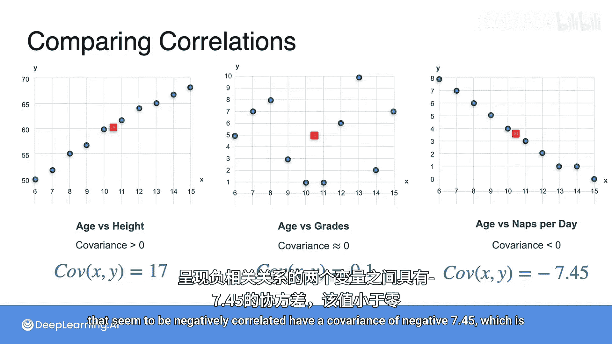

# 052：协方差

## 概述
在本节课中，我们将要学习一个非常重要的概念——协方差。协方差用于衡量两个随机变量之间的关系，帮助我们理解一个变量如何影响另一个变量。这对于构建准确的模型和做出更好的决策至关重要。

## 变量间的关系
上一节我们介绍了单个随机变量的期望值和方差。本节中我们来看看如何描述两个随机变量之间的关系。

考虑两个变量：年龄和身高。每个变量都有自己的期望值和方差。然而，这两个变量之间可能存在某种关系。例如，年龄和身高通常是相关的，因为年龄越大，身高可能越高。我们如何量化这种关系呢？这就要用到协方差和相关系数。

## 理解协方差
为了理解协方差，我们来看一个具体的例子。假设有一个离散随机变量 **X**，代表孩子的年龄。我们还有三个离散随机变量：
*   **Y1**：孩子的身高（英寸）
*   **Y2**：孩子在某个测试中的成绩
*   **Y3**：孩子每天的午睡次数

我们获得了一些数据。问题是：**X** 与这三个 **Y** 变量中的每一个相比如何？我们如何比较这些关系？

为了更好地可视化每个数据集中的情况，我们为每个关系生成散点图，其中横轴是 **X**，纵轴分别是 **Y1**、**Y2** 或 **Y3**。

以下是三个散点图的模式：
*   **年龄 vs 身高**：数据点大致呈一条向右上方倾斜的对角线。
*   **年龄 vs 成绩**：数据点看起来分布得比较散乱，没有明显的趋势。
*   **年龄 vs 午睡次数**：数据点大致呈一条向右下方倾斜的对角线。

## 从数据到洞察
我们可以先看一些基本指标。对于年龄和身高，我们可以计算两者的均值。年龄的均值是10.5，身高的均值是60。点 (10.5, 60) 是这些数据点的平衡中心点。对于年龄和成绩，中心点是 (10.5, 5)。对于年龄和午睡次数，中心点是 (10.5, 3.7)。

我们也可以查看方差。年龄的方差是9.17。只看Y坐标，三个Y变量的方差分别是39.56、9.78和7.57。

我们掌握了每个变量的均值和方差信息。然而，从散点图中我们还能看到更多：年龄和身高正相关，年龄和午睡次数负相关，而年龄和成绩似乎没有明显关联。这种关系可以通过协方差来捕捉。

## 协方差的直观解释
第一个图（年龄 vs 身高）的协方差大于0。
第二个图（年龄 vs 成绩）的协方差接近0。
第三个图（年龄 vs 午睡次数）的协方差小于0。

协方差描述了两个变量之间的关系。正如你所想，孩子年龄越大，身高越高，这解释了第一个图。年龄和成绩似乎没有很强的关联，年龄大小与成绩高低没有固定规律。年龄和午睡次数则相反，孩子年龄越大，每天的午睡次数越少。协方差正是对这些关系的总结。

## 计算协方差
那么，我们如何计算协方差呢？第一步通常是中心化数据。我们从每个X坐标中减去X的均值，从每个Y坐标中减去Y的均值。这样，中心点就移动到了坐标原点 (0, 0)。然后，我们还可以分别除以X和Y的标准差，这样处理后的数据，其X方差和Y方差都变为1，图形会更规整。

现在，让我们尝试构建一个公式来捕捉左边图的趋势、右边图的趋势以及中间图缺乏趋势的情况。

观察左边的图（正相关），当你向右移动（X增加）时，点倾向于向上移动（Y增加）。当你向左移动（X减少）时，点倾向于向下移动（Y减少）。因此，X的变化量和Y的变化量往往具有相同的符号（同为正或同为负）。换句话说，对于大多数点，其中心化后的X坐标和Y坐标符号相同。

观察右边的图（负相关），情况相反。当你有一个负的X坐标时，往往有一个正的Y坐标；当你有一个正的X坐标时，往往有一个负的Y坐标。因此，它们的坐标符号往往不同。

对于中间的图（不相关），似乎没有规律。有时X坐标为正，Y坐标也为正；有时X坐标为负，Y坐标为正。任何事情都可能发生。

现在，让我们看看坐标的乘积。在左边，坐标通常符号相同，因此乘积通常是正数。在右边，坐标通常符号不同，因此乘积通常是负数。在中间，乘积既可能是正数也可能是负数，因为它们会相互抵消。

如果我们把所有点的坐标乘积加起来会怎样？在左边，我们会得到一个正数；在右边，我们会得到一个负数；在中间，我们可能得到一个接近零的数（可能是正或负，但很可能接近零），因为正负项会相互抵消。这个和就与协方差有关。

## 协方差公式
我们得出重要的公式：协方差将告诉我们一个变量是否使另一个变量增长、减少，或者对另一个变量没有影响。但它不仅仅是乘积 **X * Y** 的和。准确地说，你需要先中心化数据，然后取所有这些乘积的平均值。

协方差的公式如下：
`Cov(X, Y) = E[(X - μ_X) * (Y - μ_Y)]`
其中，**E** 表示期望值（对于样本数据，就是平均值），**μ_X** 和 **μ_Y** 分别是X和Y的均值。

## 计算示例
现在，我们准备进行一些计算。

**1. 年龄与身高（正相关）**
以下是年龄和身高的数据表，我们预期其协方差大于0。
首先，我们计算年龄的均值 (**μ_X**) 和身高的均值 (**μ_Y**)。
然后，中心化数据：从所有年龄值中减去 **μ_X**，从所有身高值中减去 **μ_Y**。
接着，将中心化后的两列数值相乘。
最后，将这些乘积相加并取平均值（除以数据点数量，本例中为10）。
计算得到协方差为 **17**。因为数据是正相关的（年龄增长，身高增长）。

**2. 年龄与午睡次数（负相关）**
这个数据集的协方差应为负数。
同样，计算均值，中心化数据，计算乘积列。
可以看到，所有乘积都是负数。其和为 -74.5。
取平均值（除以10），得到协方差为 **-7.45**。这个值是负的，因为正如你所知，年龄越高，每天的午睡次数越少。

**3. 年龄与成绩（不相关）**
最后，我们计算年龄与成绩分布的协方差。
列出所有数字：年龄、成绩、中心化后的年龄、中心化后的成绩、中心化坐标的乘积。
其和为1。除以10，得到协方差为 **1/10** 或 **0.1**，非常接近0。这表明其中一个变量对另一个变量几乎没有影响，或者说影响非常小，因为协方差非常小。

## 总结
本节课中我们一起学习了协方差。我们有三对变量：
*   一起增长的变量（年龄 vs 身高）具有正的协方差 **17**。
*   看起来彼此独立的变量（年龄 vs 成绩）具有非常小的协方差 **0.1**。
*   似乎呈负相关的变量（年龄 vs 午睡次数）具有负的协方差 **-7.45**。

协方差是一个强大的工具，它量化了两个变量之间的线性关系方向和强度，是理解数据和构建模型的基础。