# 053：协方差详解

在本节课中，我们将学习概率分布中一个核心概念——协方差。协方差用于衡量两个随机变量之间的线性关系。我们将通过几个具体的游戏例子，直观地理解协方差如何描述变量间的关联性，并学习其计算方法。

## 游戏场景设定

考虑以下场景：玩家X和玩家Y进行三局游戏，每局游戏他们可能赢或输1美元。

### 游戏一：同赢同输

在游戏一中，有两种可能的结果：两位玩家都赢1美元，或者两位玩家都输1美元。每种情况的概率均为 `1/2`。

### 游戏二：零和博弈

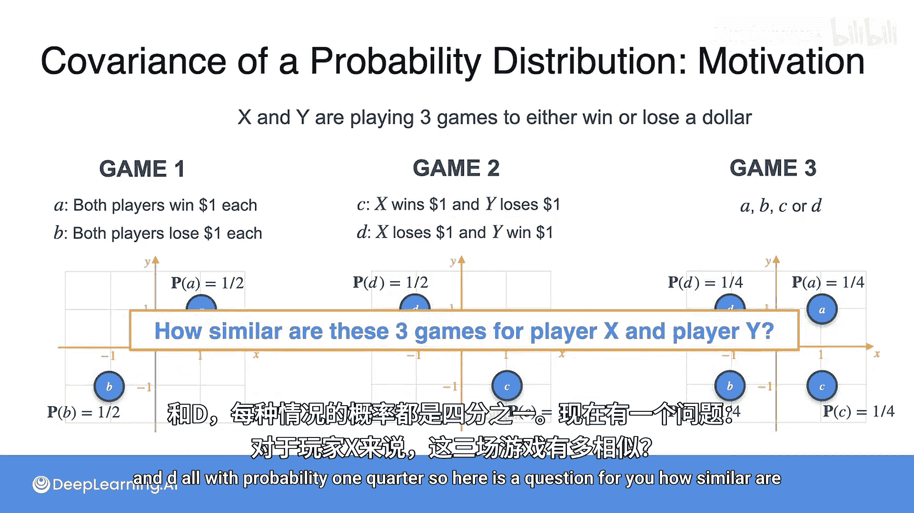

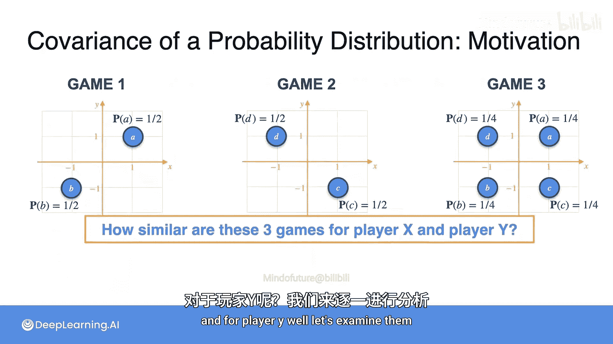

在游戏二中，有两种可能的结果：玩家X赢1美元且玩家Y输1美元，或者玩家X输1美元且玩家Y赢1美元。每种情况的概率均为 `1/2`。

### 游戏三：随机结果

在游戏三中，有四种可能的结果：两位玩家都赢1美元、两位玩家都输1美元、玩家X赢1美元且玩家Y输1美元、玩家X输1美元且玩家Y赢1美元。每种情况的概率均为 `1/4`。

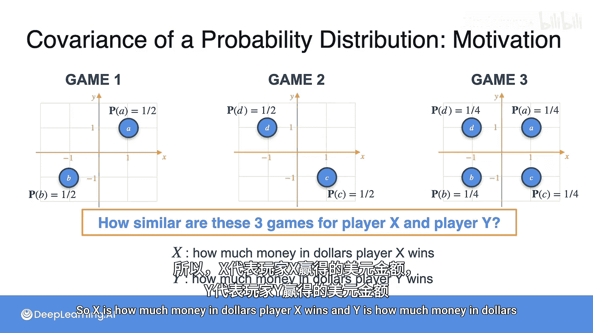

## 独立分析：期望与方差

首先，我们独立地分析每位玩家的收益情况。设随机变量X表示玩家X的收益（美元），Y表示玩家Y的收益（美元）。

### 期望值分析

对于所有三个游戏，单独看每位玩家的期望收益：

*   **游戏一**：玩家X的期望收益 `E[X] = (1/2)*1 + (1/2)*(-1) = 0`。玩家Y同理，`E[Y] = 0`。
*   **游戏二**：玩家X的期望收益 `E[X] = (1/2)*1 + (1/2)*(-1) = 0`。玩家Y同理，`E[Y] = 0`。
*   **游戏三**：玩家X的期望收益 `E[X] = (1/4)*1 + (1/4)*1 + (1/4)*(-1) + (1/4)*(-1) = 0`。玩家Y同理，`E[Y] = 0`。

**结论**：仅从期望值来看，三个游戏对每位玩家是相同的，长期平均收益均为0。

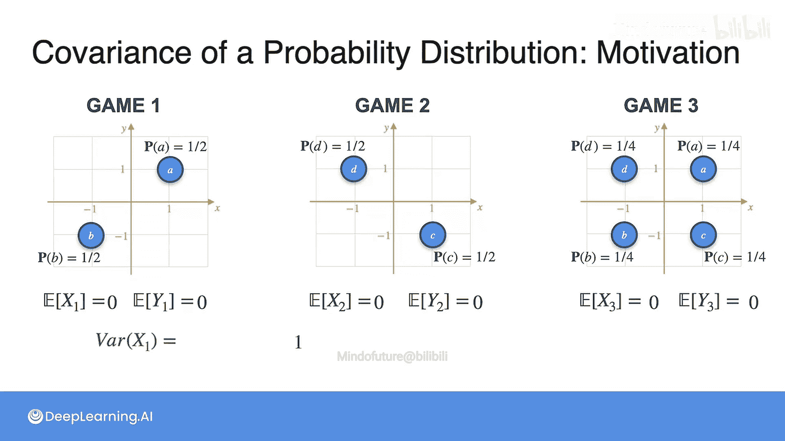

### 方差分析

接下来，我们计算每位玩家收益的方差，公式为 `Var(X) = E[(X - E[X])^2] = E[X^2]`（因为 `E[X]=0`）。

*   **游戏一**：`Var(X) = E[X^2] = (1/2)*1^2 + (1/2)*(-1)^2 = 1`。`Var(Y)` 同样为1。
*   **游戏二**：`Var(X) = E[X^2] = (1/2)*1^2 + (1/2)*(-1)^2 = 1`。`Var(Y)` 同样为1。
*   **游戏三**：`Var(X) = E[X^2] = (1/4)*1^2 + (1/4)*1^2 + (1/4)*(-1)^2 + (1/4)*(-1)^2 = 1`。`Var(Y)` 同样为1。

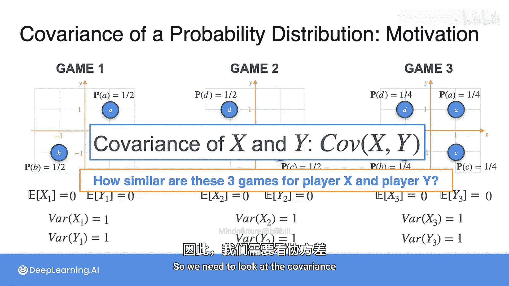

**结论**：仅从单个玩家的方差来看，三个游戏也是相同的，收益的波动程度一致。

既然期望和方差都无法区分这三个游戏，那么它们的本质区别在哪里呢？区别在于两位玩家收益之间的**关联模式**。这正是协方差要衡量的内容。

## 核心概念：协方差

协方差（Covariance）用于衡量两个随机变量变化的协同程度。其计算公式为：
`Cov(X, Y) = E[(X - E[X]) * (Y - E[Y])]`

一个常用的等价计算公式是：
`Cov(X, Y) = E[XY] - E[X]E[Y]`

### 计算三个游戏的协方差

现在，我们使用第一个公式来计算三个游戏的协方差。由于 `E[X] = E[Y] = 0`，公式简化为 `Cov(X, Y) = E[XY]`。

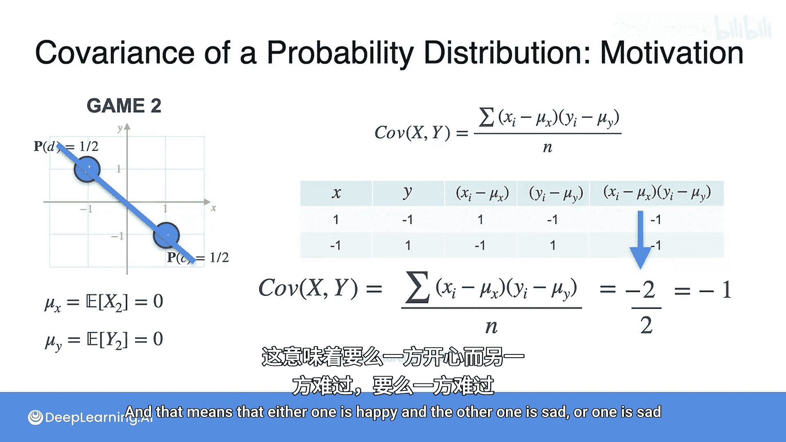

以下是计算过程：

**游戏一：同赢同输**
*   情况1：X=1, Y=1，乘积为1。
*   情况2：X=-1, Y=-1，乘积为1。
*   期望：`Cov(X, Y) = (1/2)*1 + (1/2)*1 = 1`。

**游戏二：零和博弈**
*   情况1：X=1, Y=-1，乘积为-1。
*   情况2：X=-1, Y=1，乘积为-1。
*   期望：`Cov(X, Y) = (1/2)*(-1) + (1/2)*(-1) = -1`。

**游戏三：随机结果**
*   情况1：X=1, Y=1，乘积为1。
*   情况2：X=-1, Y=-1，乘积为1。
*   情况3：X=1, Y=-1，乘积为-1。
*   情况4：X=-1, Y=1，乘积为-1。
*   期望：`Cov(X, Y) = (1/4)*1 + (1/4)*1 + (1/4)*(-1) + (1/4)*(-1) = 0`。

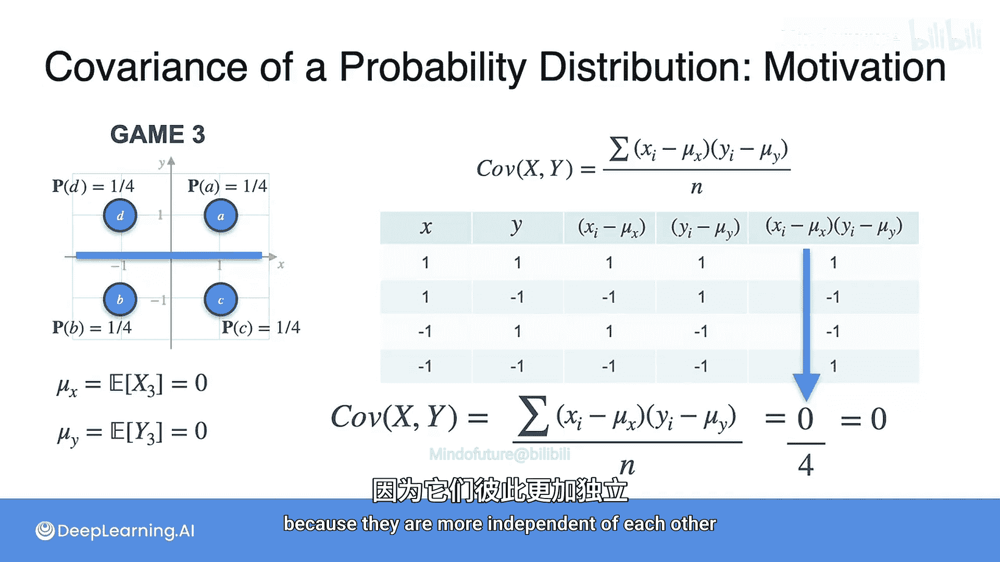

**解读**：
*   **协方差为1（正）**：表示X和Y倾向于同向变化。游戏一中，他们总是同赢或同输。
*   **协方差为-1（负）**：表示X和Y倾向于反向变化。游戏二中，一人之得即为另一人之失。
*   **协方差为0**：表示X和Y之间没有线性关联。游戏三中，知道一方的结果无法推断另一方的结果。

## 扩展案例：不等概率游戏（游戏四）

现在引入一个更复杂的游戏四，它有三种结果，且概率不等：
1.  双方都赢1美元，概率 `P = 1/2`。
2.  双方都输1美元，概率 `P = 1/3`。
3.  双方不输不赢，概率 `P = 1/6`。

### 计算期望与方差

首先计算每位玩家的期望收益：
`E[X] = (1/2)*1 + (1/6)*0 + (1/3)*(-1) = 1/6`
`E[Y] = 1/6` （与X对称）

接着计算方差，公式为 `Var(X) = E[(X - μ_X)^2]`：
`Var(X) = (1/2)*(1 - 1/6)^2 + (1/6)*(0 - 1/6)^2 + (1/3)*(-1 - 1/6)^2 ≈ 0.806`
`Var(Y) ≈ 0.806`

### 计算协方差

对于概率不等的情况，协方差公式为所有可能结果的概率加权平均：
`Cov(X, Y) = Σ P_i * (x_i - μ_X) * (y_i - μ_Y)`

也可以使用等价公式 `Cov(X, Y) = E[XY] - E[X]E[Y]` 计算。这里 `E[XY]` 是XY乘积的期望：
`E[XY] = (1/2)*1*1 + (1/6)*0*0 + (1/3)*(-1)*(-1) = 1/2 + 0 + 1/3 = 5/6`

因此：
`Cov(X, Y) = E[XY] - E[X]E[Y] = 5/6 - (1/6)*(1/6) = 5/6 - 1/36 = 29/36 ≈ 0.806`

**解读**：协方差约为0.806，为正值。这表明在游戏四中，两位玩家的收益仍然倾向于同向变化（一起赢或一起输），尽管存在“平局”的可能性。

## 实际应用示例：客服电话

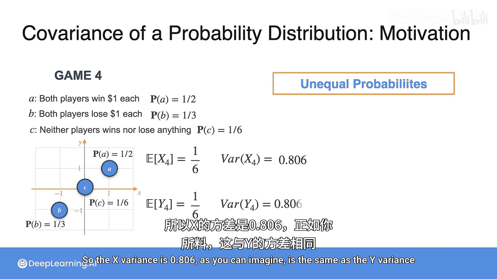

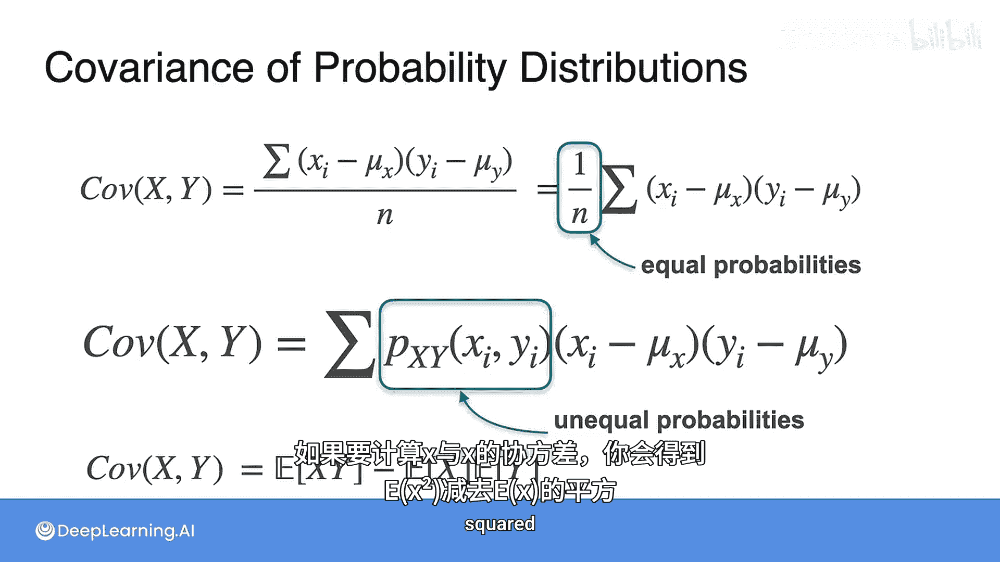

回顾之前客服电话的例子，我们有两个随机变量：
*   **X**：客户等待时间。
*   **Y**：客户评分（1-5分）。

从数据的散点图趋势来看，等待时间越长，评分倾向于越低，呈现一种负相关的对角线模式。因此，我们**预测协方差为负值**。

### 计算验证

假设我们已计算出以下值（具体计算过程略）：
*   `E[X] ≈ 2.1`
*   `E[Y] ≈ 3.5`
*   `E[XY] ≈ 18.014`

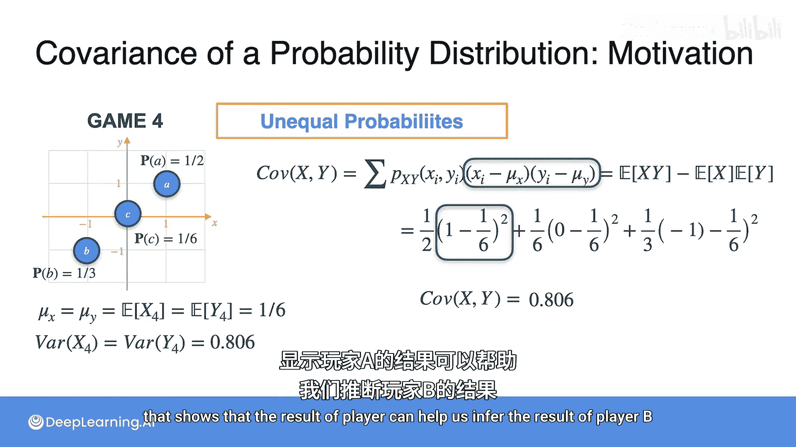

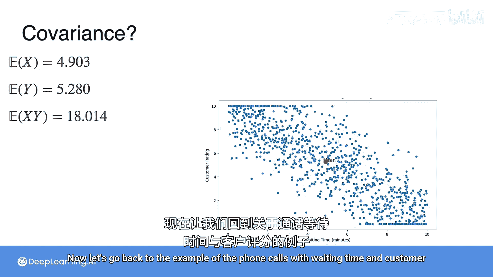

使用公式 `Cov(X, Y) = E[XY] - E[X]E[Y]` 进行计算：
`Cov(X, Y) ≈ 18.014 - (2.1 * 3.5) ≈ 18.014 - 7.35 ≈ -7.878`

**结论**：计算得到的协方差约为-7.878，证实了我们的预测。这表明等待时间与客户评分之间存在负的线性关联，即等待时间增加，客户评分倾向于下降。

## 总结

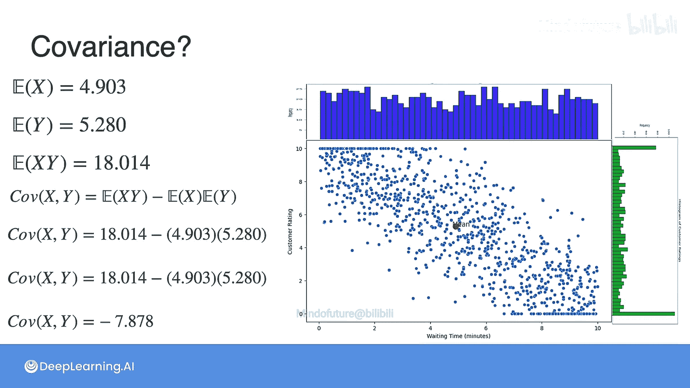

本节课中，我们一起学习了协方差这一核心概念：
1.  **协方差的定义**：它衡量两个随机变量变化的协同方向与程度。
2.  **计算公式**：我们掌握了两个关键公式 `Cov(X,Y) = E[(X-μ_X)(Y-μ_Y)]` 和其等价形式 `Cov(X,Y) = E[XY] - E[X]E[Y]`。
3.  **符号的意义**：
    *   **协方差 > 0**：变量间存在正相关，倾向于同增同减。
    *   **协方差 < 0**：变量间存在负相关，倾向于一增一减。
    *   **协方差 = 0**：变量间没有线性相关关系（但可能有其他非线性关系）。
4.  **应用**：我们通过几个游戏例子直观理解了不同协方差值对应的数据关系模式，并将此概念应用于一个实际的客服数据场景，验证了等待时间与客户评分之间的负相关性。

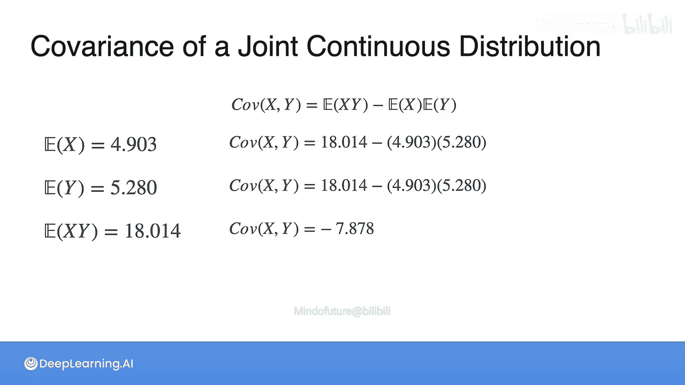

理解协方差是理解变量间关系、以及后续学习相关系数、多元统计分析等更高级概念的重要基础。