# 055：相关系数 📊

在本节课中，我们将要学习一个非常重要的统计概念——**相关系数**。上一节我们介绍了协方差，它描述了变量间的变化关系。本节中我们来看看如何量化这种关系的强度，并理解其局限性。

## 概述：从协方差到相关系数

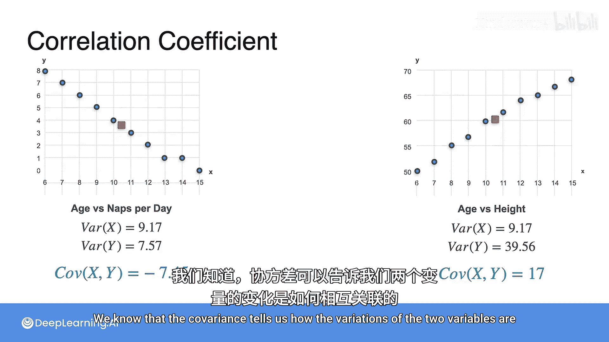

我们之前已经见过这两个数据集，并计算了它们的方差和协方差。我们知道，协方差告诉我们两个变量的变化是如何关联的：正值表示两者倾向于一同增加，负值表示一个增加时另一个减少。

然而，协方差的大小没有限制范围。例如，一个数据集的协方差是17，另一个是7.45（不考虑符号）。这是否意味着协方差为17的数据集相关性更强？我们无法直接判断，因为协方差的值可以很大，但这可能仅仅是因为原始数据的数值本身就很大。

那么，我们如何才能真正衡量两个变量之间的相关性强度呢？答案就是**相关系数**。

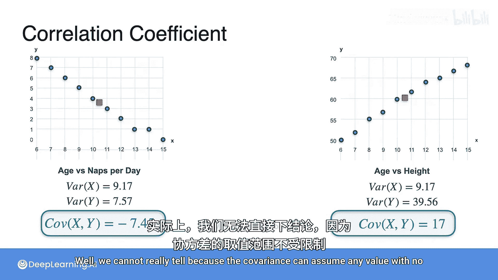

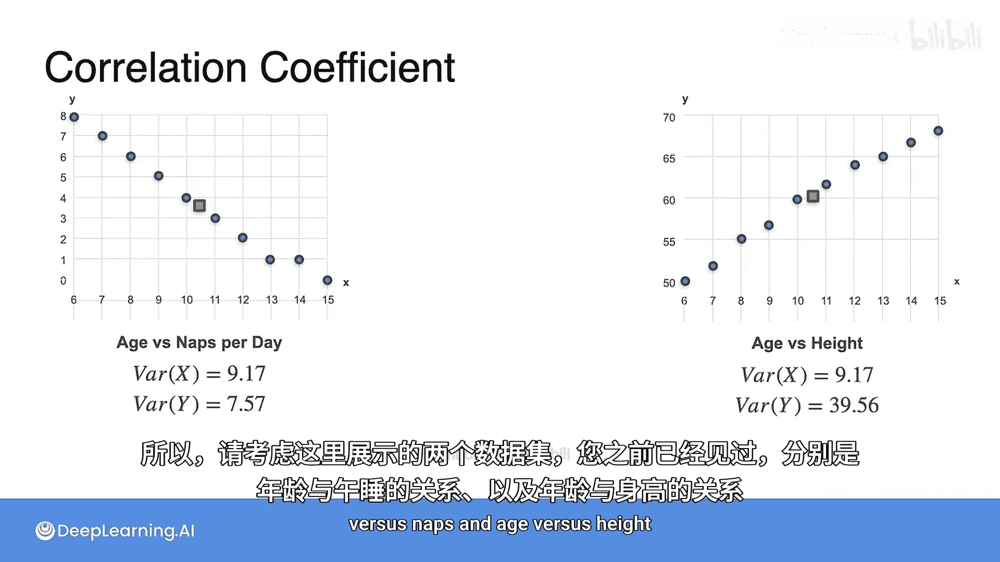

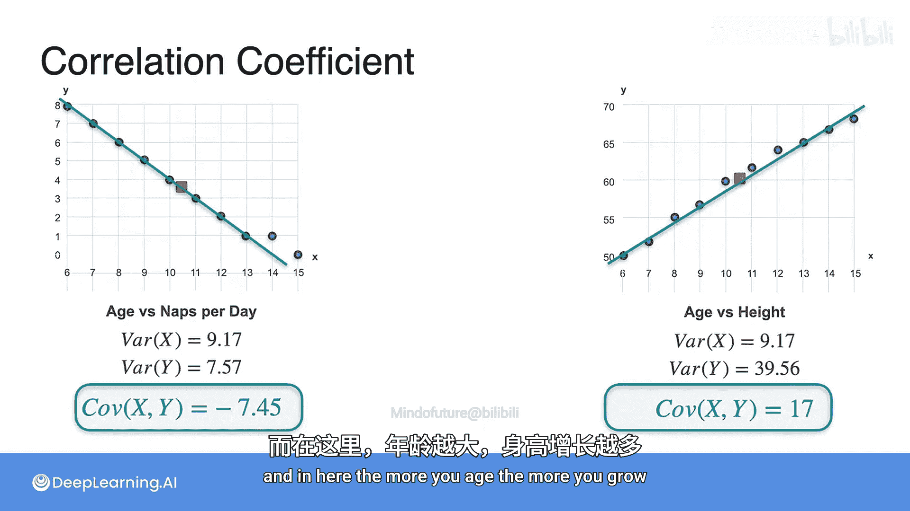

## 什么是相关系数？🔢

相关系数是一个介于 **-1** 和 **1** 之间的数字。
*   **-1** 表示两个变量**完全负相关**。
*   **1** 表示两个变量**完全正相关**。
*   **0** 表示两个变量**完全独立**（不相关）。

相关系数本质上是**标准化后的协方差**。其公式如下：

**公式：**
`ρ = Cov(X, Y) / (σ_X * σ_Y)`

其中：
*   `Cov(X, Y)` 是变量X和Y的协方差。
*   `σ_X` 是变量X的标准差（即方差的平方根）。
*   `σ_Y` 是变量Y的标准差。

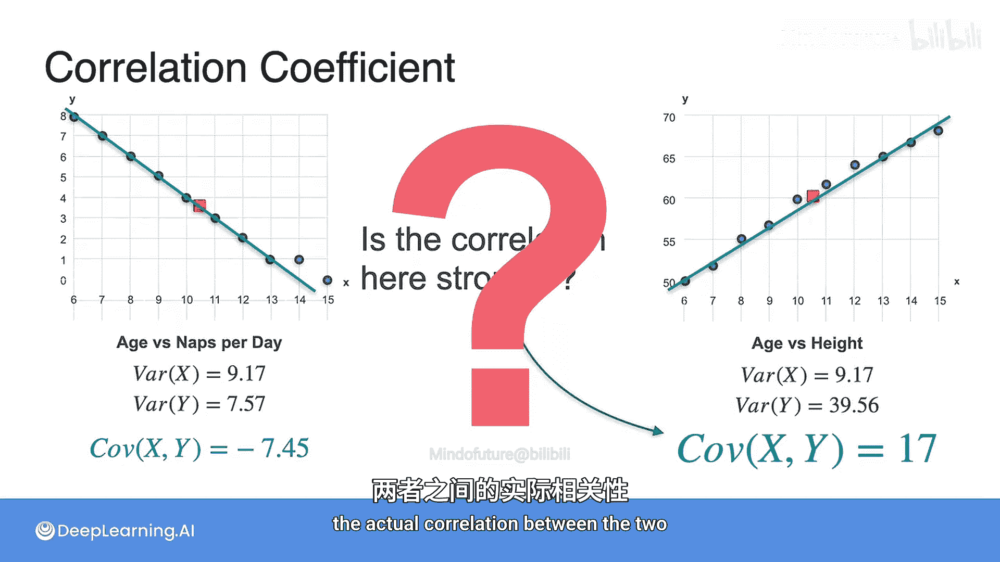

我们也可以将其写作：
`ρ = Cov(X, Y) / sqrt(Var(X) * Var(Y))`

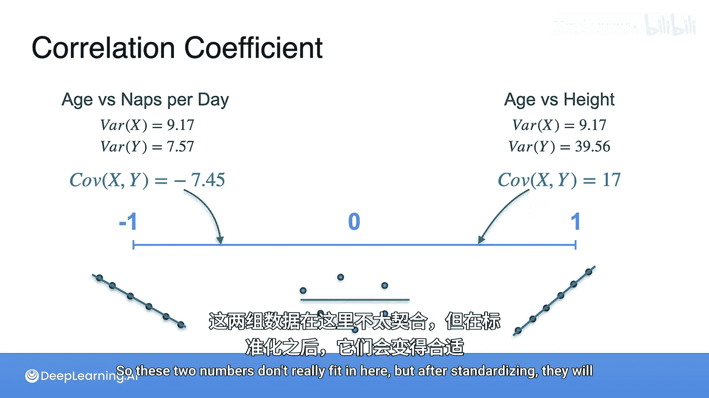

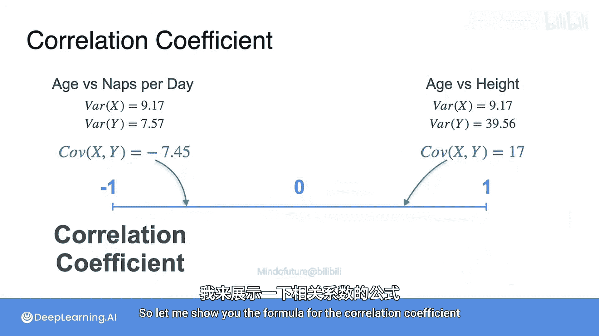

## 计算相关系数示例 📈

现在，让我们用这个公式来计算之前提到的数据集。

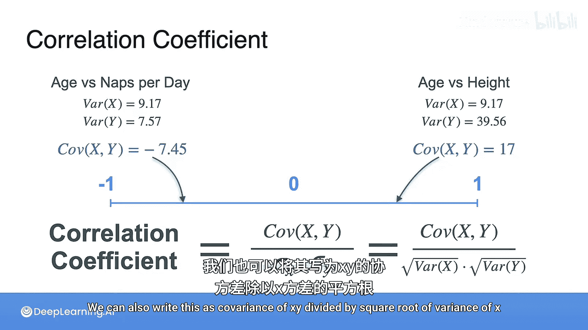

**1. 年龄 vs. 午睡次数**
对于年龄与午睡次数的数据集，其协方差为负。计算相关系数：
`ρ = -7.45 / (sqrt(9.17) * sqrt(39.56)) ≈ -0.894`

这个值接近 **-1**，表明这两个变量**高度负相关**（年龄越大，午睡越少）。从散点图上看，数据点非常接近一条向下的对角线。

**2. 年龄 vs. 身高**
对于年龄与身高的数据集，其协方差为正。计算相关系数：
`ρ = 17 / (sqrt(9.17) * sqrt(39.56)) ≈ 0.893`

这个值接近 **1**，表明这两个变量**高度正相关**（年龄增长，身高也增长）。从散点图上看，数据点非常接近一条向上的对角线。

**关键发现：**
尽管两个数据集的协方差（17 和 7.45）在数值上差异很大，但它们的相关系数（0.893 和 -0.894）的**绝对值**却非常接近。这证实了相关系数消除了量纲影响，能更准确地反映相关性的强度。两个数据集的线性关系强度相似，唯一的区别是方向（正相关或负相关），这由相关系数的符号体现。

**3. 其他示例**
*   **作业成绩 vs. 考试成绩**：计算出的相关系数约为 **0.01**，非常接近0，表明两者基本不相关。
*   **等待时间 vs. 客户评分**：计算出的相关系数约为 **-0.845**，表明存在较强的负相关关系（等待时间越长，评分倾向于越低）。

## 相关系数总结 📝

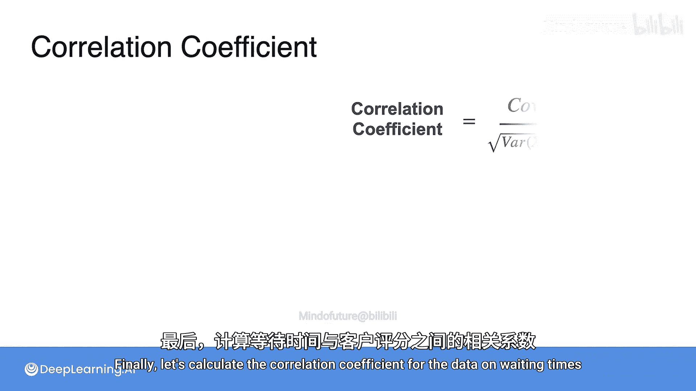

本节课中我们一起学习了相关系数。以下是核心要点：

相关系数是两个变量协方差与其各自标准差乘积的比值。
*   它是一个标准化的度量，始终介于 **-1** 和 **1** 之间。
*   当数据点几乎完全落在对角线 `y = x` 上时，相关系数接近 **1**（完全正相关）。
*   当数据点几乎完全落在对角线 `y = -x` 上时，相关系数接近 **-1**（完全负相关）。
*   当数据点呈随机分布，无任何线性趋势时，相关系数接近 **0**（不相关）。

相关系数在统计学中非常有用，特别是在比较成对变量时。它帮助我们量化并理解变量间线性关系的强度和方向。

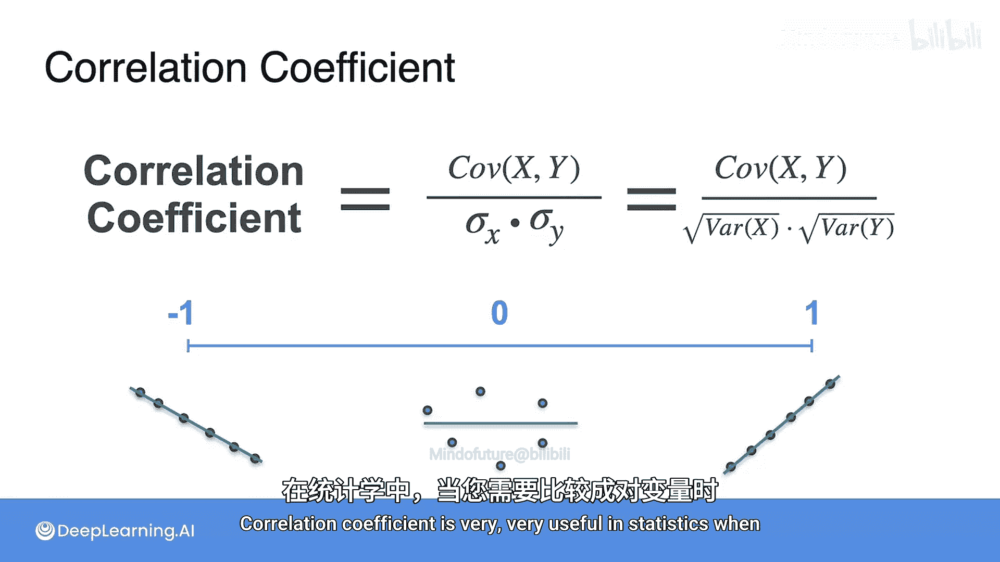

---

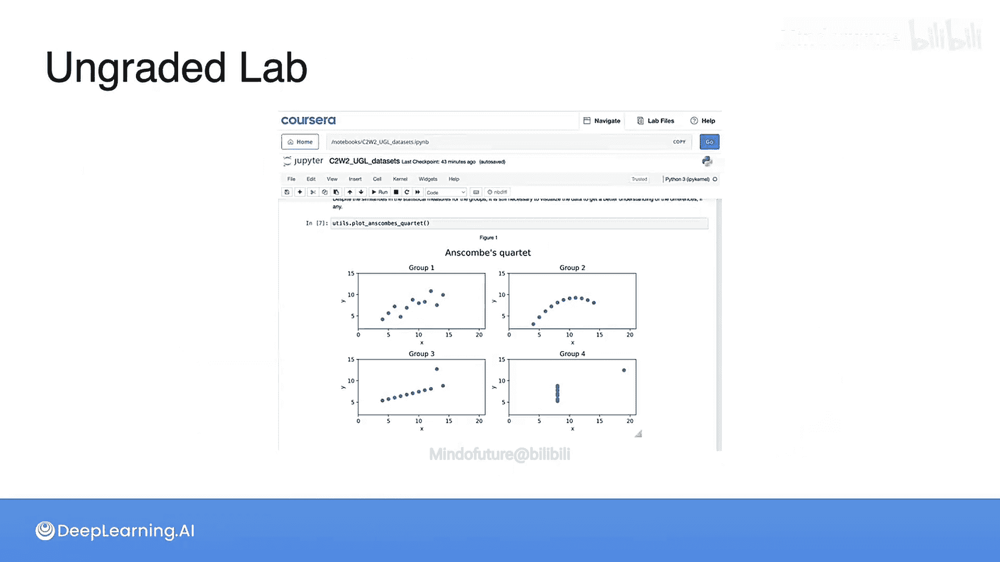

**接下来**，你将进入一个基于著名数据集的简短实验。这些例子将展示，在某些情况下，像均值、方差和相关系数这样的统计度量可能无法揭示数据的全貌。请享受探索这个实验的过程，完成后我们再见。😊