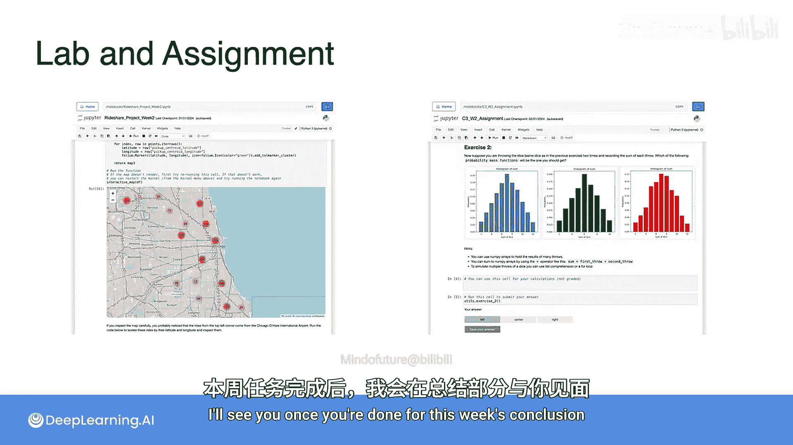

# 056：多元高斯分布


在本节课中，我们将要学习高斯分布从单变量到多变量的扩展，即多元高斯分布。我们将探讨其公式、几何意义以及在数据中的直观表现，特别是协方差如何影响分布的形状。

## 从单变量到多变量 📈

上一节我们介绍了单变量的正态或高斯分布。当变量多于一个时，该分布被称为多元高斯分布。在二维变量下观察，其形状像一个钟形曲面，这种分布在机器学习中频繁出现。

回忆单变量高斯分布的概率密度函数公式，它由均值 `μ`（钟形中心）和标准差 `σ`（钟形展宽）两个参数定义。

```
f(x) = (1 / (σ * √(2π))) * exp(-(x - μ)² / (2σ²))
```

## 二元高斯分布示例 🧍♂️⚖️

现在，我们考虑一个包含两个变量的例子。假设 `H` 代表成年人的身高（英寸），`W` 代表成年人的体重（磅）。如果你有一个包含1000个人身高和体重的数据集，分别观察每个变量的边缘分布，会发现它们都近似服从具有特定均值和标准差的高斯分布。

那么，这两个变量的联合分布是什么样子呢？

以下是两种情况的对比：

*   **变量独立时**：如果两个变量相互独立，那么联合概率密度函数就是两个边缘概率密度函数的乘积。经过整理，可以得到如下表达式。此时，从顶部观察分布的等高线，会呈现为圆形。
*   **变量相关时**：在实际数据集中，身高和体重通常是正相关的（个子高的人往往更重）。这导致联合分布不再是完美的对称钟形，而是沿着一条具有正斜率的直线被拉长。从顶部看，其等高线变为椭圆形。

造成联合分布形状变形的，正是两个变量之间的协方差。

## 公式推导与推广 🧮

让我们通过代数操作，将独立二元高斯分布的公式重写为更紧凑的形式。

由于 `H` 和 `W` 各自服从高斯分布，其密度函数的乘积指数部分是各自高斯指数的和。这个平方和可以看作是一个向量的平方范数。

向量 `[H - μ_H, W - μ_W]` 可以写成 `[H, W] - [μ_H, μ_W]`。为了给向量中的每个元素乘以不同的常数（即各自的方差倒数），我们需要在中间插入一个对角矩阵。

最终，整个表达式可以写成向量转置、乘以一个矩阵、再乘以该向量的形式。这个矩阵就是协方差矩阵的逆。在变量独立的情况下，协方差矩阵是一个对角矩阵，对角线上的元素是各自的方差。

将均值向量记作粗体 **μ**，协方差矩阵记作 **Σ**，我们可以将联合分布的概率密度函数统一写成如下形式：

```
f(x) = (1 / ((2π)^{n/2} * |Σ|^{1/2})) * exp(-1/2 * (x - μ)^T * Σ^{-1} * (x - μ))
```

这个表达式不仅适用于变量独立的情况，也普遍适用于变量相关的情况。唯一的区别在于，当变量相关时，协方差矩阵 **Σ** 不再是对角矩阵，其非对角线上的元素代表了变量之间的协方差。

## 与单变量公式对比 🔄

既然你已经熟悉单变量高斯公式，让我们通过对比来理解多元高斯公式的各个部分。

*   **概率密度函数 `f(x)`**：从单变量 `x` 变为多变量随机向量 **x**。
*   **归一化常数**：从除以 `σ√(2π)` 变为除以 `(2π)^{n/2} * |Σ|^{1/2}`，其中 `n` 是变量个数，`|Σ|` 是协方差矩阵的行列式，它捕捉了分布的总体“体积”或离散程度。
*   **指数项**：
    *   `(x - μ)` 变为 `(x - μ)`，其中 **μ** 是每个变量的均值向量。
    *   `1/σ²` 变为协方差矩阵的逆 `Σ^{-1}`，它负责对数据进行标准化和缩放，并处理变量间的相关性。
    *   平方运算 `(x - μ)²` 变为二次型 `(x - μ)^T Σ^{-1} (x - μ)`。

总而言之，从单变量到多变量，所有的标量值（`x`, `μ`, `σ²`）都被替换为对应的向量或矩阵（**x**, **μ**, **Σ**）。

## 本周学习任务安排 📋

接下来是你本周的学习任务：

*   **探索性数据分析实验**：你将再次分析上周见过的“RightSha”数据集。运用本周在第二周学到的技能，你现在可以更深入地查看能为此数据集生成的某些汇总统计量，并以一些有趣的新方式将它们可视化。
*   **本周计分测验**：完成实验后，你将进行本周的计分测验，内容涵盖本周所有主题。
*   **本周计分作业**：本周的作业将挑战你结合对NumPy的知识以及你学到的概率分布知识，来回答一组关于灌铅骰子的问题。你可以选择解析求解问题，或者在Python中模拟场景。你可以选择自己喜欢的方法。

完成所有这些周末任务后，我们将在本周的总结中再见。😊



## 总结 ✨


本节课中我们一起学习了多元高斯分布。我们从熟悉的单变量高斯分布出发，通过一个身高体重的例子，直观理解了二元高斯分布的形状如何受变量间独立性或相关性的影响。我们推导并对比了多元高斯分布的一般概率密度函数公式，认识到协方差矩阵 **Σ** 在其中扮演了定义分布形状的关键角色。最后，我们了解了本周后续的实验、测验和作业安排。