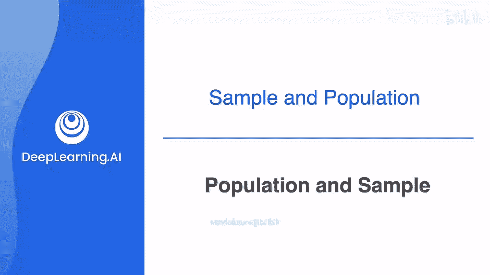
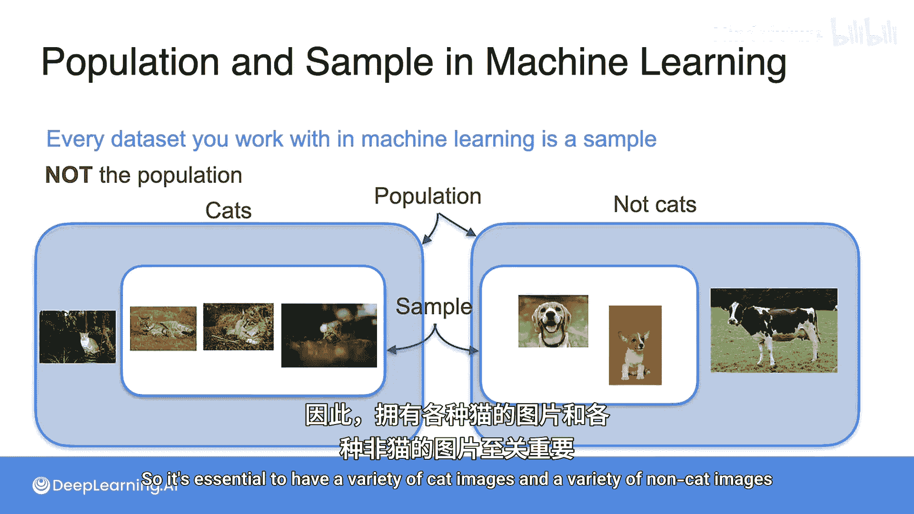
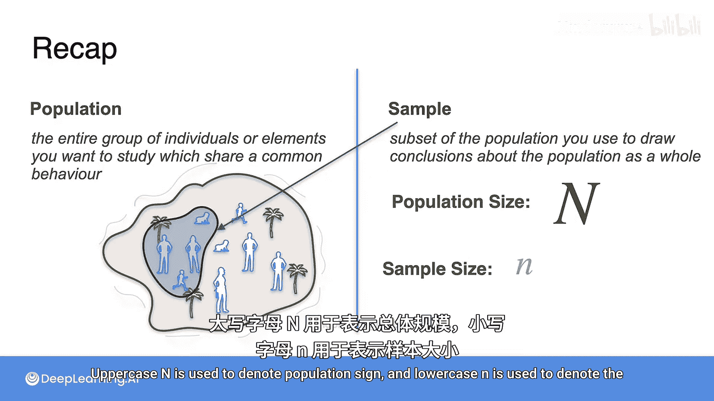

# 058：总体与样本 📊

在本节课中，我们将要学习统计学中的两个核心概念：**总体**与**样本**。理解这两个概念对于后续学习如何从数据中得出结论至关重要。

---

## 总体与样本的定义

上一节我们介绍了本课程的目标，本节中我们来看看总体与样本的具体含义。

**总体**是指我们想要研究的全部个体或项目的集合。
**样本**则是我们从总体中实际观测或测量的一个较小的子集。

例如，如果我们想测量全人类的身高，那么“全人类”就是总体。但显然我们无法测量每一个人，因此我们会抽取一个包含100人的子集进行测量，这个子集就是样本。

在机器学习和数据科学中，我们经常使用样本来训练模型和进行预测，因为我们无法获取整个数据宇宙。因此，理解两者的区别及其相关性非常重要。

---

## 一个生动的例子：斯塔托皮亚岛 🏝️

为了更好地理解，让我们来到美丽的斯塔托皮亚岛。假设你被聘为数据科学家，第一个任务是找出岛上居民的平均身高。

你最初的想法是询问岛上每一个人，然后计算平均值。但当你得知岛上有10,000名居民时，这个方法变得不切实际。

因此，你必须改变策略：只询问一小部分居民，以此来**估计**总体的平均身高。

*   **总体**：研究的所有对象，即斯塔托皮亚岛的所有居民。
*   **样本**：从总体中随机选取的一个子集，例如选取100人。

在这个例子中：
*   总体大小记为 **N**，这里是10,000。
*   样本大小记为 **n**，可以是1到9,999之间的任何数。我们的目标是选择一个既易于管理又具有统计意义的数字。

---

## 如何选取一个好的样本？🎯

为了简化说明，假设岛上只有10个人（N=10），而你想选取4个人（n=4）进行研究。

以下是两种选取方法：
1.  随机挑选4个人。
2.  将所有人按从矮到高排成一队，然后挑选前4个人。

你认为哪种方法好，哪种方法不好？

如果你认为第一种方法更好，那是正确的。因为你总是希望抽取**随机样本**。第二种方法可能会得到一个偏低的平均身高估计值，因为你只选取了队伍中较矮的人。

---

## 样本的独立性

让我们看另一个例子。假设你第一次随机选取了4个人。现在你想再做一次实验，于是你又选取了另外4个人。

这并不好。为什么？因为虽然第一次抽样是随机的，但第二次抽样却**依赖于**第一次——你不能重复选取同一个人。这会导致第二个样本集不是一个好的样本，因为它依赖于第一个样本集。

每次抽样都必须从头开始，允许同一个人被重复选中，这一点非常重要。否则，后续样本会依赖于之前的样本，从而破坏实验的随机性。

---

## 样本的同分布性

此外，你需要确保样本是**同分布**的。这意味着你选取第一个样本的规则，必须与选取第二个、第三个样本的规则完全相同。

例如，如果你总是去城镇中某个特定区域（那里的人可能普遍更高或更矮）选取样本，那么你将无法得到一个有代表性的好样本。

因此，我们必须确保样本是**独立且同分布**的。

---

## 知识测验：牛油果吐司趋势 🥑

让我们通过一个例子来检验你对总体和样本的理解。

牛油果吐司是一种流行趋势，它显著影响了商品的经济价值。在此趋势之后，你决定研究美国牛油果的价格。你显然无法检查美国每一笔牛油果交易。

于是，你随机挑选了四家商店，并记录每家店每次牛油果销售的价格。

*   **问题**：你认为这个例子中的总体是什么？
*   **答案**：总体是美国销售的所有牛油果。
*   **问题**：样本是什么？
*   **答案**：样本是你所选四家商店销售的牛油果。

---

## 在机器学习中的意义 🤖

现在，让我们看看总体与样本概念在机器学习中的含义。

在机器学习中，你处理的每一个数据集，无论它有多大，实际上都是一个**样本**，而非总体。

例如，在进行猫图像分类时，世界上存在无限多种可能的猫和非猫图像，你的数据集仅仅是其中的一个样本。

然而，拥有一个**有代表性**的数据集至关重要，正如我们在斯塔托皮亚岛身高例子中看到的那样。有代表性意味着你的数据集的分布与总体的分布相同。

例如，如果你的猫分类模型训练所用的所有猫照片都是“草地上的猫”，那么模型可能会学会将“草地”与“猫”关联起来。后果是：
*   当看到一头站在草地上的牛时，模型可能会错误地将其分类为猫。
*   当看到一只躺在沙发上的猫时，模型可能无法识别，因为它没有看到“草地”这个特征。

因此，拥有多种多样的猫图像和非猫图像是至关重要的。

---

## 核心概念总结 📝

本节课中我们一起学习了总体与样本的基本概念。以下是关键术语的正式定义：

*   **总体**：你想要研究的、具有共同特征的全体个体或元素的集合。
*   **样本**：从总体中选取的、用于推断总体特征的子集。
*   **总体大小**：用大写字母 **N** 表示。
*   **样本大小**：用小写字母 **n** 表示。

理解这些概念是进行有效统计分析和构建可靠机器学习模型的基础。

