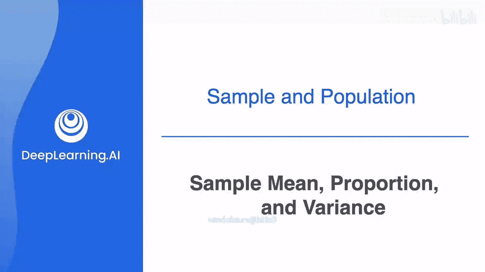
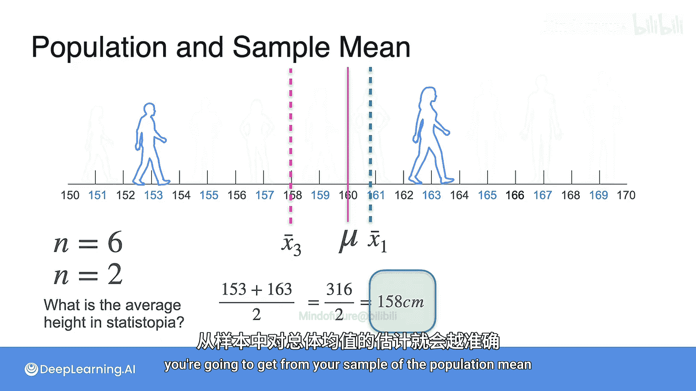

# 059：样本均值



## 概述

在本节课中，我们将要学习如何使用样本均值来估计总体均值。我们将通过一个简单的例子，理解为什么样本均值可以作为总体均值的估计，以及样本大小如何影响估计的准确性。

---

## 从总体到样本

上一节我们介绍了总体和样本的基本概念。本节中我们来看看如何通过样本数据来推断总体信息。

假设你拥有全世界人口的数据，你想知道所有人的平均身高。要精确计算这个总体均值非常困难，因为你无法测量每一个人。一个可行的方法是，从总体中随机抽取一小部分人，计算这部分人的平均身高，并用这个结果来估计总体的平均身高。

这种方法同样适用于估计其他指标，例如比例。然而，当我们试图用样本来估计总体的方差时，直接计算会遇到问题。如果我们取数据集的一个小样本并计算其方差，得到的结果通常不等于原始数据集的方差，但会非常接近。我们将在后续课程中详细探讨这一点。

## 一个具体的例子：斯塔托皮亚岛

为了更好地理解，让我们再次回顾斯塔托皮亚岛的例子。为了简化，我们假设岛上总共有10个人，他们的身高数据如下所示：

```
[150, 155, 160, 165, 170, 175, 180, 185, 190, 195] 厘米
```

斯塔托皮亚岛的总体平均身高是多少？我们可以轻松计算出来：

**公式：**
`μ = (150 + 155 + 160 + 165 + 170 + 175 + 180 + 185 + 190 + 195) / 10 = 172.5 厘米`

这个值 `μ = 172.5` 就是总体均值。

现在，假设由于某些原因，你无法记录全部10个人的身高，只能随机测量其中6个人。这意味着你的样本大小 `n = 6`。

## 计算样本均值

以下是计算第一个样本均值的步骤：

1.  假设我们随机抽取了以下6个人的身高：`[155, 165, 170, 180, 185, 190]`。
2.  计算这6个人的平均身高。

**公式：**
`x̄₁ = (155 + 165 + 170 + 180 + 185 + 190) / 6 = 174.17 厘米`

我们称这个结果为第一个样本均值 `x̄₁`。这是我们对总体均值 `μ` 的第一个估计。

## 样本均值的波动性

现在，让我们抽取第二个大小为6的样本。假设这次我们抽到的是：`[150, 155, 160, 165, 170, 175]`。

计算第二个样本均值：

**公式：**
`x̄₂ = (150 + 155 + 160 + 165 + 170 + 175) / 6 = 162.5 厘米`

我们得到了第二个估计值 `x̄₂ = 162.5` 厘米。

比较 `x̄₁` 和 `x̄₂`，哪个是对总体均值 `μ (172.5)` 更好的估计？显然 `x̄₁ (174.17)` 更接近。这可以归因于随机抽样的偶然性。第二个样本恰好由总体中身高较低的六个人组成，因此不是一个有代表性的样本。

## 样本大小的影响

那么，如果我们把样本大小减小到 `n = 2` 呢？让我们随机抽取两个人，假设身高为 `[160, 185]`。

计算第三个样本均值：

**公式：**
`x̄₃ = (160 + 185) / 2 = 172.5 厘米`

我们得到了 `x̄₃ = 172.5` 厘米。

虽然 `x̄₃` 这次恰好等于总体均值，但我们可以想象，通常情况下，基于 `n=6` 的样本均值 `x̄₁` 会比基于 `n=2` 的样本均值 `x̄₃` 更可靠。因为 `x̄₁` 使用了更多数据，受个别极端值的影响更小。

## 核心结论

通过以上例子，我们可以得出一个重要的初步结论：**样本越大，你从样本中获得的总体均值估计通常就越准确、越稳定。** 我们将在后续课程中更深入地探讨这一现象背后的数学原理。

---

## 总结



本节课中我们一起学习了样本均值的概念及其应用。我们了解到，样本均值 `x̄` 是总体均值 `μ` 的一个有用估计。通过斯塔托皮亚岛的例子，我们看到了样本均值会因随机抽样而波动，并且更大的样本容量通常能带来更可靠的估计。在接下来的课程中，我们将继续探索如何量化这种估计的不确定性。