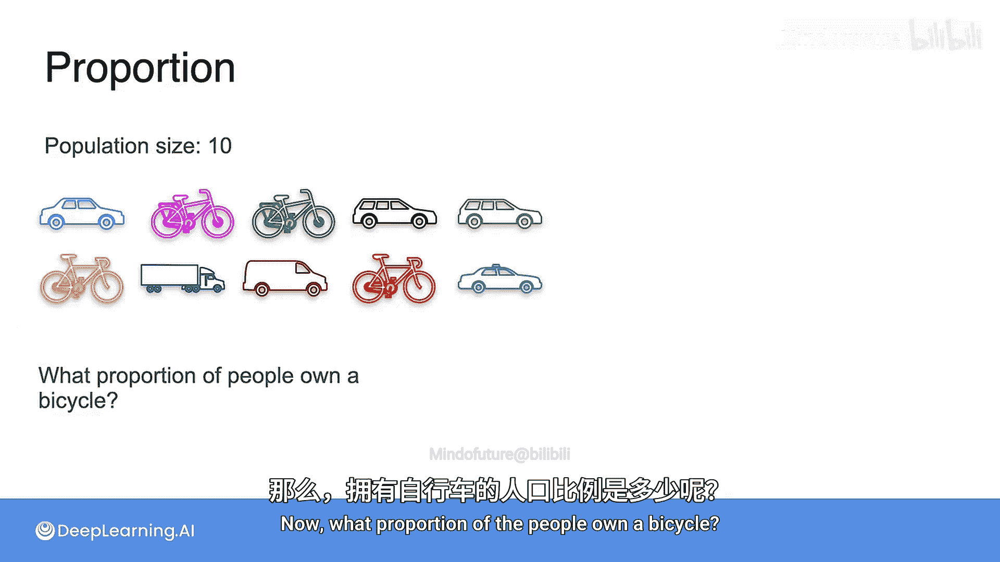
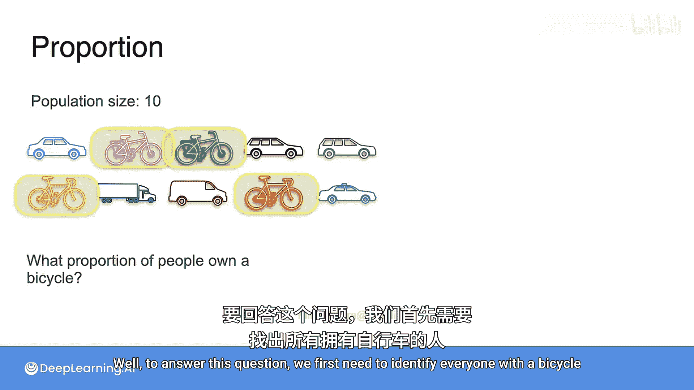
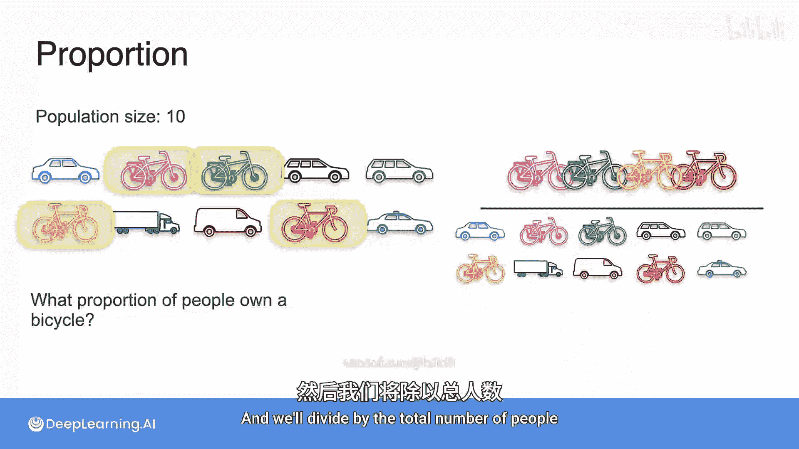
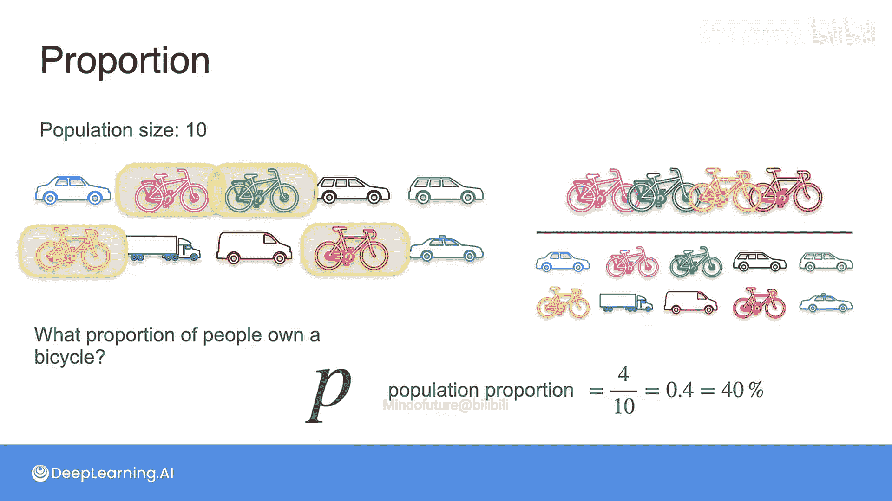
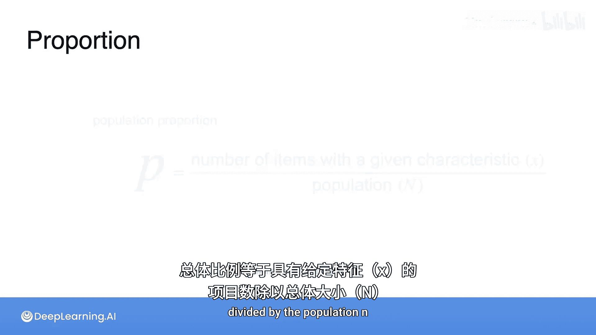
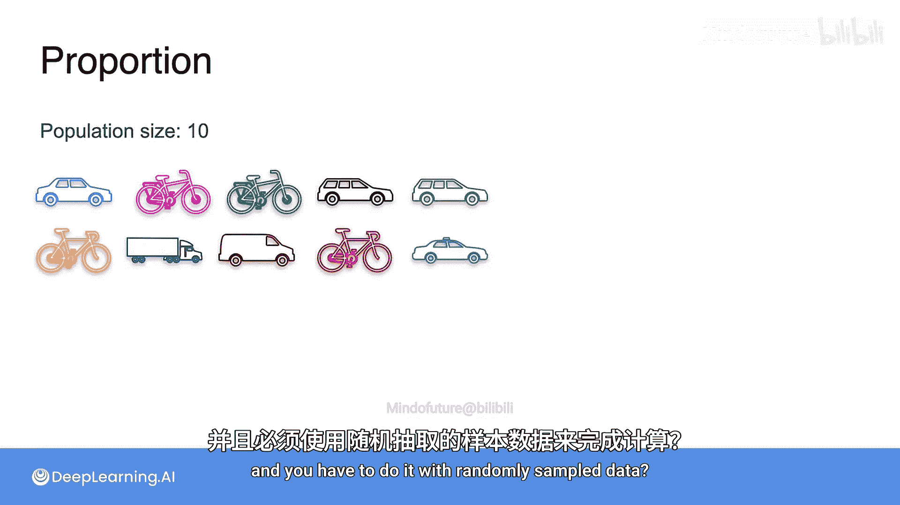
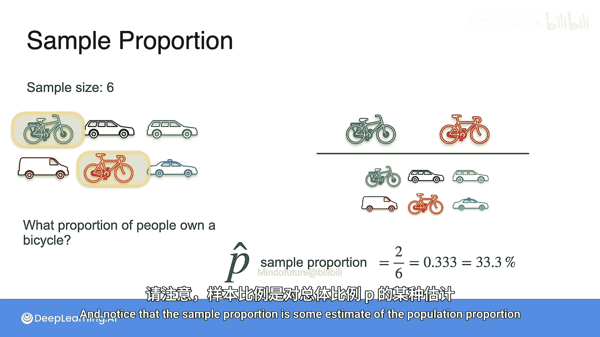
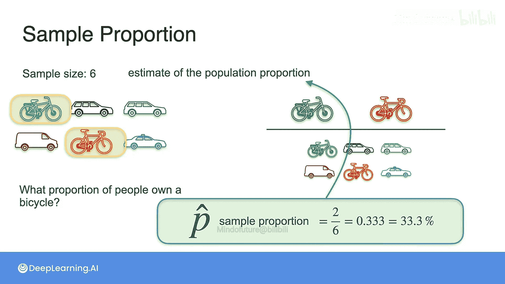

# 060：样本比例 📊

在本节课中，我们将要学习统计学中的一个核心概念：**样本比例**。我们将通过一个简单的例子，理解总体比例与样本比例的区别与联系，并学习如何用公式来描述它们。

---

为了便于说明，假设在“斯塔洛托皮亚”这个虚构的地方只居住着10个人。这意味着总体规模为10。现在，每个人都拥有某种交通工具，如图所示，要么是汽车，要么是自行车。那么，拥有自行车的人口比例是多少？

要回答这个问题，我们需要识别所有拥有自行车的人，图中已高亮显示，然后除以总人数。计算结果是 **4 / 10 = 40%**。这40%就是拥有自行车的**总体比例**。

当然，这里假设每个人恰好只拥有一种交通工具。这个指标被称为**总体比例**，记作 **P**。

总体比例的计算公式是：具有特定特征的个体数量 **x** 除以总体大小 **N**。

> **P = x / N**

---

上一节我们介绍了总体比例的概念。但在现实中，我们通常无法获取整个总体的数据。本节中我们来看看，当只能使用随机抽样数据时，情况会如何变化。

假设我们无法接触到这10个人的总体，而只能进行随机抽样。我们随机抽取了6个人作为样本。

现在，让我们计算这个样本中的比例：样本中拥有自行车的人的比例是多少？计算结果是 **2 / 6 ≈ 33.3%**。

这个指标被称为**样本比例**，记作 **P̂**（读作“P hat”）。需要注意的是，样本比例是总体比例 **P** 的一个**估计值**。

样本比例的计算公式与总体比例类似，但基于样本数据：

> **P̂ = x_sample / n**

其中，`x_sample` 是样本中具有特定特征的个体数量，`n` 是样本大小。

---

本节课中我们一起学习了总体比例与样本比例。我们了解到，总体比例 **P** 是基于整个总体的真实值，而样本比例 **P̂** 是基于一个随机样本对总体比例的估计。理解这两者的区别是进行统计推断的基础。