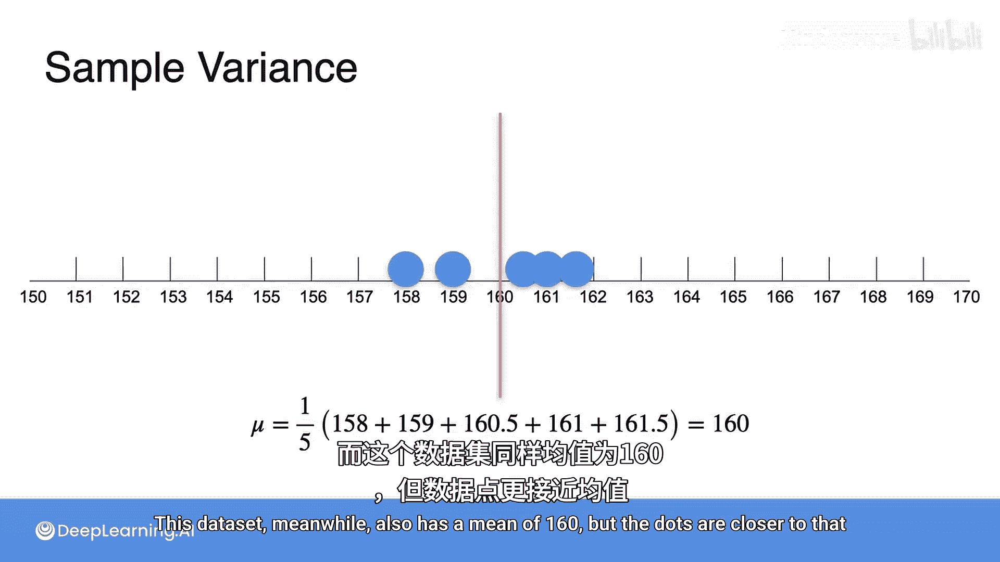
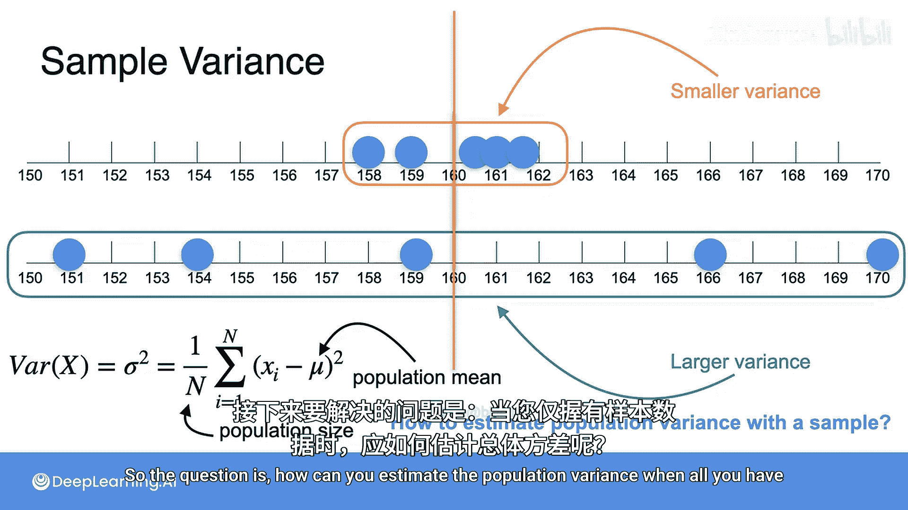
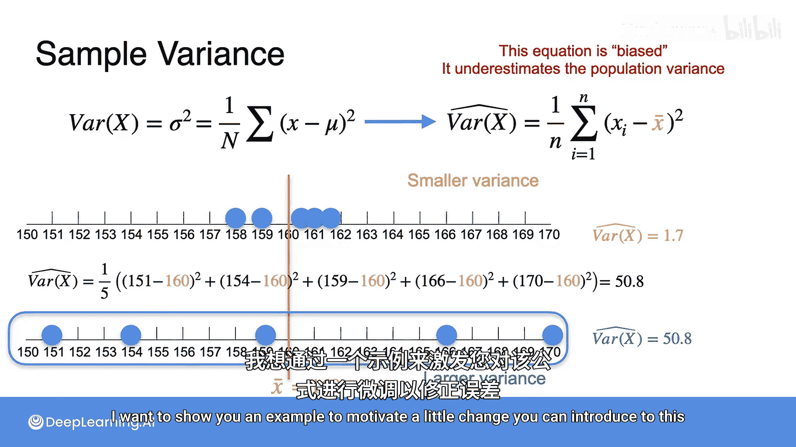
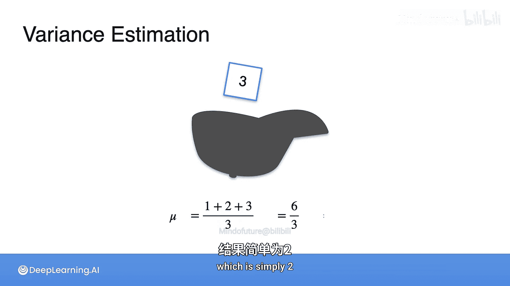
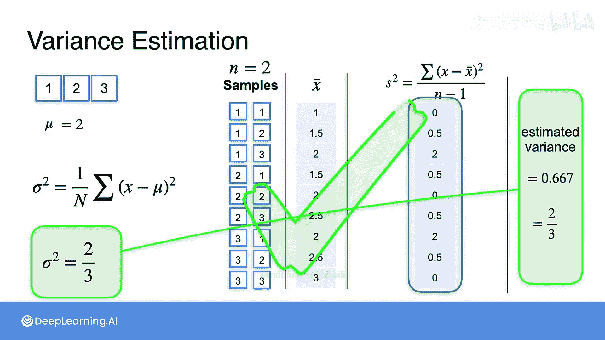
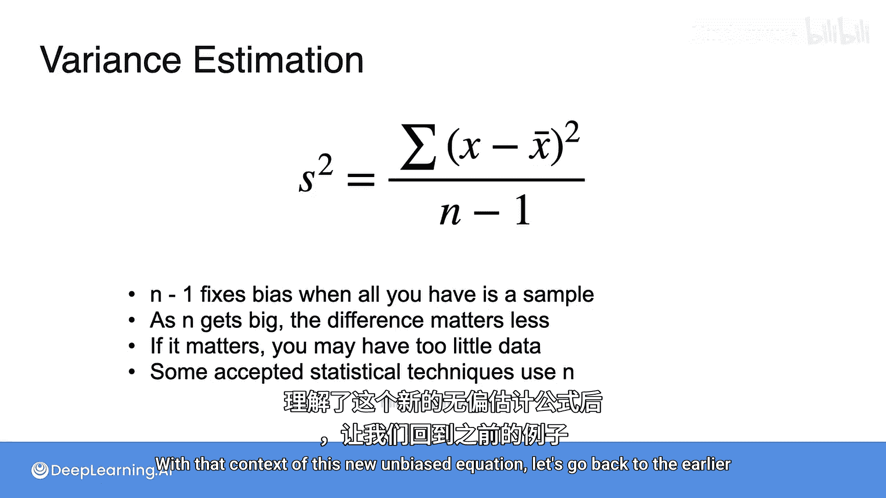
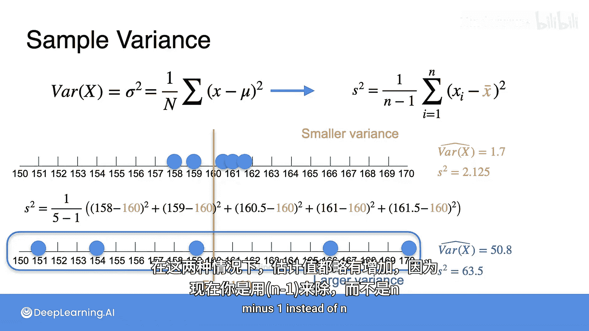
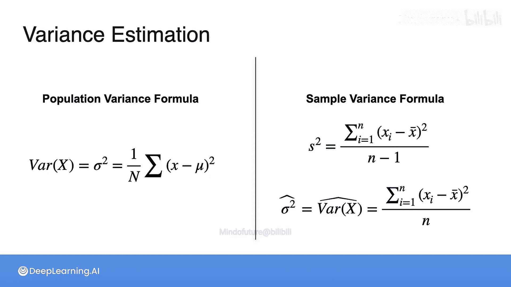

# 061：样本方差 📊

在本节课中，我们将学习方差的概念，以及如何仅通过样本数据来估计总体的方差。我们将从理解方差的定义开始，逐步推导出样本方差的常用计算公式，并解释公式中一个关键调整（`n-1`）的原因。

## 什么是方差？

在第二周的学习中，我们了解到方差是衡量数据离散程度的一个指标。它与数据点偏离其均值的距离有关。

例如，考虑一个包含五个人身高（厘米）的数据集，每个数据点用下图中的一个点表示。该数据集的均值为160，数据点离该均值相对较远。而另一个数据集，其均值同样为160，但数据点更接近均值。

让我们并排观察这两个数据集。上方数据集的方差相对较小，因为所有样本彼此接近。下方数据集的方差相对较大，因为数据点更加分散。

## 总体方差公式

现在，让我们回顾第二周学到的方差实际公式。方差写作 `Var(X)` 或 `σ²`，其定义为总体中每个值 `X` 与总体均值 `μ` 之差的平方的平均值，其中总体大小为 `N`。

**公式：**
`σ² = (1/N) * Σ (Xᵢ - μ)²`

这也可以称为“与均值的平均平方偏差”。

然而，在统计学中，你通常无法获取整个总体，而只能获得一个样本。换句话说，你不会有总体均值 `μ`，也不会有总体大小 `N`。

那么问题来了：当你只有样本时，如何估计总体方差？

## 从样本估计方差

让我们尝试仅使用目前学到的知识来推导方差的某种估计方法。记住，方差仍然是一种期望值，因此我们至少可以运用一些从样本均值中学到的技术。

创建一个新变量 `Y`，令其等于 `(X - μ)²`。这看起来有点随意，但可以将其视为由原始变量 `X` 构成的另一个随机变量。

现在，你可以复制 `X` 的方差表达式，并将其重写如下：

`σ² = (1/N) * Σ Yᵢ`

注意，这其实就是新变量 `Y` 的期望值或均值，也就是 `Y` 的总体均值。

既然你已经将这个表达式写成了总体均值的形式，就可以运用之前学到的方法来得到样本均值的表达式。具体来说，如果你有 `n` 个样本，只需对这些 `n` 个值取平均即可得到样本均值。

请注意，我同时使用了 `Y` 和 `y`。记住，`Y` 指代随机变量或总体，而 `y` 代表观测值或总体的个体元素。

现在，你可以将 `(X - μ)²` 代回，得到一个仅用 `X` 表示的样本方差表达式。

`σ̂² = (1/n) * Σ (xᵢ - μ)²`

我在 `σ` 上加了一个帽子 `̂` 来表示这是一个估计值。

这个表达式基本上只是将总体方差公式中的大 `N`（总体大小）替换成了小 `n`（样本大小）。但问题在于，这个表达式中仍然出现了总体均值 `μ`。可以合理推断，如果你不知道总体方差，很可能也不知道总体均值。所以目前，我将“作弊”——直接用样本均值 `x̄` 替换它。这个表达式只使用了样本中你能获取的值，并且直观上感觉它应该可行。

你认为这个“作弊”方法能行得通吗？让我们在刚才看到的例子上试试看。

## 应用示例

回想一下，两个数据集的样本均值都是160。

首先计算上方数据集的样本方差。你有5个点，所以先除以5。然后需要将每个点与样本均值（160）之差的平方相加，得到估计方差为1.7。

现在计算下一个数据集。在计算之前，请思考：如果上一个数据集的样本方差是1.7，那么这个数据集的样本方差会是多少？如果你猜大约50，那么你是正确的。你可以使用相同的公式直接计算，也可以通过观察数据点平均距离样本均值大约7个单位来估算，因此与样本均值的平均平方距离大约是49，非常接近真实值50.8。

通常你不需要这样手工计算方差，但对于小数据集进行计算有助于强化这些术语所代表的操作。

## 偏差与修正

还记得我之前说你可以直接在方程中使用样本均值吗？实际上，事实证明这会引入一些误差，并使这个方程变得有点“有偏”。在统计学中，这意味着这个公式会高估或低估其目标值。在本例中，这个方程会略微低估总体方差的真实值。

这并不意味着我们的第一个估计是错误的，但也许我们可以改进这个对方差的低估。

我想通过一个例子来展示如何对公式进行一个小小的修改以纠正这个误差。

## 一个游戏示例

考虑一个游戏：你有三张纸，上面分别写着数字1、2、3。你把它们放进一顶帽子，然后随机抽出一张，你获得的分数就是纸上写的数字。

如果你将这个游戏的结果视为一个随机变量，那么这里的总体均值 `μ = (1+2+3)/3 = 6/3 = 2`。

使用总体方差公式，让我们看看这个游戏的总体方差是多少。

首先，列出 `X` 的三个值：1, 2, 3。
接着，计算所有三个值的 `(X - μ)`，即 `X - 2`（因为总体均值是2）。得到值：-1, 0, 1。
最后，将这些值平方得到 `(X - μ)²`：1, 0, 1。
求和得到2。除以 `N`（3）得到 `2/3`。这就是你计算出的总体方差值。

现在假设你决定玩两次游戏，每次抽签后将纸片放回。结果是样本量 `n=2` 的样本。你将使用这些样本来估计方差。

以下是玩两次游戏所有可能的结果列表。以及你可以用来计算每个样本方差的方程。

然后你可以平均这些方差，看看它是否是总体方差（`2/3`）的一个良好估计。

首先，计算每个样本的均值，得到以下值。
现在我添加一列，使用提议的估计（除以 `n`）来计算方差。注意，在每个计算中，我使用的样本量 `n` 是2。
最后，平均所有这些样本方差，看看平均估计方差是多少。结果是0.333或 `1/3`。但你知道总体方差应该是 `2/3`，所以显然这里存在误差。

让我们退回到计算每个样本方差的步骤。现在，我不使用这个方差公式，而是调整分母，减去1，看看效果。

所以现在在方差计算中，我们不是除以 `n`，而是除以 `n-1`。让我们称这种估计方差的新方法为 `s²`，因为这是你在其他资料中最常见到的写法，并且它类似于 `σ`。

以下是使用这个新公式计算出的样本方差。现在取这些样本方差的平均值，你得到0.667或 `2/3`。当然，你知道这正是你目标中的总体方差值。

## 样本方差的标准公式

因此，以下是你最常看到的样本方差表达式，最大的挑战在于分母中的 `n-1`。

**公式：**
`s² = (1/(n-1)) * Σ (xᵢ - x̄)²`

我不会严格证明为什么使用 `n-1` 能修正之前展示的样本方差方程中的偏差，但只需知道这种方法通常是有效的。如果你希望你的样本方差是无偏的，你将除以 `n-1`。

也就是说，随着 `n` 变大，差异的影响会变小。如果你的样本量是3，除以3和除以2的差异很大。如果你的样本量是1000，那么除以1000和除以999的差异就不是很大。

事实上，从实践者的角度来看，如果使用 `n` 或 `n-1` 对你的估计方差有显著影响，那么要小心——你可能面临比决定除以 `n` 还是 `n-1` 更大的问题，因为这可能意味着你的样本量很小，应该谨慎做出强有力的结论。

最后，我想澄清一点，一些公认的统计技术使用分母为 `n` 的公式来估计方差，例如最大似然估计（你将在后续课程中看到）在技术上就是除以 `n`。

然而，除以 `n-1` 的 `s²` 估计是方差最常见的估计，也是你在本课程剩余部分以及实践中需要从样本估计总体方差时最常遇到的一个。

## 回顾示例

带着这个新的无偏方程的背景，让我们回到之前的例子，看看情况有多大变化。

现在，将 `1/n` 替换为 `1/(n-1)` 以得到 `s²` 估计。

看第一个数据集，现在你的估计从1.7变成了2.125。对于第二个数据，你的样本方差估计从50.8上升到了63.5。在这两种情况下，估计值都略有增加，因为你现在除以的是 `n-1` 而不是 `n`。

## 总结 📝

本节课中我们一起学习了方差的概念及其估计方法。

*   **总体方差**：如果你能获取整个总体，那么方差可以通过计算每个值与总体均值之差的平方的平均值来求得。公式为：`σ² = (1/N) * Σ (Xᵢ - μ)²`。
*   **样本方差**：如果你只能获取部分数据点或一个样本，那么你最常使用的是 `s²` 方差估计。在这个估计中，你计算样本中每个值与样本均值之差的平方的平均值，但不是除以样本大小 `n`，而是除以 `n-1`。公式为：`s² = (1/(n-1)) * Σ (xᵢ - x̄)²`。
*   **修正偏差**：除以 `n-1` 是为了修正因使用样本均值代替总体均值而引入的偏差。随着样本量增大，这种修正的影响变小。
*   **其他估计**：在某些特定上下文中，你可能会看到分母使用 `n` 的估计（记为 `σ̂²`）。虽然这个估计量存在小的偏差，但它仍然是方差的一个相当好的估计，并且是一些常见统计技术的一部分。

总而言之，`s²` 估计器将是本课程以及实践中当你需要从样本估计总体方差时最常见的方法。