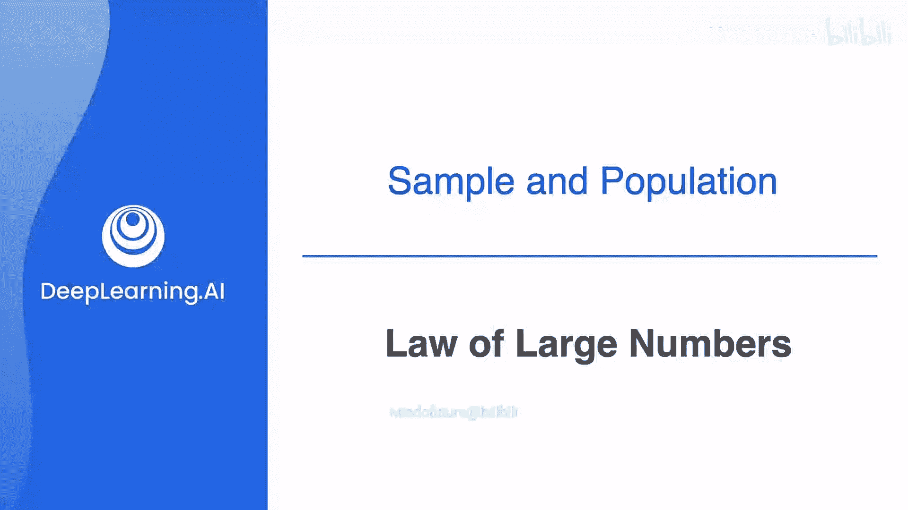
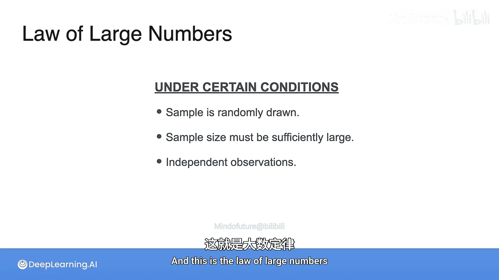

**深度学习：概率与统计：3.1：大数定律**

在本节课中，我们将学习统计学中的一个核心概念——大数定律。我们将通过一个简单的例子来理解它的含义，并了解其成立的条件。

---

### 概述：什么是大数定律？

假设我们想了解全球人口的平均身高。最直接的方法是测量所有人，但这不现实。一个更实际的方法是：先测量一个人，得到一个估计值；然后测量两个人，取平均身高，得到一个稍好的估计；接着测量十个人、一百个人……随着测量人数（样本量）的增加，我们对总体平均身高的估计会越来越准确。这种现象不仅适用于平均值，也适用于其他统计量，其背后的原理就是**大数定律**。

### 从掷骰子实验理解大数定律

让我们用一个更具体的例子来阐明这个概念。考虑一个公平的四面色子，其可能的结果是1、2、3、4，其总体均值（期望值）为2.5。

现在，我们进行一个实验：掷两次骰子，并记录两次结果的平均值。所有可能的骰子对及其平均值如下表所示：

| 第一次 | 第二次 | 平均值 |
| :----: | :----: | :----: |
|   1    |   1    |   1    |
|   1    |   2    |   1.5  |
|   1    |   3    |   2    |
|   1    |   4    |   2.5  |
|   2    |   1    |   1.5  |
|   2    |   2    |   2    |
|   2    |   3    |   2.5  |
|   2    |   4    |   3    |
|   3    |   1    |   2    |
|   3    |   2    |   2.5  |
|   3    |   3    |   3    |
|   3    |   4    |   3.5  |
|   4    |   1    |   2.5  |
|   4    |   2    |   3    |
|   4    |   3    |   3.5  |
|   4    |   4    |   4    |

所有这些可能平均值的均值，就是总体均值 2.5。

接下来，我们从这个“所有可能结果”的总体中，逐步抽取样本并计算样本均值。

1.  抽取第一个样本（例如，4和3），其样本均值 `x̄₁ = 3.5`。我们将其标记在图上，它距离总体均值2.5较远。
2.  抽取前两个样本（例如，再增加3和4），计算这两个样本的均值 `x̄₂`。
3.  抽取前三个样本，计算均值 `x̄₃` 并标记。
4.  继续此过程，抽取四个、五个……样本，并依次计算累计样本均值。

观察下图可以发现，随着抽取的样本数量 `n` 增加，样本均值 `x̄ₙ` 越来越接近总体均值 2.5。例如，当抽取了九个样本时，样本均值已达到 2.56，已经非常接近 2.5。

这个实验直观地演示了**大数定律**：随着样本容量增大，样本的平均值会趋向于接近总体的平均值。

### 大数定律的数学表述与核心条件

上一节我们通过实验观察到了现象，现在我们来正式定义它。

设 `n` 为样本数量，每个 `Xᵢ` 都是一个随机变量，代表从总体中抽取的一个样本。这些样本必须满足以下条件：
*   **独立同分布**：所有 `Xᵢ` 必须相互独立，并且服从与总体随机变量 `X` 相同的分布。

那么，大数定律指出，当 `n` 趋向于无穷大时，样本均值将收敛于总体均值（期望值）。

用公式表示如下：

**当 n → ∞ 时， (1/n) Σᵢ₌₁ⁿ Xᵢ → E[X] = μ**

其中，`E[X]` 或 `μ` 代表总体均值。

为了使大数定律成立，需要满足以下几个核心条件：

以下是必须满足的关键条件：
1.  **随机抽样**：样本必须从总体中随机抽取。
2.  **足够大的样本量**：样本容量需要足够大。样本量越大，样本均值接近总体均值的可能性就越高，估计也越精确。
3.  **观测值独立**：样本中的每个观测值必须相互独立，即一个观测结果不影响另一个。

### 总结

本节课中，我们一起学习了**大数定律**。我们通过估计平均身高和掷骰子的例子，理解了其核心思想：**当从总体中随机、独立地抽取足够多的样本时，样本的平均值将非常接近总体的真实平均值**。这是统计学和机器学习中许多推断方法的基石，它保证了当我们拥有大量数据时，能够对总体做出可靠的估计。

