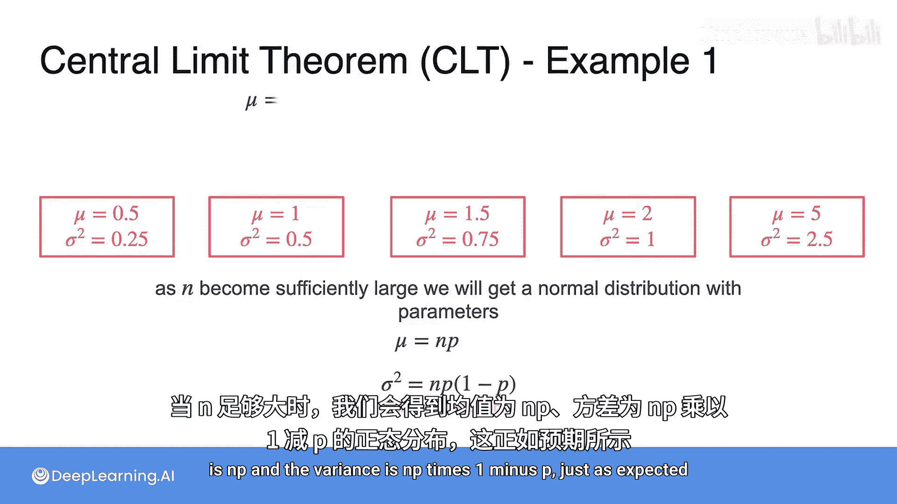

# 063：中心极限定理与离散随机变量 📊

在本节课中，我们将要学习一个统计学中极为重要的概念——**中心极限定理**。我们将通过一个具体的离散随机变量例子（抛硬币）来直观地理解这一定理，并观察当试验次数增加时，其概率分布如何神奇地趋近于正态分布。

## 无处不在的正态分布

上一节我们介绍了正态分布的基本形态。正态分布之所以重要，是因为它出现在许多意想不到的场景中。这里有一个你可能未曾预料到的现象：**无论你从何种分布开始**，即使它非常偏斜，只要你**重复抽取固定数量的样本并计算其平均值**，然后将这些平均值绘制出来，你最终得到的分布形状都会是**正态分布**。

这个引人入胜的结论是统计学的巅峰成果之一，被称为**中心极限定理**。

## 一个离散随机变量的例子

为了理解中心极限定理，让我们从一个熟悉的离散随机变量例子开始：**抛硬币**。

假设一枚硬币正面和反面出现的概率相同。我们定义随机变量 **X** 为抛掷 **n** 次硬币后，出现正面的次数。

*   当只抛一次硬币时（n=1），X 的可能取值为 1（正面）或 0（反面）。这是一个离散随机变量，其概率分布为：P(X=1) = 0.5，P(X=0) = 0.5。我们可以用横轴表示正面次数，纵轴表示概率来绘制这个分布。

那么，当抛硬币的次数 **n** 增加时，这个概率分布会如何变化呢？

以下是随着抛掷次数增加，正面次数 X 的概率分布变化：

*   **两次抛掷 (n=2)**：分布开始呈现形状。
*   **三次抛掷 (n=3)**：分布形状更加明显。
*   **四次抛掷 (n=4)**：分布进一步平滑。
*   **十次抛掷 (n=10)**：此时，分布已经非常接近**高斯分布（即正态分布）**的钟形曲线。

观察这个过程，我们可以发现：**统计 n 次抛硬币中的正面次数，等价于将 n 个独立的伯努利随机变量相加**，其中每个变量在出现正面时取值为1，出现反面时取值为0。

这正是**中心极限定理**的一个例证。该定理指出，随着你求和的随机变量数量增加，这个**和的分布**会越来越像**高斯分布（正态分布）**。

## 分布的均值与方差

现在，让我们回顾一下这个抛硬币模型的参数。当我们抛掷 n 次硬币，每次正面的概率为 p 时：

*   均值 **μ** 的计算公式为：`μ = n * p`
*   方差 **σ²** 的计算公式为：`σ² = n * p * (1 - p)`

对于我们的公平硬币例子，p = 0.5。我们可以计算之前各个例子中的均值和方差：

以下是不同抛掷次数下的均值和方差：
*   n=1：均值 = 0.5， 方差 = 0.25
*   n=2：均值 = 1.0， 方差 = 0.5
*   n=3：均值 = 1.5， 方差 = 0.75
*   n=4：均值 = 2.0， 方差 = 1.0
*   n=10：均值 = 5.0， 方差 = 2.5

## 中心极限定理的核心结论

当 n 足够大时，我们最终会得到一个正态分布。这个正态分布的均值就是 `n * p`，方差就是 `n * p * (1 - p)`。这与我们计算出的结果完全一致。

## 总结

本节课中，我们一起学习了**中心极限定理**。我们通过“抛硬币计数正面”这个具体的离散随机变量实验，直观地观察到：即使初始分布是简单的二项分布，随着独立试验次数 n 的增加，其**和的分布（即正面次数的分布）** 会越来越逼近一个**正态分布**。这个正态分布的参数（均值和方差）可以由原始分布的参数直接推导得出（`μ = np`, `σ² = np(1-p)`）。中心极限定理揭示了正态分布在统计学中的普遍性，是许多统计推断方法的基石。