# 064：中心极限定理与连续随机变量 📊

在本节课中，我们将学习中心极限定理在连续随机变量场景下的应用。我们将通过一个具体的例子——技术支持热线的等待时间——来观察样本均值的分布如何随着样本量的增加而变化，并最终趋近于正态分布。

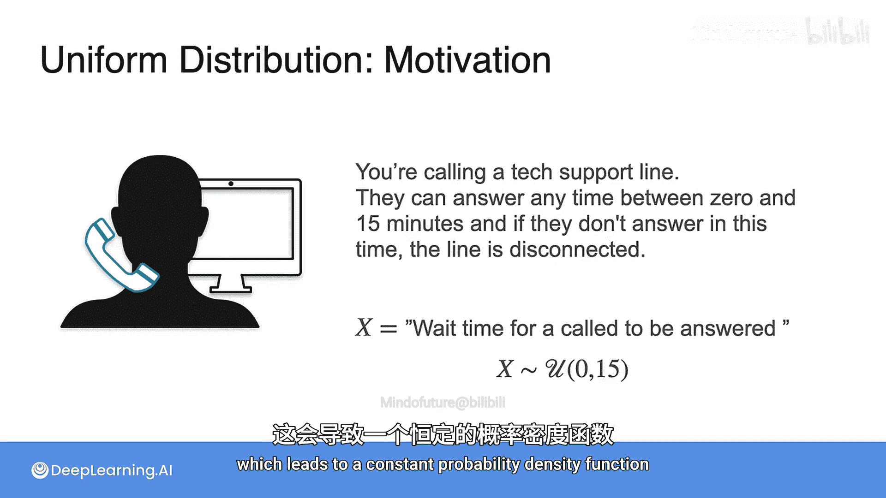

上一节我们介绍了中心极限定理的基本概念，本节中我们来看看它在连续随机变量上的具体表现。

## 实验设定：技术支持热线等待时间

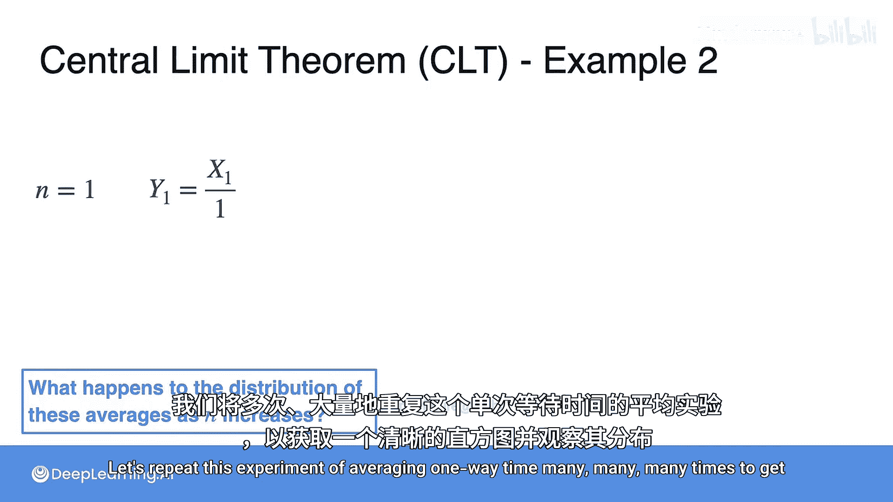

让我们回到第一周第2课中的技术支持热线例子。当你拨打电话后，客服人员可能在0到15分钟内的任意时间接听，超过15分钟则通话自动断开。

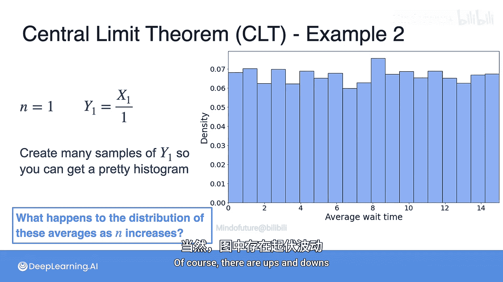

我们可以定义一个随机变量 **X**，它代表等待接听的时间。在第一周的示例中，该变量服从参数为0和15的**均匀分布**。均匀分布模拟的是任何相同长度的区间发生概率相同的情况，这导致其概率密度函数是一个常数。

其概率密度函数为：
```
f(x) = 1/(15-0) = 1/15, 当 0 ≤ x ≤ 15
```

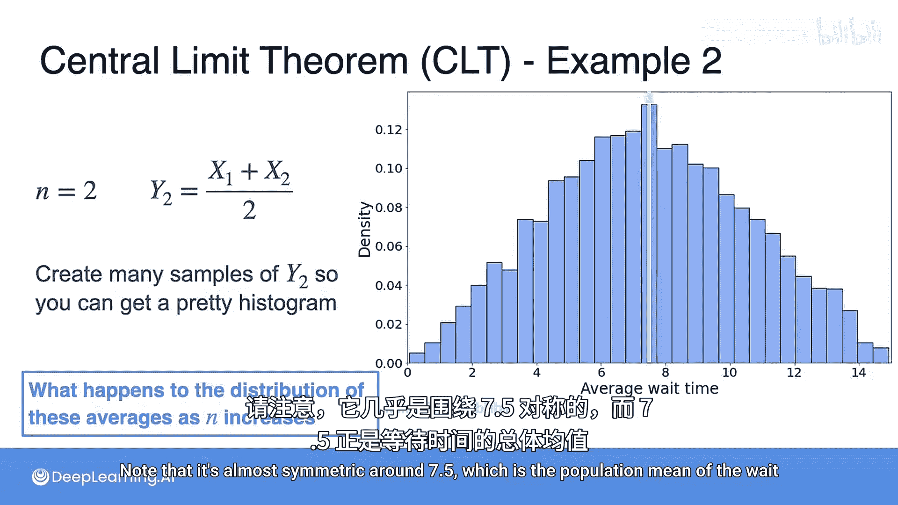

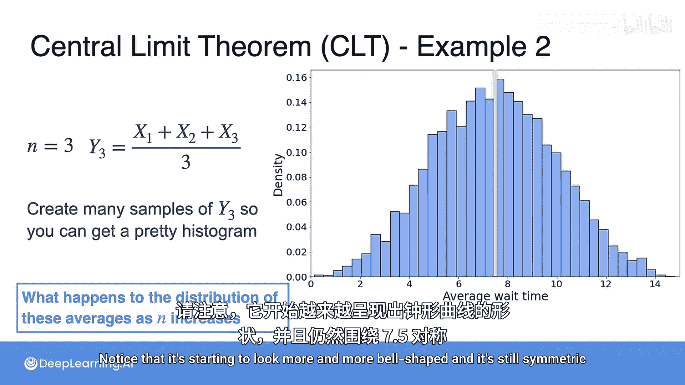

现在，我们关心的是平均等待时间。为了估算它，我们将对不同数量的通话等待时间取平均值。

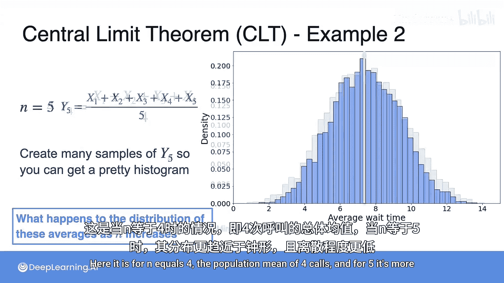

## 观察样本均值的分布

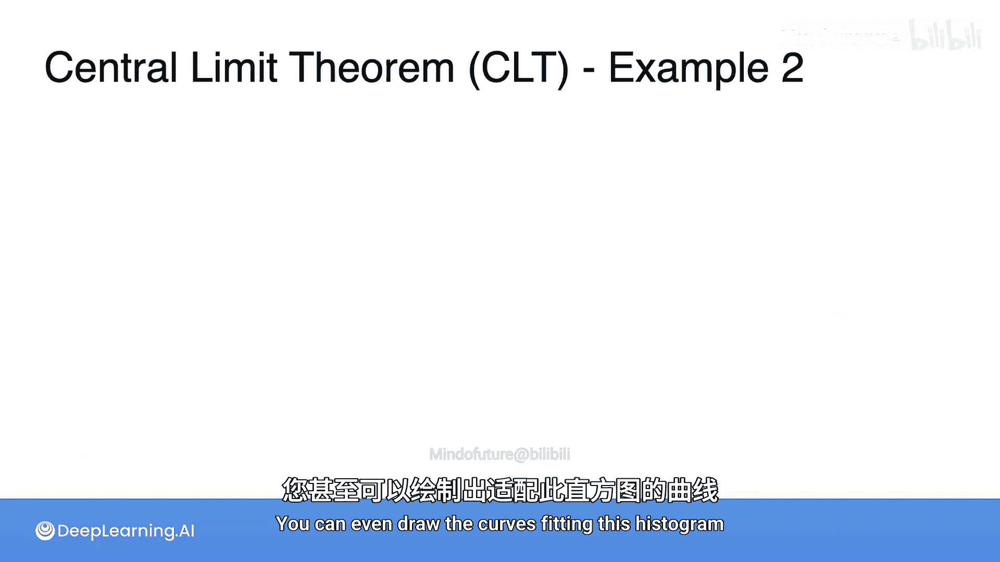

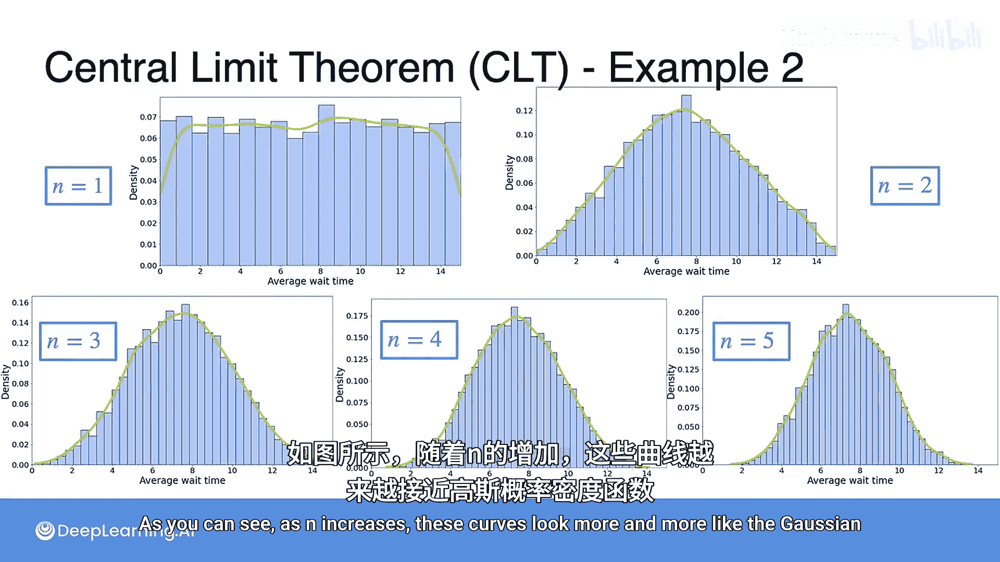

以下是实验的核心步骤：我们记录n通电话的等待时间，并定义变量 **Yn** 为这n次等待时间的平均值。我们将观察 **Yn** 的分布如何随n变化。

*   **n = 1**：此时我们只对一次等待时间取平均（即该次等待时间本身）。将这个实验重复很多次，得到直方图。其分布看起来像一个均匀分布，因为每个Y1的样本都来自均匀分布。
*   **n = 2**：对两次等待时间取平均，重复实验多次。此时的分布密度看起来像一个三角形，并且几乎围绕总体均值7.5对称。
*   **n = 3**：对三次等待时间取平均。分布开始变得更像钟形，仍然围绕7.5对称。
*   **n = 4 和 n = 5**：随着n增大，分布越来越接近钟形（正态分布），并且离散程度（方差）越来越低。

我们可以绘制核密度估计曲线（绿色）来拟合直方图。随着n增加，这些曲线看起来越来越像高斯概率密度函数。

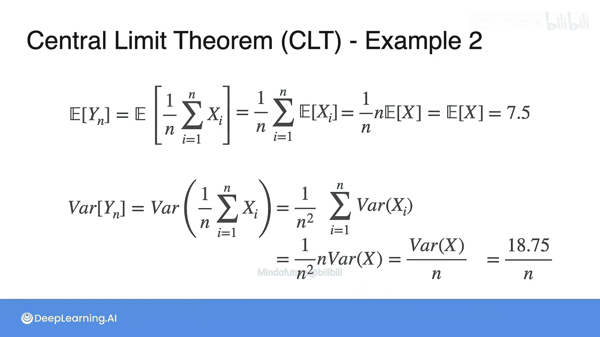

## 计算 Yn 的均值与方差

我们也可以从理论上计算 **Yn** 的均值和方差。

*   **均值**：根据期望的线性性质，**Yn** 的均值等于 **X** 的总体均值。对于参数为0和15的均匀分布，这个值是 **7.5**。
    ```
    E[Yn] = E[X] = 7.5
    ```
*   **方差**：由于样本独立，**Yn** 的方差等于 **X** 的总体方差除以样本量 **n**。对于参数为0和15的均匀分布，方差是18.75。
    ```
    Var(Yn) = Var(X) / n = 18.75 / n
    ```

这个结果非常有趣：均值保持不变，但方差随着n增大而减小。这很合理，因为取的变量越多，平均值就越可能接近总体均值，因此离散程度和方差就越小。**这个结果与原始总体的分布无关**。

## 中心极限定理的正式表述

现在，让我们给出中心极限定理的正式定义。

中心极限定理指出，当 **n** 趋近于无穷大时，标准化后的样本均值将服从**标准正态分布**。
```
(Yn - μ) / (σ/√n)  ~ N(0, 1)  当 n → ∞
```
其中，μ 是总体均值，σ 是总体标准差。

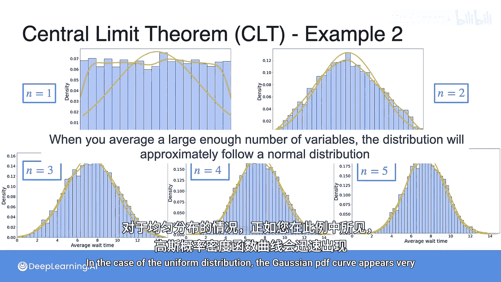

在实践中，当 **n 大约为30或更大**时，这通常就成立。有时即使样本量更小（如本例所示）也能观察到。中心极限定理也可以用**和**的形式来表述，通过提取公因子并重新排列项，可以得到等价的表达式。

## 标准化与实用要点

可视化这一现象最常见的方式是进行**标准化**。因为均值始终是总体均值，但方差依赖于n。标准化后，更容易比较不同n值时 **Yn** 的分布。标准化也带来了一个好处：即使我们不知道总体均值和方差的确切值，我们也知道随着n增大，样本均值将近似服从正态分布（尽管参数未知）。

需要强调的是，虽然在本例中，平均三四个样本就开始呈现正态分布，但这并非普遍情况。一个安全的经验法则是通常需要大约30个变量，钟形分布才会显现。这完全取决于数据的原始分布。如果原始总体非常偏斜，通常比处理对称分布时需要更多的样本。

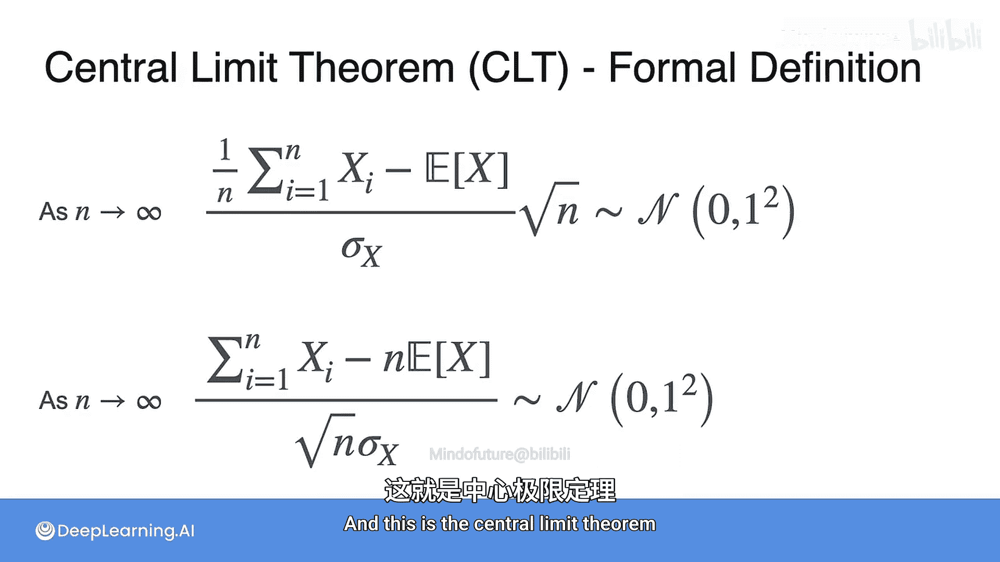

## 总结与后续

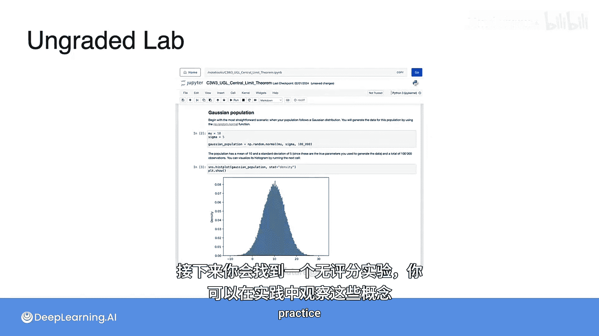

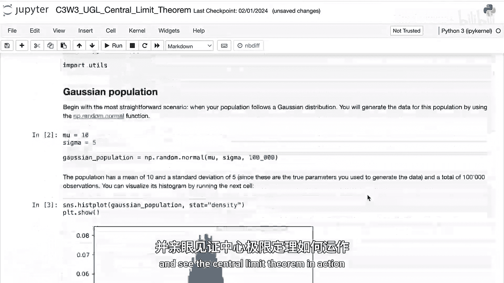

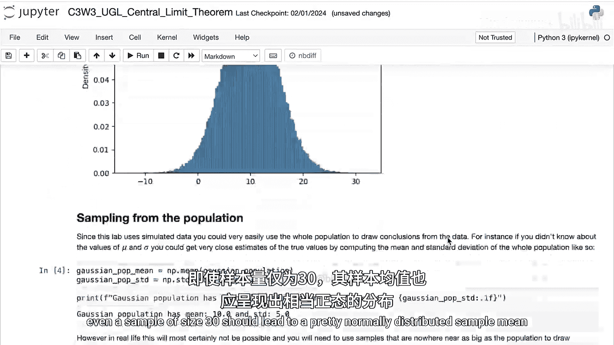

本节课中我们一起学习了中心极限定理在连续随机变量中的应用。我们通过一个均匀分布的例子，观察到无论原始总体分布如何，随着样本量n的增加，样本均值的分布会趋近于正态分布。我们推导了样本均值的期望和方差公式，并给出了中心极限定理的正式表述。

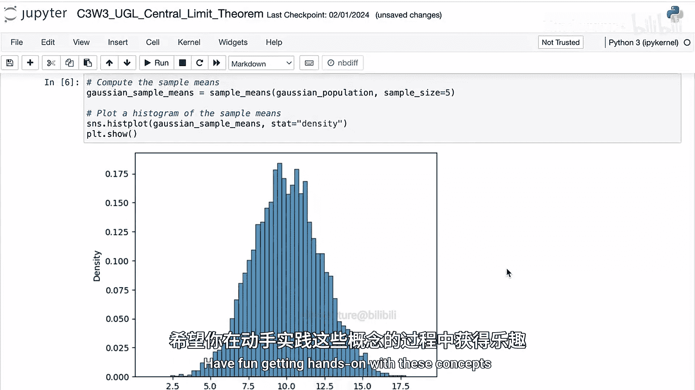

接下来，你将在未评分的实验课中通过Python实践这些概念，从多种不同的分布中抽样，亲眼见证中心极限定理的作用。对于大多数表现良好的分布，即使是大小为30的样本也能得到相当正态分布的样本均值。如果你的数据表现不佳，则可能需要更大的样本量才能使样本均值近似正态分布，但中心极限定理依然适用，只是生效需要更长的时间。