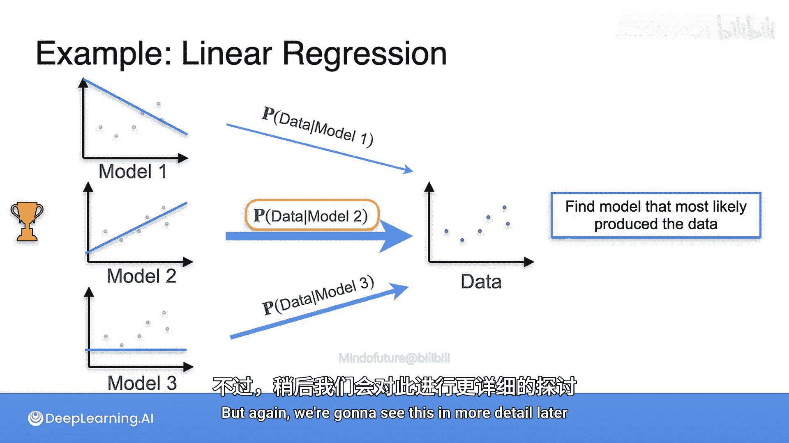

# 066：最大似然估计动机

在本节课中，我们将学习最大似然估计（MLE）。MLE在机器学习中广泛用于训练模型，但其背后的概念其实非常简单。

想象一下，你观察到了一些证据，并希望找出最可能导致该证据发生的情景。你的做法是，在所有可能的情景中，选择那个使证据出现概率最高的情景。

## 一个直观的例子

让我们通过一个例子来理解这个概念。

假设你走进一个客厅，看到沙发旁边的地板上散落着一堆爆米花。

现在的问题是：以下哪个事件更可能发生过？
1.  人们在看电影。
2.  人们在玩桌游。
3.  有人在打盹。

你认为哪个最可能发生呢？

我们需要分析哪个情景最可能导致地板上出现爆米花。

*   看电影时，地板上出现爆米花的**概率很高**。
*   玩桌游时，地板上出现爆米花的**概率中等**。
*   打盹时，地板上出现爆米花的**概率很低**，因为打盹通常不会产生爆米花。

因此，我们会选择那个使“地板上出现爆米花”这一证据**概率最高**的情景，即“人们在看电影”。我们推断，最可能发生的事情就是人们在看电影。

## 最大似然估计的核心思想

我们刚才所做的，就是最大化**条件概率**。我们比较了：
*   给定“看电影”时出现爆米花的概率（高）。
*   给定“玩桌游”时出现爆米花的概率（中）。
*   给定“打盹”时出现爆米花的概率（低）。

我们找到了最高的条件概率。换句话说，我们找到了最可能导致地板上出现爆米花的情景。这就是**最大似然估计**：我们选择了使证据最可能发生的那个情景。

## 最大似然估计在机器学习中的应用

这正是机器学习中经常使用的方法。很多时候，你有一堆数据，以及多个可能生成这些数据的模型。

以下是典型的步骤：
1.  你估计在给定**模型1** 的情况下，观察到当前数据的概率。
2.  你估计在给定**模型2** 的情况下，观察到当前数据的概率。
3.  你估计在给定**模型3** 的情况下，观察到当前数据的概率。

然后，你选择那个使当前数据出现**概率最高**的模型，即最可能产生当前数据的模型。

用公式表示，我们是在最大化：
**P(数据 | 模型)**

## 与线性回归的联系

上一节我们介绍了最大似然估计的基本思想，本节中我们来看看它如何与线性回归联系起来。我们将在后续课程中深入细节，但这里先给出一个概览。

想象你有一些数据点，以及三条可能的拟合直线（模型）。

假设我们有一种方法，可以根据一条直线来生成数据点，并且生成的点会聚集在这条直线附近。

那么，对于每条直线（模型），都存在一个概率，表示当前这些数据点是由该模型生成的。我们选择那个使当前数据点出现**概率最高**的模型。我们将在后续课程中更详细地探讨这一点。

## 总结

本节课中，我们一起学习了最大似然估计的动机和核心思想。最大似然估计是一种选择最可能产生观测数据的模型或情景的方法。其核心是计算并比较**P(证据 | 情景)** 或 **P(数据 | 模型)** 的条件概率，并选择概率值最大的那个。这种方法在机器学习模型训练中有着基础而重要的应用。