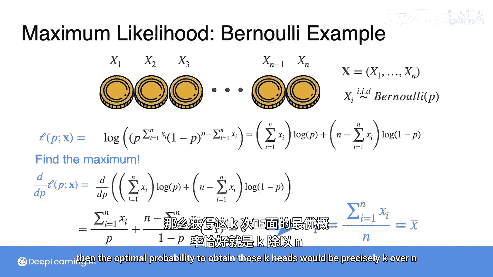

# 067：最大似然估计伯努利示例

在本节课中，我们将通过一个具体的抛硬币例子，学习最大似然估计的核心思想。我们将看到如何从观测到的数据出发，找到最有可能生成这些数据的模型参数。

---

## 回到抛硬币的例子

假设你抛一枚硬币10次，观察到8次正面和2次反面。

现在，你有三枚可能的硬币，它们可能被用来得到这个结果：
*   硬币1：正面概率为0.7。
*   硬币2：公平硬币，正反面概率均为0.5。
*   硬币3：正面概率为0.3。

那么，你认为哪一枚硬币最有可能被用来进行这10次抛掷？或者说，如果你想再次生成这10次抛掷结果，你会选择哪一枚硬币？

让我们计算一下每枚硬币产生“8正2反”这个结果的概率。

对于硬币1，概率是 `0.7^8 * 0.3^2`，计算结果约为 **0.0051**。这个概率值不大。

对于硬币2，概率是 `0.5^10`，计算结果为 **0.0010**。这个值更小。

对于硬币3，概率是 `0.3^8 * 0.7^2`，计算结果约为 **0.00003**。这个值非常小。

实际上，最大的概率值是硬币1对应的 **0.0051**。因此我们得出结论：如果必须从这三枚硬币中选一枚，我们最可能选择硬币1，因为它最有可能生成我们观测到的数据。

我们刚才所做的就是最大似然估计。我们想生成“8正2反”的结果，有三种可能的硬币（参数分别为0.7、0.5、0.3）可以生成数据。哪一枚硬币最有可能产生“8正2反”呢？就是那个使得条件概率 `P(8正2反 | 硬币)` 最大的硬币，也就是硬币1。

---

## 寻找更好的硬币

但是，我们能找到比这三枚硬币更好的选择吗？是否存在一枚更合适的硬币？

假设我们选择一枚正面概率为 `p`、反面概率为 `1-p` 的硬币。那么，这枚硬币生成“8正2反”的概率是多少呢？概率是 `p^8 * (1-p)^2`，这是一个关于 `p` 的函数。

我们想要找到那个能使我们看到“8正2反”这个数据可能性最大的 `p` 值。这个可能性就是**似然**。似然是基于模型（一枚概率为 `p` 的硬币）看到这些数据的概率。

注意，这是一个关于 `p` 的函数，我们需要最大化它。这是一个我们在微积分课上学过的优化问题。通常，我们不直接处理多个小数的乘积，而是采用一个标准技巧：取对数。对数可以将乘积转化为求和。

于是，乘积 `p^8 * (1-p)^2` 的对数（即**对数似然**）变为：
`8 * log(p) + 2 * log(1-p)`

我们通常不直接最大化似然，而是最大化对数似然。最大化其中一个等价于最大化另一个，而对数似然通常是一个更“友好”的函数。

当我们对对数似然函数关于 `p` 求导时，得到：
`d/dp [log-likelihood] = 8/p - 2/(1-p)`

令导数等于0以寻找最优值：
`8/p - 2/(1-p) = 0`

解这个方程，得到最优的 `p` 值（记为 `p_hat`）：
`p_hat = 8/10 = 0.8`

因此，实际上，最有可能生成这些抛掷结果的硬币，其正面概率应为 **8/10 或 80%**。这很合理，因为数据中正好有80%是正面。

---

## 推广到一般情况

现在，让我们进行一些数学推导，看看一般情况。

假设你抛了 `n` 次硬币，观察到 `k` 次正面。每次抛掷都是一个参数为 `p` 的伯努利变量，即正面概率为 `p`。

似然函数由以下公式给出：
`L(p) = ∏ (p^{x_i} * (1-p)^{1-x_i})`，其中 `x_i` 是第 `i` 次抛掷的结果（1代表正面，0代表反面）。

这个乘积可以分解为：
`L(p) = p^k * (1-p)^{n-k}`

对数似然函数是它的对数：
`log L(p) = k * log(p) + (n-k) * log(1-p)`

为了最大化这个表达式，我们对其关于 `p` 求导并令其等于0：
`d/dp [log L(p)] = k/p - (n-k)/(1-p) = 0`

解这个方程，得到最优的 `p` 值（`p_hat`）：
`p_hat = k / n`

**结论是：最优的概率估计值 `p_hat` 恰好是观测数据中正面的比例，也就是样本均值。**

换句话说，如果我们在一系列伯努利试验中观察到 `k` 次成功（正面），那么最大似然估计给出的成功概率就是 `k/n`。

---

## 总结

本节课中，我们一起学习了最大似然估计在伯努利分布中的应用。我们从一个具体的抛硬币例子出发，比较了不同参数硬币生成数据的可能性，并学会了通过最大化（对数）似然函数来找到最优的参数估计 `p_hat`。最终我们推导出，对于伯努利试验，成功概率的最大似然估计就是观测到的成功频率 `k/n`。这个方法直观地体现了“让模型最大程度地拟合观测数据”的核心思想。