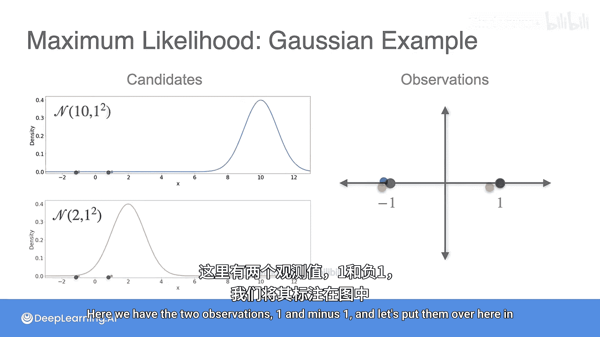
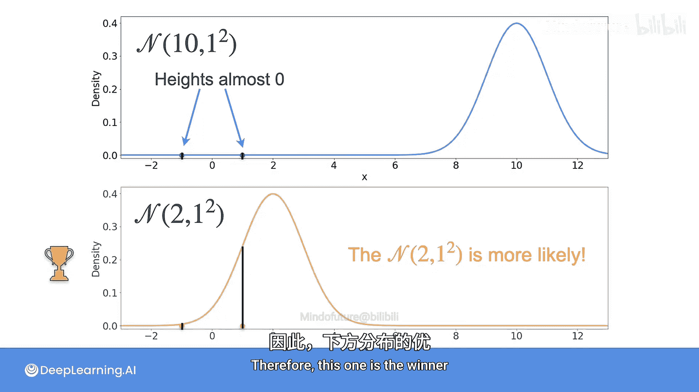
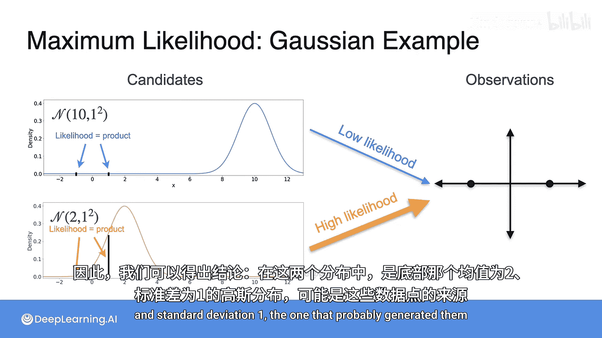
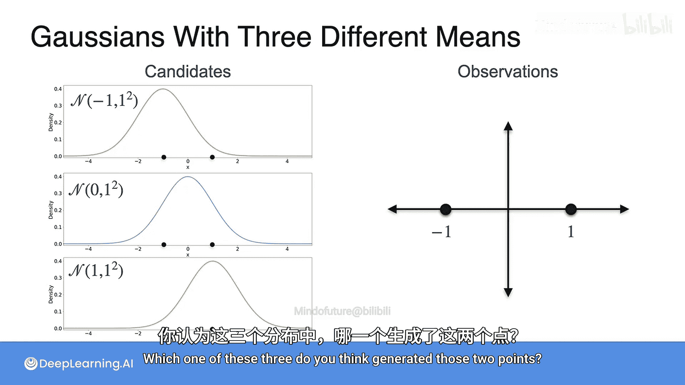
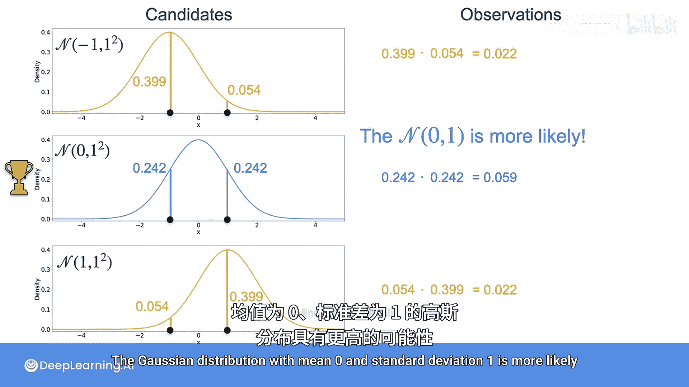
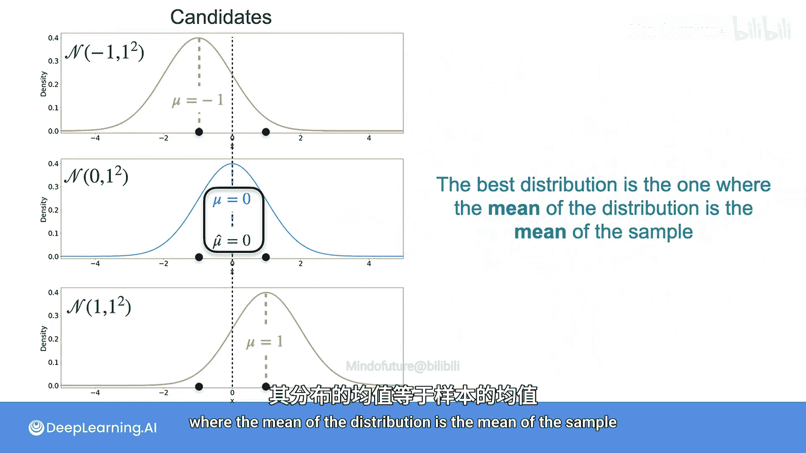
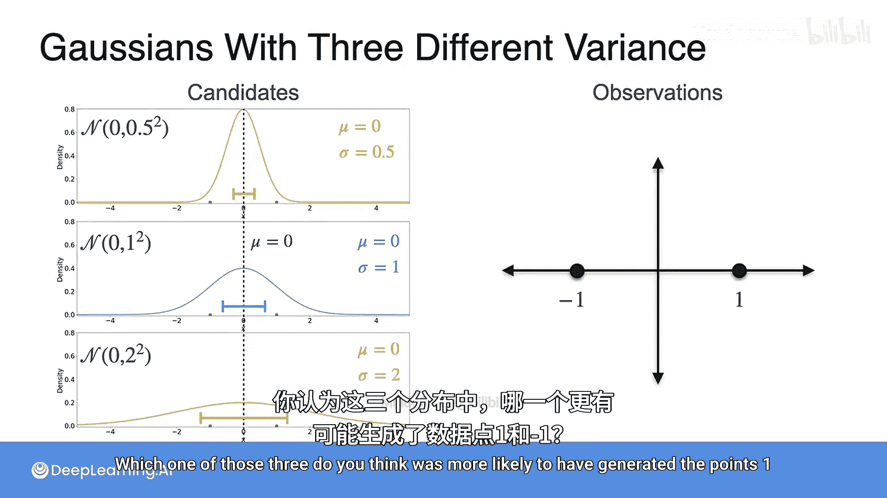
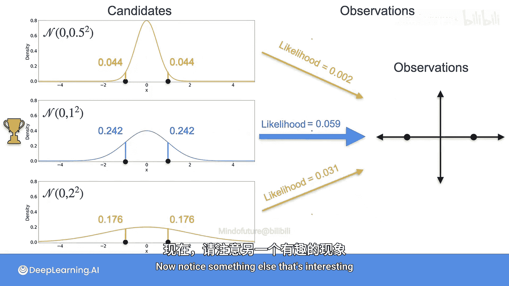
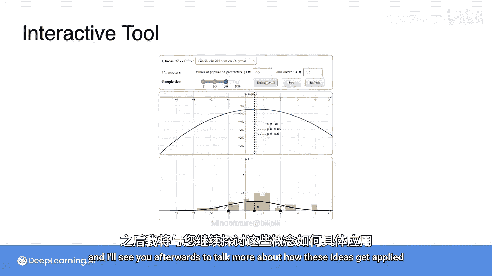

# 068：最大似然估计高斯分布示例

在本节课中，我们将通过具体的例子，学习如何使用最大似然估计方法，从几个候选的高斯分布中，选出最可能生成给定观测数据的那个分布。

## 从两个候选分布中选择

上一节我们介绍了最大似然估计的基本思想，本节中我们来看看如何将其应用于具体的高斯分布选择问题。

假设我们有两个观测数据：`1` 和 `-1`。这些数据是从某个未知分布中采样得到的。现在，我们有两个候选的高斯分布：
1.  均值为 `10`，标准差为 `1` 的正态分布。
2.  均值为 `2`，标准差为 `1` 的正态分布。

问题是：哪一个分布更可能生成了这些观测数据？

以下是分析过程：
*   我们将数据点 `1` 和 `-1` 标注在分布图上。
*   每个数据点对应分布曲线上的“高度”，这个高度代表了该数据点在该分布下的**似然**值。
*   观察发现，底部曲线（均值为2）在两个数据点处的似然值都更高。
*   因此，在两个候选分布中，**均值为2、标准差为1的高斯分布**是胜出者，因为它生成给定数据的似然更高。

## 从三个候选分布中选择

现在，让我们增加候选分布的数量，看看如何选择。

我们考虑三个高斯分布，它们的标准差都是 `1`，但均值不同：
1.  均值 `mu = -1`
2.  均值 `mu = 0`
3.  均值 `mu = 1`

以下是这三个分布的图像：

我们的任务依然是判断哪个分布最可能生成了数据 `1` 和 `-1`。

以下是分析步骤：
*   计算每个数据点在每个分布下的似然值（即曲线高度）。
*   由于数据点是独立生成的，整体数据的似然是每个数据点似然的乘积。
*   计算每个候选分布的似然乘积。

具体数值如下：
*   对于均值 `-1` 的分布：似然值为 `0.399` 和 `0.054`，乘积为 `0.022`。
*   对于均值 `0` 的分布：似然值均为 `0.242`，乘积为 `0.059`。
*   对于均值 `1` 的分布：似然值为 `0.054` 和 `0.399`，乘积为 `0.022`。

比较乘积大小，**均值 `mu = 0`、标准差 `sigma = 1` 的分布**的似然乘积最高 (`0.059`)，因此它是最可能的分布。

这里有一个重要的观察：**胜出分布的均值 (`0`) 恰好等于样本数据的均值**。样本均值的计算公式为：
`样本均值 = (数据点之和) / (数据点数量)`
对于数据 `[1, -1]`，其均值为 `(1 + (-1)) / 2 = 0`。

## 固定均值，比较不同标准差

基于上一节的发现，我们知道了最佳分布的均值应与样本均值一致。现在，我们固定均值为 `0`，来考察标准差的影响。

我们比较三个均值均为 `0`，但标准差不同的高斯分布：
1.  标准差 `sigma = 0.5`
2.  标准差 `sigma = 1`
3.  标准差 `sigma = 2`

它们的分布形状如下：

问题依然是：哪一个最可能生成了数据 `1` 和 `-1`？

我们重复之前的分析：
*   计算每个数据点在每个分布下的似然值。
*   计算每个分布的似然乘积。

具体数值如下：
*   对于 `sigma = 0.5` 的分布：似然值为 `0.044` 和 `0.044`，乘积为 `0.0019`。
*   对于 `sigma = 1` 的分布：似然值均为 `0.242`，乘积为 `0.059`。
*   对于 `sigma = 2` 的分布：似然值为 `0.176` 和 `0.176`，乘积为 `0.031`。

比较乘积大小，**标准差 `sigma = 1` 的分布**的似然乘积最高 (`0.059`)，再次胜出。

这里另一个有趣的发现是：**胜出分布的标准差的平方（即方差 `sigma^2 = 1`）恰好等于样本方差**。样本方差的计算公式为：
`样本方差 = (各数据点与均值之差的平方和) / (数据点数量)`
对于数据 `[1, -1]`，其方差为 `((1-0)^2 + (-1-0)^2) / 2 = 1`。

## 后续学习与工具

通过以上示例，我们直观地理解了最大似然估计如何工作。为了深化理解：

1.  **数学推导**：后续阅读材料将深入讲解最大似然估计的数学推导过程。
2.  **交互工具**：你将可以使用一个交互式工具，通过模拟从二项分布或正态分布中采样，并观察最大似然估计如何用于估计总体参数。

请尽情探索这个工具，之后我们将继续讨论如何应用这些思想。

## 总结

本节课中我们一起学习了最大似然估计在高斯分布选择中的应用。通过具体示例，我们了解到：
*   最大似然估计的核心是选择能使观测数据出现**似然**最大的模型参数。
*   对于高斯分布，**最大似然估计给出的最优均值参数等于样本均值**。
*   对于高斯分布，**最大似然估计给出的最优方差参数等于样本方差**。
*   比较不同分布时，通过计算并比较生成数据的整体似然（通常取乘积或对数求和）来进行选择。