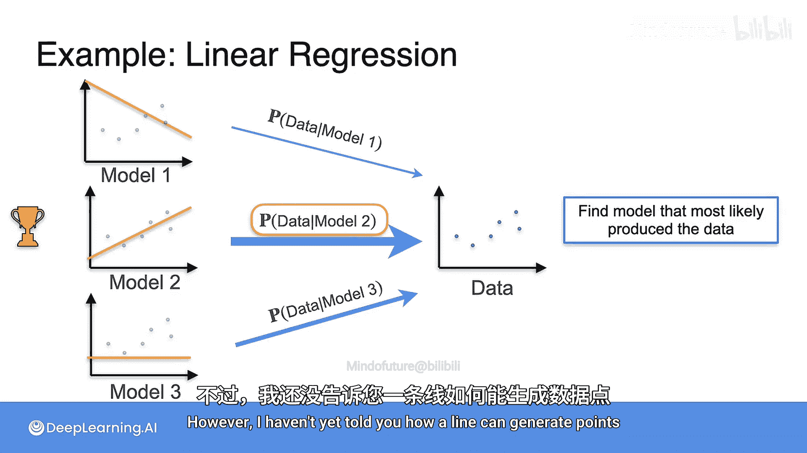
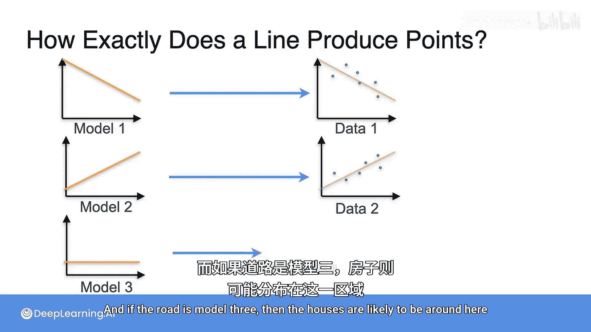
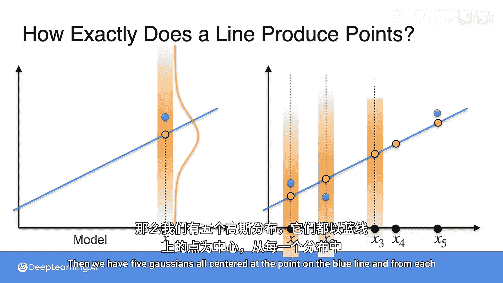
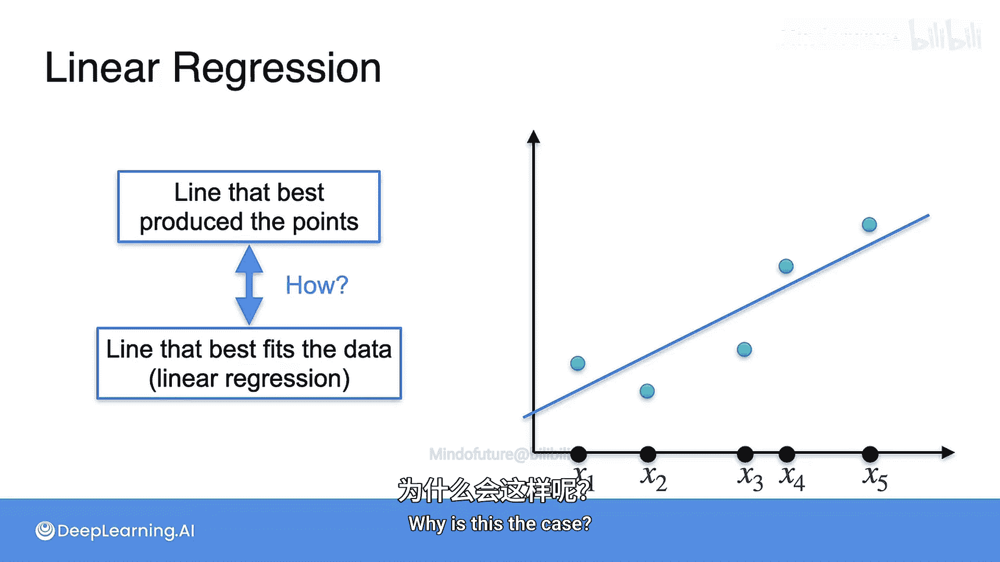
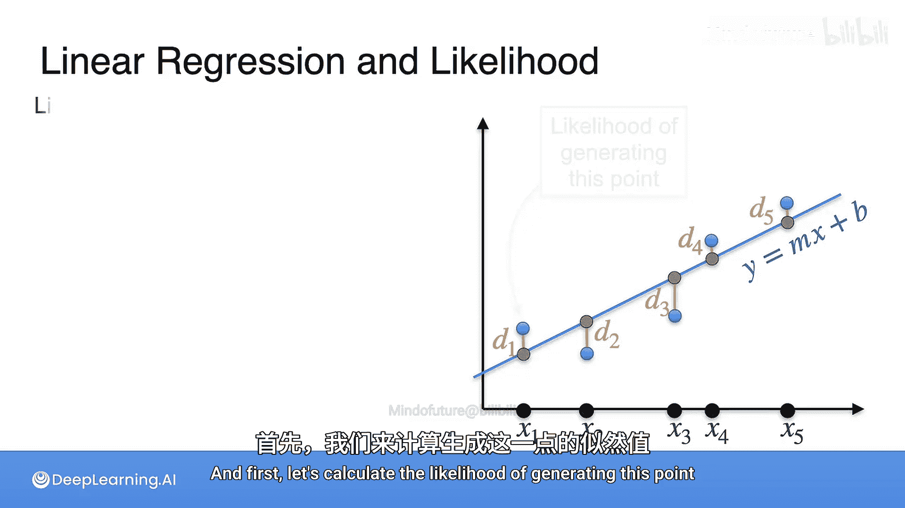
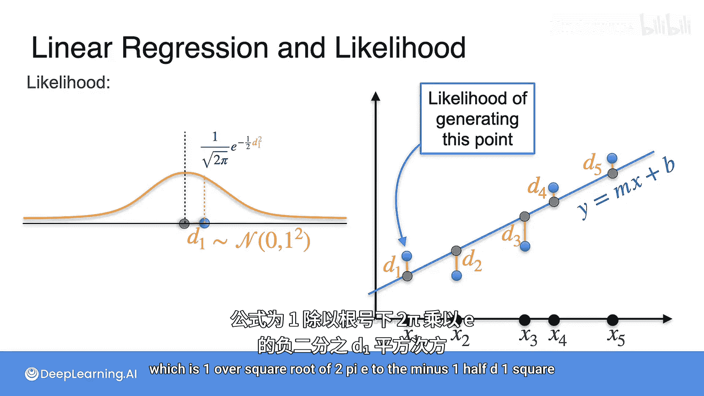
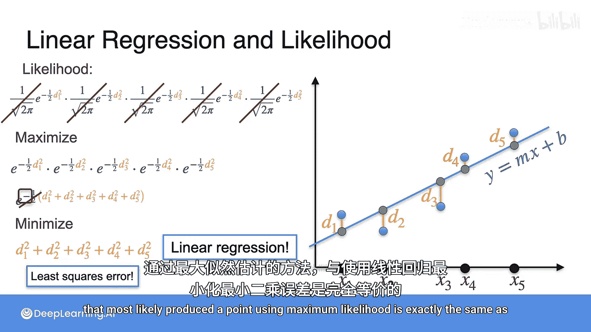
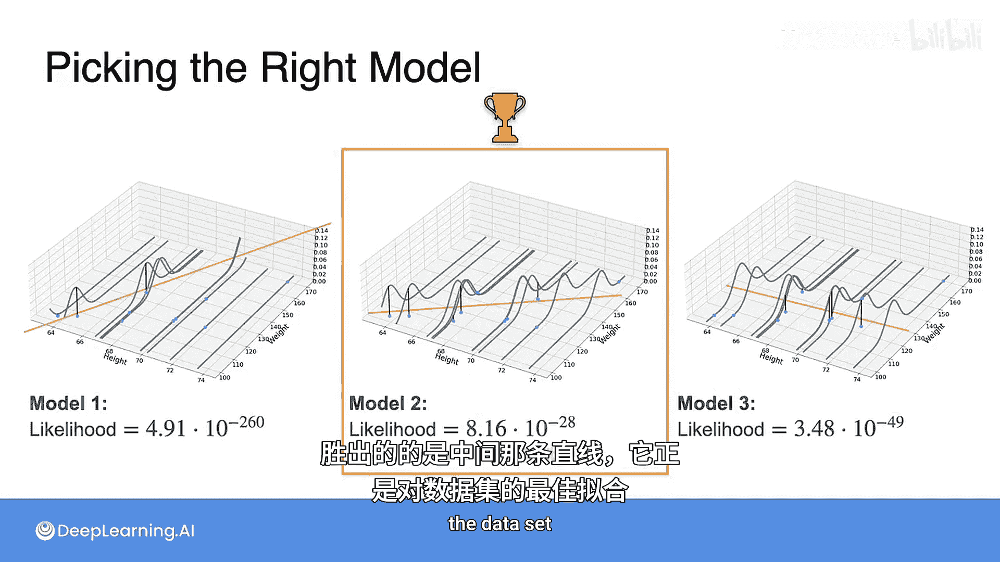

# 069：最大似然估计在线性回归中的应用 📈

在本节课中，我们将要学习最大似然估计（MLE）如何应用于机器学习，特别是如何用它来理解线性回归。我们将看到，寻找一条最可能“生成”观测数据的直线，在数学上等价于寻找一条最小化平方误差的直线。

---

## 最大似然估计在机器学习中的应用

上一节我们介绍了最大似然估计的基本思想。本节中我们来看看它在机器学习中的一个具体应用场景。

在机器学习中，使用最大似然估计的一种方式如下：
1.  你有一批数据。
2.  有一些可能“生成”这些数据的模型。
3.  对于每一个模型，你计算在该模型下观测到这批数据的概率。
4.  给出最高概率的模型就是“获胜者”。

这意味着你找到了最可能产生这批数据的模型。获胜的模型就是那个最大化 **P(数据 | 模型)** 的模型。

---

## 线性回归的似然视角

现在，让我们通过一个线性回归的小例子来具体理解这个过程。

假设这些是你的数据点，你试图用一条直线去拟合它们。但我们不直接“拟合”，而是尝试用概率的视角来看待。

以下是候选模型：
*   **模型1**：这条直线。
*   **模型2**：这条直线。
*   **模型3**：这条直线。

首先，直观上哪条线看起来拟合得最好？拟合得最好的那条线，将给出观测到这些数据的最高概率。第一条线以某个概率生成数据，第二条线以更高的概率生成，第三条线以一个中等概率生成。获胜的将是第二条线。

然而，我还没有解释一条直线如何“生成”数据点。接下来我将说明这一点。

---

## 直线如何“生成”数据点

其核心思想是：这些直线在自身附近生成数据点。

想象这条直线是一条路。如果这条黄色的线是路（模型2），那么房子（数据点）很可能建在路附近，而不是远离它。如果路是模型3，那么房子很可能建在另一片区域。

让我们用数字来描述。假设这是你的模型（蓝色直线），这是一个点 `x`，直线在该 `x` 值处的对应点是 `y_pred`。

我们使用一个高斯分布（正态分布）来生成靠近直线的点。我们将这个高斯分布的中心设在直线与垂直线的交点处（即 `y_pred`），然后从这个分布中采样。采样得到的点（如 `y_actual`）就是“生成”的数据点。这就像在路附近建造房子，房子的位置是从那个垂直方向的高斯分布中采样得到的。

如果我们有一系列点 `x1` 到 `x5`，那么我们就有了五个高斯分布，每个都以其在蓝色直线上的对应点为中心。我们从每一个高斯分布中采样一个点，这五个点就是基于这条蓝色直线“生成”的数据。

现在，我们要做的就是找到那条最可能产生这些观测点的直线。巧合的是，这恰好与线性回归中寻找最佳拟合直线的目标一致。

---

## 从最大似然到最小二乘

为什么两者等价？让我们做一些数学推导。

假设直线方程为：
`y = mx + b`

这些是直线与各 `x` 值的交点（预测值 `y_pred_i`）。这些是观测到的数据点（实际值 `y_actual_i`）。它们之间的垂直距离我们称为 `d1, d2, d3, d4, d5`。

首先，计算生成第一个数据点的似然。由于我们使用高斯分布，假设其标准差为1，均值为0（即中心在预测点），那么生成这个实际点的似然由高斯分布的概率密度函数给出：
`L1 = (1 / sqrt(2π)) * exp(-1/2 * d1²)`

这就是生成第一个点的似然。我们需要考虑所有点，因此总的似然是五个点各自似然的乘积。我们需要最大化这条直线生成所有这些点的总似然。由于各点生成是独立的，我们考察乘积。

其中一些项是常数，例如 `1/sqrt(2π)`，我们可以忽略它们，专注于最大化指数部分。

我们可以将乘积写成：
`L_total ∝ exp(-1/2 * Σ(d_i²))`

注意，最大化某个函数等价于最大化它的对数。因此我们可以取对数，并去掉指数 `exp` 和常数 `-1/2`（乘以-2等价于最小化）。但请记住，指数项前面有一个负号。

这意味着，**最大化总似然等价于最小化距离的平方和**。

而最小化平方和正是**最小二乘误差**。这正是线性回归所做的：在线性回归中，你想要找到那条最小化数据点到直线垂直距离平方和的蓝色直线。

因此，这证明了使用最大似然估计寻找最可能生成数据点的直线，在数学上完全等同于使用线性回归最小化最小二乘误差。

---

## 示例对比

以下是三条不同直线及其在每个数据点处生成的高斯分布的示例。

正如你所见，当我们为实际的蓝色数据点计算似然时，获胜的是中间那条线。我们也可以直观地看出，它确实是数据集中拟合得最好的直线。

---

## 总结

本节课中我们一起学习了：
1.  最大似然估计在机器学习中用于选择最可能生成观测数据的模型。
2.  在线性回归问题中，可以将直线视为一个“生成模型”，它在自身附近（通过高斯分布）生成数据点。
3.  通过数学推导，我们发现**最大化该生成模型下数据的似然，等价于最小化预测值与实际值之间的平方误差和**。
4.  因此，线性回归的最小二乘法可以从概率论的最大似然估计框架中得到自然解释。这为线性回归提供了一个坚实的概率基础。