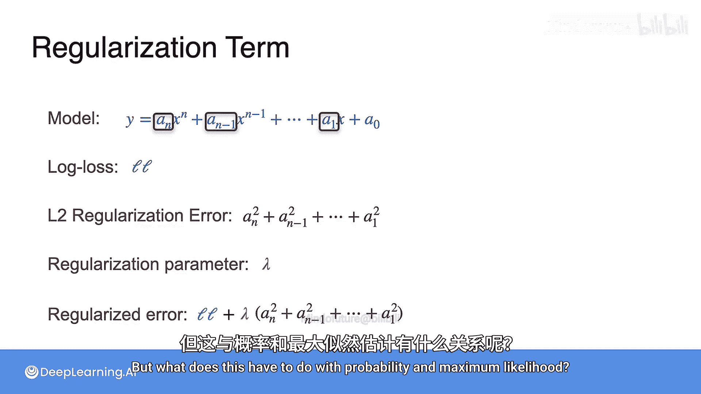

# 070：正则化

在本节课中，我们将学习机器学习中的一个重要概念——**正则化**。我们将了解它如何帮助我们在多个可能的模型中，选择出既拟合数据又不过于复杂的模型，从而提升模型的泛化能力。

## 概述

想象我们有一个数据集，并且有三个可能的模型可以拟合这些数据。第一个是线性模型，第二个是二次多项式模型，第三个是十次多项式模型。为了找出哪个模型最可能生成了这些数据，我们通常会看它们的损失，例如平方误差。然而，损失最小的模型（如十次多项式）可能过于复杂，导致“过拟合”。正则化通过给模型复杂度施加“惩罚”来解决这个问题，引导我们选择更简单、泛化能力更强的模型。

## 模型选择与损失

以下是三个候选模型及其假设的损失值：
*   **模型1（线性）**：损失为 10。
*   **模型2（二次）**：损失为 2。
*   **模型3（十次多项式）**：损失为 0.1。

仅从损失来看，模型3似乎是最佳选择，因为它对现有数据的拟合近乎完美。但直觉告诉我们，模型2可能更接近数据的真实规律，因为它更平滑，不易受到数据中噪声的过度影响。

## 引入正则化惩罚

为了解决这个问题，我们引入**正则化**。其核心思想是：**对模型复杂度施加惩罚**。模型越复杂，惩罚越大。这样，一个模型的总“成本”就变成了原始损失加上这个惩罚项。

我们使用一种称为 **L2正则化** 的方法。其惩罚项定义为模型方程中**所有非常数项系数的平方和**。

让我们为之前的模型计算L2惩罚项。假设它们的方程是：
*   **模型1**：`y = 4x + 3`。惩罚项为 `4² = 16`。
*   **模型2**：`y = 2x² - 4x + 5`。惩罚项为 `2² + (-4)² = 4 + 16 = 20`。
*   **模型3**：`y = ...`（十次多项式）。假设其非常数项系数的平方和为 `26060`。

## 计算正则化后的总损失

现在，我们计算每个模型的正则化总损失，即 **原始损失 + L2惩罚项**：
*   **模型1**：`10 + 16 = 26`
*   **模型2**：`2 + 20 = 22`
*   **模型3**：`0.1 + 26060 = 26060.1`

经过正则化处理后，**模型2** 的总损失（22）最小，成为了最佳选择。我们通过惩罚复杂的模型，成功地选择了更简单、更可能反映数据真实趋势的模型。

## 正则化的通用公式

上一节我们通过一个具体例子理解了正则化的作用，现在来看看它的通用数学表达。

对于一个模型，设其原始损失函数为 `L`（例如对数损失）。L2正则化误差 `R` 定义为：

**`R = Σ (w_i)²`**

其中，`w_i` 是模型中**所有非常数项（即特征对应的权重）的系数**。

最终，我们用于模型训练和选择的**正则化误差** `E_reg` 为：

**`E_reg = L + λ * R`**

这里引入了一个新参数 **`λ`**（lambda），称为**正则化参数**。它控制着惩罚项的强度：
*   当 `λ = 0` 时，我们完全忽略正则化，退回到原始损失函数。
*   当 `λ` 很大时，我们强烈惩罚大系数，迫使模型变得非常简单。

通过调整 `λ`，我们可以在模型复杂度和拟合度之间取得平衡。

## 总结

本节课中，我们一起学习了**正则化**的核心思想。我们了解到，仅仅追求训练数据上的低损失可能导致“过拟合”。正则化通过向损失函数中添加一个与模型复杂度（系数大小）相关的惩罚项（如L2惩罚），来鼓励模型选择更简单的解。这通常能提高模型在未见数据上的表现，即**泛化能力**。正则化参数 `λ` 让我们可以灵活地控制这种惩罚的强度。