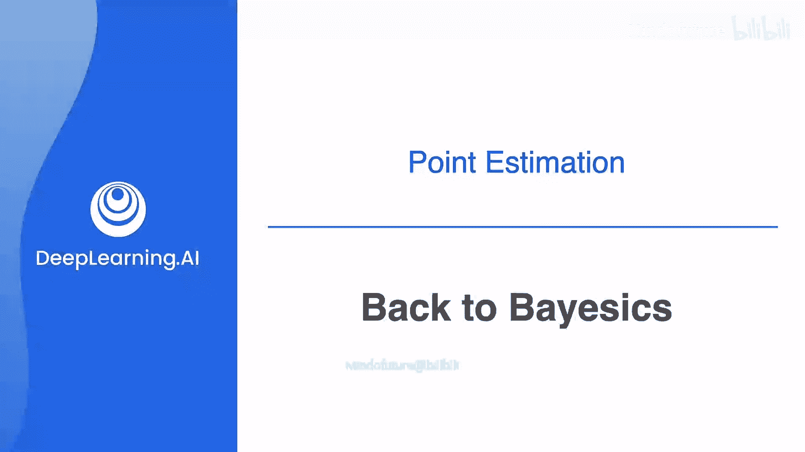
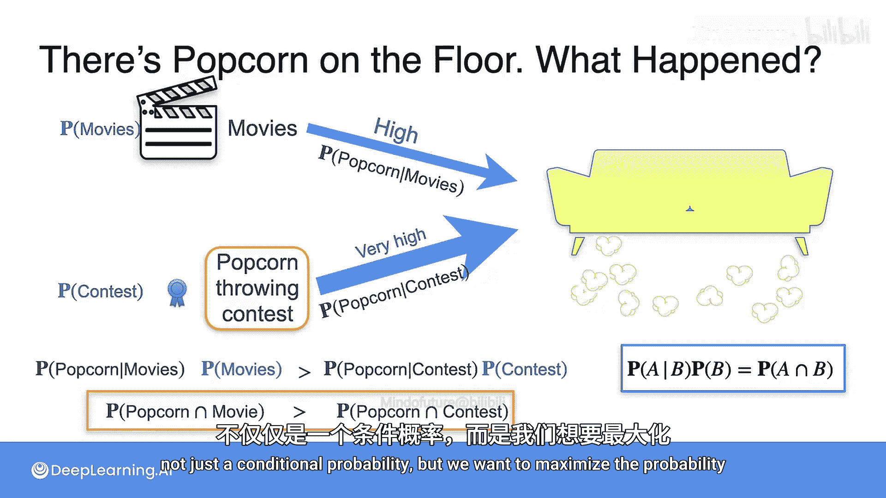

# 071：回归贝叶斯基础

在本节课中，我们将学习贝叶斯推断中的一个核心概念：如何结合证据的概率与事件本身的先验概率，以做出更合理的决策。我们将通过一个生动的例子来理解为什么仅考虑条件概率是不够的，并引入联合概率的概念。

## 回顾：基于证据的初步推断

上一节我们介绍了如何根据观察到的证据（如地上的爆米花）来推断最可能发生的情景。我们当时的方法是选择使条件概率 **P(证据 | 情景)** 最大的情景。

例如，我们曾有三个可能的情景：
1.  **看电影**：产生爆米花的概率很高。
2.  **玩桌游**：产生爆米花的概率中等。
3.  **打盹**：产生爆米花的概率很低。

根据条件概率，我们选择了“看电影”，因为它产生地上爆米花的概率最高。

## 引入新情景：先验概率的重要性

然而，故事并未结束。现在，我们考虑两个不同的候选情景：
*   **情景A：看电影**
*   **情景B：举办扔爆米花比赛**

以下是两种情景的比较：
*   **条件概率**：看电影时地上出现爆米花的概率 **P(爆米花 | 电影)** 很高。但举办扔爆米花比赛时，地上出现爆米花的概率 **P(爆米花 | 比赛)** 几乎是100%，即“极高”。
*   **直觉冲突**：如果仅看条件概率，扔爆米花比赛“获胜”。但我们的直觉告诉我们，“看电影”才应该是更合理的解释。这是为什么？

原因在于，事件本身发生的可能性（即**先验概率**）不同。看电影是一个相对常见的事件，而举办扔爆米花比赛则是一个非常罕见的事件。

即使比赛**产生证据的可能性更大**，但它**本身发生的可能性却小得多**。这个因素必须被考虑进去。

## 数学建模：从条件概率到联合概率

为了综合考虑证据概率和先验概率，我们需要将两者结合起来。

之前的方法是最优化条件概率：
`P(爆米花 | 情景)`

现在，我们应该将先验概率 **P(情景)** 纳入考量。具体做法是将两者相乘：
`P(爆米花 | 情景) * P(情景)`

在我们的例子中：
*   对于看电影：`P(爆米花 | 电影) * P(电影)`
*   对于扔爆米花比赛：`P(爆米花 | 比赛) * P(比赛)`

虽然 `P(爆米花 | 比赛)` 可能大于 `P(爆米花 | 电影)`，但 `P(电影)` 很可能远大于 `P(比赛)`。当两者相乘后，乘积的大小关系可能逆转，使得“看电影”的联合概率更大。

## 核心概念：联合概率

请注意，这个乘积公式看起来非常熟悉：
`P(爆米花 | 电影) * P(电影)` 类似于 `P(A|B) * P(B)`。

根据概率论乘法公式，这正是事件A与B同时发生的**联合概率**：
`P(A ∩ B) = P(A|B) * P(B)`

因此，我们现在的最优化目标发生了变化：
*   **旧目标**：最大化条件概率 `P(证据 | 情景)`。
*   **新目标**：最大化联合概率 `P(证据 ∩ 情景)`，即证据**和**情景同时发生的概率。

这更有意义，因为这才真正反映了我们关心的：“某个特定情景**并且**产生了我们看到的证据”这件事的整体可能性。

以下是两种推断方法的对比：

1.  **最大似然法**：只考虑证据的可能性。
    *   选择标准：`argmax P(证据 | 情景)`
2.  **贝叶斯方法**：综合考虑证据的可能性和情景本身的先验可能性。
    *   选择标准：`argmax P(证据 | 情景) * P(情景)`
    *   等价于：`argmax P(证据 ∩ 情景)`

## 总结

本节课中，我们一起学习了贝叶斯推断的关键一步。我们通过例子发现，仅根据证据产生的可能性（似然）做判断可能得到反直觉的结果，因为忽略了事件本身的常见程度（先验概率）。正确的做法是同时考虑两者，即最大化**联合概率** `P(证据 ∩ 情景)`。这为后续正式学习贝叶斯公式奠定了直观基础——贝叶斯公式的本质就是在已知证据的情况下，通过联合概率来更新我们对不同情景发生可能性的判断。