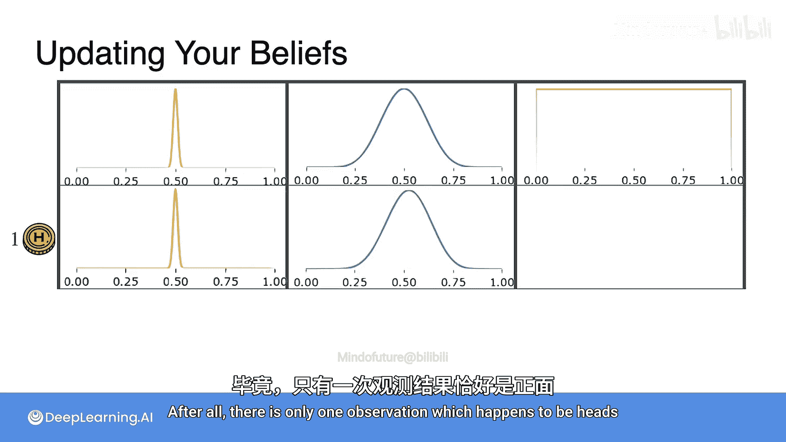
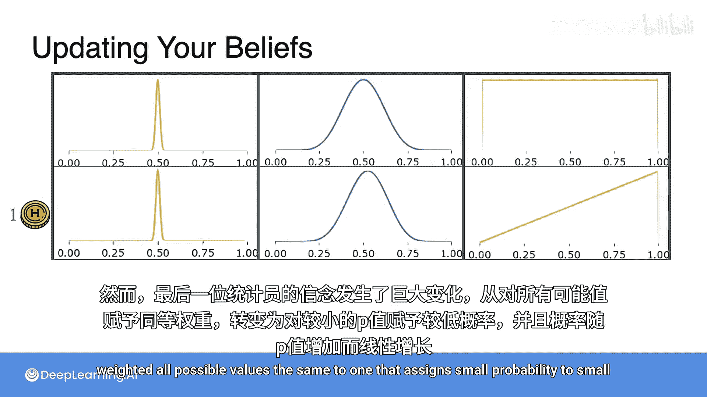
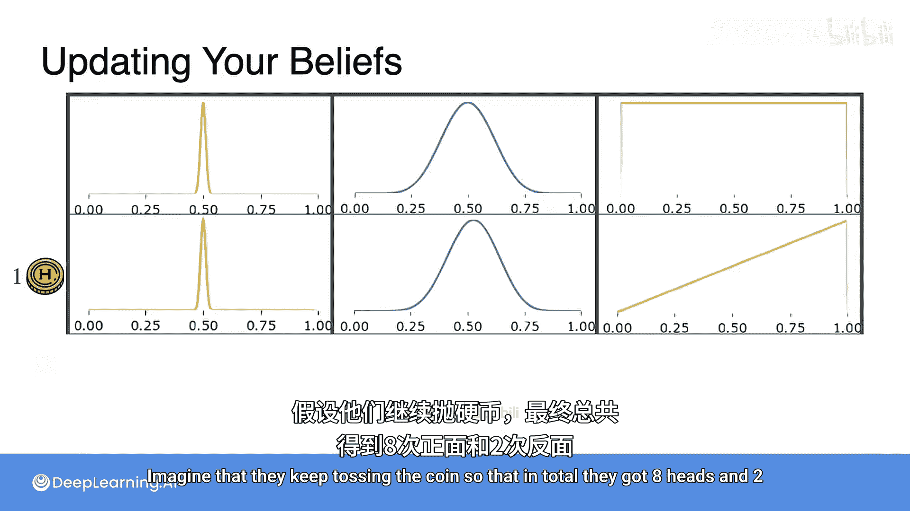
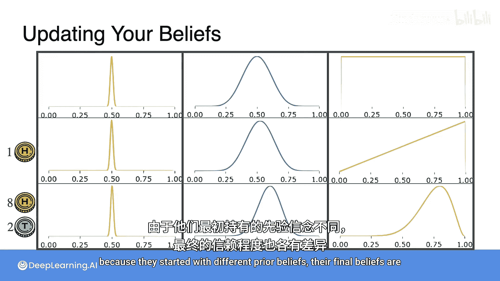
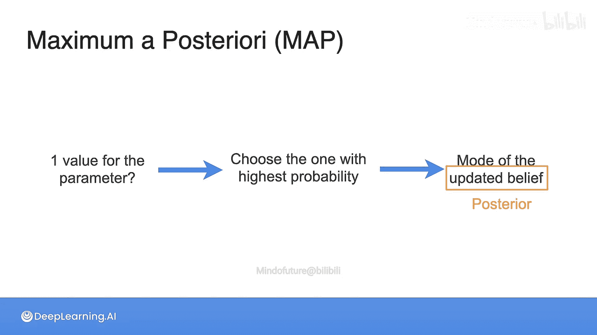
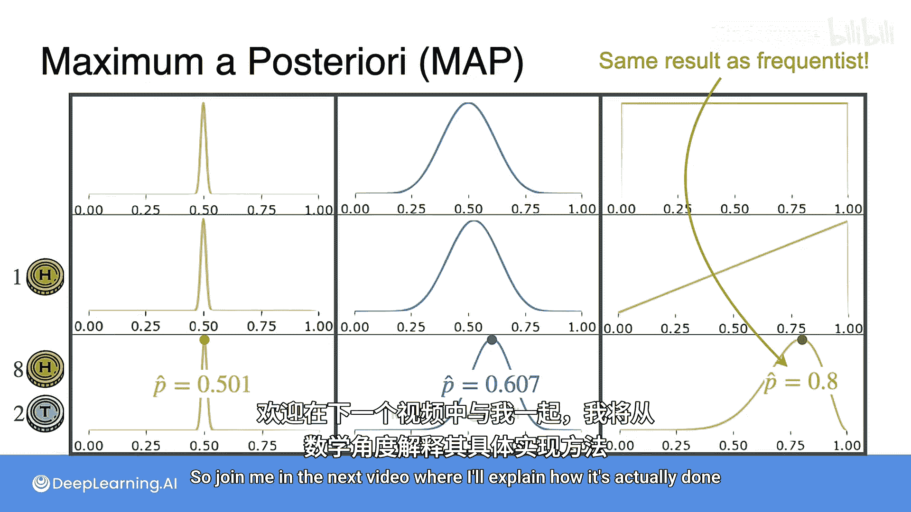

# 073：贝叶斯统计与最大后验估计 🎲

在本节课中，我们将学习贝叶斯统计的核心思想，特别是先验信念如何影响我们对参数的估计。我们将通过一个抛硬币的例子，直观地理解不同先验分布如何导致不同的后验信念，并最终引出**最大后验估计**的概念。

---

## 先验信念的设定

假设有三位统计学家在街上捡到一枚硬币，他们都想估计这枚硬币正面朝上的概率 `P`。然而，他们对硬币的“公平性”持有不同的初始信念，这被称为**先验分布**。

以下是他们各自选择的先验分布：

*   **第一位统计学家**：他坚信硬币是公平的。因此，他选择的先验分布非常狭窄，且中心在 `0.5`。这个狭窄的曲线代表了他强烈的信念，认为正面概率就是 `50%`，并且概率值向 `0` 或 `1` 方向会迅速下降。
*   **第二位统计学家**：他也认为硬币应该是公平的，但他愿意相信硬币可能存在某种偏向。因此，他选择的先验分布同样在 `0.5` 处概率最大，但比第一位统计学家的分布更分散一些。
*   **第三位统计学家**：他不想做任何假设，因此他为每一个可能的 `P` 值分配了相同的权重。这被称为**无信息先验**，因为它没有添加任何额外的信息。

## 观察数据后的信念更新

现在，我们来看看如果三位统计学家都只抛了一次硬币，并且看到了正面，他们的信念会发生什么变化。

*   **保守的第一位**：他的信念几乎没有移动。肉眼几乎看不出变化。
*   **中间的第二位**：他的信念更新了，但幅度也非常小。毕竟，只有一个观测数据（正面）。
*   **无先验的第三位**：他的信念发生了剧烈变化，从一个对所有可能值赋予相同权重的分布，变成了一个随着 `P` 值增大而概率线性增加的分布。

上一节我们看到了单次观测的影响，现在让我们继续观察。假设他们继续抛硬币，总共得到了 **8次正面和2次反面**。让我们看看每位统计学家的信念如何进一步演变。

以下是更新后的信念分布：

*   **第一位统计学家**：他的信念仍然非常紧密地围绕在先验附近。曲线几乎没有移动。
*   **第二位统计学家**：立场相对温和的这位，其信念已经开始发生偏移。注意，曲线看起来更窄了，并且峰值不再在 `0.5`，而是在大约 `0.65` 附近。
*   **第三位统计学家**：他的信念变化最大。他从没有任何信息，变得相当确信正面朝上的概率应该在 `0.8` 左右。

> 注：目前你无需担心这些更新是如何计算的，我们将在下一个视频中详细学习。这里只是想让你感受一下先验信念对后续信念更新的影响。

尽管三位统计学家观察到了完全相同的数据，但由于他们始于不同的先验信念，他们最终的信念也各不相同。

## 从信念到点估计：最大后验估计

这些代表信念的曲线非常具有信息量，它们不仅展示了一个最可能的结果，还展示了统计学家认为每个可能结果是真实参数值的置信程度。

然而，很多时候我们仍然希望得到一个参数的代表值。如何从更新后的信念中得到这个值呢？实际上有很多标准可以选择这个值，但最有用的一种是选择**概率最高的那个值**。

这意味着取能最大化你信念的那个参数值。换句话说，就是取你更新后信念分布的**众数**。

*   更新后的信念被称为**后验信念**。
*   正如你最初的信念被称为**先验**（因为在观察数据之前），更新后的信念被称为**后验**（因为它代表了看到数据后的信念）。

由于这个估计是基于后验分布的最大值（众数）得出的，因此这种参数估计方法被称为**最大后验估计**，简称 **MAP**。

> 如果你想了解从后验分布中还能得到哪些其他估计，本节末尾有一篇阅读材料可供参考。

现在，让我们回到抛硬币的例子，看看每种情况下的 MAP 估计值是多少。

以下是基于8次正面、2次反面数据后，三位统计学家的 MAP 估计：

*   **非常保守的第一位**：正面概率的 MAP 估计是 `0.501`。可以看到，它几乎没有偏离“硬币是公平的”这一原始假设。
*   **第二位统计学家**：他会说看到正面的概率是 `0.607`。可以看到，这个值发生了显著变化，但即使面对8正2反的数据（从频率学派的角度可能暗示硬币偏差更大），这个估计仍然不算极端。
*   **第三位统计学家**：他会说正面概率是 `0.8`。这个结果听起来很熟悉，对吧？它应该很熟悉，因为**这与频率学派方法得出的结论相同**。

事实上，**任何时候，当你使用对所有可能值赋予相等权重的无信息先验进行 MAP 估计时，得到的结果与频率学派方法的结果完全相同**。这强化了先验的引入在贝叶斯统计中的重要性和独特性。如果你不携带任何有意义的先验信念，MAP 最终会变成一种本质上进行频率统计的繁琐方式。

---

## 总结

本节课中，我们一起学习了：

1.  **先验信念**：在观察数据之前，对参数可能取值的初始假设分布。
2.  **后验信念**：在观察到数据之后，结合先验信念和似然度更新得到的参数分布。
3.  **最大后验估计**：一种参数点估计方法，通过取后验分布的众数（最大值）来获得参数的代表值。其公式可以表示为：
    `θ_MAP = argmax_θ P(θ | Data) = argmax_θ P(Data | θ) * P(θ)`
    其中 `P(θ)` 是先验，`P(Data | θ)` 是似然，`P(θ | Data)` 是后验。
4.  **先验的影响**：不同的先验会导致相同的观测数据产生不同的后验分布和 MAP 估计。无信息先验下的 MAP 估计等价于频率学派的极大似然估计。

对贝叶斯统计基础概念的介绍就到这里。在下一个视频中，我将解释如何在数学上实际进行这些计算。

