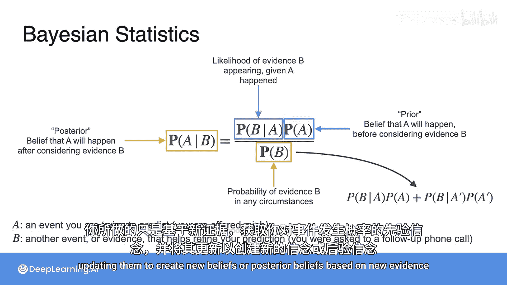
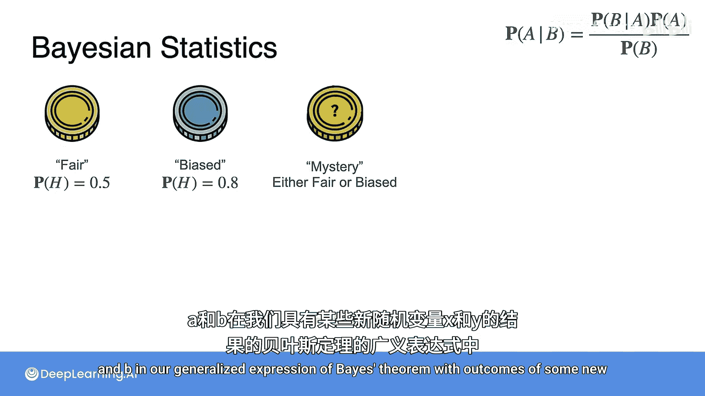
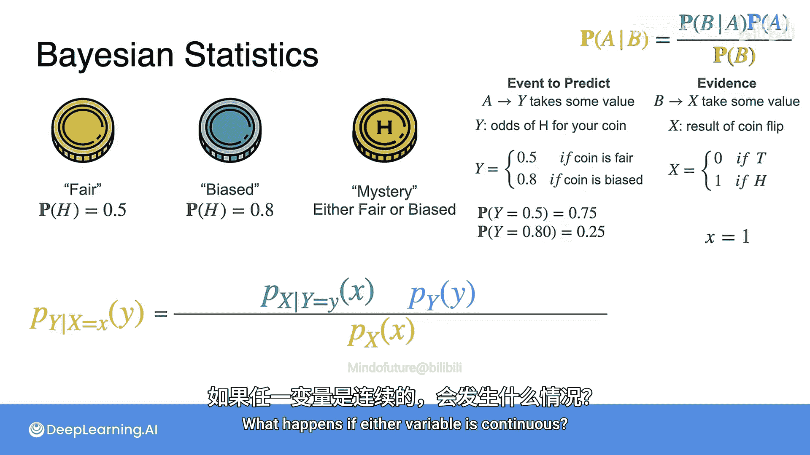
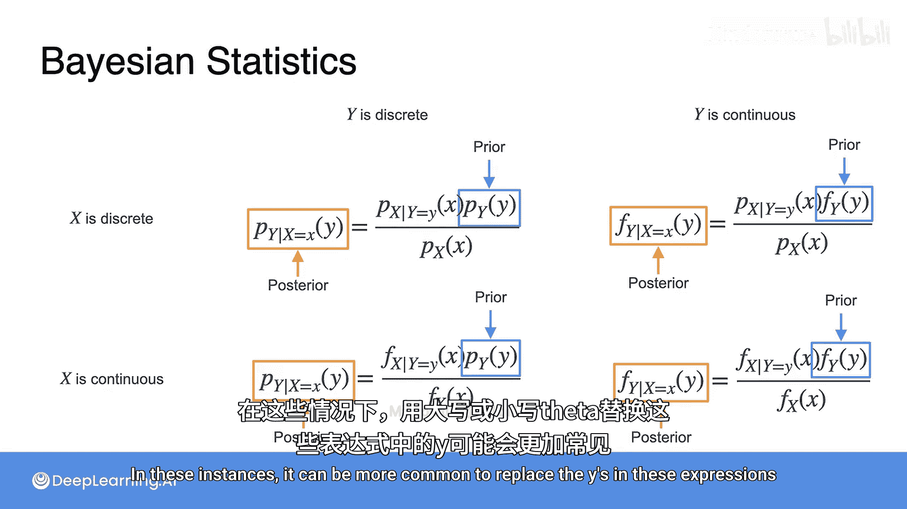
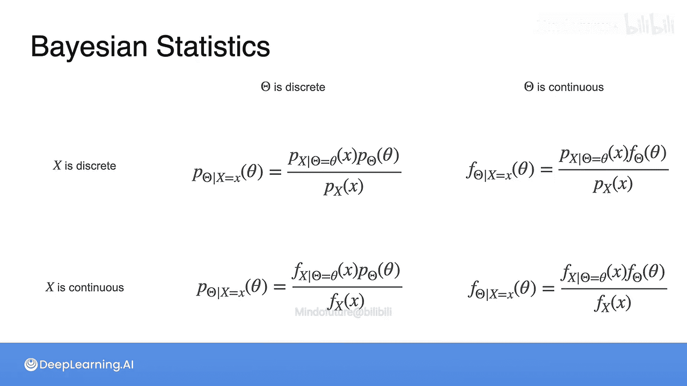

# 074：贝叶斯统计更新先验

在本节课中，我们将学习贝叶斯统计的核心思想：如何利用新证据来更新我们对某个事件的初始信念（先验概率）。我们将通过一个简单的例子，逐步推导贝叶斯定理的公式，并了解其在不同数据类型（离散与连续）下的应用形式。

## 贝叶斯定理回顾

上一节我们建立了贝叶斯统计的直觉。本节中，我们来看看如何实际执行信念更新。你会发现，其中涉及的数学你已经学习过了。

它始于贝叶斯定理。给定两个事件A和B，贝叶斯定理表述为：

**P(A|B) = [P(B|A) * P(A)] / P(B)**

这个公式如果没有例子可能有点难以理解。因此，让我们以贝叶斯统计中典型的方式来定义A和B。

*   **A** 通常是你试图预测的事件。在理想情况下，你无法确切知道其概率。例如，你申请的工作是否会给你录用通知。
*   **B** 是另一个事件，或者是你能够观察到的、有助于改进你预测A能力的证据。例如，你是否被要求参加后续的电话面试。

这个等式的左边，**P(A|B)**，是你要求解的部分，它被称为**后验概率**。它代表了在考虑了事件B提供的信息后，事件A更新或修正后的概率。在这个例子中，就是现在你知道自己被要求参加后续电话面试后，你获得这份工作的可能性。

等式的右边包含三项：
*   第一项是**先验概率 P(A)**。你可以将其视为事件B发生之前，事件A发生的概率。在这个例子中，你的先验概率就是在收到后续电话面试请求之前，你对自己获得这份工作的可能性的信念。
*   另外两项是用来更新你的先验并形成后验的。
    *   分子项是**似然度 P(B|A)**，即在A发生（或将要发生）的条件下，证据B出现的可能性。在这个例子中，就是在你最终会获得这份工作的条件下，你被要求参加后续电话面试的可能性。
    *   分母项是**证据概率 P(B)**，即证据B出现的总概率。在这个例子中，就是你被要求参加后续电话面试的可能性，无论你最终是否会获得这份工作。通常你需要使用以下表达式来计算P(B)：`P(B) = P(B|A)*P(A) + P(B|¬A)*P(¬A)`。你通常使用一般乘法规则计算P(B∩A)和P(B∩¬A)，然后将它们相加。

退一步看这个等式的所有四个部分如何协同工作，你所做的只是基于新证据，获取你对某个事件概率的先验信念，并更新它们以形成新的信念，即后验信念。

## 硬币示例：应用贝叶斯更新

现在让我们回到判断一枚硬币是公平的还是偏倚的例子，看看这个表达式是如何实际使用的。

在这个例子中，你知道有两种可能的硬币类型：
1.  第一种是**公平硬币**，这意味着抛掷出现正面的概率是 **0.5**。
2.  另一种类型是**偏倚硬币**。这种硬币出现正面的概率是 **0.8**。

你有一枚神秘的硬币。它可能是公平的，也可能是偏倚的，但你不知道是哪一种。弄清楚这一点的唯一方法就是抛掷它。

我将以贝叶斯的方式设置这个实验，第一步是将贝叶斯定理通用表达式中的A和B替换为一些新的随机变量X和Y的结果。

*   首先，**A**（你想要预测的事件）将被替换为新随机变量**Y**取某个值的事件。Y将代表你所持硬币出现正面的几率。Y可以输出两个可能的值：如果你的硬币是公平的，则为0.5；如果你的硬币是偏倚的，则为0.8。这两个结果的概率是未知的，所以你从一些先验开始。在这个例子中，假设你相信大多数硬币是公平的。因此，你分配0.75的概率认为硬币确实是公平的（即Y=0.5），分配0.25的概率认为硬币是偏倚的（即Y=0.8）。
*   现在你需要一些证据来帮助更新你的先验。在这个例子中，你将用新随机变量**X**的结果替换事件**B**。X将是你抛掷神秘硬币的结果，所以如果抛掷结果是反面则输出0，如果是正面则输出1。

现在你准备好根据抛掷硬币的结果来更新你的先验了。让我们抛掷它。这次抛掷的结果是正面，所以我记下 `x = 1`。现在让我们使用贝叶斯定理来更新那些先验信念。

首先，我将展示如何计算硬币是公平的后验信念。写下你的后验：`P(Y=0.5 | X=1)`。换句话说，就是在你抛掷出正面的条件下，你持有公平硬币的概率。

接下来，应用贝叶斯定理：
`P(Y=0.5 | X=1) = [P(X=1 | Y=0.5) * P(Y=0.5)] / P(X=1)`

现在代入实际数值：
*   `P(X=1 | Y=0.5)` 是给定硬币公平时抛出正面的概率，即 **0.5**。
*   `P(Y=0.5)` 来自你的先验，你相信75%的时间硬币是公平的，所以用 **0.75** 替换这个值。
*   `P(X=1)` 是抛出正面的总概率。这需要计算：`P(X=1) = P(X=1|Y=0.5)*P(Y=0.5) + P(X=1|Y=0.8)*P(Y=0.8) = (0.5*0.75) + (0.8*0.25) = 0.375 + 0.2 = 0.575`。

完成这个计算：`[0.5 * 0.75] / 0.575 = 0.375 / 0.575 ≈ 0.652`。这就是你的新后验概率。

将这个值与你先前的信念进行比较，你可以看到发生了什么：你曾经认为有75%的机会你的硬币是公平的，但在抛出一个正面后，你稍微改变了你的信念。现在你相信你的硬币是公平的概率只有65.2%。

虽然我不会在这里带你计算数学，但一个非常类似的方法将导致一个新的后验信念：硬币是偏倚的概率增加到 **0.348**。注意，这两个信念的总和仍然是1，这是合理的：你知道硬币要么公平要么偏倚，所以你对这两种结果的信念之和应该仍然是1。

## 通用公式：离散与连续变量

这个例子非常离散，Y只有两个可能值，X也只有两个可能值。但让我开始用一种更通用的方式来书写它，使用概率质量函数。

用概率质量函数重写上述方程：
`P(Y=0.5 | X=1) = [P(X=1 | Y=0.5) * P(Y=0.5)] / P(X=1)`
可以看作是：
`f_{Y|X}(0.5 | 1) = [f_{X|Y}(1 | 0.5) * f_Y(0.5)] / f_X(1)`
其中 `f` 代表概率质量函数。

现在我已经用X和Y的PMF写下了这个等式，我可以再进一步使其更通用。与其使用这里显示的X和Y的具体值，我不如重写它，以便你可以为任何可能的先验结果 `y` 和任何可能的事件 `x` 更新你的先验。

你得到的是当有两个离散随机变量时，贝叶斯定理的通用表达式：
`f_{Y|X}(y | x) = [f_{X|Y}(x | y) * f_Y(y)] / f_X(x)`
对于给定的事件 `y` 和给定的证据 `x`，这个表达式将允许你更新你的先验。

这是一个有用的通用公式，但请注意，它是为事件和证据都是离散的情况设计的。如果任一变量是连续的怎么办？这就是我接下来要展示的内容。

根据X和Y是离散还是连续，你需要考虑四种组合：

1.  **X离散，Y离散**：你刚才看到的例子就是这种情况。公式使用概率质量函数。
    `P(Y=y | X=x) = [P(X=x | Y=y) * P(Y=y)] / P(X=x)`

2.  **X连续，Y连续**：在这种情况下，公式看起来几乎相同，只是将两个变量的概率质量函数替换为概率密度函数。
    `f_{Y|X}(y | x) = [f_{X|Y}(x | y) * f_Y(y)] / f_X(x)`

3.  **X连续，Y离散**：
    `P(Y=y | X=x) = [f_{X|Y}(x | y) * P(Y=y)] / f_X(x)`

4.  **X离散，Y连续**：
    `f_{Y|X}(y | X=x) = [P(X=x | Y=y) * f_Y(y)] / P(X=x)`

尽管表达式不同，但这些项都是**后验**，因为它们代表了在考虑了观察到的数据之后更新的概率；而这些项都是**先验**，即在知道任何关于X的信息之前对Y的信念。

在许多机器学习上下文中，你求解的是模型中某个参数取某个特定值的概率。在这些情况下，更常见的是用看起来像 `θ`（theta）的大写或小写字母替换这些表达式中的Y。

同样，这里改变只是符号，字母Y被 `θ` 取代，但基本概念是相同的。根据你的上下文中离散和连续变量的组合，你将使用这四个方程中的一个来更新你的先验。

## 总结

本节课中，我们一起学习了贝叶斯统计的核心操作——更新先验信念。我们从回顾贝叶斯定理开始，明确了先验、似然度、证据和后验概率各自的意义。接着，通过一个判断硬币是否公平的具体例子，我们一步步演示了如何利用一次抛掷正面的证据，将“硬币有75%概率公平”的先验更新为“硬币有65.2%概率公平”的后验。最后，我们将具体的计算过程抽象成通用公式，并介绍了当随机变量为离散或连续时的四种不同表达式。理解这些公式是应用贝叶斯方法解决机器学习问题的基础。在接下来的课程中，你将看到更多这方面的实际应用。