# 075：贝叶斯统计完整示例 🎲

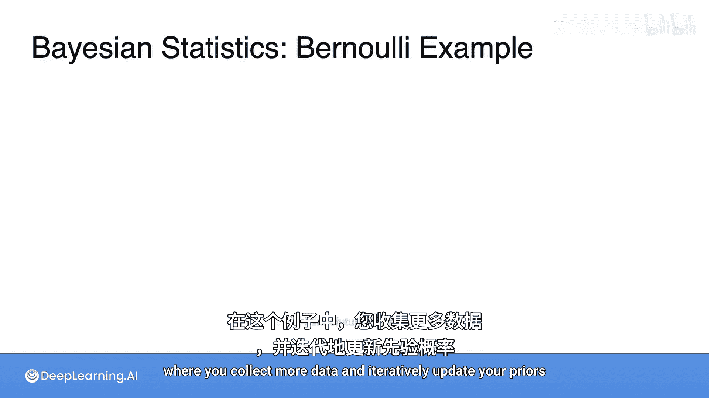

在本节课中，我们将学习一个更完整的贝叶斯统计示例。我们将通过收集更多数据并迭代更新先验信念，来展示贝叶斯推断的完整流程。

## 概述

在之前的课程中，我们介绍了贝叶斯定理的基本概念。本节我们将通过一个具体的抛硬币实验，演示如何利用新收集的数据，一步步更新我们对硬币正面朝上概率（记为 $\theta$）的信念。我们将从设定先验分布开始，计算似然函数，最终得到后验分布，并探讨其含义。

## 问题设定与建模

首先，我们需要对问题进行数学建模。我们有一枚硬币，其正面朝上的概率 $\theta$ 是未知的。因此，我们可以将 $\theta$ 视为一个随机变量。我们的目标是通过收集抛硬币的数据，来了解 $\theta$ 的概率密度函数。

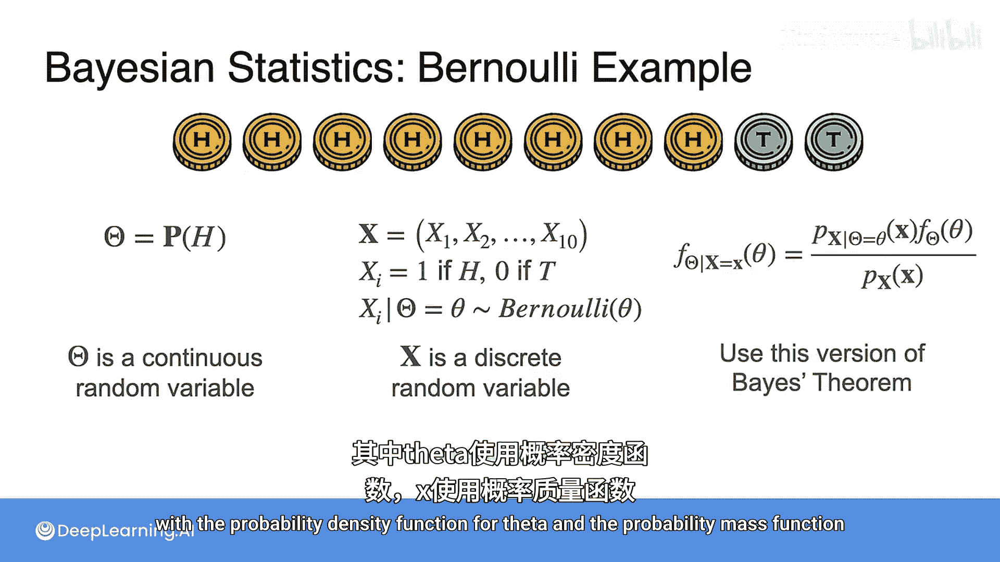

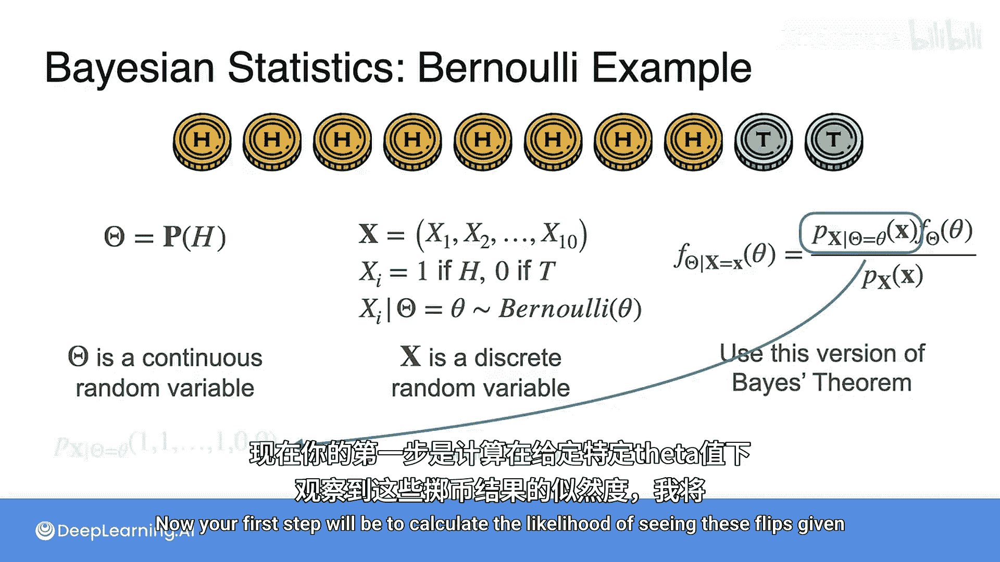

我们进行了10次抛掷，观察到8次正面（记为1）和2次反面（记为0）。我们将这10次独立实验的结果记为随机变量 $\mathbf{X} = (X_1, X_2, ..., X_{10})$。如果已知 $\theta$ 的具体值，那么每次抛掷 $X_i$ 都可以看作是一个伯努利分布：$X_i \sim \text{Bernoulli}(\theta)$。

由于 $\theta$ 是连续的（概率密度函数），而 $\mathbf{X}$ 是离散的（概率质量函数），我们将使用以下形式的贝叶斯定理：

$$
P(\theta | \mathbf{X}) = \frac{P(\mathbf{X} | \theta) P(\theta)}{P(\mathbf{X})}
$$

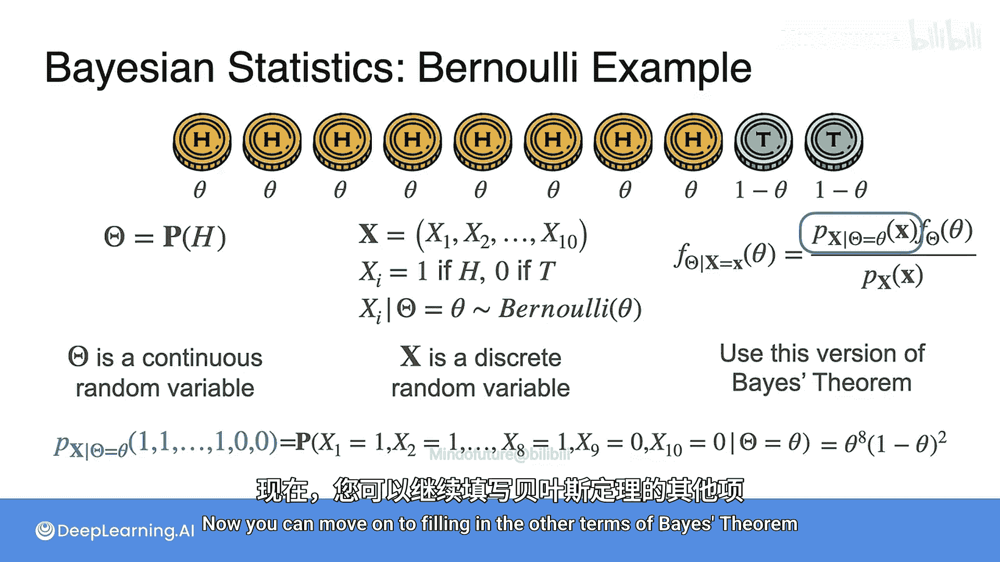

其中：
*   $P(\theta | \mathbf{X})$ 是后验概率密度函数，即看到数据后我们对 $\theta$ 的信念。
*   $P(\mathbf{X} | \theta)$ 是似然函数，即在给定 $\theta$ 下观察到当前数据的概率。
*   $P(\theta)$ 是先验概率密度函数，即我们在看到数据前对 $\theta$ 的初始信念。
*   $P(\mathbf{X})$ 是证据或边缘似然，是一个归一化常数。

## 第一步：计算似然函数

我们的第一步是计算在给定某个 $\theta$ 值时，观察到“8正2反”这个特定序列的似然度。

$$
P(\mathbf{X} | \theta) = P(\text{正，正，...，正，反，反} | \theta)
$$

由于每次抛掷是独立的，其联合概率等于各次概率的乘积。对于正面，概率为 $\theta$；对于反面，概率为 $1 - \theta$。因此：

$$
P(\mathbf{X} | \theta) = \theta \cdot \theta \cdot ... \cdot \theta \cdot (1-\theta) \cdot (1-\theta) = \theta^8 (1-\theta)^2
$$

## 第二步：选择先验分布

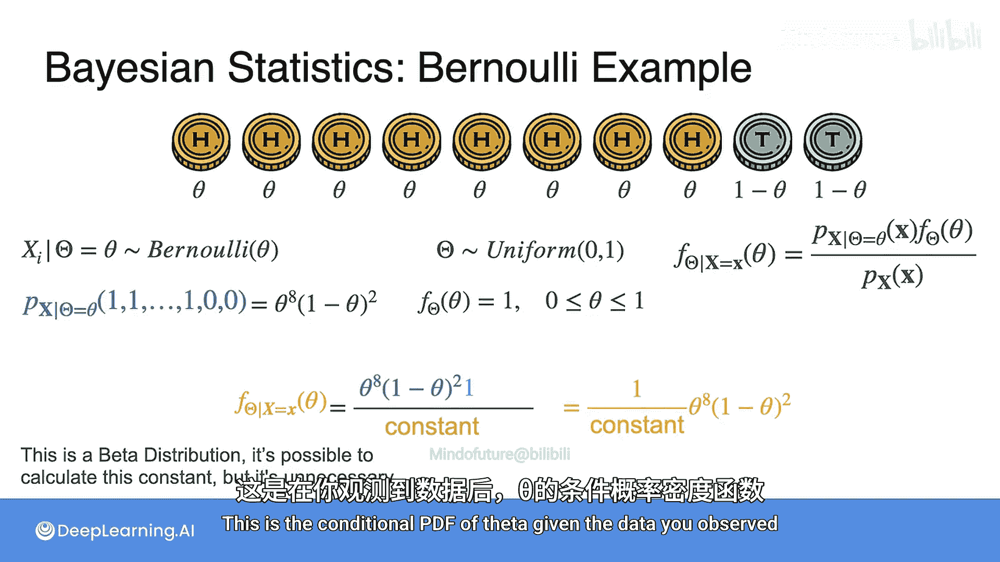

接下来，我们需要选择先验分布 $P(\theta)$。假设在实验前，我们对这枚硬币没有任何先入为主的看法，认为 $\theta$ 取0到1之间任何值的可能性都相同。这种情况下，我们选择均匀分布作为先验：

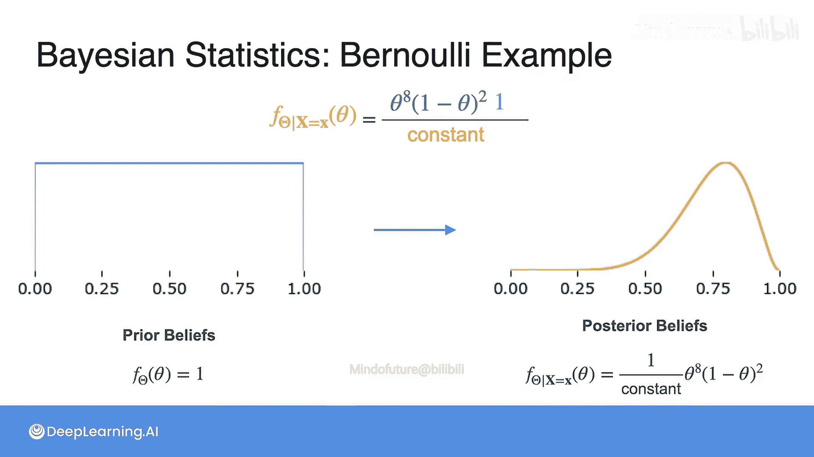

$$
P(\theta) = 1, \quad \text{for } 0 < \theta < 1
$$

## 第三步：推导后验分布

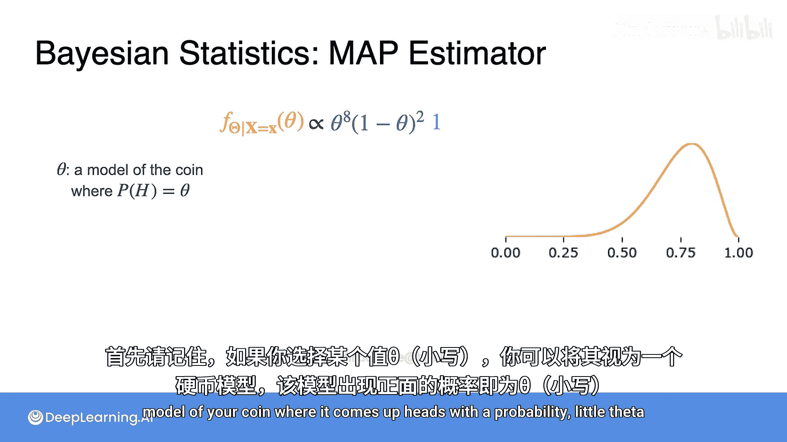

现在，我们有了计算后验分布的所有要素。根据贝叶斯定理：

$$
P(\theta | \mathbf{X}) = \frac{\theta^8 (1-\theta)^2 \times 1}{P(\mathbf{X})}
$$

分母 $P(\mathbf{X})$ 是一个归一化常数，确保后验概率密度函数下方的总面积为1。在这个例子中，后验分布恰好是一个**贝塔分布（Beta Distribution）**。其归一化常数是 $\frac{8! \cdot 2!}{11!}$。但重要的是，这个常数不影响分布的形状，尤其是不影响其众数（最高点）的位置。因此，我们通常写作：

$$
P(\theta | \mathbf{X}) \propto \theta^8 (1-\theta)^2
$$

符号 $\propto$ 表示“正比于”。下图展示了我们从均匀先验（平坦直线）更新后得到的后验分布。可以看到，后验分布的峰值在 $\theta \approx 0.8$ 附近，表明在看到8次正面后，我们相信硬币正面朝上的概率很可能在0.8左右。

## 第四步：计算MAP估计

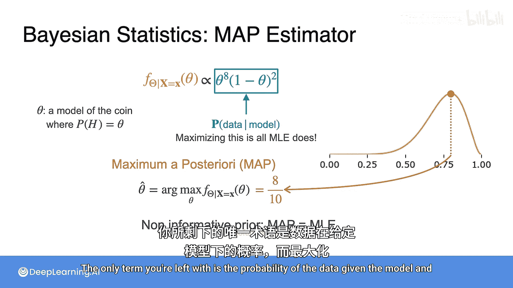

我们常常希望用一个单一的数字来总结后验分布所代表的信念。一个常用的方法是计算**最大后验概率估计**。

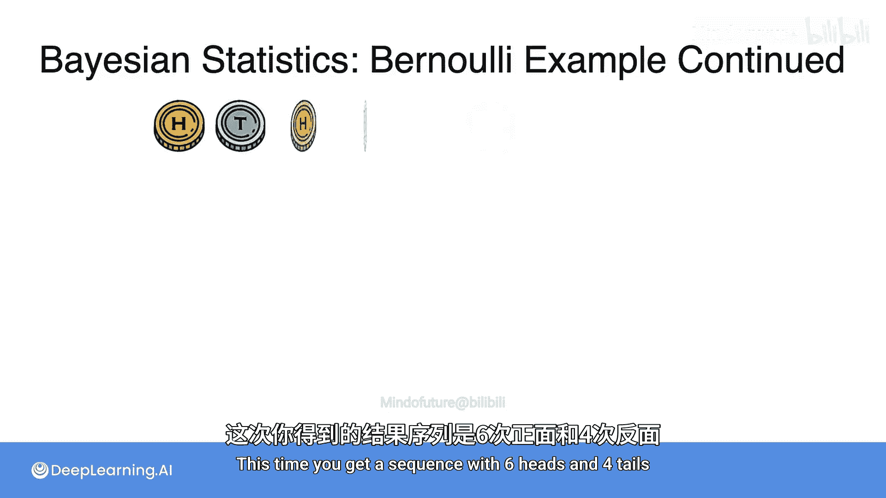

MAP估计是后验概率密度函数取得最大值时所对应的 $\theta$ 值，即后验分布的众数。由于归一化常数和均匀先验（常数1）都不影响函数取最大值的位置，因此在这个例子中，最大化后验分布等价于最大化似然函数 $\theta^8 (1-\theta)^2$。

通过求导等数学方法，可以找到这个函数在 $\theta = 0.8$ 时取得最大值。这恰好等于我们观察到的正面频率（8/10）。**当使用无信息先验（如均匀分布）时，MAP估计与频率学派的极大似然估计结果相同。**

## 第五步：迭代更新信念

贝叶斯推断的强大之处在于可以持续更新。假设我们又抛了10次硬币，得到6次正面和4次反面。

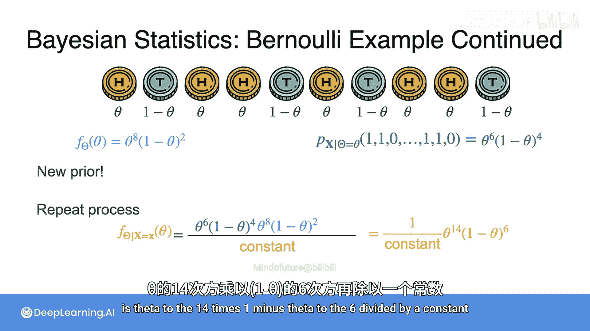

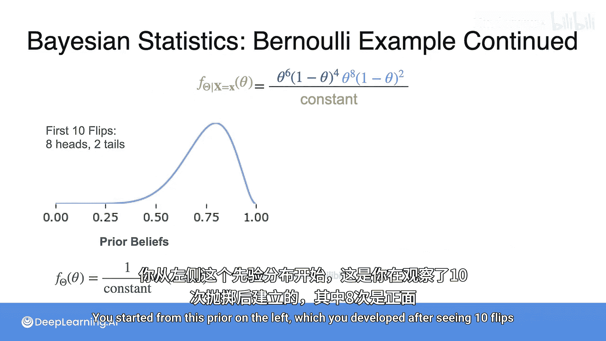

现在，我们不再从均匀先验开始，而是将上一轮得到的后验分布作为本轮的新先验。即：
新先验 $P_{\text{new}}(\theta) \propto \theta^8 (1-\theta)^2$

新数据的似然函数为：$P(\mathbf{X}_{\text{new}} | \theta) = \theta^6 (1-\theta)^4$

再次应用贝叶斯定理，我们得到更新后的后验分布：
$$
P(\theta | \mathbf{X}_{\text{all}}) \propto [\theta^6 (1-\theta)^4] \times [\theta^8 (1-\theta)^2] = \theta^{14} (1-\theta)^6
$$

这个过程如下图所示：

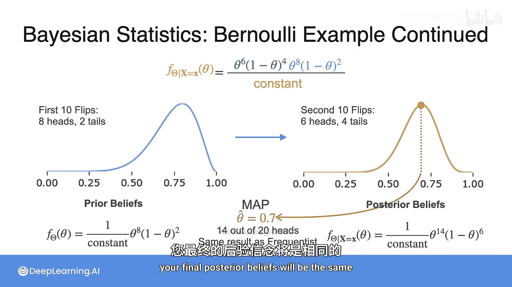

此时，MAP估计为 $\theta = 0.7$。这个结果有两个重要启示：
1.  **先验信息的影响**：如果频率学派只看到第二组数据（6正4反），他们会估计 $\theta = 0.6$。但由于我们包含了第一组数据带来的先验信息（倾向于0.8），我们的估计是0.7。这说明**当先验信息丰富时，它会显著影响结论**。
2.  **数据整合的等价性**：我们分两批（10+10次）处理数据，最终后验基于总共20次抛掷（14正6反）。如果我们一次性使用全部20次数据，从均匀先验开始，得到的后验将是 $\theta^{14} (1-\theta)^6$，MAP估计同样是0.7。**在贝叶斯推断中，无论是一次性使用所有数据，还是分批次迭代更新，最终的后验信念是相同的。**

## 总结与对比

本节课我们一起完成了一个完整的贝叶斯统计示例。让我们总结一下关键点：

*   **核心思想**：贝叶斯统计的核心是利用数据迭代更新信念。旧的后验成为新的先验，结合新数据产生更新的后验。
*   **MAP与MLE**：当使用无信息先验时，MAP估计在数值上等于频率学派的极大似然估计。此时，所有信息都来自数据。
*   **大数定律**：只要先验分布不是极端错误的，随着收集的数据越来越多，MAP估计和MLE估计会收敛到同一个值。新数据会逐渐“稀释”初始先验的影响。
*   **学派选择**：
    *   贝叶斯方法在**数据有限**或**拥有强先验知识**的场景下特别有用。
    *   如果预计会收集大量数据，频率学派的方法通常也足够。
    *   贝叶斯方法的一个潜在缺点是：如果先验设置错误，尤其是在数据量小时，可能会导致错误的结论，因为先验的影响会很大。

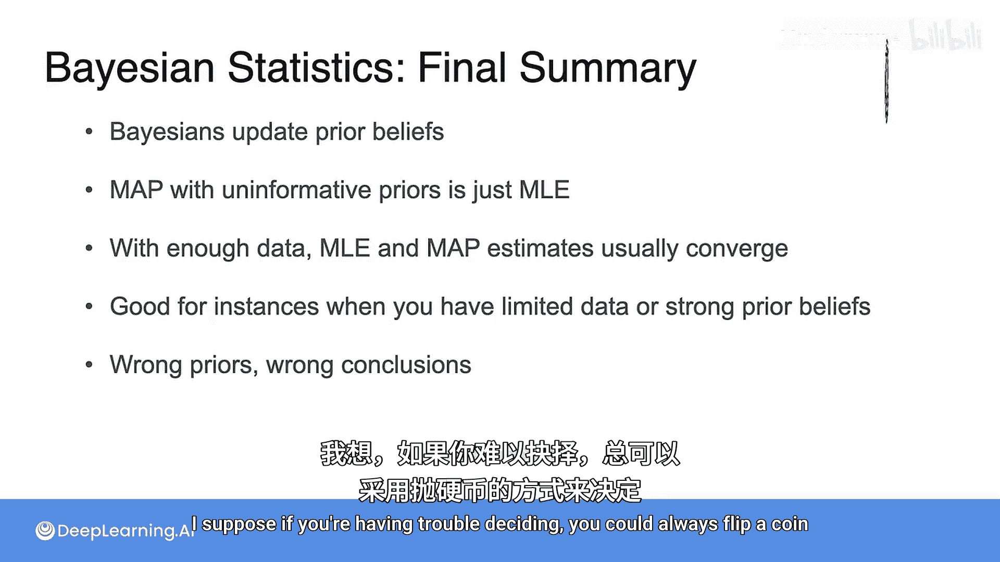

理解这两种哲学思想的差异后，你可以根据具体问题选择更适合的框架。如果你难以决定，或许可以抛一枚硬币——当然，别忘了思考你对该硬币正面概率的先验信念是什么。