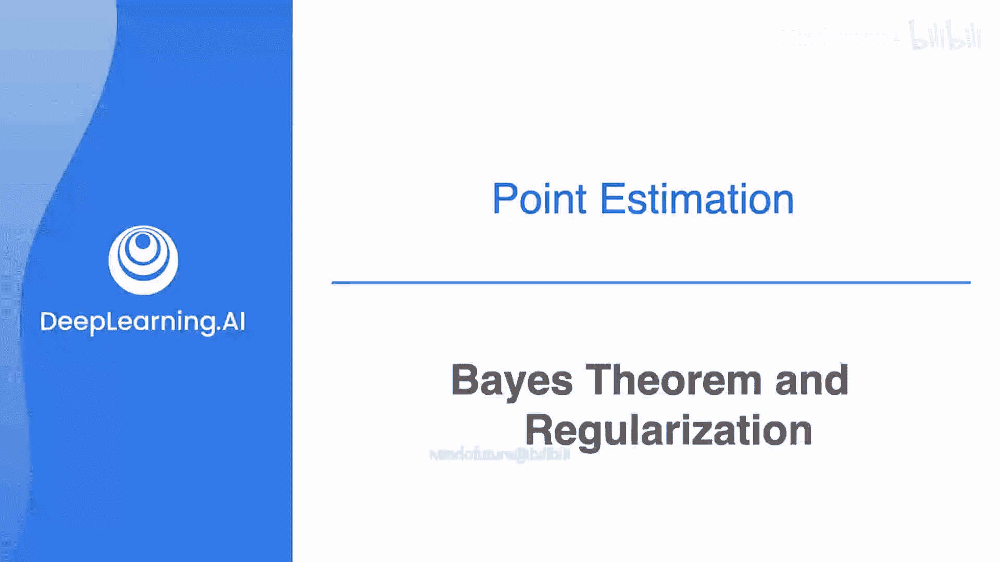
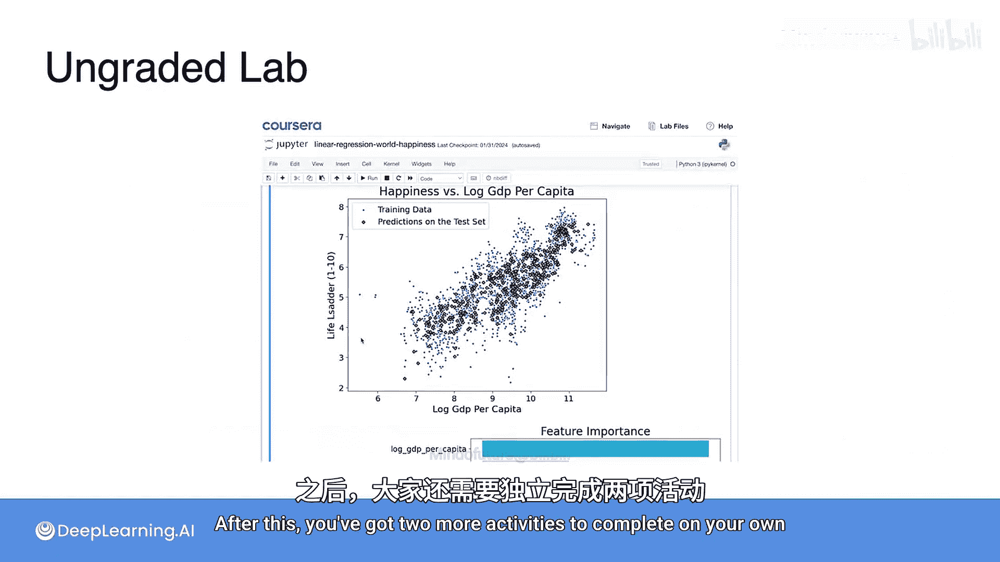
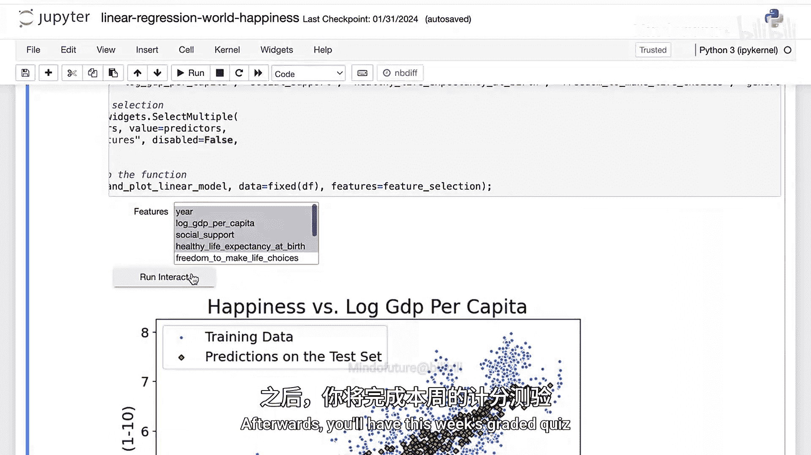

# 076：MLE、MAP与正则化之间的关系



在本节课中，我们将学习最大似然估计、最大后验估计以及机器学习中的正则化。本节视频将展示这三者是如何结合在一起的，并揭示正则化与最大似然估计之间的内在联系。

## 模型选择与概率

上一节我们介绍了最大似然估计，本节中我们来看看如何结合模型本身的先验概率进行选择。

假设我们有一些数据，以及三个可能拟合这些数据的模型。每个模型都以一定的概率生成这些数据。第一个模型生成数据的概率是 **P(数据 | 模型1)**，第二个模型的概率更高，而第三个模型由于拟合得最好，其生成数据的概率最高。因此，如果仅考虑数据拟合度，我们会选择第三个模型。

然而，就像之前抛爆米花和看电影的例子一样，我们还需要考虑模型本身被选中的先验概率。模型越简单，其被选中的可能性就越大。一个像模型1这样非常简单的模型出现的可能性很高，像模型2这样稍复杂的模型可能性较低，而像模型3这样非常复杂的模型则极不可能出现。

因此，我们需要将这两个概率相乘：**P(数据 | 模型) * P(模型)**。现在，胜出的可能不再是第三个模型，而或许是第二个模型。这就是我们最终选择的模型。

## 从概率到损失函数

现在，让我展示最大似然估计与带正则化的回归是如何协同工作的。

在回归中，我们有一个损失函数，例如平方损失。在最大似然估计中，我们最大化模型生成数据的概率。如果我们引入贝叶斯思想（即最大后验估计），就需要额外乘以模型的先验概率 **P(模型)**。

在回归中，如果加入正则化，我们会在损失函数中添加一个正则化项。那么，如何将左边的概率乘积形式转化为右边的损失函数加正则化项的形式呢？一个有效的方法是对乘积取对数。

通过取对数，我们可以将左边的概率论证转化为右边的损失函数与正则化项之和的论证。然而，这里有一个关键问题尚未说明：模型的概率 **P(模型)** 究竟是什么意思？接下来我将解释这一点。

## 模型概率的定义

所谓模型的概率（更准确说是似然），可以这样理解：

假设我们有模型1、模型2和模型3。模型1的概率很高，模型2较低，模型3则非常低。假设这些是模型的方程，我们将从标准正态分布中选取模型的系数。例如，系数 **a1, a2, ..., a10** 都从标准正态分布中选取。

那么，某个系数 **a_i** 的似然就是：
```
P(a_i) = (1 / sqrt(2π)) * e^(-1/2 * a_i^2)
```
因此，整个模型的似然就是所有这些概率的乘积。

## 结合数据拟合与模型复杂度

现在回到拟合最佳模型的问题。如果我们有一些数据点，并且有一个拟合模型，我们希望最大化 **P(数据 | 模型) * P(模型)**。

我们已经知道，如果数据点到模型的垂直距离是 **d1 到 d5**，那么 **P(数据 | 模型)** 就是这些点对应的高斯概率的乘积。而 **P(模型)**，如果模型方程是 **y = a1*x + a2**，那么就是：
```
P(模型) = [1/sqrt(2π) * e^(-1/2 * a1^2)] * [1/sqrt(2π) * e^(-1/2 * a2^2)]
```
我们希望最大化这两个的乘积。其中包含很多常数项，我们可以忽略它们，只最大化剩余部分。像之前一样，我们取对数。

对 **P(数据 | 模型)** 取对数，我们得到 **-1/2 * Σ(d_i^2)**。
对 **P(模型)** 取对数，我们得到 **-1/2 * (a1^2 + a2^2)**。
在对数下，乘积变成了求和。

因此，我们需要最大化：
```
[-1/2 * Σ(d_i^2)] + [-1/2 * (a1^2 + a2^2)]
```
我们可以乘以 -2，那么最大化问题就等价于最小化：
```
Σ(d_i^2) + (a1^2 + a2^2)
```
这正是平方损失加上正则化项（L2正则化）的形式。

## 核心关系总结

因此，当我们在模型1、2、3中进行选择时：
*   最大化模型的后验概率 **P(模型 | 数据)**，等价于最小化损失函数与正则化项之和。
*   最大化数据的条件概率 **P(数据 | 模型)**，等价于最小化平方损失。
*   最大化模型的先验概率 **P(模型)**，等价于最小化模型系数的平方和（即正则化项）。

新的损失函数就是这两部分之和。这就是基于贝叶斯方法、使用正则化来训练模型的方式。



---

本节课中我们一起学习了最大似然估计与最大后验估计的核心思想，并深入探讨了正则化项在贝叶斯框架下的统计意义——它对应于对模型复杂度的先验约束。理解这一关系有助于我们更深刻地认识机器学习中损失函数的设计原理。



本周的课程到此结束。之后你需要独立完成两项活动：
以下是需要完成的任务列表：
1.  **本周的探索性数据分析实验**：在本周的实验中，你将更深入地研究第一周见过的“世界幸福度”数据集。你将使用线性回归来尝试找出哪些国家特征最能预测该国报告的幸福水平。这个实验有一些特别有趣的交互部分，你可以选择在模型中包含哪些特征，并观察哪些特征实际上最重要。
2.  **本周的计分测验**：祝你顺利！完成后，我们将在本周总结部分再见。