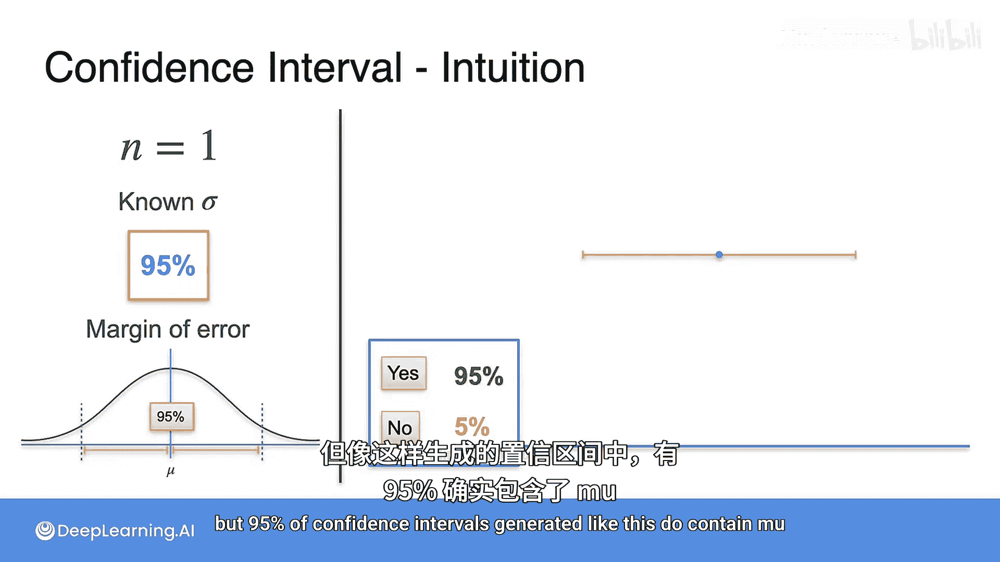

# 078：置信区间概述

## 概述

在本节课中，我们将要学习置信区间这一核心概念。置信区间是统计学中用于估计未知总体参数（如总体均值）的一个区间范围，它能够以一定的概率（置信水平）包含真实的参数值。我们将通过一个生动的比喻来理解其原理，并学习如何构建和解释置信区间。

## 置信区间的基本思想

上一节我们介绍了如何通过抽样来估计总体参数。本节中我们来看看如何量化这种估计的不确定性。

假设Statopia国的人口平均身高为μ，我们通过抽样来估计它。即使采用了随机抽样、大样本量等最佳实践，任何一次抽样得到的样本均值都很难与真实的总体均值μ完全一致。因此，我们总是对样本均值的准确性存在一定程度的不确定性。一个自然的问题是：我们能否以某种程度的确定性来使用样本均值？统计学家通过置信区间来解决这个问题。

简而言之，置信区间是一个由下限和上限构成的数值区间，它以一定的确定性包含了总体参数（例如μ）。

## 一个直观的比喻：寻找钥匙

在展示概率分布中的置信区间之前，让我们通过一个现实世界的比喻来建立直观理解。

想象你在一条路上步行去朋友家。到达后，你发现钥匙掉在了路上的某个地方。你的朋友开车带你回去寻找。你们决定将车停在你们猜测钥匙最可能掉落的位置，然后两人分别向路的两侧行走相同的搜索距离来寻找钥匙。

*   停车的位置是你们对钥匙真实位置的**最佳猜测**。
*   搜索距离是你们为了弥补猜测可能错误而添加的**缓冲范围**。
*   整个搜索路段（从停车点减去搜索距离到停车点加上搜索距离）就构成了一个**区间**。

你需要根据找到钥匙所需的**置信度**来决定搜索距离的大小。例如，80%的置信度对应一个较小的搜索距离，而95%的置信度则需要一个更大的搜索距离。这里存在一个权衡：更高的置信水平需要更大的搜索距离（更宽的区间）。

这个比喻强调了几个关键点：
1.  钥匙的真实位置是**固定但未知**的。
2.  区间是**随机生成**的，因为它基于一个猜测的起点。
3.  置信水平（如95%）描述的是**生成区间的方法**，而非钥匙本身。我们不能说“钥匙有95%的概率落在这个区间里”，因为钥匙的位置是固定的。正确的理解是：**如果我们用同样的方法重复生成许多区间，那么其中大约95%的区间会包含钥匙的真实位置**。

## 应用于统计问题：估计平均身高

现在，让我们将这些思想应用到Statopia国估计平均身高的问题上。

假设Statopia国民的身高服从正态分布，其总体均值μ未知，总体方差σ²暂时假设为已知。回想钥匙的比喻，μ就是那把“钥匙”，其值固定但未知。我们将随机生成一个置信区间来估计它的位置。

为了构建区间，我们从总体中抽取一个随机样本。为简化起见，我们从样本量为1开始，即只测量一个人的身高。这个人的身高值就是样本均值，我们记作 `x̄`。

我们创建一个随机变量 `X̄` 来描述抽取不同样本均值的概率。由于总体服从正态分布，`X̄` 也服从正态分布，其均值同样是μ，方差为σ²。这并不意味着我们知道了μ，但我们知道 `X̄` 的分布以μ为中心。

### 确定边际误差与置信水平

我们想知道：大多数样本均值距离真实的总体均值μ有多远？这引出了两个相关概念：
*   **边际误差**：在μ两侧的一个距离范围。
*   **置信水平**：样本均值落在这个边际误差范围内的概率。

通常，我们先设定第三个值：
*   **显著性水平（α）**：样本均值落在边际误差范围**之外**的概率。这是一个希腊字母，常用值为0.05。

从α可以计算出置信水平：**置信水平 = 1 - α**。当α=0.05时，置信水平就是95%。

我们的目标是：增大边际误差的范围，直到正态分布曲线下**95%的面积**（即95%的样本均值）都落在这个范围内。由于正态分布是对称的，这意味着有2.5%的样本均值会因过大而落在右侧范围外，另有2.5%会因过小而落在左侧范围外，即每侧各占 **α/2**。

### 置信区间公式

最终，我们得到置信区间的公式：
**置信区间 = 样本均值 ± 边际误差**

这个公式的含义是：除非我们运气极差，抽到了一个非常极端（过大或过小）的样本均值（这种情况发生的概率只有5%），否则真实的总体均值μ应该与我们的样本均值比较接近。换句话说，置信区间是在表达：“我有95%的信心，这个区间包含了真实的μ。”

## 置信区间的模拟演示

为了更清晰地理解，让我们模拟构建几个置信区间。

假设我们已确定95%置信水平所需的边际误差。图中标出了真实的μ值（但在实际中我们并不知道）。现在我们进行多次抽样：

1.  第一次抽样得到样本均值 `x̄₁`，并以其为中心构建区间。这个区间**没有**包含μ。
2.  第二次抽样得到 `x̄₂`，构建的区间**包含**了μ。
3.  第三次抽样得到 `x̄₃`，构建的区间也**包含**了μ。

如果我们重复这个过程很多次，并将包含μ的区间标为绿色，不包含的标为红色，我们会发现：**大约有95%的区间是绿色的（包含μ），5%的区间是红色的（不包含μ）**。

这就是95%置信区间的含义：**你所使用的构建区间的方法，在重复使用时，有95%的概率会产生一个包含总体均值的区间**。

然而，在实际研究中，我们通常只构建**一个**置信区间。我们无法确定这个特定的区间是否包含了μ，但我们可以知道，像这样构建出来的区间，有95%的可能性是包含μ的。

## 总结

本节课中我们一起学习了置信区间的核心概念。我们通过“寻找钥匙”的比喻理解了置信区间是围绕一个点估计（最佳猜测）构建的、具有一定宽度的区间，用以表达估计的不确定性。我们学习了置信水平（如95%）的真实含义：它描述的是区间构建方法的长期成功率，而非针对某个特定区间。最后，我们掌握了置信区间的基本公式 **`x̄ ± 边际误差`**，并了解了其背后的概率原理。记住，置信区间是量化估计不确定性的强大工具。