# 079：置信区间调整区间 📊

在本节课中，我们将学习置信区间如何受到样本量和置信水平的影响。我们将看到，通过增加样本量或调整置信水平，可以改变置信区间的宽度，从而影响估计的精确度和可靠性。

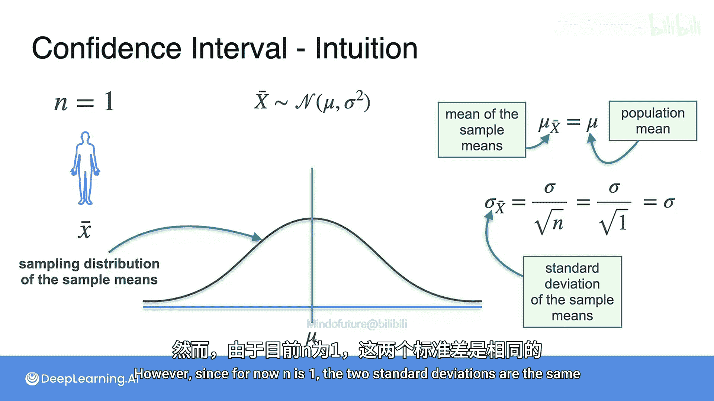

## 样本量对置信区间的影响 📈

上一节我们介绍了当样本量为1时如何构建95%的置信区间。本节中我们来看看，如果改变样本量，置信区间会发生什么变化。

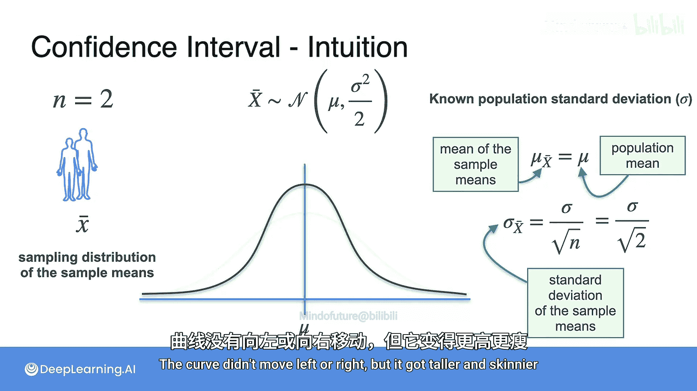

样本均值 `X̄` 的抽样分布是正态分布，其均值等于总体均值 `μ`，标准差等于总体标准差 `σ` 除以样本量 `n` 的平方根。

**公式**：
`E(X̄) = μ`
`σ_X̄ = σ / √n`

当样本量 `n=1` 时，样本均值的标准差与总体标准差相同。如果我们将样本量增加到 `n=2`，样本均值的均值 `μ` 保持不变，但其标准差会减小为 `σ / √2`。这使得抽样分布的曲线变得更高、更窄，样本均值更紧密地围绕在总体均值周围。

以下是样本量增加带来的影响：
*   随着样本量增加，抽样分布的标准差减小。
*   为了覆盖抽样分布中95%的样本均值，所需的误差范围会变小。
*   因此，置信区间整体变窄，对总体均值 `μ` 的估计更加精确。

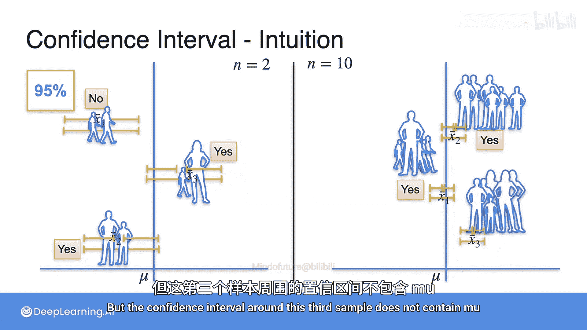

让我们通过模拟来观察这一现象。当样本量 `n=2` 时，我们生成一些95%的置信区间。其中大约95%的区间会包含真实的总体均值 `μ`，大约5%的区间不会包含。当我们将样本量增加到 `n=10` 时，置信区间变得更窄，但同样有大约95%的区间会包含 `μ`。

虽然两种情况下置信水平都是95%，但样本量更大的置信区间明显更理想，因为它们更窄。这意味着在保持相同置信度的前提下，你能对 `μ` 的真实值做出更精确的估计。

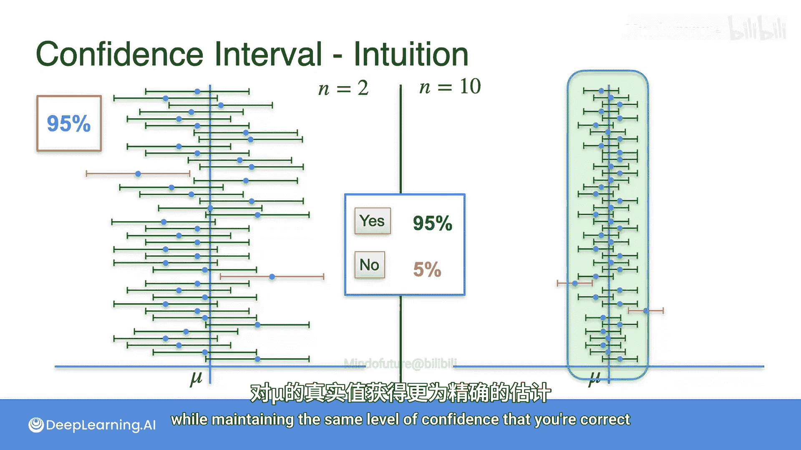

## 置信水平对置信区间的影响 ⚖️

现在，让我们看看如果改变置信水平，而保持样本量不变，置信区间会发生什么变化。

我们将样本量固定为 `n=1`。当置信水平为95%时，误差范围较大，以确保随机生成的样本均值有95%的概率落在 `μ` 加减该误差范围的区间内。

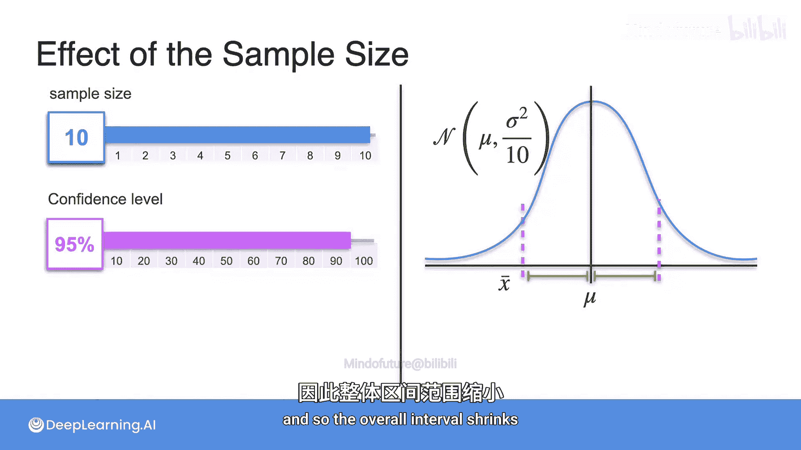

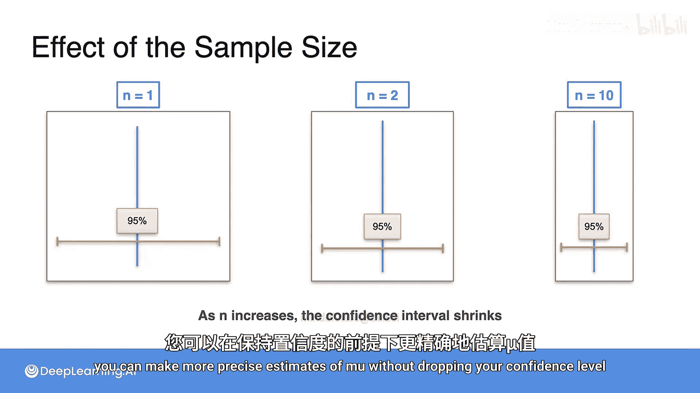

假设你愿意接受一个更低的置信水平，例如70%。由于你只要求样本均值有70%的概率落在区间内，因此可以使用更小的误差范围。这将导致置信区间变窄。

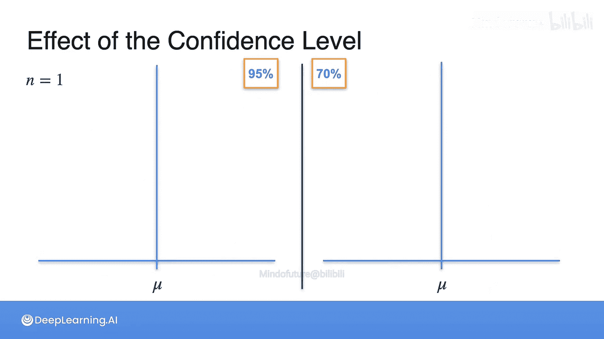

以下是不同置信水平下的模拟结果：
*   对于95%的置信区间，大约95%的区间会包含 `μ`，大约5%不会。
*   对于70%的置信区间，大约70%的区间会包含 `μ`，大约30%不会。

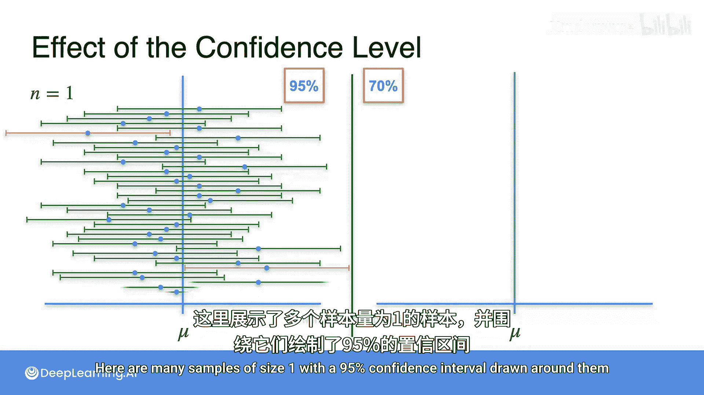

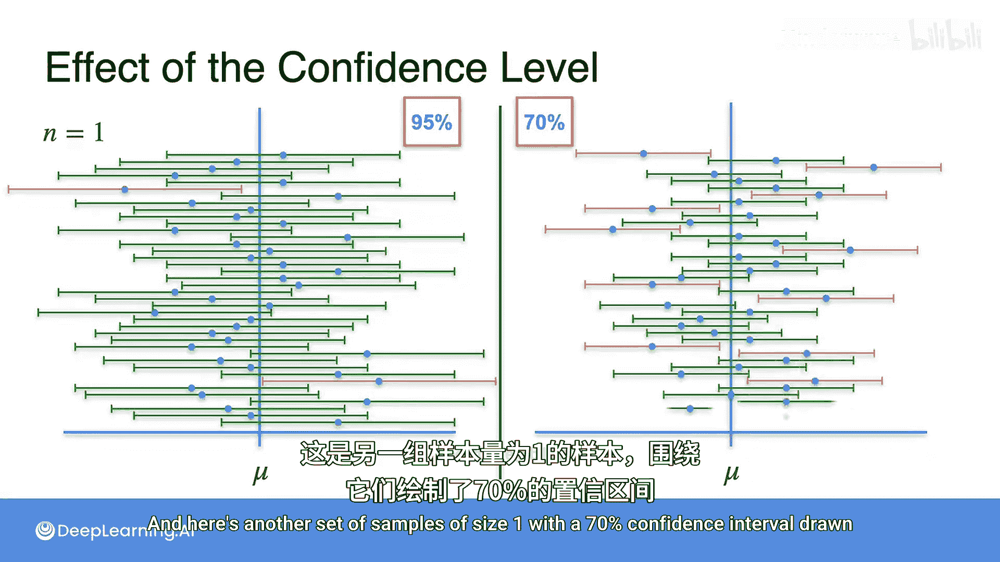

右侧（70%置信水平）的区间更窄，并非因为其样本均值离 `μ` 更远，而是因为你选择了更小的误差范围，因此有更多的情况区间不包含 `μ`。

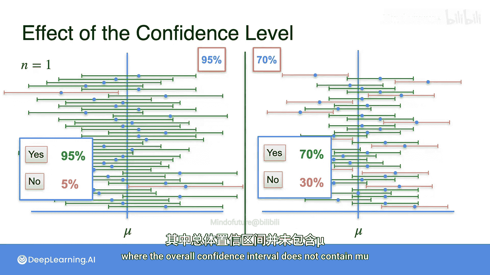

这体现了精确度与可靠性之间的权衡：如果你希望区间包含 `μ` 的概率更高（更可靠），就需要使用更大的误差范围（更不精确）。

## 核心要点总结 📝

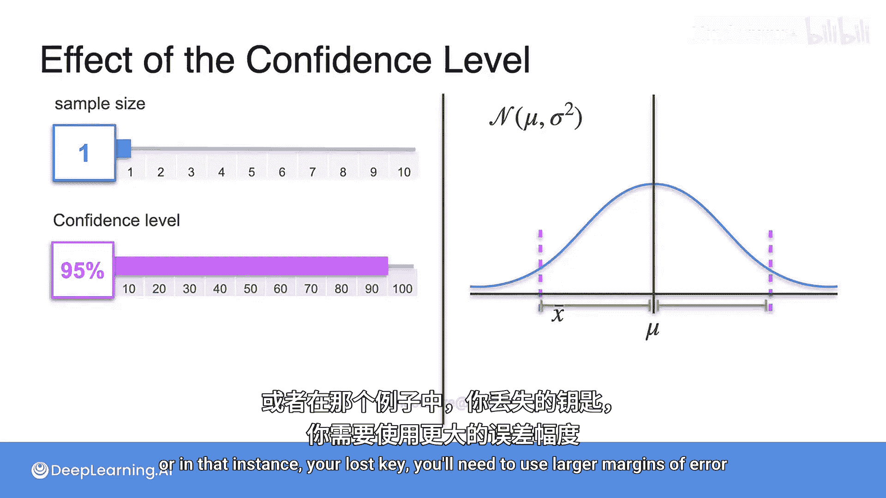

本节课中我们一起学习了影响置信区间的两个关键因素。

1.  **样本量 `n`**：增加样本量会减小样本均值抽样分布的标准差（`σ_X̄ = σ / √n`），从而允许我们在保持相同置信水平的情况下使用更小的误差范围，获得更窄、更精确的置信区间。
2.  **置信水平**：降低置信水平（例如从95%降至70%）可以直接使用更小的误差范围，从而得到更窄的置信区间，但代价是区间包含总体均值 `μ` 的概率降低了。

最直接地缩小置信区间的方法是收集更多数据。虽然选择更低的置信水平也能使区间变窄，但在实践中，低于90%的置信水平很少使用，95%最为常见。归根结底，如果你想要更精确的估计，通常需要更多的数据。

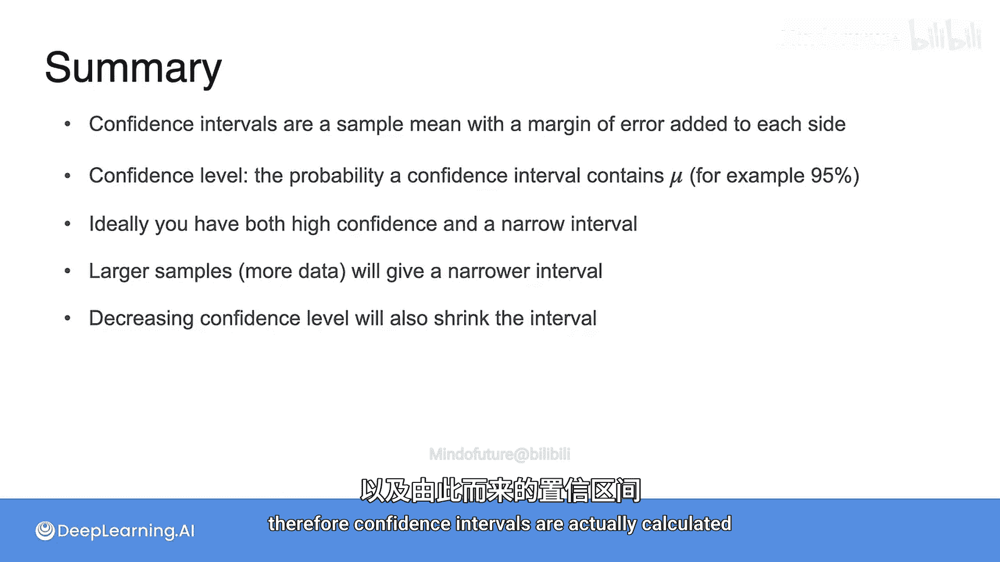

到目前为止，我们是在较高层次上理解这些概念。在下一个视频中，你将学习误差范围以及置信区间具体是如何计算的。