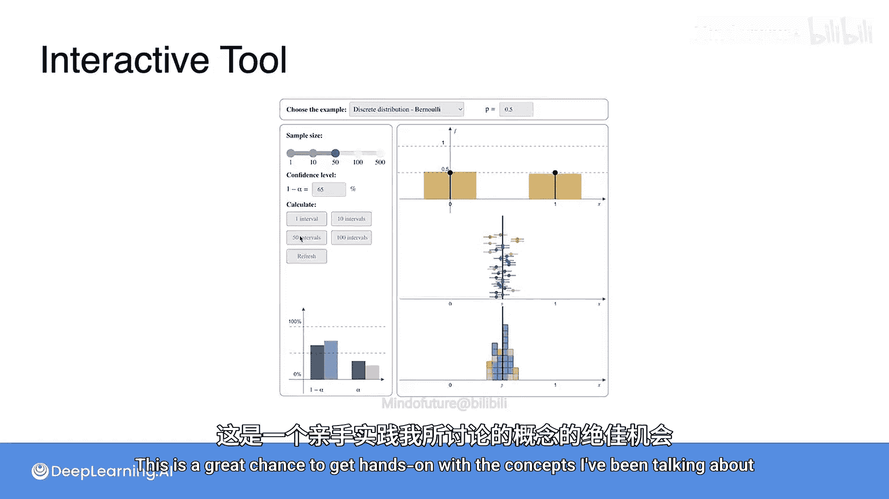

# 080：置信区间与误差幅度

在本节课中，我们将学习如何构建置信区间，以量化样本统计量对总体参数的估计精度。我们将从理解误差幅度开始，逐步推导出置信区间的计算方法。

## 置信区间的基本构成

上一节我们介绍了样本均值的分布特性，本节中我们来看看如何利用它来构建置信区间。

置信区间由两个核心部分组成：样本均值和误差幅度。样本均值是我们从数据中计算出的中心点，而误差幅度则定义了围绕这个中心点的范围，用以捕捉总体参数。

以下是构建置信区间的基本步骤：
1.  从总体中抽取一个样本，并计算样本均值 `x̄`。
2.  根据所需的置信水平和样本信息，计算误差幅度。
3.  将误差幅度与样本均值相加和相减，得到置信区间的下限和上限。

## 误差幅度的计算原理

既然我们已经知道如何计算样本均值，现在让我们更仔细地研究如何计算误差幅度。

我们从一个通用案例开始。假设你正在研究一个身高服从正态分布的群体，其总体均值 `μ` 未知，但总体方差 `σ²` 已知。这个随机变量称为 `X`。你的目标是找出总体平均身高 `μ`。

为此，你抽取一个大小为 `n` 的样本，并计算样本均值 `x̄`。你知道样本均值很可能不等于总体均值，但应该很接近。你的目标就是量化这个“接近”的程度。

样本均值 `x̄` 本身也是一个随机变量。根据中心极限定理，如果样本量足够大，`x̄` 的分布近似正态分布，其均值为 `μ`，方差为 `σ²/n`。这个分布以 `μ` 为中心，并且随着样本量增大，分布的离散程度（方差）会减小，使得样本均值更可能接近 `μ`。

关键点在于，你仍然不知道 `μ`，并且你只抽取了一个样本。你拥有的只是 `x̄` 和已知的 `σ`。

## Z分数与临界值

为了构建置信区间，我们需要回顾关于正态分布形状的一些有用事实。

对于任何正态分布，大约68%的曲线位于均值的一个标准差范围内，大约95%位于均值的两个标准差范围内。如果你知道正态分布的标准差，你就可以确定围绕均值 `μ` 的、包含任意百分比分布的范围。

这些距离均值特定标准差倍数的点有一个特殊的名称：Z分数或Z统计量。例如，比均值大2个标准差的点的Z分数是2，比均值低1个标准差的点的Z分数是-1。

Z分数的名称来源于标准正态分布（常称为Z分布）。你可以通过减去均值并除以标准差，轻松地将任何正态分布转换为标准正态分布。Z分布的均值为0，方差为1。

在使用Z分布时，Z分数就是该点的值本身。例如，在数值2处，你位于均值0以上2个标准差的位置。对于标准正态分布，你知道大约95%的分布位于-2和2之间。

为了使数学计算更简便，我们通常从标准正态分布的角度来讨论这个概念。如果你想要恰好95%的分布，那么精确到两位小数的Z分数是-1.96和+1.96。如果你从标准正态分布中随机抽样，95%的情况下，结果会落在这个范围内。5%的情况下，你的样本会落在这个范围之外。

-1.96和+1.96被称为临界值。它们是概率分布中包含特定精确百分比的截止点。要找到这些值，你需要查阅预先计算好的查找表或使用软件库，这不是手动计算的内容。

第一个临界值是 `z_{0.025}`。这个符号表示“找到那个在其左侧有2.5%分布曲线的Z分数”。从查找表或软件库中，你会得到结果-1.96。
第二个临界值是 `z_{0.975}`。它同样是“在其左侧有97.5%分布曲线的Z分数”的简写。

选择这两个值是因为正态曲线是对称的，并且你想要包含95%分布的均值周围区域。换句话说，你希望你的临界值排除5%的分布。这正好是上一节学到的显著性水平 `α`，在本例中 `α = 0.05`。

这意味着左侧临界值是 `z_{α/2}`，右侧临界值是 `z_{1 - α/2}`。如果 `α = 0.1`，那么你的临界值现在是 `z_{0.05}` 和 `z_{0.95}`，对应的Z分数大约是-1.65和+1.65，这两个值之间包含了90%的分布。

## 计算误差幅度

回到非标准化的正态分布，你仍然可以使用这些临界值。但由于分布没有标准化，你需要将它们乘以标准差。在本例中，95%的分布位于均值附近1.96个标准差范围内，所以你只需将该临界值乘以 `σ`。

现在你终于可以计算误差幅度了。你知道 `x̄` 服从一个以 `μ` 为中心、方差为 `σ²/n` 的正态分布。这意味着其标准差是 `σ / √n`，这也被称为标准误。

因此，95%的样本均值将落在以下范围内：
`μ - 1.96 * (σ / √n) < x̄ < μ + 1.96 * (σ / √n)`

由此，你可以得到你的误差幅度，它等于 `1.96 * 标准误`，即 `1.96 * (σ / √n)`。

如果你选择了不同的 `α` 值，你将得到不同的误差幅度。你需要查找 `z_{1 - α/2}` 的值，并将其乘以你的标准误。

## 构建置信区间

你已经建立了误差幅度，现在让我们完成生成置信区间的最后几步。请记住，这个过程的最终目标是找到总体均值 `μ` 的下限和上限。

你刚刚发现，在概率0.95的情况下，你的样本均值会落在上面所示的范围内。但请注意，你实际上还没有找到 `μ` 的边界，你找到的是 `x̄` 的边界。

因此，让我们变换这个不等式，以得到你真正想要的结果。从所有项中减去 `μ`：
`-1.96 * (σ / √n) < x̄ - μ < 1.96 * (σ / √n)`

现在，减去 `x̄`：
`-x̄ - 1.96 * (σ / √n) < -μ < -x̄ + 1.96 * (σ / √n)`

你几乎完成了，只需要将所有项乘以 -1 来清理中间的 `-μ`。请记住，如果你用一个负数乘以不等式，不等号的方向会改变。结果你得到：
`x̄ + 1.96 * (σ / √n) > μ > x̄ - 1.96 * (σ / √n)`

现在，你将不等式翻转到了另一个方向。这样就完成了，你成功地得到了一个界定 `μ` 的区间。

因此，你的置信区间最终是通过将误差幅度与样本均值相加和相减得到的区间：
`[ x̄ - z_{1 - α/2} * (σ / √n), x̄ + z_{1 - α/2} * (σ / √n) ]`

## 关于总体分布的说明

到目前为止，我们假设你处理的总体服从正态分布。在这种情况下，如果你有一个样本量为 `n` 的样本，那么样本均值也将服从正态分布，其均值与总体均值相同，但方差是总体方差的 `1/n`。

然而，数据并不总是正态分布的，甚至可能不知道总体的行为方式。那么刚才学到的内容还适用吗？

请记住，你实际上并不关心总体的分布。你需要的只是样本均值的分布，而这就是中心极限定理发挥作用的地方。如果 `n` 足够大，那么根据中心极限定理，你的样本均值仍然具有近似正态分布，并且其参数同样是 `μ` 和 `σ²/n`。因此，实际上没有任何变化。只要你选取足够大的样本，你刚刚学到的用于推导误差幅度的过程仍然成立。

## 总结

在本节课中，我们一起学习了如何构建置信区间来估计总体参数。我们从理解样本均值的分布出发，引入了Z分数和临界值的概念，并详细推导了误差幅度的计算公式 `z_{1 - α/2} * (σ / √n)`。最后，我们通过代数变换，得到了置信区间的最终形式：`x̄ ± 误差幅度`。重要的是，即使总体不服从正态分布，只要样本量足够大，中心极限定理也能保证这一方法的近似有效性。

接下来，你将找到一个交互式工具，可以在其中为伯努利分布和正态分布生成自己的置信区间。你将能够设置目标置信水平，并观察其对置信区间大小以及包含总体均值的置信区间比例的影响。这是亲手实践我所讨论概念的好机会。