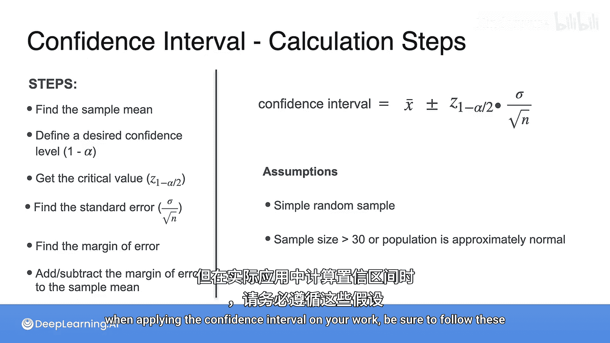

# 081：置信区间计算步骤 📊

在本节课中，我们将学习如何计算置信区间。置信区间是一个范围，用于估计总体参数（如总体均值）可能落在其中的概率。我们将分步介绍其计算方法，并了解其背后的假设条件。

## 计算步骤详解

上一节我们介绍了置信区间的概念，本节中我们来看看其具体的计算步骤。以下是计算置信区间的六个核心步骤：

1.  **计算样本均值**：首先，从你的样本数据中计算出样本均值（`x̄`）。
2.  **确定置信水平**：定义一个期望的置信水平，例如 95% 或 99%。
3.  **查找临界值**：根据你选择的置信水平（`1 - α`），找到对应的临界值（`z*` 或 `t*`）。例如，对于 95% 的置信水平，`α = 0.05`。
4.  **计算标准误差**：这是样本均值分布的标准差。计算公式为：**标准误差 = 样本标准差 / √样本容量**。
5.  **计算误差范围**：将临界值与标准误差相乘，得到误差范围。公式为：**误差范围 = 临界值 × 标准误差**。
6.  **构建置信区间**：最后，将误差范围与样本均值相加和相减，得到置信区间的上下限。公式为：**置信区间 = 样本均值 ± 误差范围**。

通过以上步骤，你就完成了置信区间的计算。

## 关键假设条件

在应用上述方法计算置信区间时，需要满足以下两个关键假设，以确保结果的可靠性：

*   **样本是随机抽取的**：这保证了样本能够代表总体。
*   **样本容量足够大或总体近似正态分布**：通常要求样本容量 `n > 30`。如果样本容量较小，但总体分布近似正态，也可以使用。

请注意，尽管我们在示例中可能使用了小于30的样本容量进行说明，但在实际应用时，务必遵循这些假设条件。

## 总结

本节课中我们一起学习了置信区间的完整计算流程，从计算样本均值到最终确定区间范围。同时，我们也明确了计算有效的前提条件，即样本的随机性和足够的样本容量（或总体的正态性）。掌握这些步骤和假设，是正确进行统计推断的基础。