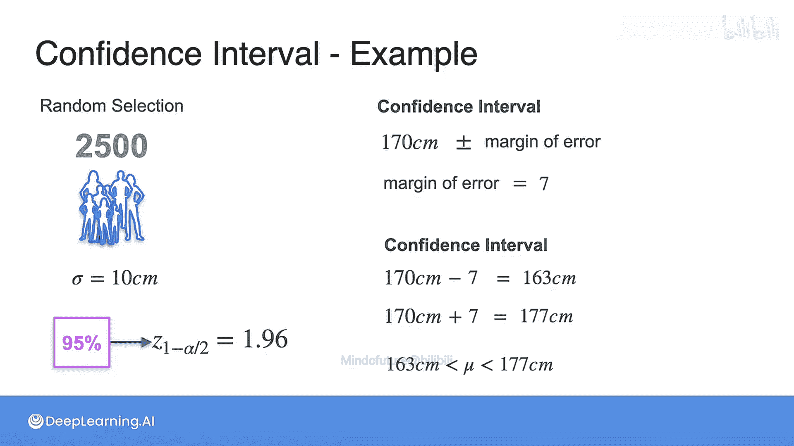

# 082：置信区间示例 📊

在本节课中，我们将通过一个具体的例子，学习如何计算和解释置信区间。我们将从一个估计全球人口平均身高的例子开始，然后逐步计算一个95%置信区间。

---

## 概述

置信区间为我们提供了一个范围，在这个范围内，我们有一定程度的信心（例如95%）认为真实的总体参数（如总体均值）会落在此区间内。它结合了点估计（如样本均值）和误差范围来计算。

## 从概念到计算

上一节我们介绍了置信区间的核心概念。本节中，我们来看看如何通过一个具体的例子进行计算。

假设我们想了解Statopia岛上成年人的平均身高。岛上共有6000名成年人，但我们无法测量所有人。因此，我们采取随机抽样的方法。

以下是我们的已知条件：
*   总体大小：6000人
*   样本大小：`n = 49`人
*   样本平均身高：`x̄ = 170` 厘米
*   已知的总体标准差：`σ = 25` 厘米
*   置信水平：95%

## 计算95%置信区间

我们的目标是找到一个区间，使得我们有95%的信心认为Statopia岛的真实平均身高位于该区间内。回想一下，95%置信水平对应的临界值 `z*` 是1.96。

计算过程分为两步：首先计算误差范围，然后构建置信区间。

### 1. 计算误差范围

误差范围的公式为：
`误差范围 = z* × (σ / √n)`

将我们的数值代入公式：
`误差范围 = 1.96 × (25 / √49) = 1.96 × (25 / 7) ≈ 1.96 × 3.57 ≈ 7`

因此，误差范围约为7厘米。

### 2. 构建置信区间

置信区间以样本均值为中心，向两侧扩展一个误差范围。公式为：
`置信区间 = 样本均值 ± 误差范围`

代入我们的数值：
`置信区间 = 170 ± 7`

所以，置信区间的下限是 `170 - 7 = 163` 厘米，上限是 `170 + 7 = 177` 厘米。

## 结果解释

我们计算出的95%置信区间是 **[163厘米， 177厘米]**。

这意味着：基于我们49人的样本数据，我们有95%的信心认为Statopia岛上所有6000名成年人的真实平均身高在163厘米到177厘米之间。需要注意的是，这并不意味着真实均值有95%的概率落在这个特定区间内（真实均值是一个固定值），而是指如果我们用同样的方法重复抽样多次，计算出的所有区间中，大约有95%会包含真实的总体均值。

---

## 总结

本节课中我们一起学习了置信区间的实际应用。我们从一个实际问题出发，使用样本均值、已知的总体标准差、样本大小以及Z临界值，逐步计算出了一个95%置信区间。关键步骤是计算误差范围 `z* × (σ/√n)`，然后构建区间 `x̄ ± 误差范围`。理解如何解释这个区间——“我们有95%的信心认为总体参数位于此区间内”——是掌握置信区间概念的核心。