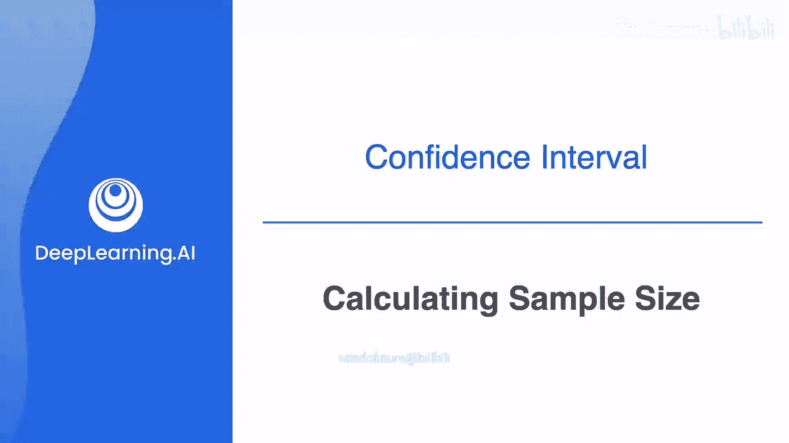
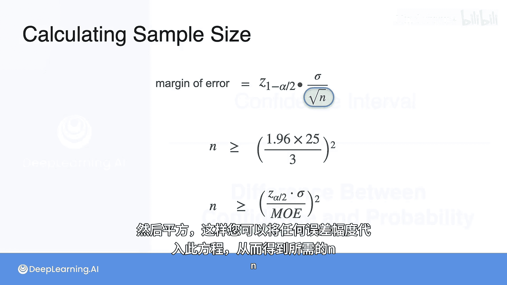

# 083：计算样本大小 📊



在本节课中，我们将学习如何计算在给定置信水平和期望误差范围的情况下，所需的最小样本大小。我们将从一个具体例子出发，推导出通用的计算公式。

## 概述

上一节我们介绍了如何根据样本数据计算总体均值的置信区间。我们得到了一个误差范围，它告诉我们总体均值有95%的概率落在样本均值加减这个误差的区间内。然而，有时这个误差范围可能过大，无法满足我们对估计精度的要求。

本节中，我们来看看当误差范围过大时，如何通过增加样本量来缩小它。我们将学习如何计算达到特定误差范围所需的最小样本数量。

## 从具体问题出发

在之前的例子中，我们有一个6000名成年人的总体。我们抽取了49名成年人作为样本，其平均身高为170厘米，标准差为25厘米。我们计算出的95%置信区间误差范围约为7厘米，这意味着总体均值有95%的概率落在163厘米到177厘米之间。

假设我们认为7厘米的误差范围过大，希望得到一个更精确的估计，例如将误差范围控制在3厘米以内。那么，49的样本量显然不足。我们需要一个更大的样本来提供更高的精度。

核心问题是：**为了达到期望的误差范围，所需的最小样本量是多少？**

## 逆向推导样本量

我们将采用与计算置信区间相似但逆向的方法。回忆一下，误差范围的计算公式如下：

**误差范围公式：**
```
Me = Z_(α/2) * (σ / √n)
```
其中：
*   `Me` 是误差范围。
*   `Z_(α/2)` 是对应于置信水平的标准正态分布临界值（例如，95%置信水平下约为1.96）。
*   `σ` 是总体标准差（或样本标准差作为估计）。
*   `n` 是样本大小。

现在，我们知道除了 `n` 之外的所有值。我们的目标是让误差范围 `Me` 小于或等于3厘米。因此，我们可以建立不等式：

**目标不等式：**
```
3 ≥ Z_(α/2) * (σ / √n)
```
这里使用“大于等于”是因为误差范围小于3厘米（如2厘米或1厘米）结果更好，3厘米是我们能接受的最大值。

## 代入数值求解

将已知数值代入不等式。对于95%的置信水平，`Z_(α/2)` = 1.96；总体标准差 `σ` = 25厘米；目标误差 `Me` = 3厘米。

代入后得到：
```
3 ≥ 1.96 * (25 / √n)
```

现在，我们解这个不等式来求 `n`：
1.  两边同时除以1.96： `3 / 1.96 ≥ 25 / √n`
2.  两边取倒数（注意不等式方向可能改变，但这里都是正数，方向不变）： `1.96 / 3 ≤ √n / 25`
3.  两边同时乘以25： `25 * (1.96 / 3) ≤ √n`
4.  最后，两边平方以解出 `n`： `[25 * (1.96 / 3)]^2 ≤ n`

计算这个值：
```
n ≥ [25 * (1.96 / 3)]^2 ≈ [25 * 0.6533]^2 ≈ [16.333]^2 ≈ 266.78
```

由于样本量 `n` 代表人数，必须是整数，所以我们向上取整。因此，**我们需要至少267名成年人的样本**，才能确保在95%的置信水平下，对总体平均身高估计的误差范围不超过3厘米。

## 通用公式

我们可以将上述求解过程推广为一个通用公式，用于计算在给定置信水平、总体标准差和期望误差范围下的最小样本量。

**最小样本量计算公式：**
```
n ≥ [ Z_(α/2) * (σ / Me) ]^2
```

以下是使用此公式的步骤：
1.  **确定置信水平**：例如95%，并找到对应的 `Z_(α/2)` 值（如1.96）。
2.  **确定总体标准差 (σ)**：可以使用历史数据、预实验或合理的估计值。
3.  **确定期望的误差范围 (Me)**：即你允许的估计值与真实值之间的最大差距。
4.  **代入公式计算**：将以上值代入公式 `[ Z_(α/2) * (σ / Me) ]^2`。
5.  **向上取整**：因为样本量必须是整数，所以对计算结果向上取整。

你可以将任何期望的误差范围代入这个方程，计算出所需的最小样本量 `n`。

## 总结



本节课中，我们一起学习了如何计算为达到特定精度（误差范围）所需的最小样本大小。我们从回顾置信区间误差范围公式出发，通过逆向思维，建立了目标不等式并求解。最终，我们推导出了通用的最小样本量计算公式 `n ≥ [ Z_(α/2) * (σ / Me) ]^2`。掌握这个方法，可以帮助你在设计实验或调查时，科学地确定需要收集多少数据，从而在资源有限的情况下做出最有效的推断。