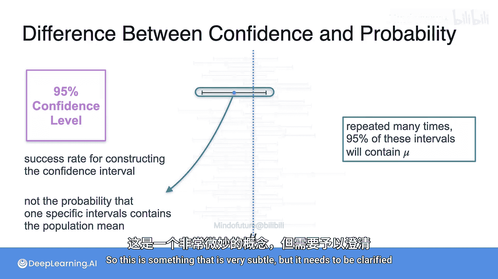

# 084：置信度与概率之间的区别

在本节课中，我们将要学习置信区间中“置信度”与“概率”这两个概念之间的关键区别。理解这一区别对于正确解释统计推断的结果至关重要。

## 概述

当我们基于样本数据计算出一个置信区间时，例如一个95%的置信区间，对其含义的解释需要格外小心。常见的两种说法看似相似，实则存在根本性的差异。本节将深入探讨这一差异，并阐明置信度的真正含义。

## 核心概念解析

首先，我们需要明确两个核心对象：**总体参数**和**样本统计量**。

考虑一个总体参数，例如总体均值，通常用符号 **μ** 表示。**μ** 的一个关键特性是，对于一个给定的总体，它是一个**固定的、未知的常数**。它不随我们的抽样而改变。因此，**μ 本身没有概率分布**，因为它不是随机变量，只是一个我们不知道的确定值。

由于 **μ** 是固定的，对于任何一个计算出的具体置信区间，**μ 要么在这个区间内，要么不在**。这是一个非此即彼的事实，不会以某个概率“落入”区间。

另一方面，**样本均值**（通常表示为 **x̄**）则不同。**x̄** 是一个随机变量，因为它依赖于我们随机抽取的样本。如果我们重复抽样，每次得到的 **x̄** 值都可能不同。**x̄** 的分布被称为**样本均值的抽样分布**。

## 置信度的真正含义

上一节我们介绍了总体参数和样本统计量的根本区别，本节中我们来看看“95%置信度”究竟指的是什么。

置信区间的构建与**样本均值 x̄** 及其抽样分布紧密相关。当我们说“我们95%确信总体均值在某个区间内”时，这里的“确信”或“置信度”并非指该特定区间包含 **μ** 的概率。

实际上，95%的置信度与**重复抽样过程**有关。其含义是：如果我们从同一总体中反复抽取无数个相同大小的样本，并为每个样本计算一个95%的置信区间，那么**在所有计算出的区间中，大约有95%会包含真实的总体均值 μ**。

以下是理解这一过程的步骤：
1.  从一个总体中抽取一个随机样本。
2.  计算该样本的均值 **x̄**。
3.  基于 **x̄** 和抽样分布的标准误，计算一个95%的置信区间。
4.  重复步骤1-3很多次。

最终，大约95%的这样构造出来的区间会“捕获”到固定的总体均值 **μ**。因此，置信度描述的是**区间构造方法的长期成功率**，而不是针对某一个特定区间的概率陈述。

## 错误解释与正确解释

为了更清晰地展示区别，我们对比以下两种说法：

*   **正确解释**：“我有95%的置信度认为，这个置信区间包含了真实的总体参数。” 这反映了区间构造方法的可靠性。
*   **错误解释**：“总体参数有95%的概率落在这个置信区间内。” 这种说法错误地将概率赋予了固定的总体参数 **μ**。对于已经计算出的一个具体区间，**μ** 要么在内（概率为100%），要么在外（概率为0%），不存在95%的概率。

## 总结

本节课中我们一起学习了置信度与概率之间的微妙而重要的区别。核心要点在于：**总体参数（如 μ）是固定的，而置信区间是随机的**。95%的置信度并非指某个特定区间包含参数的概率，而是指**在重复抽样中，使用该方法构建的区间能包含参数的比例**。正确理解这一点，是避免统计误用、合理解读数据分析结果的基础。