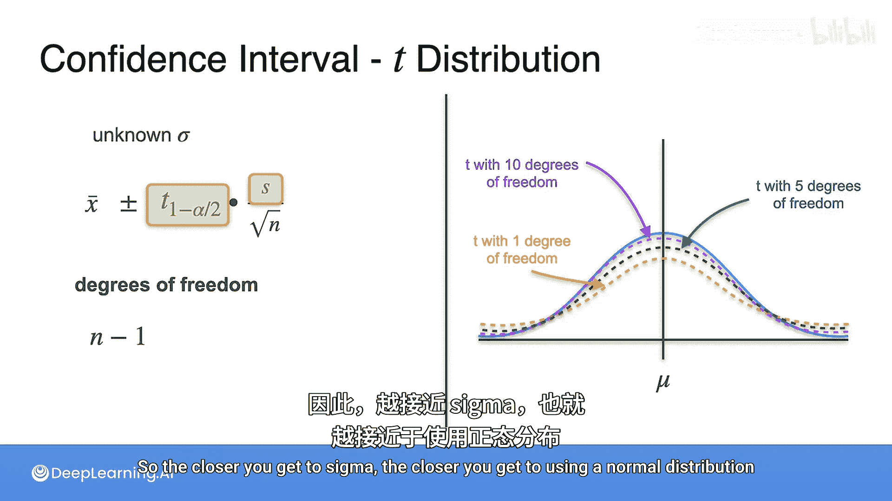

# 085：未知标准差下的置信区间 📊

在本节课中，我们将学习当总体标准差未知时，如何构建置信区间。我们将引入一个新的分布——学生T分布，并了解它如何替代正态分布来处理样本标准差。

## 概述

在之前的课程中，我们进行了大量的点估计，但都假设已知总体标准差。然而，实际情况中我们常常不知道总体标准差。这并非问题，我们只需在计算中做一个小调整，引入学生T分布即可。

## 已知标准差的情况回顾

上一节我们介绍了已知总体标准差时，如何利用正态分布构建置信区间。其公式为：

**置信区间 = x̄ ± Z_{α/2} * (σ / √n)**

这个公式成立的前提是我们知道总体标准差σ。这使得抽样分布统计量围绕总体均值呈正态分布，因此我们可以使用临界值Z_{α/2}。

## 未知标准差的问题与解决方案

然而，更多时候我们并不知道总体标准差。这导致我们无法在公式中使用σ。为了解决这个问题，我们需要使用样本标准差S来替代σ。

当我们用S替代σ后，抽样分布统计量变为：

**(x̄ - μ) / (S / √n)**

这个统计量不再服从正态分布，而是服从一种新的分布，称为**学生T分布**。

与正态分布相比，学生T分布形状相似，但尾部更厚。这意味着从T分布中抽取的点，比从正态分布中抽取的点，更有可能远离中心。

## 调整临界值：从Z分数到T分数

为了适应分布的变化并得到准确的置信区间，我们需要调整用于缩放的临界值。

*   在已知σ（使用正态分布）的情况下，我们使用**Z分数**。
*   在未知σ（使用学生T分布）的情况下，我们使用**T分数**。

因此，修正后的置信区间公式为：

**置信区间 = x̄ ± t_{α/2} * (S / √n)**

以下是两种情况的公式对比：

| 情况 | 标准差来源 | 分布 | 临界值 | 置信区间公式 |
| :--- | :--- | :--- | :--- | :--- |
| **已知σ** | 总体标准差 (σ) | 正态分布 | Z分数 (Z_{α/2}) | x̄ ± Z_{α/2} * (σ / √n) |
| **未知σ** | 样本标准差 (S) | 学生T分布 | T分数 (t_{α/2}) | x̄ ± t_{α/2} * (S / √n) |

## 自由度对T分布的影响

T分数的大小取决于一个称为**自由度**的参数。对于T分布，自由度等于样本量减一：**df = n - 1**。

自由度定义了T分布的形状：
*   自由度越小，T分布的尾部越厚，与正态分布差异越大。
*   自由度越大，T分布的尾部越薄，形状越接近正态分布。

这符合直觉：使用的样本量n越大，样本标准差S就越接近总体标准差σ。当S无限接近σ时，使用T分布的结果就无限接近使用正态分布的结果。

## 总结

本节课中，我们一起学习了当总体标准差未知时构建置信区间的方法。核心在于用样本标准差S替代总体标准差σ，并相应地使用来自学生T分布的T分数替代来自正态分布的Z分数。我们还了解了自由度如何影响T分布的形状，以及随着样本量增加，T分布会趋近于正态分布。